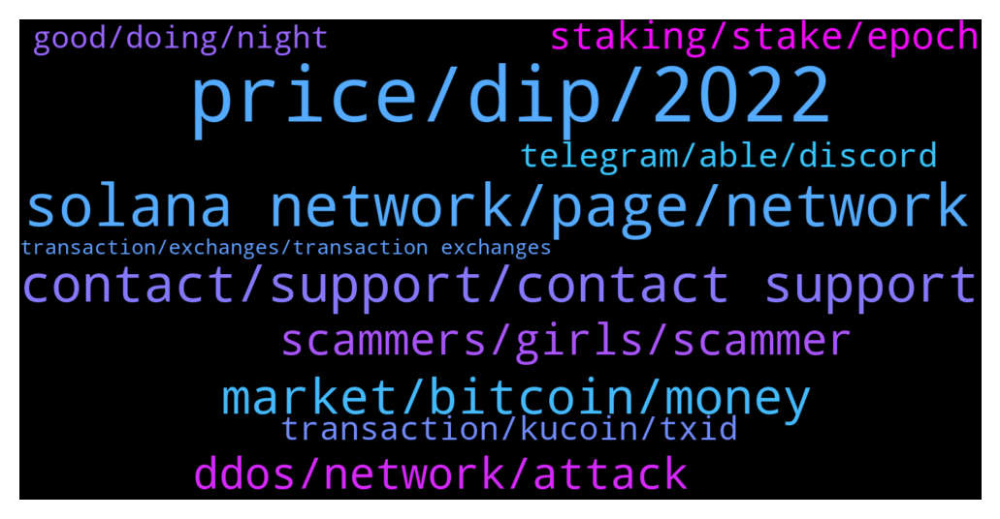

# **@solana**
 ## Analysis for **2022-01-04** - **2022-01-05**.

---

## 📊 **Basic Stats**

**n_messages_sent**: 502

---

---

## 🔝 **Top keywords and related messages**

1. **price, dip, 2022**

    @Ali_Mohsenii --- *Solana will rise and keep this momentum in 2022... most experts and traders believe in this...* **--->** [TG Discussion](https://t.me/solana/889612)

    @clementine0818 --- *What price do you think SOL will reach in February?* **--->** [TG Discussion](https://t.me/solana/889833)

    @Yusufemrekaan --- *Will Solana hit $500 end of 2022* **--->** [TG Discussion](https://t.me/solana/889367)

    @jcr712 --- *£350 if market goes bullish not a financial advice but do your own research* **--->** [TG Discussion](https://t.me/solana/889845)

    @cryptolover1987 --- *Hello everyone!   Price discussion is not allowed here!  It would be ideal to have this conversation (price discussion)on trading channel! Please join our trading room 📊  Thanks for your understanding 🙏🏻* **--->** [TG Discussion](https://t.me/solana/888826)

    @austriaallen --- *Check out Engines of Fury. There will be an IDO in 5 weeks* **--->** [TG Discussion](https://t.me/solana/890337)

2. **solana network, page, network**

    @Bommy --- *Sounds like Solana is having issues, again!* **--->** [TG Discussion](https://t.me/solana/889589)

    @Helldiver82 --- *It is the Allow Blind Sign Setting in the Solana App! Oh man why nobody of 96208 could say me that? 😕* **--->** [TG Discussion](https://t.me/solana/890672)

    @Emil --- *and now the "solana support" wants to facetime me* **--->** [TG Discussion](https://t.me/solana/889709)

    @Monterrey_Rice --- *Everything is fine with the Solana network!* **--->** [TG Discussion](https://t.me/solana/889875)

    @Ricardo --- *Mining Solana on Solana network seems slow... Why?* **--->** [TG Discussion](https://t.me/solana/890287)

    @Fi_dati --- *did solana become more slower ??* **--->** [TG Discussion](https://t.me/solana/888549)

3. **contact, support, contact support**

    @mahib45 --- *Its clearly stated that you need to contact Their tech support!* **--->** [TG Discussion](https://t.me/solana/888383)

    @pamelacurry --- *Well maybe you should check your network connection it's working perfectly fine over here* **--->** [TG Discussion](https://t.me/solana/888626)

    @aFidcel --- *Clear your cache and try again* **--->** [TG Discussion](https://t.me/solana/889679)

    @RealPrinceOla --- *Hello EG, can you please make me understand the issue, I will be glad to help you more with it.* **--->** [TG Discussion](https://t.me/solana/888622)

    @ginagawa --- *Anyone know why the website submit project keeps giving an error when trying to submit project?* **--->** [TG Discussion](https://t.me/solana/889678)

    @clementine0818 --- *Thank you for your reminder, I will pay attention* **--->** [TG Discussion](https://t.me/solana/889913)

4. **market, bitcoin, money**

    @sweeeeetapple --- *Is there anyone here who can help me invest in crypto? I'm really scared to make mistakes again.* **--->** [TG Discussion](https://t.me/solana/890422)

    @Abhinav552 --- *She's a scammer .. she will ask you to invest somewhere you cannot make withdrawal from* **--->** [TG Discussion](https://t.me/solana/890161)

    @jinYi_Liu --- *There are 3 eras of currency: Commodity based, politically based, and now, math based.* **--->** [TG Discussion](https://t.me/solana/890409)

    @Han_euna --- *Blockchain is the tech. Bitcoin is merely the first mainstream manifestation of its potential.* **--->** [TG Discussion](https://t.me/solana/888779)

    @Mayukism --- *Bitcoin is a remarkable cryptographic achievement… The ability to create something which is not duplicable in the digital world has enormous value…Lot’s of people will build businesses on top of that.* **--->** [TG Discussion](https://t.me/solana/888807)

    @Cryptocx9b --- *Personally, I think we have 2 kinds of people in this industry. One is money crypto, just focus on money, interest. The second one are builders who believe in technology like the way Vitalik is doing now, they don't care about the market up or down. they care about tech.   So money crypto can leave this industry when it has less interest but builder will remain and continue to develop it. It can go down temporarily but still run underground and develop through time* **--->** [TG Discussion](https://t.me/solana/889982)

5. **ddos, network, attack**

    @DeepThoughtFortyTwo --- *Transactions per second: 1,187 on Solana main page. Is the network under DDoS attack again? All farms are not processing any transactions across the board.* **--->** [TG Discussion](https://t.me/solana/888623)

    @Lemonade_Jo --- *There was no DDOS, the network works all the time, how long have you been using it? There was a DDOS a few months ago, but it's working now* **--->** [TG Discussion](https://t.me/solana/890708)

    @C --- *Someone sent a DoS attack by spamming transactions with too low a transaction fee which led to a congestion of the network in which the Solana developers made a Twitter status saying they were restarting the network.* **--->** [TG Discussion](https://t.me/solana/888461)

    @soapsniffa --- *Even if it wasn’t a ddos having the network perform badly isn’t good* **--->** [TG Discussion](https://t.me/solana/890709)

    @Happy_Corbin --- *Another DDOS attack? This isn't good* **--->** [TG Discussion](https://t.me/solana/888901)

    @Lemonade_Jo --- *Admin, did you fall asleep? Can't you tell people that there is no DDoS and this is fake news spreading?* **--->** [TG Discussion](https://t.me/solana/890705)

6. **scammers, girls, scammer**

    @LuckyAntonio --- *I feel this group have so many scammers like I have never seen before, they try to act like they really care for your problem and want to help but in the reality the just want to steal from u.  Be careful people 👍🏼* **--->** [TG Discussion](https://t.me/solana/889909)

    @ruslanshpirka --- *too many scammers are in this group that contacted me* **--->** [TG Discussion](https://t.me/solana/890066)

    @austriaallen --- *There's also a $1000 giveaway happening rn on their twitter page* **--->** [TG Discussion](https://t.me/solana/890341)

    @George --- *Just learning how to dodge the scammers at this moment in time* **--->** [TG Discussion](https://t.me/solana/889537)

    @Ricardo --- *Seriously!? I ask 1 question... then tons of scammers come along...  think this grp/channel shoould shut down and open new clean fresh start* **--->** [TG Discussion](https://t.me/solana/889400)

    @pppayload --- *if a stranger messages you something stupid/random just block and report spam. it's a scammer 100% of the time.* **--->** [TG Discussion](https://t.me/solana/888772)

7. **staking, stake, epoch**

    @Roberth --- *where i can find instructions about staking of SOL?* **--->** [TG Discussion](https://t.me/solana/888603)

    @Jamescrypto7 --- *Please guys, I wanna ask about solana staking. What's your opinion about it? I'm planning to stake some solana for a year* **--->** [TG Discussion](https://t.me/solana/890184)

    @cryptolover1987 --- *You will receive your staking rewards every 2-3 days (on every epoch) and it will automatically be added and compounded to your staked amount.* **--->** [TG Discussion](https://t.me/solana/890254)

    @KeyserSozeTurk --- *How long does it take to unstake if you’re staking?* **--->** [TG Discussion](https://t.me/solana/890704)

    @Flawaz --- *Guys i saw the different place where we can stake Sol, but witch one is the best?* **--->** [TG Discussion](https://t.me/solana/889511)

    @cryptolover1987 --- *I think you are taking about staking…  SOL cannot be mined. Miners are part of proof-of-work blockchains. Solana is based on proof-of-stake. You can’t mine* **--->** [TG Discussion](https://t.me/solana/890294)

8. **telegram, able, discord**

    @jun_up_only --- *FTX telegram is full of scammers. I sent 1 message and got 15 fake admins DM me. my ticket is pending for 4 days without response so I’m wondering if anyone knows whats going on.* **--->** [TG Discussion](https://t.me/solana/889976)

    @Folaross --- *You can also DM one of their Telegram support but beware of scammers and impersonators account that DM you first. Be careful* **--->** [TG Discussion](https://t.me/solana/890000)

    @AJlegend1 --- *Pls can someone send the solana airdrop bot for me* **--->** [TG Discussion](https://t.me/solana/889387)

    @mahib45 --- *You can join our discord channel. Our dev support will be able to help you technical things!   👉 https://solana.com/discord  ✅Click on #role and select the emoji "Community " 👨‍🌾 on Carl -bot. And then go back to the general section again.  Then you will able to send message!* **--->** [TG Discussion](https://t.me/solana/890687)

    @RealPrinceOla --- *You can join our discord channel. Our dev support will be able to help you technical things!   👉 https://solana.com/discord  ✅Click on #role and select the emoji "Community " 👨‍🌾 on Carl -bot. And then go back to the general section again.  Then you will able to send message!* **--->** [TG Discussion](https://t.me/solana/889874)

    @cryptolover1987 --- *You can join our discord channel. Our dev support will be able to help you technical things!   👉 https://solana.com/discord  ✅Click on #role and select the emoji "Community " 👨‍🌾 on Carl -bot. And then go back to the general section again.  Then you will able to send message!* **--->** [TG Discussion](https://t.me/solana/890260)

9. **transaction, kucoin, txid**

    @Jatoshi1 --- *Hi is anyone having problems transferring SOL? Im sending from Kraken to my Phantom wallet. heres the TX Hash:* **--->** [TG Discussion](https://t.me/solana/888365)

    @isuskito --- *Hello guys!what is happening on the network?I sent some hours ago some usdc by solana network ,the txid was created but appear “transaction not found”* **--->** [TG Discussion](https://t.me/solana/889569)

    @TheRossB --- *Hi guys,  i have a question.   Maybe some of the admins could help me out? Yesterday i transferred some SOL from kucoin to a phantom wallet but it never came. Kucoin says the transfer is completed but the tx hash gives an error on sol scan.. the amount is never received at the wallet..  A friend of mine had exactly the same problem yesterday.   Anybody who could help or has the same experience?  Thanks!* **--->** [TG Discussion](https://t.me/solana/888968)

    @doh1188 --- *Hi Admin, need some help with a transaction. Tried sending SOL from Kucoin to phantom wallet. It shows completed with trx ID on kucoin but the SOL has not arrived.* **--->** [TG Discussion](https://t.me/solana/888627)

    @Jatoshi1 --- *Transaction BSP2BP7-OQOGSU-3B22OL Withdrawal AMOUNT 1.84387349 SOL FEE 0.01000 SOL STATUS Failed Type Withdraw Error Transaction failed, please contact customer support or try again Ref-ID BSP2BP7-OQOGSU-3B22OL Transaction ID 5QoJ16ushDzEs7DcCMNUv3Ft3Rn7P6xN2Q1g3w9i9F8eBddzd9a4xyFKp3xgACbDtKkKq1uCdLoWFNj88W3w515d  Asset Solana SOL Date 01-03-2022 10:33:15 -08:00 Address 5sQCmrJNeW1f...XitRS3dYRpd6* **--->** [TG Discussion](https://t.me/solana/888380)

    @Tyranny5000 --- *why is kucoin withdraw of sol suspended* **--->** [TG Discussion](https://t.me/solana/889351)

10. **good, doing, night**

    @Abhinav552 --- *What are you doing here ? Go to Only Fans* **--->** [TG Discussion](https://t.me/solana/890290)

    @Monterrey_Rice --- *How is everyone doing this afternoon?* **--->** [TG Discussion](https://t.me/solana/890689)

    @mahib45 --- *Hello!  1️⃣ https://solana.com/ecosystem  2️⃣ https://twitter.com/Solana_Mates (Latest updates on new projects)  3️⃣ https://solanabeach.io/tokens* **--->** [TG Discussion](https://t.me/solana/889391)

    @weifang84 --- *A beautiful day is coming to an end, good night everyone Greet a better tomorrow* **--->** [TG Discussion](https://t.me/solana/890633)

    @Nealalee --- *😊Everybody is good! My name is Ealaoo. Nice to meet you all* **--->** [TG Discussion](https://t.me/solana/890429)

    @john --- *EVENT TONIGHT:  party in VISHV metaverse night club at 1.30 am UTC  🚀  google vishv* **--->** [TG Discussion](https://t.me/solana/889635)

