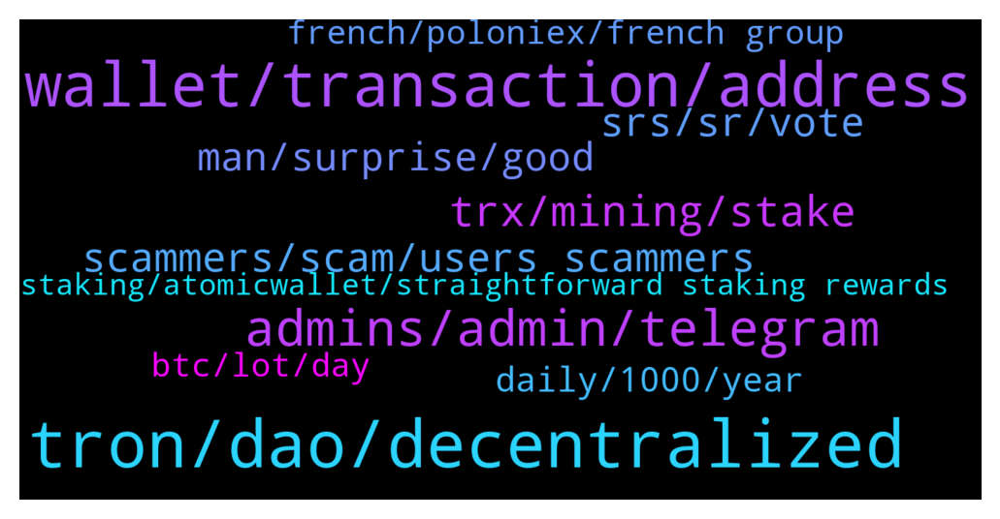

# **@tronnetworkEN**
 ## Analysis for **2022-01-04** - **2022-01-05**.

---

## 📊 **Basic Stats**

**n_messages_sent**: 312

---

---

## 🔝 **Top keywords and related messages**

1. **tron, dao, decentralized**

    @PiterSpain --- *⚒️Since the #TRON Foundation has settled to dissolve itself on July 25, 2021. #TRON network is sufficiently self-sustainable as a decentralized autonomous organization (#DAO), having completed this historical mission.🚀  🙌As the #TRON blockchain protocol is now essentially decentralized. Please follow TRON DAO and get more updates.  🥰Big thanks to our incredible #TRONICS for your continued support.  https://twitter.com/trondao/status/1478298336184926215* **--->** [TG Discussion](https://t.me/tronnetworkEN/3808069)

    @Carlos_TRX --- *TRON is guided by the decisions and votes of the SRs so if you want to be attentive to the news of TRON, I recommend that you enter their proposals.* **--->** [TG Discussion](https://t.me/tronnetworkEN/3808148)

    @Engr_murphy --- *I  mean do anyone have tron* **--->** [TG Discussion](https://t.me/tronnetworkEN/3811025)

    @firmam12 --- *so we try together to hold tron, for our target* **--->** [TG Discussion](https://t.me/tronnetworkEN/3808110)

    @zanzib4r --- *Hi, where to find the annouchement TronDao partnership with Quigon?* **--->** [TG Discussion](https://t.me/tronnetworkEN/3808386)

    @RickyBrein --- *I got an airdrop of PAL token in my TronLink wallet. Anyone can tell where I can sell it?* **--->** [TG Discussion](https://t.me/tronnetworkEN/3808007)

2. **wallet, transaction, address**

    @shotirk --- *i send my funds to by mistake to SC.... can I return it to my wallet? Or whom must I contact about it? Thanks.* **--->** [TG Discussion](https://t.me/tronnetworkEN/3810580)

    @Đỗ --- *Oh my God. I did not make that USDT transfer. Since my friend sent it to me, I've been checking my balance repeatedly but it's not showing. Why is there this transaction 2 hours later?* **--->** [TG Discussion](https://t.me/tronnetworkEN/3807522)

    @Fabs_trx --- *I can see 179usdt coming in and then going out of ur wallet 1 or 2 hours after* **--->** [TG Discussion](https://t.me/tronnetworkEN/3807319)

    @Fabs_trx --- *Getting back to the wallet it came from* **--->** [TG Discussion](https://t.me/tronnetworkEN/3807323)

    @Đỗ --- *@agentpiki My transaction history is completely empty. I have never received any transaction.* **--->** [TG Discussion](https://t.me/tronnetworkEN/3807313)

    @Mrwhite4life --- *Yes I have checked the hash and the transaction has been made pls what do I need to now* **--->** [TG Discussion](https://t.me/tronnetworkEN/3806723)

3. **admins, admin, telegram**

    @Papeaz --- *Here I can tell about a fake Tron telegram scamming about and airdrop* **--->** [TG Discussion](https://t.me/tronnetworkEN/3809883)

    @agentpiki --- *Admins and mods never message you first. They all stay in channel to help* **--->** [TG Discussion](https://t.me/tronnetworkEN/3808001)

    @turbo_tutone --- *guys watch out! ADMIN HELP is a scammer* **--->** [TG Discussion](https://t.me/tronnetworkEN/3810796)

    @v4hid1988 --- *hi  please guide  Is waykingroup Company claiming to cooprate with you? In your opinion , it is approved and the company can be trusted?  thanks* **--->** [TG Discussion](https://t.me/tronnetworkEN/3808356)

    @PiterSpain --- *There is no need to remove the picture if there is no evidence of scam.  We can found supporters with TRON logos in their profile. That's another way of support* **--->** [TG Discussion](https://t.me/tronnetworkEN/3810608)

    @Tamouu --- *Hello Guys ! Is Tron TRX bot on Telegram is a scam ?* **--->** [TG Discussion](https://t.me/tronnetworkEN/3810311)

4. **trx, mining, stake**

    @emilie_Dana --- *How to participate in TRX liquidity mining.* **--->** [TG Discussion](https://t.me/tronnetworkEN/3810557)

    @agentpiki --- *For freeze & free gas + trx rewards all in one* **--->** [TG Discussion](https://t.me/tronnetworkEN/3808200)

    @aleekfx --- *Whare I can stake more TRX?* **--->** [TG Discussion](https://t.me/tronnetworkEN/3806893)

    @eafrooz1 --- *Where do i can invest my trons? Daily profit* **--->** [TG Discussion](https://t.me/tronnetworkEN/3807692)

    @Carlos_TRX --- *TRX can not be mined, u can participate in LP event in sunswap.com* **--->** [TG Discussion](https://t.me/tronnetworkEN/3810571)

    @agentpiki --- *Or you can stake your trx in exchanges.  There is no tron mining. Saying this a million times. Mining trx is scam* **--->** [TG Discussion](https://t.me/tronnetworkEN/3808071)

5. **srs, sr, vote**

    @MilNoslen --- *If they afford the SR fee and operating fees for their own server rig* **--->** [TG Discussion](https://t.me/tronnetworkEN/3807159)

    @xPommepote --- *No information about this SR 🤷🏼‍♂️* **--->** [TG Discussion](https://t.me/tronnetworkEN/3807142)

    @Giulio --- *Sorry Carlos but what are the Srs?* **--->** [TG Discussion](https://t.me/tronnetworkEN/3808161)

    @RogerJones --- *what happens if you're an SR and you don't even validate blocks (as in run zero rigs)?* **--->** [TG Discussion](https://t.me/tronnetworkEN/3807162)

    @RogerJones --- *yes and no, I mean, you can use a 2nd wallet to vote for your self, I believe a few of the top SRs have done that  mysterious SRs w/ no info or group chat* **--->** [TG Discussion](https://t.me/tronnetworkEN/3807167)

    @RogerJones --- *that's why, when I saw the new SR I asked who they are* **--->** [TG Discussion](https://t.me/tronnetworkEN/3807168)

6. **scammers, scam, users scammers**

    @F4NTXME --- *Scammers are like trans prostitutes ... They wait for the client on the sidewalks ... don't be the client who will be tricked into things that are too beautiful to be those of a woman 😁* **--->** [TG Discussion](https://t.me/tronnetworkEN/3808669)

    @agentpiki --- *There are legit users.  Scammers are active, but if we are smart, scammers will stay hungry and die* **--->** [TG Discussion](https://t.me/tronnetworkEN/3808641)

    @sim_bil --- *Mostly users are scammers over here 🤦🏻‍♂️* **--->** [TG Discussion](https://t.me/tronnetworkEN/3808639)

    @kelvinalessandro --- *please can someone explain to me how I can earn money from this platform... no scam please.* **--->** [TG Discussion](https://t.me/tronnetworkEN/3810376)

    @simon866 --- *Maria was a bot posting random BTC info in quite a few groups 🤦‍♂️  If you see strange posts randomly talking about BTC let us know so we can check as they are probably bots 👍* **--->** [TG Discussion](https://t.me/tronnetworkEN/3808293)

    @Ilbana1973 --- *ok so they are ill-intentioned ??* **--->** [TG Discussion](https://t.me/tronnetworkEN/3808015)

7. **man, surprise, good**

    @shotirk --- *can you answer to my question )))* **--->** [TG Discussion](https://t.me/tronnetworkEN/3810614)

    @shotirk --- *i hope you wrong man )))))* **--->** [TG Discussion](https://t.me/tronnetworkEN/3810619)

    @simon866 --- *😂 so true, a very nasty surprise is waiting for them* **--->** [TG Discussion](https://t.me/tronnetworkEN/3808680)

    @turbo_tutone --- *piter you the man... you really are!👏👏👍👍👍👍👍🙃🙃🙃🙃🙃😉😉* **--->** [TG Discussion](https://t.me/tronnetworkEN/3810875)

    @ccmedianetwork --- *Haha, you are funny dude :)* **--->** [TG Discussion](https://t.me/tronnetworkEN/3810168)

    @F4NTXME --- *A hard and painful surprise 😏* **--->** [TG Discussion](https://t.me/tronnetworkEN/3808686)

8. **daily, 1000, year**

    @WindsofChange92 --- *Yes or divide $60 by 365 days and you will get the daily return* **--->** [TG Discussion](https://t.me/tronnetworkEN/3807965)

    @sim_bil --- *Its $60 a year for $1000 staked for a year 👍🏼* **--->** [TG Discussion](https://t.me/tronnetworkEN/3807917)

    @WindsofChange92 --- *7% apy on 1 million usd is a nice amount.* **--->** [TG Discussion](https://t.me/tronnetworkEN/3808014)

    @sim_bil --- *What would be the calculation for $1000 daily profits ?* **--->** [TG Discussion](https://t.me/tronnetworkEN/3807815)

    @sim_bil --- *Buying some currencies for a million would be more nice than 7%* **--->** [TG Discussion](https://t.me/tronnetworkEN/3808055)

    @WindsofChange92 --- *If you are looking to get rich its better probably to 10x a couple times.* **--->** [TG Discussion](https://t.me/tronnetworkEN/3808009)

9. **french, poloniex, french group**

    @HestimadoHamigo --- *No it is old for French community* **--->** [TG Discussion](https://t.me/tronnetworkEN/3809288)

    @HestimadoHamigo --- *Can I ask to join our Poloniex community?* **--->** [TG Discussion](https://t.me/tronnetworkEN/3809311)

    @Fabs_trx --- *Don’t hesitate to join Tron official French group as well 👀* **--->** [TG Discussion](https://t.me/tronnetworkEN/3809293)

    @Fabs_trx --- *Ok, didn’t know Poloniex had a French group till now hehe* **--->** [TG Discussion](https://t.me/tronnetworkEN/3809289)

    @HestimadoHamigo --- *You can all join our French community ❤️🇫🇷❤️* **--->** [TG Discussion](https://t.me/tronnetworkEN/3809265)

    @Illum --- *Any french group for tron please?* **--->** [TG Discussion](https://t.me/tronnetworkEN/3809468)

10. **btc, lot, day**

    @Sussyi7 --- *Shiba pump run is over and if you are buying shiba now you deserve to loose your money and all of it..* **--->** [TG Discussion](https://t.me/tronnetworkEN/3810325)

    @RealLescoBrandon --- *Does this board kick you off for asking about price movements?   It seems that no one likes to talk about price, because you’re all in this $Trillion Mkt for the tech.  Is that right?* **--->** [TG Discussion](https://t.me/tronnetworkEN/3810893)

    @WindsofChange92 --- *A lot of coins are actually growing against BTC though. Take a look at some coin/BTC charts.* **--->** [TG Discussion](https://t.me/tronnetworkEN/3807876)

    @HODLGANG21 --- *I learned a lesson painfully at the end of 2017 when BTC dropped from $20 000 to +- R3 000 the minute I bought after the ICO Boom....... I lost everything.. People who bought SHIB  before the pump or BTT are still hodling and are in profit till this day. Only late comers catch a falling knife🔪🔪🔪🔪🔪* **--->** [TG Discussion](https://t.me/tronnetworkEN/3810369)

    @sim_bil --- *Market is getting bored day by day 🙄 unless Elon Musk or some big whale try to move BTC to upwards.* **--->** [TG Discussion](https://t.me/tronnetworkEN/3810366)

    @WindsofChange92 --- *If you take a look at BTC dominance it has fallen. A lot of coins are decoupling but if BTC falls too much they will get rekt.* **--->** [TG Discussion](https://t.me/tronnetworkEN/3807872)

