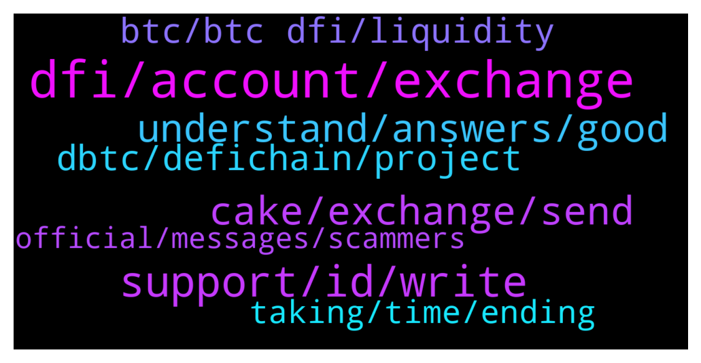

# **@CakeDeFi_EN**
 ## Analysis for **2022-01-05** - **2022-01-06**.

---

## 📊 **Basic Stats**

**n_messages_sent**: 348

---

---

## 🔝 **Top keywords and related messages**

1. **dfi, account, exchange**

    @freedfidotcom --- *DFI Withdrawals and Deposits are working fine* **--->** [TG Discussion](https://t.me/CakeDeFi_EN/161285)

    @YunTao --- *I got a network upgrade at kucoin* **--->** [TG Discussion](https://t.me/CakeDeFi_EN/161562)

    @Bence --- *sorry - is there a problem? at bittrex no dfi exchange possible since couple of days* **--->** [TG Discussion](https://t.me/CakeDeFi_EN/160820)

    @Michael_Schredl --- *You need an Exchange for that, like Bittrex or Kucoin* **--->** [TG Discussion](https://t.me/CakeDeFi_EN/161174)

    @ABIOLA SYLVESTER --- *Still waiting for DFi withdrawal to go through for days now any idea when they will have it resolved as KuCoin shows my deposit is still processing* **--->** [TG Discussion](https://t.me/CakeDeFi_EN/161380)

    @Richard Heng --- *Can we start to withdrawing dfi from kucoin?* **--->** [TG Discussion](https://t.me/CakeDeFi_EN/160877)

2. **support, id, write**

    @RevoMediaCCO --- *I live at a house, so all my info are the street and the number of it, i put all the information from my id on the adress and i get rejected because i didn't put all the necessary information* **--->** [TG Discussion](https://t.me/CakeDeFi_EN/160792)

    @erdalsutcu --- *I've been trying for a week it says my alias is wrong  I write what it says on my ID card. i can't change my name* **--->** [TG Discussion](https://t.me/CakeDeFi_EN/161261)

    @MENTOR1880 --- *Moderator please help, my account verification, it was rejected over 5 times, I have uploaded all documents required* **--->** [TG Discussion](https://t.me/CakeDeFi_EN/160931)

    @MENTOR1880 --- *Have tried even sent email to Zendesk, they said, they can't attend to documents* **--->** [TG Discussion](https://t.me/CakeDeFi_EN/160941)

    @Rocío --- *I can't register in the mobile version* **--->** [TG Discussion](https://t.me/CakeDeFi_EN/161466)

    @budiyil --- *@Michael_Schredl  The operation seems to be successful, but when I query the hash address, nothing comes up.* **--->** [TG Discussion](https://t.me/CakeDeFi_EN/161210)

3. **cake, exchange, send**

    @Yehuda --- *Do you planning to do an easier way to withdraw money from cake?* **--->** [TG Discussion](https://t.me/CakeDeFi_EN/160997)

    @YunTao --- *hi may i transfer ltc to cakedefi already? Or are there still problems with the deposit* **--->** [TG Discussion](https://t.me/CakeDeFi_EN/160989)

    @MaveJ --- *Really 60m? That would be indeed an improvement. Interesting why mine is pending and not progressed. As mentioned, cake becomes more and more an exchange in view of the dToken at least practically. Will wait the mentioned 72h …* **--->** [TG Discussion](https://t.me/CakeDeFi_EN/161036)

    @MaveJ --- *Would be really great if cake could reduce the time of withdrawals, in particular for higher amounts. Am waiting more than 24h and wire is still pending while value is reducing and I can‘t trade with it. FTX is able to arrange a transfer within 15min.* **--->** [TG Discussion](https://t.me/CakeDeFi_EN/161032)

    @Diodl --- *I want to delete my account, what about locked cake* **--->** [TG Discussion](https://t.me/CakeDeFi_EN/160803)

    @rupchan99 --- *hello  ad  Diposite and withdrawal are live or not in cakedefi?* **--->** [TG Discussion](https://t.me/CakeDeFi_EN/161002)

4. **understand, answers, good**

    @Bonnita --- *Very good morning to ya'll gud people.i'm the new member here and I'm to learn and contribute a lot.......Thank you* **--->** [TG Discussion](https://t.me/CakeDeFi_EN/161358)

    @CliintSaxon --- *I been checking this out for a few weeks now and love the concept. I want to get started I know nothing is perfect, and I understand the risk associated with the program 📺.* **--->** [TG Discussion](https://t.me/CakeDeFi_EN/160770)

    @Cryptoziano --- *Thank you for this :). I must do more research* **--->** [TG Discussion](https://t.me/CakeDeFi_EN/161230)

    @enalettin --- *Yes with all due respect I hope you understand how frustrating this for a user i am sure if you were in our position you would feel the same 😉* **--->** [TG Discussion](https://t.me/CakeDeFi_EN/161045)

    @enalettin --- *Yes i know it is the rule ok i accept it. And it is our right to feedback that  just know it it is a very frustrating rule and it works against the customer satisfaction just this.* **--->** [TG Discussion](https://t.me/CakeDeFi_EN/161049)

    @<UNK> --- *i dont really care if im venting in the wrong channel* **--->** [TG Discussion](https://t.me/CakeDeFi_EN/161455)

5. **dbtc, defichain, project**

    @Michael_Schredl --- *At the Moment no, but normaly yes. dBTC are just wrapped Bitcoin* **--->** [TG Discussion](https://t.me/CakeDeFi_EN/161616)

    @Michael_Schredl --- *You can deposit and lend BTC, you cannot use dBTC* **--->** [TG Discussion](https://t.me/CakeDeFi_EN/161166)

    @Michael_Schredl --- *Litecoin works fine, only dBTC Deposits are disabled* **--->** [TG Discussion](https://t.me/CakeDeFi_EN/160990)

    @AndesLarson --- *When will we be able to withdraw dBTC again?* **--->** [TG Discussion](https://t.me/CakeDeFi_EN/161266)

    @DmgBautista --- *BTC is the real asset. dBTC is a wrapped version to use in the defichain environment, if for example you want to send your BTC from Cake to the defichain wallet for example* **--->** [TG Discussion](https://t.me/CakeDeFi_EN/161608)

    @<UNK> --- *why so long? market crash and dbtc is stuck* **--->** [TG Discussion](https://t.me/CakeDeFi_EN/161412)

6. **btc, btc dfi, liquidity**

    @dwgranth --- *When is BTC->DFI swapping going to be enabled?* **--->** [TG Discussion](https://t.me/CakeDeFi_EN/161231)

    @noname123123789 --- *Hey, can you tell me when it will be possible to invest in btc-DFI again (liquidity mining) 😇* **--->** [TG Discussion](https://t.me/CakeDeFi_EN/161069)

    @Patrick_WH --- *Ok Great 😞  That means that I have no possibility to put my BTC into the Liquidity Mining?* **--->** [TG Discussion](https://t.me/CakeDeFi_EN/161484)

    @WilliamCHughes --- *Anyone know how long BTC deposits to Liquidity Mining will be off?* **--->** [TG Discussion](https://t.me/CakeDeFi_EN/161133)

    @Explorister --- *Can check why adding/removing liquidity is disabled for BTC-DFI?* **--->** [TG Discussion](https://t.me/CakeDeFi_EN/161602)

    @noname123123789 --- *How long will we not be able to put money in btc-DFI ? 😞* **--->** [TG Discussion](https://t.me/CakeDeFi_EN/161143)

7. **taking, time, ending**

    @rupchan99 --- *Hello admin  Please tell me refferal ending time there is no mention it* **--->** [TG Discussion](https://t.me/CakeDeFi_EN/160998)

    @meisterHaie --- *Any timing when this will be solved? Anything rough estimated?* **--->** [TG Discussion](https://t.me/CakeDeFi_EN/161214)

    @Michael_Schredl --- *There is no time, best would be to follow the announcement channel for news: https://t.me/CakeDeFi_EN_announcements* **--->** [TG Discussion](https://t.me/CakeDeFi_EN/161134)

    @Michael_Schredl --- *There is no ending for the referral program* **--->** [TG Discussion](https://t.me/CakeDeFi_EN/160999)

    @Steffen --- *Ok, when will it be possible again? Do you know ?* **--->** [TG Discussion](https://t.me/CakeDeFi_EN/161552)

    @<UNK> --- *Taking own sweet time to vote and blah. Solve it already* **--->** [TG Discussion](https://t.me/CakeDeFi_EN/161430)

