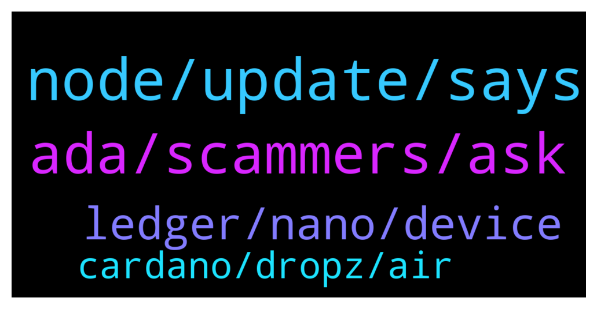

# **@Cardano**
 ## Analysis for **2022-01-05** - **2022-01-06**.

---

## 📊 **Basic Stats**

**n_messages_sent**: 101

---

---

## 🔝 **Top keywords and related messages**

1. **node, update, says**

    @glitch04 --- *if you get another node crash try a reboot and see if that helps something might be stuck in the background* **--->** [TG Discussion](https://t.me/Cardano/765860)

    @glitch04 --- *Right but it can still exit in a hung state, if it does that means it was killed before the process was cleanly exited which causes the extended check on startup* **--->** [TG Discussion](https://t.me/Cardano/765844)

    @Julius --- *I see. How do i avoid the hung state?  It just says stopping cardano node...* **--->** [TG Discussion](https://t.me/Cardano/765847)

    @AskCryptoViking --- *thanks for the help @Lgbeano appreciate it* **--->** [TG Discussion](https://t.me/Cardano/765883)

    @Julius --- *Must just be one of those days.  Usually it fixes itself after a day or so.  First time getting a crash on closure though.* **--->** [TG Discussion](https://t.me/Cardano/765856)

    @Julius --- *It usually says, shutting down node...* **--->** [TG Discussion](https://t.me/Cardano/765842)

2. **ada, scammers, ask**

    @Albert --- *Well I was looking for an admin couse a couple members of this group are trying to scam me and wanted to report them couse I have pictures. I can't even find the message I sent I guess someone deleted it* **--->** [TG Discussion](https://t.me/Cardano/765726)

    @Lgbeano --- *No worries at all. P.s. I will not be sending you a DM if you do receive one from an account looking like mine or anyone else's* **--->** [TG Discussion](https://t.me/Cardano/765884)

    @Giovanni --- *I mean when I want to liquidate my ADAs and convert them into fiat* **--->** [TG Discussion](https://t.me/Cardano/765925)

    @KN959595 --- *I read something about Liqwid, a project on ADA* **--->** [TG Discussion](https://t.me/Cardano/765810)

    @CryptoXgroup --- *Hey guys sending ADA from crypto.com to exodus, how long will it take? Been over 1 hour and yes adress is correct* **--->** [TG Discussion](https://t.me/Cardano/765664)

    @zainbachmid --- *can someone explain to me how to stake ada?* **--->** [TG Discussion](https://t.me/Cardano/765729)

3. **ledger, nano, device**

    @apex_pool_spo --- *you re not doing anything wrong. actually introducing the recovery words in Yoroi was a mistake. if the device is broken, you need to buy another Ledger and use the recovery words on that device to recover your wallet.* **--->** [TG Discussion](https://t.me/Cardano/765615)

    @AskCryptoViking --- *o ok well I didn't know I could do that with the s into the x i assumed maybe unnaturally so that the x had a different set of words because it was an "upgraded" version* **--->** [TG Discussion](https://t.me/Cardano/765882)

    @Ans --- *Hi my ledger is stuck on battery level and is not doing anything anylonger. I tried to import the ledger wallet in yoroi using the 24the seed phrase but it seems not the same wallet. What am I doing wrong?* **--->** [TG Discussion](https://t.me/Cardano/765613)

    @glitch04 --- *If you had a wallet added on Yoroi or another light wallet client you may have to remove the other device first for the new device to function they will have different signatures* **--->** [TG Discussion](https://t.me/Cardano/765896)

    @AskCryptoViking --- *I only ever really use daedalus wallet personally I've not gotten into using any light wallets yet tbh* **--->** [TG Discussion](https://t.me/Cardano/765903)

    @aw77jc --- *Hello is there a way to speed up the syncing process in the Daedalus wallet? Been syncing for several days.* **--->** [TG Discussion](https://t.me/Cardano/766000)

4. **cardano, dropz, air**

    @cryptowolfRSA --- *Good day,  I need some assistance, I need to send my cardano from Binance to Yori. Can anyone walk me through the whole process?* **--->** [TG Discussion](https://t.me/Cardano/765973)

    @the_boxer12 --- *Cardano overwhelms Ethereum on all of indexes https://twitter.com/cardaofinance/status/1478978919030456321* **--->** [TG Discussion](https://t.me/Cardano/766185)

    @Josh --- *Hi There!  I'm a newer developer to Cardano and set up a Testnet stake pool that I was hoping to get some extra tADA sent to.  Would anyone here be able to help me with that?* **--->** [TG Discussion](https://t.me/Cardano/766018)

    @CTLN91 --- *Are there any AirDrops for Cardano based projects?* **--->** [TG Discussion](https://t.me/Cardano/765867)

    @mindmisled --- *can anyone list the TG groups for cardano pls* **--->** [TG Discussion](https://t.me/Cardano/765755)

    @mindmisled --- *Cardano don't do air dropz do they?* **--->** [TG Discussion](https://t.me/Cardano/765769)

