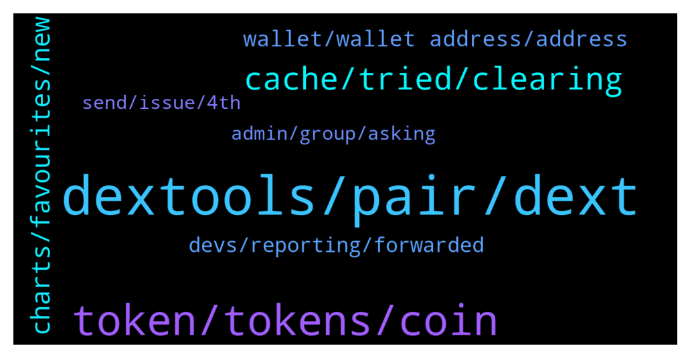

# **@DEXToolsCommunity**
 ## Analysis for **2022-01-04** - **2022-01-06**.

---

## 📊 **Basic Stats**

**n_messages_sent**: 435

---

---

## 🔝 **Top keywords and related messages**

1. **dextools, pair, dext**

    @stanes --- *Fixed. You can now find your pair on Dextools. Sorry for the delay.* **--->** [TG Discussion](https://t.me/DEXToolsCommunity/322292)

    @hmk18990 --- *if liq. is added in pancake then you'll see it soon in dextools. did you try to search for your contract in the search bar? (no need to add anything in dextools)* **--->** [TG Discussion](https://t.me/DEXToolsCommunity/322108)

    @bb98765kh --- *Interested in being sponsored on Dextools* **--->** [TG Discussion](https://t.me/DEXToolsCommunity/322470)

    @jmorfeo --- *on the same project dextscore is different if I see a pair or another ...* **--->** [TG Discussion](https://t.me/DEXToolsCommunity/321782)

    @jmorfeo --- *ok, I thought that dextscore was related to a project (token) ...* **--->** [TG Discussion](https://t.me/DEXToolsCommunity/321789)

    @C1T1Z3N --- *Is there any Dextools info on KCC projects? Trying to explore more chains.* **--->** [TG Discussion](https://t.me/DEXToolsCommunity/321795)

2. **token, tokens, coin**

    @OQuintero --- *Trying to swap some rose token to bnb but I can’t, any idea why?* **--->** [TG Discussion](https://t.me/DEXToolsCommunity/322505)

    @DFKGamer --- *bad news! Can not found aurora network coin 😭* **--->** [TG Discussion](https://t.me/DEXToolsCommunity/322145)

    @hmk18990 --- *To update Social Information for your token, please update etherscan.io or bscscan.com & update information on coinmarketcap.com and coingecko.com* **--->** [TG Discussion](https://t.me/DEXToolsCommunity/322058)

    @stanes --- *There is indeed an issue with displaying this token. I am reporting it to the devs team and they will fix it asap. Thank you for reporting.* **--->** [TG Discussion](https://t.me/DEXToolsCommunity/322123)

    @jon --- *It is  BSCB  BSCBITCOIN  Thank you* **--->** [TG Discussion](https://t.me/DEXToolsCommunity/321333)

    @bastardganpunk --- *There are sells on this coin, maybe you should adjust slippage* **--->** [TG Discussion](https://t.me/DEXToolsCommunity/321334)

3. **cache, tried, clearing**

    @stanes --- *Please try to clear your cache.* **--->** [TG Discussion](https://t.me/DEXToolsCommunity/322283)

    @bastardganpunk --- *Still not working? Check you have a stable internet connection and your cache cleared. It should work then. Maybe even restarting your computer.* **--->** [TG Discussion](https://t.me/DEXToolsCommunity/321610)

    @jamesharris279 --- *Is anyone else having huge problems with the site stalling and not running? I have to disconnect and reconnect my metamask every 15 minutes for the site to keep working. Same problem on chrome and brave* **--->** [TG Discussion](https://t.me/DEXToolsCommunity/322380)

    @hmk18990 --- *also it's a possibility that an antivirus, ad-blocker (can sometimes blocks irrelevant javascripts), or some other extension blocking something in the webapp.* **--->** [TG Discussion](https://t.me/DEXToolsCommunity/322386)

    @bastardganpunk --- *Have you cleared your cashe and tried again?* **--->** [TG Discussion](https://t.me/DEXToolsCommunity/322526)

    @borntochas3 --- *yea it worked after clearing cache and restarting my pc, i had it on for a few weeks now that might be the issue* **--->** [TG Discussion](https://t.me/DEXToolsCommunity/322286)

4. **charts, favourites, new**

    @imuresan --- *Sorry for this. I guess a bot was guilty of vaporising my feedback. Here it is again. I like the new font and the new, slightly cleaner, more stylish look. The thing that I don't find good is the treatment of the favourites. I should mention that I took the time to try and adjust to the new look and avoid being resistant to change. However I find that the favourites being displayed like they are on the right column does not work for me. That column covers the right part of the main/current chart I'm looking at (including the price). I'm on a windows computer. Also the column on the left side of the screen, where the favourites used to be, displays now information that is largely irrelevant to me at least. And one last thing. The miniature charts for each of the favourites is not very useful to me. It occupies a lot of space and it makes me scroll a lot to have a look at all my favourite pairs. I would still prefer the favourites to be on the left side of the screen where they used to be and without the miniature chart. In that way I was able to have a quick, birds eye view at my favourites without the need to scroll too much. I hope my feedback gets to the right persons. I wish everyone a Happy New Year! I have bought into Dextools because you are the first to publish the charts of new pairs from IDOs. I tried to use the Ethereum bot, without success. It's clunky as hell. I know that's another company. And I know a BSC bot is in the making. If you guys manage to pull those trading strategies off you have a great advantage and product.* **--->** [TG Discussion](https://t.me/DEXToolsCommunity/322017)

    @AJ --- *what about the candles which appeared before launch ? couldn't that be removed ? coz when you open the chart, it looks odd untill you zoom it* **--->** [TG Discussion](https://t.me/DEXToolsCommunity/321300)

    @Flashbang665 --- *hi, any admin online? (f&ckying scammers dont botther me with your dms...)  The save chart functionality doesn't work for me. When I want to load a saved chart, it doesn't list any charts* **--->** [TG Discussion](https://t.me/DEXToolsCommunity/322449)

    @mf1495 --- *No charts opening for me since the UI update* **--->** [TG Discussion](https://t.me/DEXToolsCommunity/322433)

    @napascual --- *1. You can switch favorites to the left side 2. You can hide the charts on the favorites and display them in a single line each* **--->** [TG Discussion](https://t.me/DEXToolsCommunity/322018)

    @JoeyDieleman --- *All depends on screensizes but you should have a change layout button right top* **--->** [TG Discussion](https://t.me/DEXToolsCommunity/322028)

5. **wallet, wallet address, address**

    @OQuintero --- *But they asking for my wallet address, it’s that correct?* **--->** [TG Discussion](https://t.me/DEXToolsCommunity/322507)

    @stanes --- *Yes you can. But for that you only need to connect your actual wallet (Metamask or other) to the app.* **--->** [TG Discussion](https://t.me/DEXToolsCommunity/322204)

    @Birds --- *Wallet Info when linked to Metamask* **--->** [TG Discussion](https://t.me/DEXToolsCommunity/321960)

    @OQuintero --- *Why it’s impossible if they have the address?* **--->** [TG Discussion](https://t.me/DEXToolsCommunity/322514)

    @rpoole69 --- *Now if you gave them your seed phrase yes, they could. Wallet address is public on the blockchain* **--->** [TG Discussion](https://t.me/DEXToolsCommunity/322550)

    @bastardganpunk --- *Michael is right. Nobody can steal coins having your PUBLIC key, which is your wallet address and starts with 0x…. On the ethereum chain. Never show your seed phrase to anyone. This is the 12 or 24 words you appointed. You need to keep them in a save place, this is the access to your wallet.* **--->** [TG Discussion](https://t.me/DEXToolsCommunity/322520)

6. **devs, reporting, forwarded**

    @bastardganpunk --- *ok, i will forward it to the devs. let’s see what they can do 🙂* **--->** [TG Discussion](https://t.me/DEXToolsCommunity/322364)

    @stanes --- *Ok, forwarding that to the devs rn, thanks for reporting.* **--->** [TG Discussion](https://t.me/DEXToolsCommunity/321553)

    @pranaysanghavi --- *where do we log a bug* **--->** [TG Discussion](https://t.me/DEXToolsCommunity/321759)

    @Elcocote --- *@stanes tell dev that I received notification now. Maybe they have changed something* **--->** [TG Discussion](https://t.me/DEXToolsCommunity/321563)

    @stanes --- *ah ok in weekly. I will forward that to the devs, thanks for reporting 👍* **--->** [TG Discussion](https://t.me/DEXToolsCommunity/322262)

    @bastardganpunk --- *thank you for reporting. I forwarded it to the devs.* **--->** [TG Discussion](https://t.me/DEXToolsCommunity/322147)

7. **send, issue, 4th**

    @napascual --- *You can dm those contact addresses to me* **--->** [TG Discussion](https://t.me/DEXToolsCommunity/322532)

    @stanes --- *Ahahaha how many of you in this chat + in DM? 😅* **--->** [TG Discussion](https://t.me/DEXToolsCommunity/322275)

    @napascual --- *Feel free to dm me for the original pc issue, we could go through it now* **--->** [TG Discussion](https://t.me/DEXToolsCommunity/322593)

    @napascual --- *Hey could you dm me before doing that?* **--->** [TG Discussion](https://t.me/DEXToolsCommunity/322591)

    @stanes --- *Can you send me some links with with this issue in DM please?* **--->** [TG Discussion](https://t.me/DEXToolsCommunity/322322)

    @FredericDEXT --- *If you are part of the team DM me* **--->** [TG Discussion](https://t.me/DEXToolsCommunity/322149)

