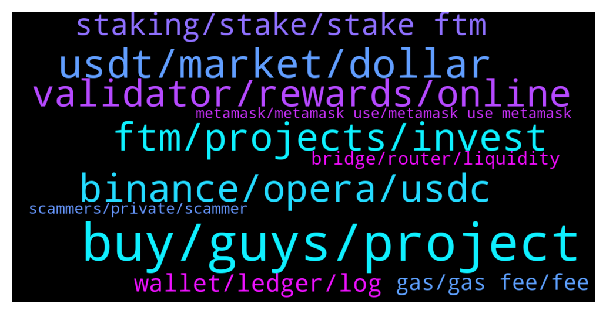

# **@Fantom_English**
 ## Analysis for **2022-01-05** - **2022-01-06**.

---

## 📊 **Basic Stats**

**n_messages_sent**: 376

---

---

## 🔝 **Top keywords and related messages**

1. **buy, guys, project**

    @oigsignals_owner --- *Which dex is the leading on the fantom network.* **--->** [TG Discussion](https://t.me/Fantom_English/622913)

    @kuzu_mao --- *This Twitter means it was officially recommended by fantom？* **--->** [TG Discussion](https://t.me/Fantom_English/624293)

    @kuzu_mao --- *I saw in the hellhound group that their project was included by fantom. Does it mean that this project is less risky？* **--->** [TG Discussion](https://t.me/Fantom_English/624301)

    @nutz3r123 --- *where can I swap on fantom? is there a dex list?* **--->** [TG Discussion](https://t.me/Fantom_English/623646)

    @scammersrscum --- *Do I need to buy mim on Fantom if so is there an easy guide?* **--->** [TG Discussion](https://t.me/Fantom_English/624551)

    @Fenflocka --- *What wallet is best used for Fantom?* **--->** [TG Discussion](https://t.me/Fantom_English/623823)

2. **usdt, market, dollar**

    @Feilin --- *may be! But as the most stable digital token on the market, I don’t think any digital token is safer than usdt.* **--->** [TG Discussion](https://t.me/Fantom_English/623861)

    @Feilin --- *First of all, you must understand that the issuance of usdt is strictly based on the concept of the dollar; to issue, every company that issues a usdt will have a dollar of funds stored in a bank account to ensure the stability of the usdt  Because it is secured by the U.S. dollar as the underlying technology currency, it will be called a safe haven for all cryptocurrencies* **--->** [TG Discussion](https://t.me/Fantom_English/623850)

    @Feilin --- *When the cryptocurrency market is falling, I think it’s the safest way to convert some coins into usdt.* **--->** [TG Discussion](https://t.me/Fantom_English/623847)

    @Mcjig --- *because fusd is not pegged at this time to the dollar* **--->** [TG Discussion](https://t.me/Fantom_English/623033)

    @Feilin --- *Ha ha! Usdt is currently the largest digital token in circulation on the market* **--->** [TG Discussion](https://t.me/Fantom_English/623872)

    @Ionuț --- *Usdc is safer  Some people say that usdt does'nt have liquidity enough* **--->** [TG Discussion](https://t.me/Fantom_English/623870)

3. **ftm, projects, invest**

    @pajamasfreak --- *Preference, both are top amm on ftm* **--->** [TG Discussion](https://t.me/Fantom_English/624309)

    @huan123li --- *Hi bro, is there any channel that recommends ftm's new projects? Or a Twitter influencer, I want to invest in a project that hasn’t been launched, haha* **--->** [TG Discussion](https://t.me/Fantom_English/623404)

    @LaurensVKA --- *What can you use FTM actually for? I'm new* **--->** [TG Discussion](https://t.me/Fantom_English/623877)

    @BB --- *Any prediction of how much ftm will be by end of 2022?* **--->** [TG Discussion](https://t.me/Fantom_English/623896)

    @Ewajwz --- *Invest in fantom starter then you get only new project,s for ftm* **--->** [TG Discussion](https://t.me/Fantom_English/623413)

    @Fluffy_Fuse --- *Hello!  Is there a guide on how to run a ftm node?* **--->** [TG Discussion](https://t.me/Fantom_English/623338)

4. **binance, opera, usdc**

    @Comgabo --- *Good day, I can't withdraw my ftm token from binance to my fantom wallet* **--->** [TG Discussion](https://t.me/Fantom_English/623248)

    @ElFamosoGriingo --- *Send from my metamask to binance usdc o' opera chain* **--->** [TG Discussion](https://t.me/Fantom_English/624471)

    @JoseSwifty --- *just curious if i send ftm from binance to ftm wallet will i need to have my metamask connected to FTM Opera or Eth mainnet* **--->** [TG Discussion](https://t.me/Fantom_English/623904)

    @Fjody --- *We do have USDC on opera chain. When you are buying USDC on Spooky, you are buying USDC on opera chain. The reason why you lost your coins is that USDC on Binance is a different chain (eth), so you need to use a bridge USDC(opera) -> USDC(eth) when transferring.* **--->** [TG Discussion](https://t.me/Fantom_English/624483)

    @ElFamosoGriingo --- *We don't have usdc on opera chain* **--->** [TG Discussion](https://t.me/Fantom_English/624470)

    @Janevietani --- *please wait until Binance reopen FTM network withdrawal or you can bridge USDT/ USDC BEP20 to Fantom then swap it to FTM later* **--->** [TG Discussion](https://t.me/Fantom_English/623250)

5. **validator, rewards, online**

    @Goldensurfer --- *Weird cos I received rewards from a different validator for 1 weeks delegation* **--->** [TG Discussion](https://t.me/Fantom_English/624673)

    @Goldensurfer --- *The validator Id is 2   is that the same thing? Thank you* **--->** [TG Discussion](https://t.me/Fantom_English/624668)

    @sk_hodl --- *Actually I delegated a validator last time. But I cannot delegate to the same validator again…* **--->** [TG Discussion](https://t.me/Fantom_English/624357)

    @sk_hodl --- *Can anybody suggest best validator to delegate FTM???  👆🏽👆🏽👆🏽* **--->** [TG Discussion](https://t.me/Fantom_English/624348)

    @Janevietani --- *the address that you claim doesnt get reward* **--->** [TG Discussion](https://t.me/Fantom_English/624693)

    @Janevietani --- *check it on explorer.fantom.network see if your validator still online or offline* **--->** [TG Discussion](https://t.me/Fantom_English/624658)

6. **staking, stake, stake ftm**

    @VirtualRob --- *Does anyone know of a better deal than farming FTM/Tomb on reaper? Seems like there shouldn’t be IL loss because of the peg, correct?* **--->** [TG Discussion](https://t.me/Fantom_English/624429)

    @Coin_Warior --- *Can i use trustwallet for staking ?* **--->** [TG Discussion](https://t.me/Fantom_English/624228)

    @Coin_Warior --- *Where are the best rate for staking ?* **--->** [TG Discussion](https://t.me/Fantom_English/624042)

    @lorotoro --- *HI1 I'm new in FANTOM. If I stake FTM I can mint sFTM. Can I stake anywhere this sFTM?* **--->** [TG Discussion](https://t.me/Fantom_English/623776)

    @Mcjig --- *no minimum. no lock is 4%* **--->** [TG Discussion](https://t.me/Fantom_English/624078)

    @Mcjig --- *whatever they are when you do it. usually a few cents* **--->** [TG Discussion](https://t.me/Fantom_English/624189)

7. **wallet, ledger, log**

    @Mcjig --- *on desktop, you have to click remove wallet* **--->** [TG Discussion](https://t.me/Fantom_English/622714)

    @Ellocos89 --- *how can i log out of my fantom wallet?* **--->** [TG Discussion](https://t.me/Fantom_English/622709)

    @Ellocos89 --- *when I press remove wallet everything is gone or not?* **--->** [TG Discussion](https://t.me/Fantom_English/622715)

    @Mcjig --- *no, just your wallet. you would have to restore it to whatever local device you want it on* **--->** [TG Discussion](https://t.me/Fantom_English/622746)

    @Mcjig --- *if you log out of your wallet. you would have to restore it with seed phrase or keystore to access again* **--->** [TG Discussion](https://t.me/Fantom_English/622713)

    @Ellocos89 --- *my question is, the wallet is open all the time because you can't log out* **--->** [TG Discussion](https://t.me/Fantom_English/622754)

8. **gas, gas fee, fee**

    @CloudXXX2021 --- *Gas fee is out of this world.  Any plans for fantom to lower gas fee* **--->** [TG Discussion](https://t.me/Fantom_English/624061)

    @Janevietani --- *if you are using spiritswap bridge, it will automatically give 0.4 FTM and if you are using anyswap or spookyswap bridge you can claim gas fee at here https://www.mentasuave01-tools.com* **--->** [TG Discussion](https://t.me/Fantom_English/624300)

    @SpaView --- *Gas fees are a problem for scaling* **--->** [TG Discussion](https://t.me/Fantom_English/624112)

    @Coin_Warior --- *How much for the gas fees?* **--->** [TG Discussion](https://t.me/Fantom_English/624182)

    @Mcjig --- *too many panic sellers, causing gas prices* **--->** [TG Discussion](https://t.me/Fantom_English/624075)

    @rhizomatique --- *it's heavenly comparing with eth gas fees* **--->** [TG Discussion](https://t.me/Fantom_English/624065)

9. **bridge, router, liquidity**

    @GoldenPock3t --- *and than the router ? bridge is there strange ^^ what is the different between router and bridge ?* **--->** [TG Discussion](https://t.me/Fantom_English/623552)

    @Janevietani --- *if you are using router, when bridge doesnt have liquidity, you will get anyToken that you can bridge back to origin chain , if you are using bridge and bridge doesnt have liquidity, your tx will be stuck until there is liquidity* **--->** [TG Discussion](https://t.me/Fantom_English/623561)

    @Janevietani --- *which bridge do you use before ?* **--->** [TG Discussion](https://t.me/Fantom_English/623135)

    @mastroalex25 --- *I didn't find any bridges, that's why I asked you for help😐* **--->** [TG Discussion](https://t.me/Fantom_English/623576)

    @Janevietani --- *have you used spiritswap bridge ?* **--->** [TG Discussion](https://t.me/Fantom_English/624314)

    @Pjay81 --- *Well I usually bridge tokens over there from other networks, and it always worked good for me.* **--->** [TG Discussion](https://t.me/Fantom_English/623555)

10. **scammers, private, scammer**

    @FrancoAndreassi --- *be avare of scammers contact you in private* **--->** [TG Discussion](https://t.me/Fantom_English/623945)

    @LDM246 --- *You really want to be scammed?* **--->** [TG Discussion](https://t.me/Fantom_English/624018)

    @miragele --- *Hello because you new on here just be careful from scammers on here and good luck 🤞* **--->** [TG Discussion](https://t.me/Fantom_English/623920)

    @K --- *Sounds like a scam, talking about  airdrop* **--->** [TG Discussion](https://t.me/Fantom_English/623728)

    @ChunKiet --- *And there you go. Scammer start private message you.* **--->** [TG Discussion](https://t.me/Fantom_English/623263)

    @Laurentiu7 --- *Yeah ik all messages were from scammers lmao* **--->** [TG Discussion](https://t.me/Fantom_English/623947)

