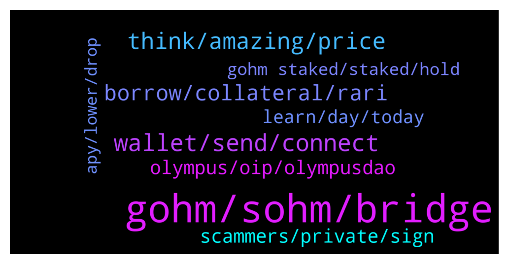

# **@OlympusTG**
 ## Analysis for **2022-01-05** - **2022-01-06**.

---

## 📊 **Basic Stats**

**n_messages_sent**: 553

---

---

## 🔝 **Top keywords and related messages**

1. **gohm, sohm, bridge**

    @Ap0l1o --- *I used the bridge both ways, was very easy to use* **--->** [TG Discussion](https://t.me/OlympusTG/142991)

    @Realcrypto123 --- *Hi Team, have 2 questions: 1) Why price of v2 is lower than v1? 2) Which price I should look at in case I own gOHM before the transition? (I wrapped my sOHM onto gOHM 1 month ago, before the transition). To rephrase my question, I would like to know what will be my sOHM rewards based on after I unwrap some day.* **--->** [TG Discussion](https://t.me/OlympusTG/142349)

    @fantom2684 --- *tell me h recently glazed sOHM and I'm starting to study. I got such a tweet, does it correspond to reality? how can I migrate to gOHM and at what point? thanks* **--->** [TG Discussion](https://t.me/OlympusTG/143048)

    @QTmightbehere --- *So sorry where am I getting reflections? My sohm hasn’t gone up at all in over a month says 0.000* **--->** [TG Discussion](https://t.me/OlympusTG/142963)

    @dbish4 --- *I can get more gOHM if I swap on traderjoe though. Why not do that?* **--->** [TG Discussion](https://t.me/OlympusTG/143329)

    @nfwaple --- *so you own sOHM now? Have you done the migration (see pinned messages)?* **--->** [TG Discussion](https://t.me/OlympusTG/142948)

2. **wallet, send, connect**

    @samboan --- *So i just connect wallet on the olympus dao app and thats itv* **--->** [TG Discussion](https://t.me/OlympusTG/143029)

    @QTmightbehere --- *Done that as well. Nothing new showing in my wallet ether* **--->** [TG Discussion](https://t.me/OlympusTG/142956)

    @nfwaple --- *I think you have been hacked friend, if metamask says 0.. if you want you can send me the transaction link in my dm, I can help you to have a look. No need to send if you're uncomfortable with it though* **--->** [TG Discussion](https://t.me/OlympusTG/143175)

    @willyc --- *It keeps getting disconnected by wallet connect* **--->** [TG Discussion](https://t.me/OlympusTG/142870)

    @GameChangerr_07 --- *Is it there a Polygon network issue? It dose not work on Metamask* **--->** [TG Discussion](https://t.me/OlympusTG/142250)

    @nfwaple --- *no it just worked for me, have you cleared cache?* **--->** [TG Discussion](https://t.me/OlympusTG/142334)

3. **think, amazing, price**

    @john --- *True, how do we create demand for this ohm? a lot of rebase projects rugged so Id figure etheir people are sick of rebase projects or still looking for a legitimate one, which ohm is* **--->** [TG Discussion](https://t.me/OlympusTG/142909)

    @xwolf69 --- *Hey been seeing alot of hype on ohm, any articles or content a dumb person like myself can educate them self with?* **--->** [TG Discussion](https://t.me/OlympusTG/143301)

    @safuking --- *guys what was the apy when there was 1000$ price per ohm ?* **--->** [TG Discussion](https://t.me/OlympusTG/142317)

    @Crypto_junkiee --- *What I have is ohm (erc 20) one* **--->** [TG Discussion](https://t.me/OlympusTG/142538)

    @DaveCraige --- *https://twitter.com/davecraige/status/1479054923304157190?s=21  Just applied to ETH Denver, one of the biggest events of the year.  Hope to see a ton of Ohnmies there!  I think it is going to be awesome!  Such good vibes there.* **--->** [TG Discussion](https://t.me/OlympusTG/143231)

    @bike4peace --- *I want you to check this out, as it means a lot to me to be in OHM since very very early and I know many of you think its too late or not that amazing, but family, OHM is KING and the new article of ZEUS is a nice moment, to see what we OHMies achieved last year https://twitter.com/bike4peace_/status/1478455942794596361?s=20* **--->** [TG Discussion](https://t.me/OlympusTG/142241)

4. **borrow, collateral, rari**

    @theMagicUnicorn --- *rari itself is safe to use, they are a long standing partner with ohm : https://docs.olympusdao.finance/main/partnership/rari-partnership* **--->** [TG Discussion](https://t.me/OlympusTG/142382)

    @nfwaple --- *no just one place, it means that rari is offering 0% because you only get what you're supposed to get from Olympus. If you deposit 1 gOHM to rari, you should still have 1 gOHM one month later* **--->** [TG Discussion](https://t.me/OlympusTG/142569)

    @nfwaple --- *this one is cool ^, using gOHM as collateral to borrow at 0% interest* **--->** [TG Discussion](https://t.me/OlympusTG/142604)

    @CodeBlooded1 --- *Rari would be cool if it would allow collateral from multiple blockchain in the same pool...  An idea for who ever wants to develop it.* **--->** [TG Discussion](https://t.me/OlympusTG/142259)

    @chitangxxx --- *even though what i borrow is only 28% of my collateral - weird - will get my credit card instead lol* **--->** [TG Discussion](https://t.me/OlympusTG/142578)

    @nfwaple --- *also pray for gOHM value to go up, then you might be able to borrow more than 1 ETH* **--->** [TG Discussion](https://t.me/OlympusTG/142573)

5. **olympus, oip, olympusdao**

    @nfwaple --- *lolol advanced OlympusDAO fork, where does the advance even come from, advance in rugging* **--->** [TG Discussion](https://t.me/OlympusTG/142273)

    @nfwaple --- *the interest they give should be the same as the Olympus APY 🥲* **--->** [TG Discussion](https://t.me/OlympusTG/142565)

    @tmytro --- *today olympus is only available only on ethereium chain?* **--->** [TG Discussion](https://t.me/OlympusTG/143413)

    @Btd0319 --- *Any other recommended projects similar to Olympus?* **--->** [TG Discussion](https://t.me/OlympusTG/142293)

    @WeeBee --- *where is the most discussion action for Olympus?* **--->** [TG Discussion](https://t.me/OlympusTG/143137)

    @nfwaple --- *go to the OlympusDAO forum, I'm voting no though, that's not really related to the vision of the protocol* **--->** [TG Discussion](https://t.me/OlympusTG/142878)

6. **scammers, private, sign**

    @brucoo --- *Scammers wont stop, dont stop because someone falls into the trap sadly.* **--->** [TG Discussion](https://t.me/OlympusTG/142491)

    @Alex --- *This should bei pinned aswell. The amount of scammers trying is insane in here 🙂👌 i think this is a good sign 😂* **--->** [TG Discussion](https://t.me/OlympusTG/143129)

    @nfwaple --- *do not respond to direct/private messages, they're scammers* **--->** [TG Discussion](https://t.me/OlympusTG/143126)

    @diobosco1 --- *Why would that bait scammers? I dont understand. Thx fir educating me.* **--->** [TG Discussion](https://t.me/OlympusTG/142525)

    @Ap0l1o --- *Claiming they will fix something or give you an airdrop* **--->** [TG Discussion](https://t.me/OlympusTG/142502)

    @willyc --- *People trying to phone me  Are they scammers* **--->** [TG Discussion](https://t.me/OlympusTG/142875)

7. **learn, day, today**

    @nfwaple --- *not too bad, it's quiet here today* **--->** [TG Discussion](https://t.me/OlympusTG/142485)

    @chitangxxx --- *i am so stupid sometimes it's unbelievable! thanks* **--->** [TG Discussion](https://t.me/OlympusTG/142924)

    @BCdev95 --- *Guys, it is my birthday today 🙂* **--->** [TG Discussion](https://t.me/OlympusTG/143281)

    @Liu2699 --- *Good morning, I wish everyone a new beginning every day* **--->** [TG Discussion](https://t.me/OlympusTG/143020)

    @Ap0l1o --- *I would rather have my breakfast :)* **--->** [TG Discussion](https://t.me/OlympusTG/142543)

    @CryptoQween --- *Hope everyone is having a productive day* **--->** [TG Discussion](https://t.me/OlympusTG/142366)

8. **gohm staked, staked, hold**

    @samboan --- *So after i buy gohm what do i do? And which is better. To buy gohm or stake manually* **--->** [TG Discussion](https://t.me/OlympusTG/143026)

    @nfwaple --- *no, your gOHM is always in staked form so it earns rewards anywhere* **--->** [TG Discussion](https://t.me/OlympusTG/143155)

    @diobosco1 --- *Am I right that in the end its no difference for a staker whether he stakes in sOHM or gOHM? Thanks for your help.* **--->** [TG Discussion](https://t.me/OlympusTG/142540)

    @nfwaple --- *no, gOHM is already staked, you're just going to the website to visualise your holding, you should be able to see something under Staked Balance* **--->** [TG Discussion](https://t.me/OlympusTG/143104)

    @nfwaple --- *nothing you need to do, gOHM is staked and earning rewards, no further action required* **--->** [TG Discussion](https://t.me/OlympusTG/142437)

    @nfwaple --- *you have to change your wallet network to ETH mainnet first, Stake page only exists on ETH mainnet because other chains don't need to stake as they will only have gOHM, gOHM is already staked so no need to have a stake page* **--->** [TG Discussion](https://t.me/OlympusTG/143099)

