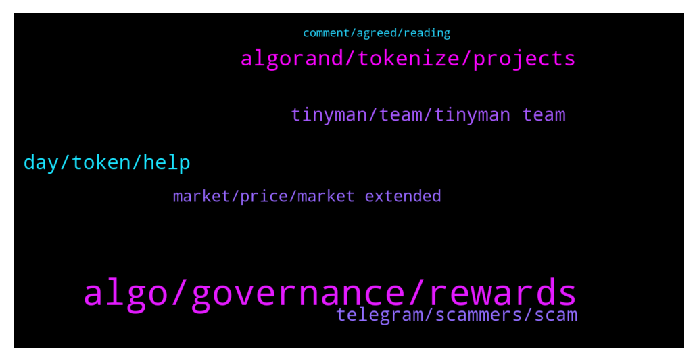

# **@algorand**
 ## Analysis for **2022-01-05** - **2022-01-06**.

---

## 📊 **Basic Stats**

**n_messages_sent**: 220

---

---

## 🔝 **Top keywords and related messages**

1. **algo, governance, rewards**

    @KAPIBAYSIDE --- *Are there people  in here in the arcc staking pool on yeildly? The numbers don't add up to me at the moment I have  283 arcc but yieldly  says I only have $22.21* **--->** [TG Discussion](https://t.me/algorand/330283)

    @MuratArkan --- *Why didn't algo intervene in the November 18 manipulation? this date has done great damage to this project. If you want to be a big coin, you will interfere with these manipulations, you will not allow them? Who sold the upgrade at that time? algo should explain it* **--->** [TG Discussion](https://t.me/algorand/330181)

    @MackDenver --- *You can check the governance FAQ below  https://algorand.foundation/gov-faq* **--->** [TG Discussion](https://t.me/algorand/329930)

    @NightAlgorand --- *Hi Chris , you can refer to this information regarding hard wallet  https://www.algorand.com/resources/algorand-announcements/the-algorand-wallet-just-got-more-secure-with-ledger  https://algorandwallet.com/support/security/pairing-your-ledger-nano-x  Hope it will help 🙂* **--->** [TG Discussion](https://t.me/algorand/330149)

    @Edison --- *Interesting! Thanks Don. What is the advantage of participating in governance?* **--->** [TG Discussion](https://t.me/algorand/329935)

    @mioumitsou --- *Guys i got a bag of algo.. Any advice on how to get it working for me (stacking, governance, loan, etc), some stratagies for max returns??* **--->** [TG Discussion](https://t.me/algorand/330062)

2. **algorand, tokenize, projects**

    @enochmarcs --- *hello  please what's the major utility of Algorand? (the website is a bit confusing 🥲)* **--->** [TG Discussion](https://t.me/algorand/329687)

    @PetitsPois --- *Not sure if those u mentioned all have smart contract* **--->** [TG Discussion](https://t.me/algorand/329738)

    @Crypt0Playa --- *XRP has Sologenic to tokenize stocks, bonds and financial securities. XLM has Mobi to tokenize stocks, bonds and financial securities.  Does Algorand have any projects that aim to tokenize stocks, bonds and financial securities?   I'm interested in real world use case projects not NFTs.  Does anyone know?* **--->** [TG Discussion](https://t.me/algorand/330056)

    @PetitsPois --- *Built-in layer 1 i am talking about. Not familiar with xdc* **--->** [TG Discussion](https://t.me/algorand/329741)

    @NightAlgorand --- *You can check out the use cases here https://www.algorand.com/ecosystem/use-cases* **--->** [TG Discussion](https://t.me/algorand/329699)

    @Crypt0Playa --- *Is there any projects on the ALGORAND Blockchain that aims to tokenize stocks, bonds, commodities, derivatives and other financial instruments?* **--->** [TG Discussion](https://t.me/algorand/329710)

3. **day, token, help**

    @jumpfetus --- *see Q38 on this page https://algorand.foundation/gov-faq* **--->** [TG Discussion](https://t.me/algorand/329841)

    @Mental --- *thank you for your answer, have a good day:)* **--->** [TG Discussion](https://t.me/algorand/330188)

    @NightAlgorand --- *Hi there, you can join Chinese community here https://t.me/AlgorandFoundationCN Have a great day 🙂* **--->** [TG Discussion](https://t.me/algorand/330163)

    @aungvbv --- *how to check sir ca pls?* **--->** [TG Discussion](https://t.me/algorand/330201)

    @Davie_p78 --- *Where can see value of the Fame token ...?* **--->** [TG Discussion](https://t.me/algorand/329977)

    @aungvbv --- *token distributed sir for gov 1?* **--->** [TG Discussion](https://t.me/algorand/330199)

4. **telegram, scammers, scam**

    @deadlypuppy --- *I'm just so tired of these weird accounts owned by people with shady alterior motives popping up in the telegram groups I'm apart of.* **--->** [TG Discussion](https://t.me/algorand/330245)

    @Cbi_6 --- *Hello  I Have a business proposal about creating an Arabic telegram community for $ALGO WHO should i pm?* **--->** [TG Discussion](https://t.me/algorand/329954)

    @MackDenver --- *Make sure to report them and stay safe from the scammers.* **--->** [TG Discussion](https://t.me/algorand/330261)

    @hope9999999 --- *🙁🙁🙁 i thought with crypto and borderless, people should not get mortgage😂😂😂 go. Travel everwhere. Don’t scam* **--->** [TG Discussion](https://t.me/algorand/330010)

    @kramercrypto --- *There was a scam message above, it's been deleted* **--->** [TG Discussion](https://t.me/algorand/329799)

    @Edward_York --- *Scammers are already texting me gonna have some fun though ...* **--->** [TG Discussion](https://t.me/algorand/329763)

5. **tinyman, team, tinyman team**

    @KKM --- *Any update on Tinyman been attack?* **--->** [TG Discussion](https://t.me/algorand/329979)

    @auronsan --- *did it safe to add algo lp on tinyman?* **--->** [TG Discussion](https://t.me/algorand/329881)

    @MackDenver --- *Please check in with Tinyman team about this  https://t.me/tinymanofficial* **--->** [TG Discussion](https://t.me/algorand/329981)

    @Cryptonigt --- *It's going alright? Was hoping to te the dump better...didn't happen quite like I wanted* **--->** [TG Discussion](https://t.me/algorand/330133)

    @Cryptonigt --- *Lol yea, I was just wasting his time* **--->** [TG Discussion](https://t.me/algorand/330130)

    @khunpon --- *♥️Thank you everyone for your support We want you all to do the  right thing.   1⃣REMOVE LIQUIDITY  2⃣STOP SWAPPING  to avoid more damages.  3⃣You dont have to apply for compensation, it will be automatic.  4⃣ If you discover something else, do well  to contact the team   5⃣ Your help and support is highly welcomed .  🖱 We look forward to accepting skilled professionals who can contribute by any other means.  📢Thank you  Tinyman Team* **--->** [TG Discussion](https://t.me/algorand/329987)

6. **market, price, market extended**

    @Cora --- *Bitcoin is plummeting. Should I Sell？* **--->** [TG Discussion](https://t.me/algorand/330273)

    @NightAlgorand --- *I was assuming you talked about the market last night 😂* **--->** [TG Discussion](https://t.me/algorand/330143)

    @ken_xmas --- *Can we talk about price here?* **--->** [TG Discussion](https://t.me/algorand/330015)

    @NightAlgorand --- *Hi @MuratArkan , we all know it was coming, this market was extended long enough, it's time for everyone to rest and start building real stuff like algorand stop chasing hype 😉* **--->** [TG Discussion](https://t.me/algorand/330180)

    @NightAlgorand --- *Here is the price discussion group-   https://t.me/algorand_price* **--->** [TG Discussion](https://t.me/algorand/330035)

    @Martin --- *I think a whale sold a huge amount and the price dump* **--->** [TG Discussion](https://t.me/algorand/330284)

7. **comment, agreed, reading**

    @Yojimbosatoshi --- *You're right, though. Those photos are gross.* **--->** [TG Discussion](https://t.me/algorand/330244)

    @deadlypuppy --- *Lol sorry I responded to the wrong comment. I was looking at the pictures from the profil right above your second to last comment.* **--->** [TG Discussion](https://t.me/algorand/330243)

    @khunpon --- *after reading it, I still don't get this https://algorand.foundation/governance/algo-dynamics* **--->** [TG Discussion](https://t.me/algorand/329842)

    @sayrus --- *finally i dont need to spend this illogical fees🥳🥳* **--->** [TG Discussion](https://t.me/algorand/330049)

    @TinyBit --- *Agreed, The website is surprisingly confusing 😳* **--->** [TG Discussion](https://t.me/algorand/329848)

