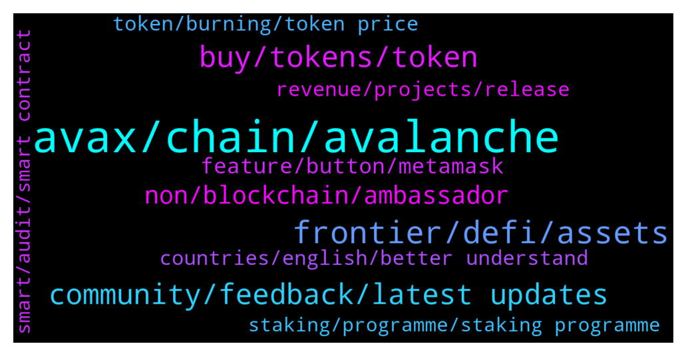

# **@avalancheavax**
 ## Analysis for **2022-01-05** - **2022-01-06**.

---

## 📊 **Basic Stats**

**n_messages_sent**: 391

---

---

## 🔝 **Top keywords and related messages**

1. **avax, chain, avalanche**

    @M0ckey --- *Does anyone know of any promising project on the Avax network, focused on P2earn and Nft? I think this segment will be very atractive to different blockchains from now on, just see harmony network pumping after the succesful of p2earn project "Defi Kingdoms".* **--->** [TG Discussion](https://t.me/avalancheavax/320186)

    @sk_hodl --- *Hi… I exported avax from c-chain address to x-chain address. But after exported from c-chain, I rejected the transaction before importing to x-chain.   Now avax is not available in any chain…can anybody help????   👆🏽👆🏽👆🏽👆🏽* **--->** [TG Discussion](https://t.me/avalancheavax/320325)

    @Nicolas_A --- *You receive the 1 avax back. and the other one for fees is quite generous* **--->** [TG Discussion](https://t.me/avalancheavax/319701)

    @charitrabansal --- *i need usdt on avax chain on metamask* **--->** [TG Discussion](https://t.me/avalancheavax/320355)

    @Thomas --- *I'm looking for advice, help or any support I can contact as my Avax was stolen from my wallet Christmas day and just discovered this last night when I logged in. Any help people can give me and point me in the direction of finding out how this has happened and what I can do will be much appreciated. Thank you.* **--->** [TG Discussion](https://t.me/avalancheavax/320411)

    @BinanceApe --- *Anyone else heard of avalps? Can’t get a chat link* **--->** [TG Discussion](https://t.me/avalancheavax/320290)

2. **frontier, defi, assets**

    @Nicolas_A --- *Yieldyak / Markr shows you a lot of farms* **--->** [TG Discussion](https://t.me/avalancheavax/320357)

    @ravidsrk --- *As per DeFiLamma there is 250b+ worth of assets have been locked in DeFi protocols across the chains.* **--->** [TG Discussion](https://t.me/avalancheavax/319978)

    @Nicolas_A --- *Fifth question is asked by TekilBilge on Twitter: What I'm wondering is how many people in total are using the #Frontier app right now.* **--->** [TG Discussion](https://t.me/avalancheavax/319972)

    @Nicolas_A --- *The first question comes from Wawan584264433: Can you explain how Frontier works? What are the advantages of its features?* **--->** [TG Discussion](https://t.me/avalancheavax/319956)

    @Nicolas_A --- *Okay question 6 by EPwnage on Twitter:  Can you share more details about the goals that Frontier aim to achieve in the market? Which main products are you focusing at the moment?* **--->** [TG Discussion](https://t.me/avalancheavax/319982)

    @ravidsrk --- *As of today we have more than 350K users using Frontier across Android and iOS.* **--->** [TG Discussion](https://t.me/avalancheavax/319974)

3. **buy, tokens, token**

    @Nicolas_A --- *Native stablecoin and native project token will continue to be listed.   You already have stables withdrawals on several exchanges. Crypto.com has USDC for example if I’m not mistaken* **--->** [TG Discussion](https://t.me/avalancheavax/319911)

    @Barraza23 --- *Can you share to us your tokenomics? How much is the total and circulation supply of your tokens? Will there be buy back system or token burning in the future?* **--->** [TG Discussion](https://t.me/avalancheavax/320095)

    @valueablesauce --- *Can you share to us your tokenomics? How much is the total and circulation supply of your tokens? Will there be buy back system or token burning in the future?* **--->** [TG Discussion](https://t.me/avalancheavax/320141)

    @zielinski_49 --- *Can you give an overview of your Tokenomics, and the UTILITY of Token?* **--->** [TG Discussion](https://t.me/avalancheavax/320046)

    @Rossieblanton --- *Can you give an overview of your Tokenomics, and the UTILITY of Token?* **--->** [TG Discussion](https://t.me/avalancheavax/320078)

    @Altheahollingsworth2003 --- *Can you share to us your tokenomics? How much is the total and circulation supply of your tokens? Will there be buy back system or token burning in the future?* **--->** [TG Discussion](https://t.me/avalancheavax/320010)

4. **community, feedback, latest updates**

    @NIm0671 --- *Could you tell us about Unifront SDK support?* **--->** [TG Discussion](https://t.me/avalancheavax/320033)

    @Nicolas_A --- *Nothing to worry about for the next century :)* **--->** [TG Discussion](https://t.me/avalancheavax/320210)

    @M0ckey --- *Good! I will study these projects, thank you* **--->** [TG Discussion](https://t.me/avalancheavax/320189)

    @sandy_queen12 --- *How can users stay updated with this project? Are there channels, including local communities where users can get the latest updates?* **--->** [TG Discussion](https://t.me/avalancheavax/320075)

    @AldaJose --- *Are you afraid some day there will be another project with more innovative technology can replace your project ?* **--->** [TG Discussion](https://t.me/avalancheavax/320015)

    @JoselynMckinney88 --- *Your project name seems to be very interesting. Does it have any story behind it? Can you share us with the inspiron for approaching to this name?* **--->** [TG Discussion](https://t.me/avalancheavax/320024)

5. **non, blockchain, ambassador**

    @Nicolas_A --- *Question 8 by iamAnup123: How does your project bring its products to the average consumer - especially non-crypto users?* **--->** [TG Discussion](https://t.me/avalancheavax/319989)

    @Rebeca_Egan_84 --- *Do you have any plans to attract non-crypto investors to join your project? Because the success of a project attracts more investors who haven't yet entered the crypto world. What are the plans to raise awareness about your project in the non-crypto space.* **--->** [TG Discussion](https://t.me/avalancheavax/320114)

    @mera_Blair --- *Do you have any plans to attract non-crypto investors to join your project? Because the success of a project attracts more investors who haven't yet entered the crypto world. What are the plans to raise awareness about your project in the non-crypto space.* **--->** [TG Discussion](https://t.me/avalancheavax/320089)

    @TheMightyAnonym --- *Most of users are still not aware with Blockchain & its related projects ! So, How Your Project platform create awareness about their project with NON-CRYPTO users too?* **--->** [TG Discussion](https://t.me/avalancheavax/320143)

    @AbbeyMcfarlane1999 --- *Most of users are still not aware with Blockchain & its related projects ! So, How Your Project platform create awareness about their project with NON-CRYPTO users too?* **--->** [TG Discussion](https://t.me/avalancheavax/320011)

    @ijordan19 --- *Most of users are still not aware with Blockchain & its related projects ! So, How Your Project platform create awareness about their project with NON-CRYPTO users too?* **--->** [TG Discussion](https://t.me/avalancheavax/320041)

6. **feature, button, metamask**

    @Nicolas_A --- *Here https://avascan.info/staking/validators?f=endTime,gte,1209600000%3BdelegationFee,lte,0.05%3Buptime,gt,0.80#tabletop   Verify that the validator has good uptime and that he has updated his node to the latest version which is 1.7.3* **--->** [TG Discussion](https://t.me/avalancheavax/319855)

    @luisao8788 --- *I tried but is not possible, because now is like disable* **--->** [TG Discussion](https://t.me/avalancheavax/319807)

    @CryptoDefiPhoenix --- *Also any one has issues with wrapping their memos?* **--->** [TG Discussion](https://t.me/avalancheavax/320247)

    @cemil1237 --- *Why didn't you put the DApps browser part in your wallet app? Don't you think this is a must have feature?* **--->** [TG Discussion](https://t.me/avalancheavax/320032)

    @AD --- *There might be an error you need to debugged* **--->** [TG Discussion](https://t.me/avalancheavax/320326)

    @don_wonton --- *Ah that might be the issue. I never use mobile* **--->** [TG Discussion](https://t.me/avalancheavax/320283)

7. **revenue, projects, release**

    @RosendaP --- *Marketing is a central element for every project, so that everyone knows the potential that a project can bring is vital to achieve the goals set. What is your strategy to attract new users and Investor to your platform and keep them long term.* **--->** [TG Discussion](https://t.me/avalancheavax/320057)

    @SolomonDeLugo --- *Too many projects promise magic but never release any working product or prove any revenue, Within a short/long time of release. Is your project also like this? If not can u tell us, What makes your project different from other projects?* **--->** [TG Discussion](https://t.me/avalancheavax/320130)

    @ah_helton_66 --- *What are the ways for your project to generate revenue in the long run? What is the progress of business development and what are some of your commercial partnerships?* **--->** [TG Discussion](https://t.me/avalancheavax/320083)

    @naldo_foret --- *Revenue is an important aspect for all projects to survive and maintain the project/company. How have you been able to build a complete project and what is the way to generate profit/revenue of the token? What is the income model?* **--->** [TG Discussion](https://t.me/avalancheavax/320047)

    @domullin1994 --- *Too many projects promise magic but never release any working product or prove any revenue, Within a short/long time of release. Is your project also like this? If not can u tell us, What makes your project different from other projects?* **--->** [TG Discussion](https://t.me/avalancheavax/320051)

    @obynLoera --- *What are the ways for your project to generate revenue in the long run? What is the progress of business development and what are some of your commercial partnerships?* **--->** [TG Discussion](https://t.me/avalancheavax/320045)

8. **countries, english, better understand**

    @EstelaDoe --- *Are you planning to promote your project in countries / regions where English is not good? Do you have a local community for them to better understand your project??* **--->** [TG Discussion](https://t.me/avalancheavax/320148)

    @JamiRyan92 --- *Are you planning to promote your project in countries / regions where English is not good? Do you have a local community for them to better understand your project??* **--->** [TG Discussion](https://t.me/avalancheavax/320119)

    @Ronda_Putnam --- *Are you planning to promote your project in countries / regions where English is not good? Do you have a local community for them to better understand your project??* **--->** [TG Discussion](https://t.me/avalancheavax/320070)

    @shoshanamckee --- *How Do you planning to promote your project in different countries, wherein English is not spoken well? Do you have a local communities for them to better understand your project?* **--->** [TG Discussion](https://t.me/avalancheavax/320031)

    @yyyyqing --- *Is there a Chinese community here?* **--->** [TG Discussion](https://t.me/avalancheavax/319839)

    @Torimarin --- *Is your project a community only for English speaking an countries or for users not of other languages?* **--->** [TG Discussion](https://t.me/avalancheavax/320029)

9. **token, burning, token price**

    @sRineharta --- *Do you have a Token Burning plan to increase Token value and attract Investors to invest?* **--->** [TG Discussion](https://t.me/avalancheavax/320132)

    @oscar_lloyd --- *Do you have any plan for burning tokens in the future to reduce the supply of the token and increase its investment attractiveness?* **--->** [TG Discussion](https://t.me/avalancheavax/320116)

    @leMeek86 --- *Do you have a Token Burning plan to increase Token value and attract Investors to invest?* **--->** [TG Discussion](https://t.me/avalancheavax/320088)

    @alie_valadez1992 --- *Do you have a Token Burning plan to increase Token value and attract Investors to invest?* **--->** [TG Discussion](https://t.me/avalancheavax/320076)

    @rena_mccau --- *Do you have a Token Burning plan to increase Token value and attract Investors to invest?* **--->** [TG Discussion](https://t.me/avalancheavax/320049)

    @Alex_lanham --- *Do you have any plan for burning tokens in the future to reduce the supply of the token and increase its investment attractiveness?* **--->** [TG Discussion](https://t.me/avalancheavax/320014)

10. **staking, programme, staking programme**

    @lackmanac --- *Staking programme is very important for any project,?? Can i stake your token,? Do you have any plan of starting staking programme,??* **--->** [TG Discussion](https://t.me/avalancheavax/320058)

    @Nicolas_A --- *Yeah should also show single side. IF you want to stake as delegator / validator check https://docs.avax.network/build/tutorials/nodes-and-staking/staking-avax-by-validating-or-delegating-with-the-avalanche-wallet/* **--->** [TG Discussion](https://t.me/avalancheavax/320361)

    @Miali12 --- *Any one knows how to stake and could put me through?* **--->** [TG Discussion](https://t.me/avalancheavax/320373)

    @Yekscrypto --- *team is great and token launch still in january.  swap/farm/stake is just some of the features to be launched. pay attention to it* **--->** [TG Discussion](https://t.me/avalancheavax/319902)

    @ssiedow4 --- *'STAKING'' is one of the STRATEGIES to ATTRACT USERS and HOLD Them long term. Does your GREAT PROJECT have plan about Staking??* **--->** [TG Discussion](https://t.me/avalancheavax/320080)

    @Sharan_Bivens_96 --- *Staking programme is very important for any project,?? Can i stake your token,? Do you have any plan of starting staking programme,??* **--->** [TG Discussion](https://t.me/avalancheavax/320030)

