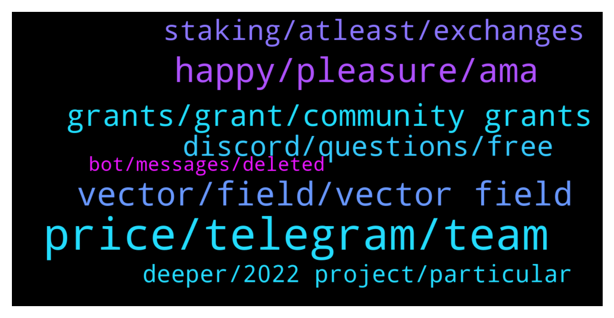

# **@chainlinkofficial**
 ## Analysis for **2022-01-05** - **2022-01-06**.

---

## 📊 **Basic Stats**

**n_messages_sent**: 154

---

---

## 🔝 **Top keywords and related messages**

1. **price, telegram, team**

    @BCdev95 --- *Am I allowed to ask about hiring process of Chainlink here?* **--->** [TG Discussion](https://t.me/chainlinkofficial/360013)

    @Linkederic --- *Hey Jamie, price discussion of any kind is prohibited in this channel* **--->** [TG Discussion](https://t.me/chainlinkofficial/360208)

    @abraham055 --- *hello, that's not my point anyway.  In fact, I asked if the price has been increasing for a week, there is a news flow that I cannot follow.  or like a deal* **--->** [TG Discussion](https://t.me/chainlinkofficial/360283)

    @Mr --- *Can someone link me to a chainlink price chat please* **--->** [TG Discussion](https://t.me/chainlinkofficial/359883)

    @Jamie --- *Is there a link channel to discuss TA or price anywhere* **--->** [TG Discussion](https://t.me/chainlinkofficial/360218)

    @Vaww1 --- *I remeber people got mad cause sergey was selling tons of chainlink* **--->** [TG Discussion](https://t.me/chainlinkofficial/360034)

2. **happy, pleasure, ama**

    @Kenduvik --- *I am happy to be here* **--->** [TG Discussion](https://t.me/chainlinkofficial/360421)

    @JJ_D_RZ --- *Hello everyone I’m new to the channel  I wish you happy new year to each and everyone of you along with your respective family and loved ones  may 2022 bring you Health joy and prosperity 🎊🎊🥳🥳* **--->** [TG Discussion](https://t.me/chainlinkofficial/360264)

    @MarcTillement --- *Hey sers Any follow up on this?* **--->** [TG Discussion](https://t.me/chainlinkofficial/360121)

    @Joypokkamol --- *Hi everyone! 👋 We will have an AMA today, don’t miss out! https://twitter.com/sosojoystory/status/1479014562422734849?s=20* **--->** [TG Discussion](https://t.me/chainlinkofficial/360562)

    @Angelikov --- *My name is Angelikov. It is a pleasure to greet you.* **--->** [TG Discussion](https://t.me/chainlinkofficial/359859)

    @jh3318 --- *Hey guys glad to be here* **--->** [TG Discussion](https://t.me/chainlinkofficial/360138)

3. **vector, field, vector field**

    @joey_roth --- *So Vector Field is my way of exploring this materiality that blockchain affords. It’s the foundation of the dynamic (changing after mint based on real-time data feeds) on-chain art that I’m working on now* **--->** [TG Discussion](https://t.me/chainlinkofficial/360666)

    @rheeunion --- *Hi, Josh. I'm reading chainlink Docs right now, and I have few questions regarding VRF.* **--->** [TG Discussion](https://t.me/chainlinkofficial/360287)

    @Joypokkamol --- *In just a few moments, we will have a Community Q&A with Vector Field who recently announced that it integrates Chainlink VRF to Deliver Secure Randomness for On-Chain Materiality in NFTs. https://twitter.com/chainlink/status/1478410899727785993?s=20* **--->** [TG Discussion](https://t.me/chainlinkofficial/360643)

    @Joypokkamol --- *It is fascinating to see Vector Field Integrates Chainlink VRF.* **--->** [TG Discussion](https://t.me/chainlinkofficial/360668)

    @joey_roth --- *My background is industrial design and hardware as I mentioned before, so this generating forms using true randomness (from VRF) and then encoding them immutably and directly onto the ethereum blockchain is as close as digital art can get to physical art* **--->** [TG Discussion](https://t.me/chainlinkofficial/360662)

    @joey_roth --- *It does three main things - requests a random number from VRF, uses that number to generate svg code with boundaries for dimensions, opacity, and colors that I set, and then encodes the svg to bytes32 as the token uri* **--->** [TG Discussion](https://t.me/chainlinkofficial/360660)

4. **grants, grant, community grants**

    @harrumphharrumph --- *Any project can request a grant and will be reviewed. Take a look through https://chain.link/community/grants for categories and past recipients to understand what qualifies.* **--->** [TG Discussion](https://t.me/chainlinkofficial/359891)

    @Angelikov --- *Hello, Thanks a lot. I have reviewed but cannot find the terms and conditions and Of all the grants, the closest to our project is community grants. But, there is not much information. Do you have an information format?* **--->** [TG Discussion](https://t.me/chainlinkofficial/359894)

    @Angelikov --- *Hello thank you very much. Yes, we want Participation in community grants but we do not see on the page The specific milestones you mention we only see the form* **--->** [TG Discussion](https://t.me/chainlinkofficial/359909)

    @JoshSimenhoff --- *Hey Angelica, thanks for asking here. The terms and conditions vary depending on the grant and are decided during the application process. Each grant has specific milestones that need to be reached in order for the grantee to receive the grant. Does this answer your question? Have you already applied for a grant? If not DM me and I can help you decide if Chainlink Community grants can provide support for your team or project.* **--->** [TG Discussion](https://t.me/chainlinkofficial/359904)

    @JoshSimenhoff --- *Thank you for the offer sir but we are not currently hiring moderators. If you want to volunteer for our community you can always apply to be a Chainlink Advocate https://blog.chain.link/expanding-the-chainlink-community-advocate-program/* **--->** [TG Discussion](https://t.me/chainlinkofficial/360324)

    @juankaramoy --- *I would suggest you to fill up this form and our team will get in touch with you https://chainlinkcommunity.typeform.com/to/OYQO67EF?page=docs-VRF&typeform-source=docs.chain.link* **--->** [TG Discussion](https://t.me/chainlinkofficial/360493)

5. **staking, atleast, exchanges**

    @Crypto_Banana --- *Is it true that staking link will be available in the future? (Scammers, dont bother dm me)* **--->** [TG Discussion](https://t.me/chainlinkofficial/360403)

    @jh3318 --- *So I have a question. I’d like to get more involved with the project is there anything I can do? Been researching running a node. I heard staking is eventually coming not sure if it’s true or not. Either way I’m looking for suggestions to get steered in the right direction. Any help or advice is appreciated. Tyia* **--->** [TG Discussion](https://t.me/chainlinkofficial/360140)

    @Kokenyesi --- *Hi guys, any dates about staking announced? More than a year is gone & I still hear ‘soon’, but atleast now Sergey called it it will be in 2022 Do we have atleast which quarters now? 2022 Q3? Q4? Maybe late Q2? If staking would come in next months we would been able to see more data on githube in the staking documents, so I guess it will come probably around june or july if no delays? I am fine with that, atleast we securly know it comes in 2022* **--->** [TG Discussion](https://t.me/chainlinkofficial/360736)

    @marcromeron --- *Chainlink staking is not yet available. Other forms of staking offered by exchanges are actually yield farming, lending/borrowing, which is not endorsed by us and is outside the scope of discussion in this channel.* **--->** [TG Discussion](https://t.me/chainlinkofficial/360335)

    @Jamie --- *Nice do you have any idea what the staking rate will be* **--->** [TG Discussion](https://t.me/chainlinkofficial/360200)

    @dracula53 --- *Yes.  Sometime in 2022 we should be able to stake* **--->** [TG Discussion](https://t.me/chainlinkofficial/360191)

6. **discord, questions, free**

    @JoshSimenhoff --- *I believe we have a couple of workshops coming up led by our developer relationships team. Sign up for our group and you’ll get updates sent to your email.* **--->** [TG Discussion](https://t.me/chainlinkofficial/360151)

    @proteusguy --- *Done. Thanks. (Interesting that you offer email, Telegram, and Discord as communication channels. Pretty cool.)* **--->** [TG Discussion](https://t.me/chainlinkofficial/360494)

    @joey_roth --- *If anyone has more questions feel free to pm me or hit me up on discord/ twitter* **--->** [TG Discussion](https://t.me/chainlinkofficial/360692)

    @juankaramoy --- *Sure thing! Feel free to check out our discord where we have dedicated channels for technical discussions* **--->** [TG Discussion](https://t.me/chainlinkofficial/360496)

    @JoshSimenhoff --- *Awesome! Please join our developer Discord. There are others who have similar questions as your self and can provide detailed explanations and answers. chain.link/discord* **--->** [TG Discussion](https://t.me/chainlinkofficial/360292)

    @PolivodaTatiana --- *hey @matt_braine depends what your question is, but generally deep technical questions are asked in our Discord group. that's where the most of developers hang out* **--->** [TG Discussion](https://t.me/chainlinkofficial/359802)

7. **deeper, 2022 project, particular**

    @symphox --- *Noob here, but I've been doing some digging here. Incredible stuff* **--->** [TG Discussion](https://t.me/chainlinkofficial/359787)

    @AriKiry --- *Such an inspiration. Love to hear how people from different backgrounds jump into this industry to create totally new use cases. Wish you the best of luck!* **--->** [TG Discussion](https://t.me/chainlinkofficial/360696)

    @Joypokkamol --- *The new year has just begun! What’s next on your project’s roadmap that we may expect in the near future?* **--->** [TG Discussion](https://t.me/chainlinkofficial/360673)

    @Joypokkamol --- *As always, we’re interested in what makes your project special?* **--->** [TG Discussion](https://t.me/chainlinkofficial/360661)

    @mesl416 --- *any great upcoming projects this 2022?* **--->** [TG Discussion](https://t.me/chainlinkofficial/360088)

    @SweatRock --- *New to this community. Any exciting new developments in particular I should look at?* **--->** [TG Discussion](https://t.me/chainlinkofficial/359840)

8. **bot, messages, deleted**

    @Linkederic --- *@prahasithv bot deleted your comment, no need to apologize, I know you were just kidding!* **--->** [TG Discussion](https://t.me/chainlinkofficial/360222)

    @juankaramoy --- *Welcome new members! Please review the pinned messages for rules and guide lines https://t.me/chainlinkofficial/325011* **--->** [TG Discussion](https://t.me/chainlinkofficial/359970)

    @Linkederic --- *our bot just deletes @'s and links from folks for a certain period after they join. We're glad to have you 🤝* **--->** [TG Discussion](https://t.me/chainlinkofficial/360226)

    @jh3318 --- *Ok I’ll definitely do that. Thank you guys very much this was helpful 👍🏽.* **--->** [TG Discussion](https://t.me/chainlinkofficial/360152)

    @rheeunion --- *Oops, my message is deleted. Could you please check from the junk messages?* **--->** [TG Discussion](https://t.me/chainlinkofficial/360290)

