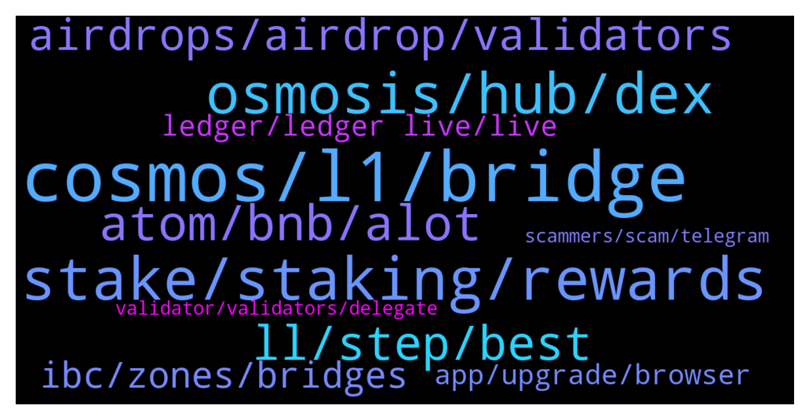

# **@cosmosproject**
 ## Analysis for **2022-01-05** - **2022-01-06**.

---

## 📊 **Basic Stats**

**n_messages_sent**: 603

---


---


## 🔝 **Top keywords and related messages**

1. **cosmos, l1, bridge**

    @escobyte --- *Looks like evmos also has an eth bridge, and it would be better than gravity bridge since you can use them in smart contracts running within evmos  https://evmos.blog/introducing-evmos-erc20-module-f40a61e05273  ``` With Evmos’s upcoming EVM bridge deployments, users will be able to transfer their existing ERC20s on Ethereum, L2s, and other EVM-based chains to Evmos and subsequently use the x/erc20 module to convert them into native Cosmos Coins ```* **--->** [TG Discussion](https://t.me/cosmosproject/468902)

    @tandemalphafitzy --- *Yup yup, I'm reasonably well versed in layman blockchain tech ie vertical scaling and how Cosmos works with L1's and IBC etc. I just have a niggling worry that should the ecosystem have a sudden spike in usage which it inevitably will that there may be some bugs that hurt the brand in the short term. I'm no dev so thought I'd ask the question. Hopefully we don't have drama with relayers when this happens* **--->** [TG Discussion](https://t.me/cosmosproject/468374)

    @Graphicals --- *Awesome awesome, yeah cause i cant seem to understand how exactly to switch from matic to cosmos haha, rookie mode 🤣* **--->** [TG Discussion](https://t.me/cosmosproject/468214)

    @AtomJazz --- *It's not a myth in Cosmos* **--->** [TG Discussion](https://t.me/cosmosproject/467579)

    @AtomJazz --- *Yes, they will launch their own Cosmos chain soon* **--->** [TG Discussion](https://t.me/cosmosproject/467496)

    @Graphicals --- *even on the reddit, all posts said that we had to basically bridge poly to ethereum, and then bridge that into cosmos* **--->** [TG Discussion](https://t.me/cosmosproject/468105)

2. **stake, staking, rewards**

    @AtomJazz --- *We will have more details on this when we get closer to the launch of Interchain staking. Hard to tell or speculate on this atm* **--->** [TG Discussion](https://t.me/cosmosproject/468375)

    @badcapitan02 --- *staking in cosmosation do not need to comession?* **--->** [TG Discussion](https://t.me/cosmosproject/468980)

    @ed_10000 --- *Do we know what proportion of rewards we get from interchain staking? For example if I stake 100 dollars of atom and the validator also secures akash, do I get rewards for 100 dollars worth of akash too, or for some other amount of akash?* **--->** [TG Discussion](https://t.me/cosmosproject/468373)

    @shadow_dweller --- *Can somebody explain to me how providing single LP assets work, if I only wish to add one asset and it’s the lesser in the pool does that help to balance the pool ? Also how does that affect the APR and potentially losses ? Thanks* **--->** [TG Discussion](https://t.me/cosmosproject/467652)

    @cosmicmatt --- *You can check out rewards for different ATOM validators here https://www.stakingrewards.com/earn/cosmos. Should be ~13%* **--->** [TG Discussion](https://t.me/cosmosproject/468482)

    @satoshi_onamoto --- *Hi, I'm new here, just wanted to ask a few quick ones; with staking are my rewards restaked automatically?* **--->** [TG Discussion](https://t.me/cosmosproject/468267)

3. **osmosis, hub, dex**

    @srini_sunil --- *is there an equivalent of https://info.osmosis.zone/ for gravity dex* **--->** [TG Discussion](https://t.me/cosmosproject/468931)

    @srini_sunil --- *wanted to look specifically at the cosmos hub vs osmosis hub* **--->** [TG Discussion](https://t.me/cosmosproject/468918)

    @AtomJazz --- *A lot of it is pooled on Osmosis* **--->** [TG Discussion](https://t.me/cosmosproject/469046)

    @AtomJazz --- *Go to Osmosis -> assets -> Huahua and click on deposit or withdraw* **--->** [TG Discussion](https://t.me/cosmosproject/467488)

    @ZoltanAtom --- *Hi there, Cosmos is ecosystem of interconnected apps and services. Osmosis is specialized AMM(Automatic market maker) platform.* **--->** [TG Discussion](https://t.me/cosmosproject/468915)

    @srini_sunil --- *are there any resources that compares the different hubs? ideally would like to compare cosmos and osmosis* **--->** [TG Discussion](https://t.me/cosmosproject/468912)

4. **atom, bnb, alot**

    @Rshangareev --- *This means actually their users are obliged to buy atom first 😉 but its okay, good concept* **--->** [TG Discussion](https://t.me/cosmosproject/467563)

    @SnowCryptoC --- *Hey all :) Is atomic wallet $atom ?* **--->** [TG Discussion](https://t.me/cosmosproject/467886)

    @emanuele --- *Where is it better to rent atom without impermanent loss?* **--->** [TG Discussion](https://t.me/cosmosproject/468419)

    @Rshangareev --- *Not all listings require payment btw but its not an issue by keeping them tied to main blockchain, and probably this could be a point of interest for users to get gravitated towards atom* **--->** [TG Discussion](https://t.me/cosmosproject/467571)

    @Cordtus --- *They aren't. There are a number of on/offramp that don't involve atom at all.* **--->** [TG Discussion](https://t.me/cosmosproject/467574)

    @Voltron --- *BK analysts from FASTMONEY say ATOM Is one of the Crypto you need to watch for 2022..* **--->** [TG Discussion](https://t.me/cosmosproject/468136)

5. **ll, step, best**

    @SannPaa --- *I need to do more reading, tnks in advance* **--->** [TG Discussion](https://t.me/cosmosproject/468244)

    @AtomJazz --- *All I have is this link https://v1.cosmos.network/resources/whitepaper* **--->** [TG Discussion](https://t.me/cosmosproject/467402)

    @tandemalphafitzy --- *Cool, I'll keep my eyes peeled for further information. I'll likely write an article on it once I feel I understand exactly where we are at with that* **--->** [TG Discussion](https://t.me/cosmosproject/468405)

    @AtomJazz --- *Found this. Maybe it will help you https://docs.sifchain.finance/resources/cosmos-token-address-in-ethereum* **--->** [TG Discussion](https://t.me/cosmosproject/468100)

    @AtomJazz --- *You'll find more exact information for that on https://t.me/JunoNetwork* **--->** [TG Discussion](https://t.me/cosmosproject/468806)

    @TicoJohnny --- *I'd also highly recommend watching this if you haven't already: https://www.youtube.com/watch?v=5Bma_1Dx_t4* **--->** [TG Discussion](https://t.me/cosmosproject/468539)

6. **airdrops, airdrop, validators**

    @ZoltanAtom --- *Hello,just do not choose exchange validator and validators which offfer 0 commission.also join community airdrop group and learn more ;  https://t.me/CosmosAirdrops* **--->** [TG Discussion](https://t.me/cosmosproject/467935)

    @ravshizzle7 --- *What about huahua airdrop for atom staked in Cosmostation?* **--->** [TG Discussion](https://t.me/cosmosproject/468279)

    @ZoltanAtom --- *Each projects have their own rules of airdrops. I can not be certain! But many validators of delegators were excluded from airdrops. Exchange ones,validators which offers 0, also “Game and Debo validators. I can’t say top 10 or top 20 will be excluded for next one.   Also keep in mind that it’s better to separate your bags with different validators to keep decentralization safe. Top20 has %67 voting power.* **--->** [TG Discussion](https://t.me/cosmosproject/468909)

    @petnkw --- *Just wonder if you know umee has airdrop for atom stakers? I come across umee last time but forgot about it. 🙈* **--->** [TG Discussion](https://t.me/cosmosproject/467882)

    @AtomJazz --- *One thing is tho that some airdrops are excluding 0% commission validators. Desmos, Evmos, Shade comes to mind* **--->** [TG Discussion](https://t.me/cosmosproject/468761)

    @AtomJazz --- *I think you'll have to export your ATOM address to Keplr to claim your HUAHUA airdrop* **--->** [TG Discussion](https://t.me/cosmosproject/468280)

7. **ibc, zones, bridges**

    @futureIIengineer --- *Where can I find IBC contract address of all assets?* **--->** [TG Discussion](https://t.me/cosmosproject/468140)

    @DAD_DEFI --- *hi cosmonauts! will adding a new IBC chain like Bitsong have risk incase this chain goes rouge? Like can it access my Keplr Wallet to do unauthorized transactions?* **--->** [TG Discussion](https://t.me/cosmosproject/468106)

    @AtomJazz --- *IBC is for fast finality POS chains mainly* **--->** [TG Discussion](https://t.me/cosmosproject/468356)

    @AtomJazz --- *IBC is bridging protocol between L1 chains* **--->** [TG Discussion](https://t.me/cosmosproject/467530)

    @AtomJazz --- *IBC projects are sovereign L1 blockchains not smart contracts* **--->** [TG Discussion](https://t.me/cosmosproject/468141)

    @Harmeetcryptonoob --- *Is there a list of what blockchains are compatible with IBC* **--->** [TG Discussion](https://t.me/cosmosproject/469024)

8. **ledger, ledger live, live**

    @juquinbu --- *Man, Ledger Live drove me insane. And, then, because I am self taught, I decided that the entire system is suspect. But, I very much agree with what you said. I still have a lot to learn about Ledger. If I am able to get past the two button thing and the PIN thing, I think that I can continue to learn to use it the way you use it. Thanks. Time to hit the books again.* **--->** [TG Discussion](https://t.me/cosmosproject/468451)

    @Cordtus --- *Ledger is most safe for sure. I have heard some talk about some kind of smart contracts that can confiscate your tokens though? Lots of people were wary of claiming the recent random airdrop on juno network because of that. Not sure if it's true or not...* **--->** [TG Discussion](https://t.me/cosmosproject/468127)

    @Cordtus --- *Ledger only sucks if you use ledger live. It works nice as just a way to connect to all the different wallet apps without having or typing a thousand seeds in. I just don't like typing my seed ever which is the main reason I got it.* **--->** [TG Discussion](https://t.me/cosmosproject/468440)

    @Kryptoswe --- *With ledger it surely can never be a risk?* **--->** [TG Discussion](https://t.me/cosmosproject/468126)

    @charlexman --- *hello - are more people having issues using ledger nano x with Cosomostation / ledger live ?* **--->** [TG Discussion](https://t.me/cosmosproject/467470)

    @TicoJohnny --- *Ledger support or exchange support tbh* **--->** [TG Discussion](https://t.me/cosmosproject/467679)

9. **app, upgrade, browser**

    @petnkw --- *Do they have any estimate date?* **--->** [TG Discussion](https://t.me/cosmosproject/467876)

    @Vasko --- *been a couple of days and it still doesnt open* **--->** [TG Discussion](https://t.me/cosmosproject/468941)

    @Cordtus --- *When they update their system to catch up to 3 weeks ago.* **--->** [TG Discussion](https://t.me/cosmosproject/468191)

    @Vasko --- *Forgot to mention it was on the mobile app* **--->** [TG Discussion](https://t.me/cosmosproject/468057)

    @Vasko --- *Thank you for the answers, hopefully, they fix it soon.* **--->** [TG Discussion](https://t.me/cosmosproject/468065)

    @SnowCryptoC --- *oh nice thanks , i don't like mobile apps . Do they have a dekstop app or web access ?* **--->** [TG Discussion](https://t.me/cosmosproject/467892)

10. **validator, validators, delegate**

    @Richard80s --- *Yes, there is a long list of validators* **--->** [TG Discussion](https://t.me/cosmosproject/468547)

    @MPLD35 --- *Hi Fam, Is melea a trusted validator?* **--->** [TG Discussion](https://t.me/cosmosproject/468758)

    @ed_10000 --- *is there somewhere to view all validators and the chains they secure?* **--->** [TG Discussion](https://t.me/cosmosproject/468292)

    @Cordtus --- *Because not every validator uses the same datacenters or the same providers. Some likely even have their own hardware entirely or as stated, services such as Akash.* **--->** [TG Discussion](https://t.me/cosmosproject/468864)

    @remsorunu --- *Where can I find the best validators list for Osmos and Juno?* **--->** [TG Discussion](https://t.me/cosmosproject/468501)

    @satoshi_onamoto --- *i guess my next question is can anyone recommend some validators? If that's allowed* **--->** [TG Discussion](https://t.me/cosmosproject/468275)

