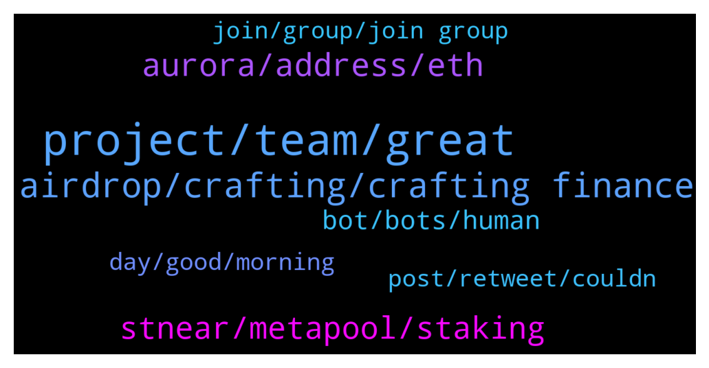

# **@cryptonear**
 ## Analysis for **2022-01-05** - **2022-01-06**.

---

## 📊 **Basic Stats**

**n_messages_sent**: 506

---

---

## 🔝 **Top keywords and related messages**

1. **project, team, great**

    @Maruf14128 --- *Nice project. This project will be big, because it includes a structured, creative, innovative, compact and transparent team. I hope I can be a part of this great project.* **--->** [TG Discussion](https://t.me/cryptonear/266563)

    @xgspon --- *Best project ever and congratulations !* **--->** [TG Discussion](https://t.me/cryptonear/276478)

    @shashishekhar --- *Watch Sherif- Head of Education at NEAR talk about what it takes to be a dev on NEAR and how we see us contributing to the web3 movement. https://www.youtube.com/watch?v=lLQAEZxtnFY* **--->** [TG Discussion](https://t.me/cryptonear/260997)

    @AliSuperman --- *Awesome project with a great team and roadmap 🔥 so excited to see more successes from this amazing project ❤️* **--->** [TG Discussion](https://t.me/cryptonear/264072)

    @rembrandt433 --- *hello everyone and thanks to dev for giving us an opportunity to support this project* **--->** [TG Discussion](https://t.me/cryptonear/266767)

    @GimhanaRamsiwarna --- *This is a really amazing project 🚀🚀* **--->** [TG Discussion](https://t.me/cryptonear/266646)

2. **airdrop, crafting, crafting finance**

    @larry_lang --- *Heyy so we are aware that newcomers are flushing in due to the Crafting Finance Airdrop, will open up the group shortly after this https://twitter.com/CraftingFinance/status/1478667618886291458* **--->** [TG Discussion](https://t.me/cryptonear/261663)

    @larry_lang --- *hehe at least the crafting finance airdrop has some benefit* **--->** [TG Discussion](https://t.me/cryptonear/274886)

    @Ankur205 --- *For crafting Finance Airdrop we have to stake any asset ?* **--->** [TG Discussion](https://t.me/cryptonear/274595)

    @Thanhtung1919 --- *Thanks for this awesome opportunity!  I am glad to participate in the airdrop.* **--->** [TG Discussion](https://t.me/cryptonear/272768)

    @larry_lang --- *didnt trisolaris give out airdrop out of nowhere=0* **--->** [TG Discussion](https://t.me/cryptonear/260938)

    @Kripto_Raptor --- *No need to spam, hi, hello, good project, nice project! you're eligible for the airdrop 😊* **--->** [TG Discussion](https://t.me/cryptonear/270105)

3. **aurora, address, eth**

    @Zeedgold --- *How can I get aurora Wallet address* **--->** [TG Discussion](https://t.me/cryptonear/275027)

    @Serverroom404 --- *Admin please How to find aurora address* **--->** [TG Discussion](https://t.me/cryptonear/266491)

    @iamkemoo --- *No, bc its not an EVM Chain. But you can bridge your Assets to Aurora Network and use MM then* **--->** [TG Discussion](https://t.me/cryptonear/276665)

    @NairdrophunterP --- *hello sir how to get Aurora address wich wallet should i use to get Aurora address* **--->** [TG Discussion](https://t.me/cryptonear/269162)

    @kv9990 --- *Here you go ✌️ $NEAR contract address on AURORA    "0xC42C30aC6Cc15faC9bD938618BcaA1a1FaE8501d"      $NEAR contract address on ETH "0x85F17Cf997934a597031b2E18a9aB6ebD4B9f6a4"      $NEAR contract address on BSC   "0x1fa4a73a3f0133f0025378af00236f3abdee5d63"* **--->** [TG Discussion](https://t.me/cryptonear/272734)

    @jamesarems --- *Hi, Is there any Aurora testnet faucet available? -  Tried to join Aurora telegram group and they are discussing with other languages .* **--->** [TG Discussion](https://t.me/cryptonear/276442)

4. **stnear, metapool, staking**

    @larry_lang --- *stNEAR is the synthetic asset on NEAR that u get for staking NEAR with Metapool, so just by holding NEAR u have already stake in* **--->** [TG Discussion](https://t.me/cryptonear/260943)

    @lpquang --- *I mean that I can only receive the stake reward in metapool if I have stNear in my Near wallet. And mean that I can only receive the reward one side, not both side. That's my concern* **--->** [TG Discussion](https://t.me/cryptonear/261002)

    @fynyc --- *Drop will be for staking near?* **--->** [TG Discussion](https://t.me/cryptonear/260759)

    @fynyc --- *What is apr for near stacking?* **--->** [TG Discussion](https://t.me/cryptonear/260880)

    @mmooxi --- *What is APY for staking NEAR?* **--->** [TG Discussion](https://t.me/cryptonear/276545)

    @butola_ravi --- *Yes and i was staking with ref at that time* **--->** [TG Discussion](https://t.me/cryptonear/260941)

5. **bot, bots, human**

    @iamkemoo --- *Bots are everywhere my friend, we have to ask these questions sometimes when we are under attack.* **--->** [TG Discussion](https://t.me/cryptonear/262210)

    @Santus_marine --- *Pls apart from Bots...is there anything like GROUP HELP here* **--->** [TG Discussion](https://t.me/cryptonear/261101)

    @Kripto_Raptor --- *hehe. I want to to meet the creator of these bots. Wanna ask why does he code all this irrelevant stuff and make bots post it on chats lol* **--->** [TG Discussion](https://t.me/cryptonear/260748)

    @rahulgoel007 --- *Just we hope that most are really users than bot* **--->** [TG Discussion](https://t.me/cryptonear/274898)

    @KhrapManush --- *i am not a bot pls let me in* **--->** [TG Discussion](https://t.me/cryptonear/266032)

    @larry_lang --- *am i look bot-alike or smt....* **--->** [TG Discussion](https://t.me/cryptonear/261105)

6. **day, good, morning**

    @larry_lang --- *Good morning guys^^ wish all of u a productive day^^* **--->** [TG Discussion](https://t.me/cryptonear/260896)

    @daplek --- *How are you to day @larry_lang ?* **--->** [TG Discussion](https://t.me/cryptonear/274842)

    @larry_lang --- *hehe im in a cheerful mood today=00 what about u buddy?* **--->** [TG Discussion](https://t.me/cryptonear/274851)

    @bacotsiakunyuk --- *Hi there , have a nice day* **--->** [TG Discussion](https://t.me/cryptonear/267145)

    @yusufiqbal_97 --- *hello guys, nice to meet you all* **--->** [TG Discussion](https://t.me/cryptonear/262532)

    @hamdansyahrin --- *Hello sir.. have a nice day* **--->** [TG Discussion](https://t.me/cryptonear/263275)

7. **post, retweet, couldn**

    @andyguerra --- *Maybe the creator can tell you, I think is this https://twitter.com/vgrichina is his Twitter.* **--->** [TG Discussion](https://t.me/cryptonear/268049)

    @larry_lang --- *FYI, u may seek for it in here. https://metapool.app/Tokenomics__Governance_-_Meta_Pool_v4.pdf* **--->** [TG Discussion](https://t.me/cryptonear/260994)

    @Takemidown --- *I'll wait then. I cannot watch videos and fill forms for nothing😁* **--->** [TG Discussion](https://t.me/cryptonear/272214)

    @Doganalpaslan1 --- *i've shared it on twitter so lots of guy asking me* **--->** [TG Discussion](https://t.me/cryptonear/260711)

    @bailey_12 --- *because I was looking my eyes out and couldn't find it* **--->** [TG Discussion](https://t.me/cryptonear/261056)

    @byGonzo --- *thanks ,,, i did but couldn't find it* **--->** [TG Discussion](https://t.me/cryptonear/272771)

