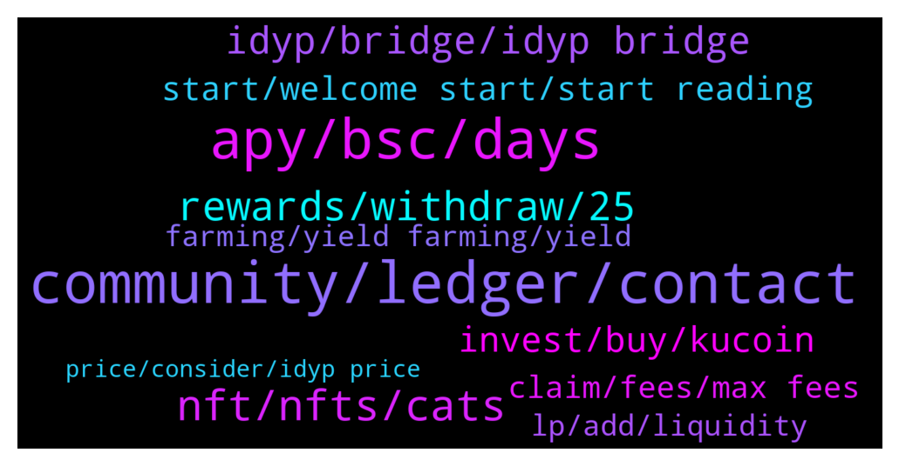

# **@dypfinance**
 ## Analysis for **2022-01-05** - **2022-01-06**.

---

## 📊 **Basic Stats**

**n_messages_sent**: 201

---

---

## 🔝 **Top keywords and related messages**

1. **community, ledger, contact**

    @ahuman516 --- *Then why you are still here? Leave this community.  You gave no value to community except for asking wen listing always, glad that you are now out we can stay in peace from your repetitive question 😂* **--->** [TG Discussion](https://t.me/dypfinance/237266)

    @PerJonsson --- *Hi, Im trying to withdraw from bridge with my ledger on eth chain and having problem with ledger. ”Transaction 80 failed. Please enable blind signing or contract data in eth app settings” I have done that but still problem. It works fine with bsc. Has anyone seen this and fixed it?* **--->** [TG Discussion](https://t.me/dypfinance/237149)

    @King 2 --- *Hello everyone, I am happy to be here, I am the founder of an Arab community for cryptocurrency Who is the right person I can contact for my promotional proposal? Thanks.* **--->** [TG Discussion](https://t.me/dypfinance/236990)

    @FR778778 --- *Where are the people in the group?😂😂😂* **--->** [TG Discussion](https://t.me/dypfinance/237193)

    @chainadoption --- *Hello everyone, I am with Chainadoption, who is the right person to discuss a mutually beneficial partnership? Thanks!* **--->** [TG Discussion](https://t.me/dypfinance/237139)

    @Laurentoni --- *I got an issue  Any help team here Or admin Please* **--->** [TG Discussion](https://t.me/dypfinance/237314)

2. **apy, bsc, days**

    @error_500 --- *Hello, can someone from the DYP team explain why the 'To be burnt/disbursed' value shows 0.000 for the BSC farm for 90 days, there weren’t any GOVERNANCE PROPOSALS, from the last proposal that was executed a month ago, and even then it was skipped on the BSC 90 days farm? The last time I check there was more than ~100,000  'To be burnt/disbursed' !!! (this is very upsetting, especially when the iDYP price drop so much ~1600% from ATH)* **--->** [TG Discussion](https://t.me/dypfinance/237011)

    @Raidering83 --- *Heyyy everyone. Just come across this project.  How’s everyone’s experience with it so far.  Some of them APY seem a little too good to be true lol* **--->** [TG Discussion](https://t.me/dypfinance/237054)

    @herbie1996 --- *Hello 👋 .. it’s because the 90d has 1.5m volume locked and the others have way less so the apy is higher payout* **--->** [TG Discussion](https://t.me/dypfinance/237214)

    @Bahrulfik --- *V2 apy is so low 😢* **--->** [TG Discussion](https://t.me/dypfinance/237106)

    @DhoniMSD516 --- *The APY is still good when compared to many projects out in BSC :)  And it is dynamic so it will increase too* **--->** [TG Discussion](https://t.me/dypfinance/237107)

    @Bahrulfik --- *when compared to v1 APY it's very much different* **--->** [TG Discussion](https://t.me/dypfinance/237110)

3. **nft, nfts, cats**

    @hemanrock --- *PAW has collection of 10,000 cat NFT s* **--->** [TG Discussion](https://t.me/dypfinance/237233)

    @Snakedancer --- *Question about cats nft. With what currency/token you be able to buy/mint? It says it will cost $250 but doesn’t specify…eth? Bnb? ADAX? Depends on chain? Or dyp?* **--->** [TG Discussion](https://t.me/dypfinance/237376)

    @Nji_jalen --- *I saw on roadmap 2021 Q2-Q4 many progress not checklist.. I hope Q1 2022 will done all* **--->** [TG Discussion](https://t.me/dypfinance/237383)

    @Hello --- *Are we in a bear trend?* **--->** [TG Discussion](https://t.me/dypfinance/236903)

    @Jorzico --- *So will there be any stackin in the future?* **--->** [TG Discussion](https://t.me/dypfinance/236931)

    @iamJubi --- *#NFTGiveaway time🐱  🔥10 lucky people will get a Cats and Watches Society #NFT which starts minting on January 17, 2022👇 https://dyp.finance/nft  Enter to win: ✅Retweet ✅Tag 3 friends that loves #NFTs ✅Follow @dypfinance ✅Join https://t.me/dypfinance  #NFTCommunity #NFTdrop  👉https://twitter.com/dypfinance/status/1475805248887439360* **--->** [TG Discussion](https://t.me/dypfinance/237307)

4. **rewards, withdraw, 25**

    @danasocial --- *i think i don't understand, 60 days ago i deposited 9 avax and 1100 DYP for an equivalent of 91LP, now the contract is expired and i withdraw and in my wallet are returned...32dyp? What's happened? i don't understand* **--->** [TG Discussion](https://t.me/dypfinance/237235)

    @Nazhadi57 --- *So 25% of my deposit is converted to DYP? I can’t get back 100% AVAX?* **--->** [TG Discussion](https://t.me/dypfinance/237285)

    @Nazhadi57 --- *Hi, can I ask if I deposit my token (eg AVAX) in farms and withdraw later, will I still get back the same token or some will be converted to DYP?* **--->** [TG Discussion](https://t.me/dypfinance/237282)

    @B --- *i continue without withdrawing but there is no rewards now* **--->** [TG Discussion](https://t.me/dypfinance/237095)

    @D0nkeyKong --- *Is there any way I can cash out my WBNB again despite lock time? Deposited a month ago at 450% APY and now lost half :/* **--->** [TG Discussion](https://t.me/dypfinance/236999)

    @DhoniMSD516 --- *If you didn't withdraw yet, you can continue without withdrawing and still earn rewards even after 30 days, if withdrawn and want to restake then yes you can do that.* **--->** [TG Discussion](https://t.me/dypfinance/237094)

5. **idyp, bridge, idyp bridge**

    @michaelder --- *Not even using another bridging service?* **--->** [TG Discussion](https://t.me/dypfinance/237300)

    @Chae --- *How max for idyp bridge ?* **--->** [TG Discussion](https://t.me/dypfinance/237047)

    @michaelder --- *can iDYP be bridged across to the ETH network?* **--->** [TG Discussion](https://t.me/dypfinance/237297)

    @Malthedk --- *Are there plans of getting idyp listed on any tracking pages? Not necessarily CMC, but something similar* **--->** [TG Discussion](https://t.me/dypfinance/237133)

    @profit984 --- *Do idyp will have any usecase regarding nft?* **--->** [TG Discussion](https://t.me/dypfinance/237351)

    @Jorzico --- *Guys how to stack Idyp and also if i stack how to unstack it?* **--->** [TG Discussion](https://t.me/dypfinance/236929)

6. **invest, buy, kucoin**

    @B --- *so should i restake to get profit?* **--->** [TG Discussion](https://t.me/dypfinance/237092)

    @alvindrajw --- *Don't worry I will buy in dip 😂 buy low sell high* **--->** [TG Discussion](https://t.me/dypfinance/237268)

    @Annayating --- *Do I need to invest in this project?* **--->** [TG Discussion](https://t.me/dypfinance/236994)

    @Nji_jalen --- *Is it safe if i buy on kucoin?* **--->** [TG Discussion](https://t.me/dypfinance/237356)

    @Disguy125 --- *Seems like you already bought high and sold low ???? , right? Lmfao* **--->** [TG Discussion](https://t.me/dypfinance/237275)

    @Wen Hsiang --- *i know its a longterm  invest* **--->** [TG Discussion](https://t.me/dypfinance/237060)

7. **start, welcome start, start reading**

    @Snakedancer --- *Thanks, so no dyp is required for it? Just wanted to be sure. All my dyp are staked and locked for few months* **--->** [TG Discussion](https://t.me/dypfinance/237379)

    @RuuneL --- *Any news on DYP being listed on exchang* **--->** [TG Discussion](https://t.me/dypfinance/237006)

    @hasan --- *Hi is dyp or idyp better* **--->** [TG Discussion](https://t.me/dypfinance/237181)

    @DhoniMSD516 --- *To get whitelisted you need 50 DYP :)* **--->** [TG Discussion](https://t.me/dypfinance/237380)

    @alvindrajw --- *Why the exchange taking more time ... To list dyp...* **--->** [TG Discussion](https://t.me/dypfinance/237261)

    @DhoniMSD516 --- *Hey welcome you can start reading about DYP here :) https://t.me/dypfinance/229271* **--->** [TG Discussion](https://t.me/dypfinance/237370)

8. **claim, fees, max fees**

    @DhoniMSD516 --- *This is from Metamask estimation and as said this is Max fees that will be charged and that is based on ETH network* **--->** [TG Discussion](https://t.me/dypfinance/237425)

    @Craig --- *This is the estimated fee to claim 386 DYP. If I click on 'claim' WETH, the estimated fee is $35. It makes no sense.* **--->** [TG Discussion](https://t.me/dypfinance/237428)

    @Craig --- *It shows the same GWEI amount for both claims, but the dollar amount is 10x higher. It makes no sense.* **--->** [TG Discussion](https://t.me/dypfinance/237419)

    @DhoniMSD516 --- *The metamask shows Max fees the actual charge will be less, I see that ETH nework is congested the GWEI is ranging upto 200 so this might be reason* **--->** [TG Discussion](https://t.me/dypfinance/237418)

    @Craig --- *Why is it to claim DYP rewards the amount of fees are 10x what it is to claim your underlying asset? So, if to claim WETH costs $50, to claim DYP costs $500.* **--->** [TG Discussion](https://t.me/dypfinance/237416)

    @DhoniMSD516 --- *Try completing the transaction the actual cost will be less of what is shown the Metamask estimates max fees* **--->** [TG Discussion](https://t.me/dypfinance/237420)

9. **farming, yield farming, yield**

    @Nazhadi57 --- *Is there any IL for the farms?* **--->** [TG Discussion](https://t.me/dypfinance/237290)

    @timdyp --- *Maximize your Yield Farming Rewards!  Available multi-chain on #Avalanche #Ethereum #BinanceSmartChain  9161 #ETH, 9661 #BNB, and 22248 #AVAX worth $42,134,963 paid to farmers  Join farming by automatically adding liquidity and earn +490% APY https://dyp.finance/farmv2  👉https://twitter.com/dypfinance/status/1478663170898206720* **--->** [TG Discussion](https://t.me/dypfinance/237042)

    @iamJubi --- *kindly proceed to this link for more details on farm section https://link.medium.com/2nXyI0UkPlb* **--->** [TG Discussion](https://t.me/dypfinance/237292)

    @Paulus --- *Seem can take profit from farming but the total asset decrease. Do you guys know why* **--->** [TG Discussion](https://t.me/dypfinance/237124)

    @Raidering83 --- *Thought that would be the case like most farming sites* **--->** [TG Discussion](https://t.me/dypfinance/237075)

    @DhoniMSD516 --- *Please watch your language, regarding the yield farming please read about IL(Impermanent Loss) and Yield farming is longterm game* **--->** [TG Discussion](https://t.me/dypfinance/237002)

10. **lp, add, liquidity**

    @Michelle --- *Where can I find the contract address for the DYP-Eth LP I have??  the LP token doesn't appear in my metamask and I want to add it as a custom token* **--->** [TG Discussion](https://t.me/dypfinance/237195)

    @Raidering83 --- *I’m not sure if I’m reading or looking at it correctly looks like I can deposit BUSD for 148% APY in the farm section. Or does have to be busd/dyp LP* **--->** [TG Discussion](https://t.me/dypfinance/237077)

    @Michelle --- *when I enter the contract I found in the MY STATS it says I have 0 Uni-V2 and I actually have 8 LP* **--->** [TG Discussion](https://t.me/dypfinance/237198)

    @Nji_jalen --- *How many circulation and max supply?* **--->** [TG Discussion](https://t.me/dypfinance/237349)

    @Tem9o9 --- *Hey, how can I automatically add liquidity on V2?* **--->** [TG Discussion](https://t.me/dypfinance/237044)

    @Michelle --- *I AM connected to the right wallet and when I connect I see the MY STATS that tells me the correct amount of LP* **--->** [TG Discussion](https://t.me/dypfinance/237201)

