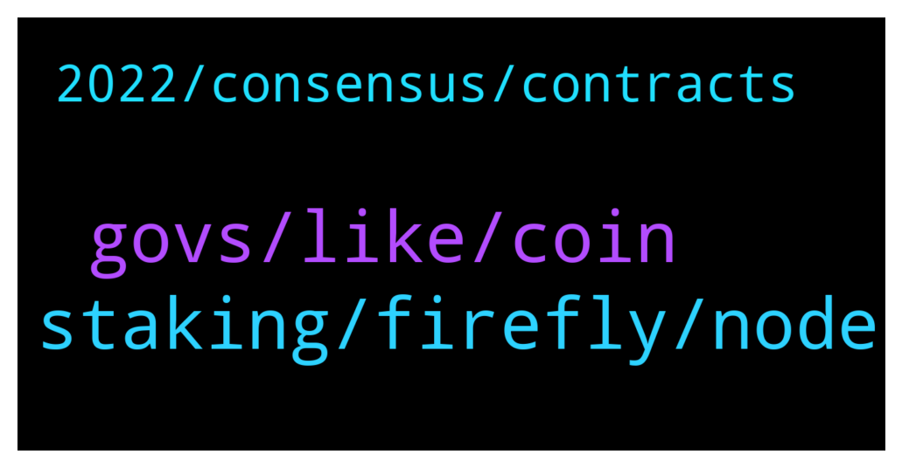

# **@iotatangle**
 ## Analysis for **2022-01-05** - **2022-01-06**.

---

## 📊 **Basic Stats**

**n_messages_sent**: 61

---

---

## 🔝 **Top keywords and related messages**

1. **staking, firefly, node**

    @Osaaaa --- *what is wrong agan, my firefly dont stake  iota.* **--->** [TG Discussion](https://t.me/iotatangle/305872)

    @RutherfordTheBrave --- *I upgraded firefly from 1.3.0 to 1.3.2 using firefly. You guys made it so simple. Awesome job!* **--->** [TG Discussion](https://t.me/iotatangle/305825)

    @Tahmis --- *If you have set it staking it is staking. Probably just a bad node you are connected to* **--->** [TG Discussion](https://t.me/iotatangle/305873)

    @L --- *Can somebody tell me what I can do more than changing the available nodes in firefly wallet to synchronize to the Assembly & Schimmer staking again?* **--->** [TG Discussion](https://t.me/iotatangle/305925)

    @RevNine --- *Short Question. Im staking iota for 4 or 5 days. But im on holiday since 3 days. When firefly Updates do i need to stake again or update my wallet that i can stake again?  Or no need to change anything?* **--->** [TG Discussion](https://t.me/iotatangle/305841)

    @Osaaaa --- *yes i  have info about  change node. what node i have to change?* **--->** [TG Discussion](https://t.me/iotatangle/305875)

2. **govs, like, coin**

    @emanuel --- *What are ur opinions on Iota?* **--->** [TG Discussion](https://t.me/iotatangle/305901)

    @lalit1414 --- *They need DEX and many IOTA meme coins with extra large community.. not gonna work out with 50k discord people where 90% already don’t check anything..   They need crazy promotion (paid promotion) Nothing comes for free..  pay for listing or get ignored* **--->** [TG Discussion](https://t.me/iotatangle/305971)

    @ef4ort --- *But looks like Miota is laying down her life for the two children  Shimmer and Assembly .  No greater Love  has a mother have . .  Lets see how that pans out* **--->** [TG Discussion](https://t.me/iotatangle/305974)

    @Basti --- *Govs 🎈Govs.io (@govs_io) Tweeted: The Iota America’s group will be having our team lead discuss the Govs protocol and project efforts. 🇺🇸  Learn about the team and vision behind the effort. Join us.   Host | @gregmart  Where | @iota discord  Time | @ 6pm PST / 9pm EST https://t.co/uTk7CX12jN https://twitter.com/govs_io/status/1478806704137678856?s=20* **--->** [TG Discussion](https://t.me/iotatangle/306012)

    @Tempus777 --- *Guys please consider commenting and retweeting this for a new IOTA review from coin bureau which has millions of followers   https://twitter.com/pilotsevane/status/1478672819970060291?s=21* **--->** [TG Discussion](https://t.me/iotatangle/305885)

    @Basti --- *Machine Learning (@machinelearnflx) Tweeted: Metal Pay welcomes IOTA to our Marketplace https://t.co/PsWtVJIyol  #Iot https://twitter.com/machinelearnflx/status/1479067087641452545?s=20* **--->** [TG Discussion](https://t.me/iotatangle/306009)

3. **2022, consensus, contracts**

    @lalit1414 --- *It will take 4 years all together to finish everything bro..* **--->** [TG Discussion](https://t.me/iotatangle/305962)

    @Toby --- *Any updates on when smart contracts will begin deploying on Assembly?* **--->** [TG Discussion](https://t.me/iotatangle/305947)

    @Alex --- *Hello guys. Do you know approximately when IOTA 2.0 and smart contracts? During 2022 or 2023? Thank you* **--->** [TG Discussion](https://t.me/iotatangle/306016)

    @Toby --- *Thanks man. I am not concerned about a run. If there are good dapps on the protocol, it will attract value. We just need updates on those* **--->** [TG Discussion](https://t.me/iotatangle/305969)

    @Toby --- *Oh the blog update says Assembly mainnet will be launched at the beginning of 2022 for developers to commence deployment of  smart contracts* **--->** [TG Discussion](https://t.me/iotatangle/305966)

    @lalit1414 --- *We will definitely do ATH on next cycle* **--->** [TG Discussion](https://t.me/iotatangle/305964)

