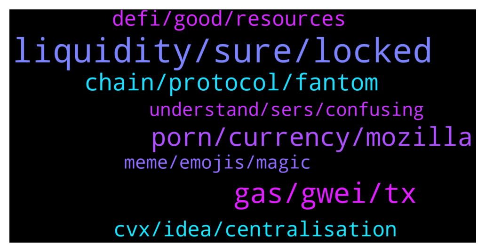

# **@lobsters_chat**
 ## Analysis for **2022-01-05** - **2022-01-06**.

---

## 📊 **Basic Stats**

**n_messages_sent**: 244

---

---

## 🔝 **Top keywords and related messages**

1. **liquidity, sure, locked**

    @spreek --- *I'm not sure. https://etherscan.io/find-similar-contracts?a=0xcbaff378442e70f587f65ac4abce603763816117&lvl=5 those are some of the contracts used if you want to take a look.* **--->** [TG Discussion](https://t.me/lobsters_chat/312861)

    @juju1234534 --- *@banteg , Ser, are you aware of any strategists working on a strategy involving selling options? (Now that the necessary legos are available.)  https://twitter.com/brypto_/status/1478569378727796738?s=21  Could be that 2022 finally sees a 2nd core base yield injected into the circle of life next to Curve?* **--->** [TG Discussion](https://t.me/lobsters_chat/312950)

    @SpikeSpiege1 --- *If the token is transferable then it should be tradeable though. So should be market for both. Article says locked positions work as nfts* **--->** [TG Discussion](https://t.me/lobsters_chat/313242)

    @PmRiviere --- *SOON https://twitter.com/thekeep3r/status/1478643116148207618  Although i m not sure which assets will have liquidity when it starts* **--->** [TG Discussion](https://t.me/lobsters_chat/312929)

    @SilkCE --- *Legit question @andrecronje Will the tokens only be sellable to a treasury or something hence why no one can buy it only earn it?* **--->** [TG Discussion](https://t.me/lobsters_chat/313235)

    @Joel_john --- *sure, please do - you should also check the amount of innovation powerpool has done this last year on auto-rebalancing assets,* **--->** [TG Discussion](https://t.me/lobsters_chat/313109)

2. **gas, gwei, tx**

    @stevenhq --- *11 gwei as it replaces the 10 gwei one* **--->** [TG Discussion](https://t.me/lobsters_chat/312817)

    @ivangbi --- *Is the gas is not used, it will just be given back. If the gas is not enough, even if has more gwei, it is then failed. The one with more gwei wins all things neutral?* **--->** [TG Discussion](https://t.me/lobsters_chat/312810)

    @andrecronje --- *I notice you didn't mention FTM... tsk tsk* **--->** [TG Discussion](https://t.me/lobsters_chat/312944)

    @ld206 --- *tx1 and tx2 with same nonce, where tx1 uses 1m gas @ 10 gwei (0.01eth total fee), but tx2 uses 900k gas at 11 gwei (0.0099eth total fee). which one do miners choose?* **--->** [TG Discussion](https://t.me/lobsters_chat/312812)

    @ivangbi --- *Did like top-5 in gas within a few minutes* **--->** [TG Discussion](https://t.me/lobsters_chat/312800)

    @ld206 --- *but the miner would actually get more money from includingthe 10gwei tx* **--->** [TG Discussion](https://t.me/lobsters_chat/312818)

3. **porn, currency, mozilla**

    @svenblockchain --- *"The cryptocurrency industry, whose business model would seem unrealistic and ham-handed if it was a villain on Captain Planet: they manufacture only POLLUTION, nothing else, and they turn that into money.  They call it a "currency" but the only thing you can do with it is pay ransom after your computer was hacked! You can't even use it to buy porn!  And make no mistake, if you can't use a thing to buy porn, that thing is not a currency."* **--->** [TG Discussion](https://t.me/lobsters_chat/312907)

    @phil_muhbags --- *>cryptocurrencies are not currencies >Websites are allowing users to pay via crypto   Well...Which one is it?  Why is that people who hate something so much barely do any sort of research. You know if I want to talk shit about something I really dig deep into it.* **--->** [TG Discussion](https://t.me/lobsters_chat/312963)

    @Swader --- *This bothers him but not Mozilla's profiteering off the free labor of 2.5th world countries, or their pretense of a non profit while shoving ads down your throat in q browser that takes half a minute to load. People are strange.* **--->** [TG Discussion](https://t.me/lobsters_chat/312903)

    @andrecronje --- *lol, I always love this question, "what stops someone else from launching this open source code", nothing obviously* **--->** [TG Discussion](https://t.me/lobsters_chat/313157)

    @syed_jafri --- *Don’t worry, that’s what they call crypto anyways* **--->** [TG Discussion](https://t.me/lobsters_chat/313093)

    @sashatsereteli --- *And people and organizations who absolutely should know better -- The Long Now Foundation, The Internet Archive (keep fucking that potato), Mozilla, and so many others -- are still adding cryptocurrencies to their checkout options like it's not a god damned planet killer.* **--->** [TG Discussion](https://t.me/lobsters_chat/312909)

4. **chain, protocol, fantom**

    @stevenhq --- *If they all use the standard geth client it will work like I said* **--->** [TG Discussion](https://t.me/lobsters_chat/312825)

    @olliten --- *Ok so what is the protocol? What value does it provide?* **--->** [TG Discussion](https://t.me/lobsters_chat/313194)

    @phil_muhbags --- *Also what is with this potato game I keep hearing about. Is like every action recorded? I thought most games, except very simple ones, don't run on chain* **--->** [TG Discussion](https://t.me/lobsters_chat/313059)

    @yic_alex --- *Is there a bridge that allows me to bridge FTM from Ethereum to Fantom? The anyswap router has no liquidity on the Fantom side, apparently.* **--->** [TG Discussion](https://t.me/lobsters_chat/312920)

    @ivangbi --- *This basically fixes that step, and makes it into one protocol?* **--->** [TG Discussion](https://t.me/lobsters_chat/313133)

    @PmRiviere --- *spookyswap is an interface to anyswap / multichain anyway* **--->** [TG Discussion](https://t.me/lobsters_chat/312925)

5. **cvx, idea, centralisation**

    @kakusaan --- *Mm the idea of cvx I remember you dint like the idea* **--->** [TG Discussion](https://t.me/lobsters_chat/313161)

    @Xoheb --- *Rome wasn't built in a day... So shall the futur of france be?* **--->** [TG Discussion](https://t.me/lobsters_chat/313017)

    @kakusaan --- *Doesn’t cvx already solve for that* **--->** [TG Discussion](https://t.me/lobsters_chat/313129)

    @perpetual_losses --- *Yeah but having a blue print of how Rome was built would definitely make the job easier.* **--->** [TG Discussion](https://t.me/lobsters_chat/313020)

    @kakusaan --- *I mean, CVX by centralising voting power makes more yield* **--->** [TG Discussion](https://t.me/lobsters_chat/313140)

    @kakusaan --- *Only thing is CVX makes governance centralised* **--->** [TG Discussion](https://t.me/lobsters_chat/313131)

6. **defi, good, resources**

    @tatai_007 --- *Basically want to get familiar with the concepts and terms* **--->** [TG Discussion](https://t.me/lobsters_chat/312972)

    @perpetual_losses --- *And that's my point. The info exists but not everyone knows where to find them. So resources that helps people in getting started on marketing side of it would help the ecosystem as a whole. I don't have a DeFi project, this is more like observation from someone peeking from outside.* **--->** [TG Discussion](https://t.me/lobsters_chat/313022)

    @rudster --- *Honestly you can just look at coingecko s glossary’s* **--->** [TG Discussion](https://t.me/lobsters_chat/312973)

    @mempirate --- *The berkeley DeFi mooc is also great: https://www.youtube.com/channel/UCB67PxhB5LAWEbI4etQS7aw/playlists* **--->** [TG Discussion](https://t.me/lobsters_chat/313004)

    @mempirate --- *+ accompanying website with all the resources: https://defi-learning.org/* **--->** [TG Discussion](https://t.me/lobsters_chat/313005)

    @olliten --- *In other words - that's info that hasn't been published yet? Thanks for your responses.* **--->** [TG Discussion](https://t.me/lobsters_chat/313197)

7. **understand, sers, confusing**

    @olliten --- *Could someone ELI5 ve(3,3)? I understand the what and the how, but not the why. https://twitter.com/dotkrueger/status/1479080529127370752?s=20* **--->** [TG Discussion](https://t.me/lobsters_chat/313192)

    @kakusaan --- *I might be on drugs confusing* **--->** [TG Discussion](https://t.me/lobsters_chat/313167)

    @andrecronje --- *Very confusing... pretty sure I supported them...* **--->** [TG Discussion](https://t.me/lobsters_chat/313165)

    @DefiApe --- *Sers can anyone explain in plain english blz* **--->** [TG Discussion](https://t.me/lobsters_chat/313117)

    @robzerizi --- *slippery slope imo - no one understand the exposrue of these products* **--->** [TG Discussion](https://t.me/lobsters_chat/312951)

    @ld206 --- *i guess i just gotta read the geth source code* **--->** [TG Discussion](https://t.me/lobsters_chat/312823)

