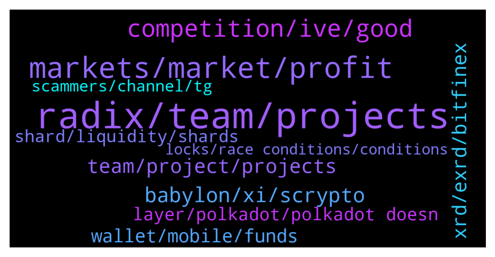

# **@radix_dlt**
 ## Analysis for **2022-01-05** - **2022-01-06**.

---

## 📊 **Basic Stats**

**n_messages_sent**: 991

---

---

## 🔝 **Top keywords and related messages**

1. **radix, team, projects**

    @fpieper --- *https://ces.tech/Innovation-Awards/Honorees/2022/Honorees/R/RadiX-AXE6600.aspx RadiX got an innovations award on CES 🔥🤟* **--->** [TG Discussion](https://t.me/radix_dlt/334998)

    @gpel33 --- *I think there is some value in asking "If Radix is so obviously technically superior, why aren't other people copying it?"* **--->** [TG Discussion](https://t.me/radix_dlt/334123)

    @Burns246 --- *Hi all, I am keen to learn more about this crypto and have a couple of questions below. Sorry in advance for the long message:  1. On the website it says radix is more scalable than Solana. What is the fastest TPS recorded on a live transaction. Has the speed been verified.  2. Radix has been in development for a long time but does not have the same level of traction as Solana. Why is this?  3. How decentralised is Radix when compared to the other top tier blockchains? Is the code open source?  4. How many developers are building on Radix. How easy is it for developers to use and build on this chain* **--->** [TG Discussion](https://t.me/radix_dlt/334476)

    @Avaunt --- *Wen Radix Tesla colour changing paint job?! https://twitter.com/SadlyItsBradley/status/1478853751091843072* **--->** [TG Discussion](https://t.me/radix_dlt/335082)

    @Cpt_Charles --- *Posted a thread on Radix on twitter, appreciate it if you could give it some love :) https://twitter.com/CptCharles_/status/1478753717461471234* **--->** [TG Discussion](https://t.me/radix_dlt/334353)

    @PeterFATAss --- *If Radix is superior  I don't understand why Vitalik is not adopting it for ETH 2.0. Radix paper is available since 2 years* **--->** [TG Discussion](https://t.me/radix_dlt/334097)

2. **markets, market, profit**

    @Ashley --- *But what most miss is that risk management and pricing and execution are all extremely important, taking that race to the bottom of you take all the shit trades gets you nowhere :)* **--->** [TG Discussion](https://t.me/radix_dlt/334297)

    @momoreina --- *And until we get true AI human traders will still dominate longer time frames* **--->** [TG Discussion](https://t.me/radix_dlt/334335)

    @AT --- *Well, great, the more people think like you, the more profit will be for the hedge fund where I work, which ended last year with record profits :)* **--->** [TG Discussion](https://t.me/radix_dlt/334272)

    @Ashley --- *I’m not talking about crypto markets, there’s no microsecond latency requirement there. Second tier prop shops like tower research do very well on crypto but can’t compete with the big firms on the traditional markets* **--->** [TG Discussion](https://t.me/radix_dlt/334271)

    @chrisijoyah --- *Never used it before but is this an area currently being leveraged for marketing crypto products 👀* **--->** [TG Discussion](https://t.me/radix_dlt/334586)

    @momoreina --- *For day traders that do 2-3 trades per day seems like current infrastructure is ok. Definitely not talking about the HFTs that need to place their hardware 1 block away from the NYSE to avoid ms latencies.  I know the current idea is that we can’t compete with the HFTs and that’s probably correct if you’re looking for ticks,  but the current delays for slower traders is fine in my experience, you can get 60-80 points per day without needing light speed. I think the main class of trader that got wiped out by the advent of HFTs are mainly the tick hunters but please correct me if I’m wrong.* **--->** [TG Discussion](https://t.me/radix_dlt/334328)

3. **competition, ive, good**

    @Radstakes --- *Very lucky dart!  You'll be even more convinced the more you read 🙂* **--->** [TG Discussion](https://t.me/radix_dlt/334053)

    @ITProfligate --- *That’s brilliant. @Adam_XRD are you there? I hope it goes well.* **--->** [TG Discussion](https://t.me/radix_dlt/334045)

    @fpieper --- *I hope you still enjoyed your breakfast 😊👌. Liked your interview with Bits Be Tripping btw 💪* **--->** [TG Discussion](https://t.me/radix_dlt/335016)

    @AT --- *Thanks you too, good night :)* **--->** [TG Discussion](https://t.me/radix_dlt/334308)

    @Josem866 --- *i want to show it to some people i know to learn about the project* **--->** [TG Discussion](https://t.me/radix_dlt/334959)

    @chrisijoyah --- *Lots of interesting stuff but I’m will keep 🤐 for now* **--->** [TG Discussion](https://t.me/radix_dlt/334611)

4. **babylon, xi, scrypto**

    @Vorgesetzter --- *https://cryptonews.net/en/news/nft/2980333/  Correct me if I'm wrong, but: Polygon has about 100 TPS. So it got clogged, because that's simply not enough. Am I the only one seeing that danger for Radix with Babylon? Seems everybody in the team is working an making Scrypto a success. If that happens before Xi'an, Babylon will get clogged the same way Polygon was now. So pushing Dapps on Babylon is actually a wrong thing to do. For not getting "bad press" we would have to wait until Xi'an with that. If too many too big projects start on Babylon the whole thing could implode. Am I missing something?* **--->** [TG Discussion](https://t.me/radix_dlt/334929)

    @conners32 --- *XRD looks set up perfectly from a TA perspective, and from my research (obviously you guys know a lot more than me) the launch of babylon could coincide nicely* **--->** [TG Discussion](https://t.me/radix_dlt/334038)

    @Blockchain_Sail --- *Xian is supposed to launch on 2023 right? And was also wondering if now that Scrypto is live there are teams that want to build on Radix and launch as soon as Xian goes live? since scrypto still might be subjected to changes so it could withhold developers from alrady building products* **--->** [TG Discussion](https://t.me/radix_dlt/334436)

    @ahsimon --- *TLDR: I see a possible path to an early release of a "limited" release of version 1 of Xi'an before EoY 2023, but only if it is needed.  This is not a commitment by the team (which I lack the power to make) but just how I personally would manage things.  It is my guess (which could be wrong) that one of the milestones along the way to Xi'an will be a test network version that "only" supports two shard groups.  Such a milestone is work that is needed for Xi'an anyway.   If we are wildly successful after Babylon delivery, and find Babylon approaching congestion, then I believe the team can quickly pivot to productizing this as version 1 of Xi'an.  That could provide us with (a) up to 6000 validators and (b) increased (double?) TPS  throughput and (c) a "functioning" PoC that Xi'an is not paperware.* **--->** [TG Discussion](https://t.me/radix_dlt/335043)

    @fpieper --- *Well, in this case it would be pure FUD, because Radix then has delivered smart contracts on mainnet - having a safe, fun and easy to use environment for developers also being 100 times faster than Cardano, 3x faster than Ethereum, 2x of Avalanche and roughly similar to other chains like Elrond, Fantom, Polkadot etc.  Also having a congested network is anything but a dead network. Yes, I agree that having Xian directly would be better (obviously) but that isn't a realistic option (even with any money and resources in the world). Babylon WILL be ready earlier.* **--->** [TG Discussion](https://t.me/radix_dlt/334947)

    @Jazzer9F --- *The third instalment in the blog series focusing on our new programming language, Scrypto, is now live on the blog!  https://www.radixdlt.com/post/scrypto-an-asset-oriented-smart-contract-language* **--->** [TG Discussion](https://t.me/radix_dlt/335030)

5. **team, project, projects**

    @Jakob --- *The question is can they keep their promises, do you believe them? Other projects promise a lot and mostly nothing happens... how good is the team?* **--->** [TG Discussion](https://t.me/radix_dlt/335061)

    @PeterFATAss --- *True. But they would have a great advantage over any project* **--->** [TG Discussion](https://t.me/radix_dlt/334114)

    @Alex --- *Exactly, no I mean the approach of the team is fully understandable. I am just very surprised that many people just buy the hype instead of conducting proper research about valid alternatives, which would lead them straight to radix😅* **--->** [TG Discussion](https://t.me/radix_dlt/334244)

    @PeterFATAss --- *They could make a totally new architecture and migrate accounts* **--->** [TG Discussion](https://t.me/radix_dlt/334103)

    @fpieper --- *A lot of projects prefer to e.g. overestimate the amount of throughput they can deliver by magnitudes.* **--->** [TG Discussion](https://t.me/radix_dlt/335065)

    @S --- *It's right up your alley. Imo, it's not looking too good for them* **--->** [TG Discussion](https://t.me/radix_dlt/333894)

6. **xrd, exrd, bitfinex**

    @Sami_1_jan --- *Hi,   what coin to transfer to Bitfinex to buy XRD and Why!?   Any leads appreciated 🙏* **--->** [TG Discussion](https://t.me/radix_dlt/333722)

    @Shane_Larson --- *I sent XLM to bitfinex then traded for BTC, and traded the BTC for XRD* **--->** [TG Discussion](https://t.me/radix_dlt/333726)

    @AfterWave2 --- *Right now you cannot buy XRD in the US (without VPN). Yes you can get EXRD and use instabridge, but its one-way and there is no way back so the US market is stuck with Eth wrapped and fees, can't stake, or is faced with a rug-pull like situation where they can't sell their XRD. I suspect that once this is resloved, US influencers may start to open up.* **--->** [TG Discussion](https://t.me/radix_dlt/334665)

    @romel9002 --- *Admin please how can i send xrd from my radix wallet to bitfinex* **--->** [TG Discussion](https://t.me/radix_dlt/335018)

    @Sturlison_98 --- *Deposit network on bitfinex is radix dlt. So you can just send it to the radix deposit Adress on bitfinex* **--->** [TG Discussion](https://t.me/radix_dlt/335023)

    @rxdufu --- *sorry for the noob question but I just installed Radix desktop wallet and am trying to transfer my EXRD from Kucoin to the wallet - but apparently the wallet adress is not ERC20. looking through FAQ now but would appreciate any advice!* **--->** [TG Discussion](https://t.me/radix_dlt/334881)

7. **wallet, mobile, funds**

    @Ravient78 --- *Others having wallet issues or just me? The send screen won’t come up. Been trying for an hour. Balance screen works* **--->** [TG Discussion](https://t.me/radix_dlt/334379)

    @radixmatt --- *Although your display settings and account names and such aren't on the network - those are local and won't carry across.* **--->** [TG Discussion](https://t.me/radix_dlt/333505)

    @Radstakes --- *Hi, please check that you have the latest firmware installed and that the ledger is connected and your pin is entered.  You also should not have any other apps open on the ledger device* **--->** [TG Discussion](https://t.me/radix_dlt/334783)

    @satoshixy --- *The only wallet issue i have always had is not enough XRD in there.   Tryna get it fixed though* **--->** [TG Discussion](https://t.me/radix_dlt/334465)

    @Sinan_BH --- *I was away for a few days. Is there a problem with olympia wallet or mainnet? I cant see balances or other screens.* **--->** [TG Discussion](https://t.me/radix_dlt/334395)

    @Radstakes --- *Hi, what version of the wallet are you using?  You may just need to update to v1.2.6* **--->** [TG Discussion](https://t.me/radix_dlt/334380)

8. **layer, polkadot, polkadot doesn**

    @Cpt_Charles --- *So much for layer2 solutions 😂. Its literally unusable currently* **--->** [TG Discussion](https://t.me/radix_dlt/334532)

    @PeterFATAss --- *This will happen one day and Polkadot is the best layer 0 so far* **--->** [TG Discussion](https://t.me/radix_dlt/333559)

    @Michelinux --- *Do you know any major layer 1 running on Polkadot?* **--->** [TG Discussion](https://t.me/radix_dlt/333541)

    @Michelinux --- *Layer 0 is a broken concept invented by Polkadot, there is no layer 0.* **--->** [TG Discussion](https://t.me/radix_dlt/333538)

    @PeterFATAss --- *Lol. Polkadot is working fine 👌* **--->** [TG Discussion](https://t.me/radix_dlt/333539)

    @rmf55 --- *Pretty sure Polkadot doesn't have atomic Composability between parachains either. It's asynchronous like all the others* **--->** [TG Discussion](https://t.me/radix_dlt/333970)

9. **shard, liquidity, shards**

    @Bent --- *Wouldn't big services like Uniswap mirror their AMMs on all the shards though to prevent this problem? They'd probably want to implement some automated cross-shard arbitrage but this seems doable. Main problem perhaps is it multiplies up the liquidity needed.* **--->** [TG Discussion](https://t.me/radix_dlt/333956)

    @S --- *And then his final proposal is just grouping contracts together on a single shard, if I understand it correctly. Because otherwise they'd need optimistic execution. But that's not a solution, more of a stopgap, right* **--->** [TG Discussion](https://t.me/radix_dlt/333896)

    @crypt_punk --- *I think it's not good mirror all dapp on all shard  They create shard to separate dapp and reduce traffic If all dapp run on all shard what's different with single shard?* **--->** [TG Discussion](https://t.me/radix_dlt/333962)

    @S --- *Hm. Well, it would work to the extent that ppl are willing to accept high fees for the shard where everyone congregates* **--->** [TG Discussion](https://t.me/radix_dlt/333959)

    @fpieper --- *Yes, possible. Though you need quite a lot of Xian already working for that. But yes, you could probably move things like dynamic shard allocation further down the road.* **--->** [TG Discussion](https://t.me/radix_dlt/335045)

    @Jazzer9F --- *Mirror on all shards? Doesn't that defeat the purpose of sharding in the first place?  It will be a scaling and coordination nightmare for sure..* **--->** [TG Discussion](https://t.me/radix_dlt/333961)

10. **scammers, channel, tg**

    @bjp333 --- *Ugh...I was sending over 6 figures.  It was crypto to crypto.  They marked my account as "suspicious" and wouldn't release my funds until I KYC'd.  I went back and forth with inquiry@bitfinex.com over 20 emails to no avail. Then contacted legal@bitfinex and argued my case.  They finally gave up after one month and said to withdraw my funds in the next 14 days and I'll be banned going forward xD.* **--->** [TG Discussion](https://t.me/radix_dlt/334169)

    @dusanmatovic --- *@Radstakes there is a scamer in your Name!* **--->** [TG Discussion](https://t.me/radix_dlt/334397)

    @ABC4632 --- *I see under every Facebook post scam. Can you delete it? A lot of people will lose money because of this* **--->** [TG Discussion](https://t.me/radix_dlt/333595)

    @Shane_Larson --- *Awesome thanks for the help, guys!!   Side note, BFS I ask a question in a crypto group and start getting DM's from scammers pretending to be from the radix team.  Is there a protocol I'm to follow? (report or just ignore?)* **--->** [TG Discussion](https://t.me/radix_dlt/333756)

    @Max_C85 --- *Hello, you should ban zt223. He just scammed me (on the Behodler TG Channel). I noticed he seems to be a member.* **--->** [TG Discussion](https://t.me/radix_dlt/334625)

    @Radstakes --- *Thanks for the flag Ducka, sadly there's not much we can do about these scammers as they aren't in the group. Please report and block.* **--->** [TG Discussion](https://t.me/radix_dlt/334451)

