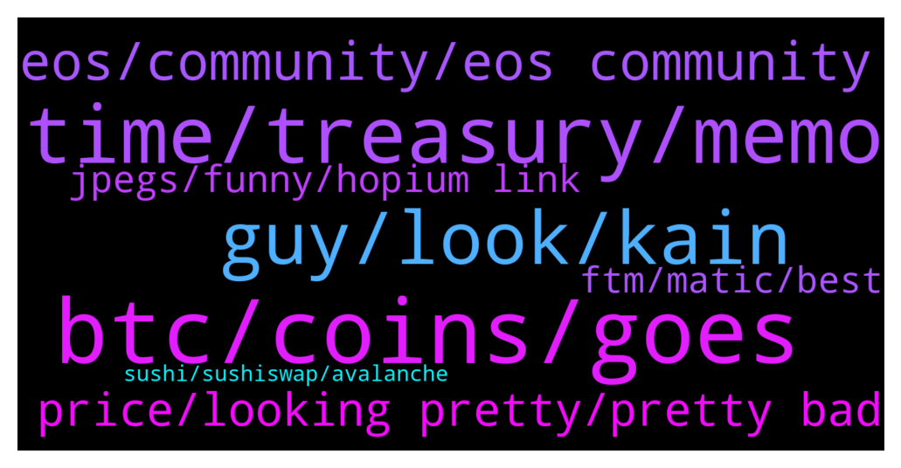

# **@shitpool**
 ## Analysis for **2022-01-05** - **2022-01-06**.

---

## 📊 **Basic Stats**

**n_messages_sent**: 219

---

---

## 🔝 **Top keywords and related messages**

1. **btc, coins, goes**

    @AsianFever --- *wow, can i ask you do you actually trust putting serious amounts on there a few 100k or a few mil whatever is significant to you? or do you just yolo farm it with some fraction of real stack* **--->** [TG Discussion](https://t.me/shitpool/714367)

    @yesbutalsono --- *BTC, ETH, CEL, TIME, SPELL, SUSHI, LINK* **--->** [TG Discussion](https://t.me/shitpool/713985)

    @i7d6_Ta3z0p --- *https://www.tradingview.com/x/XwBa4sbf Poor TON going down with BTC, at least somebody fat fingered the dip* **--->** [TG Discussion](https://t.me/shitpool/714292)

    @moonwithellie --- *Solid APY on this top coins, I'm picking Near Protocol because it still has room to grow https://twitter.com/binance/status/1476373583647682563* **--->** [TG Discussion](https://t.me/shitpool/714134)

    @kevvy_wevvy --- *the ponzinomics will catch up at some point* **--->** [TG Discussion](https://t.me/shitpool/713923)

    @AsianFever --- *@wojackdegreate got any cool stable farms to share for the shitpoolers that have at least some usdt? someone gave me this but i haven`t looked at it yet, https://flexusd.com/* **--->** [TG Discussion](https://t.me/shitpool/714363)

2. **time, treasury, memo**

    @hosermage --- *Well rebases inflate the supply but people are just selling that into the liquidity pool to generate fees. I guess they will use those fees to stabilize price somehow* **--->** [TG Discussion](https://t.me/shitpool/714147)

    @MoneroPal --- *The question will TIME pump or not?* **--->** [TG Discussion](https://t.me/shitpool/714338)

    @hosermage --- *Seems like the smart contract would be the easy part. It's how to handle the liquidity. And I don't see how it would be cross chain unless they are willing to take a year plus to develop* **--->** [TG Discussion](https://t.me/shitpool/714140)

    @pizza_dog --- *Yeah I think that’s where Time has to go, unless this revenue sharing thing incentivized people to not dump and actually stay staked* **--->** [TG Discussion](https://t.me/shitpool/713924)

    @pizza_dog --- *Seems like they have some sort of staking with the Avax in their treasury but it’ll still be liquid somehow* **--->** [TG Discussion](https://t.me/shitpool/713962)

    @MoneroPal --- *So staking of TIME will continue, but minting stops, rebases continue for TIME, so continued inflation there, but no inflation from minting, this makes no sense. sMEMO is necessary now for cross chain. Apparently buying MEMO or sMEMO directly now may increase price of MEMO.* **--->** [TG Discussion](https://t.me/shitpool/714159)

3. **guy, look, kain**

    @Blazmeen --- *I'm sorry if anyone here likes him but what a load of cringable twaddle.  I seriously doubt that guy could care less about the little man unless they're filling his bags.* **--->** [TG Discussion](https://t.me/shitpool/714323)

    @yesbutalsono --- *nodes and the casino sports betting platform* **--->** [TG Discussion](https://t.me/shitpool/713949)

    @CharliePolite --- *Yup… He is getting mega cringe* **--->** [TG Discussion](https://t.me/shitpool/714324)

    @MoneroPal --- *Jake wouldn’t look any different if they didn’t.  They’re both just really low class uneducated commoners that got propelled into money and stardom because somone else is making more off of them. Likely will be broke like most, only one I respect in the scene is Canelo Alvarez, doesn’t even belong in the same sentence as them.* **--->** [TG Discussion](https://t.me/shitpool/713968)

    @yesbutalsono --- *Kain and his brother at it again* **--->** [TG Discussion](https://t.me/shitpool/714025)

    @AsianFever --- *its a pablo escobar robin hood, apparently lol* **--->** [TG Discussion](https://t.me/shitpool/714322)

4. **eos, community, eos community**

    @ddcsov --- *Right so EOS is not a scam, B1 is a scam* **--->** [TG Discussion](https://t.me/shitpool/714275)

    @rmw_90 --- *ahhh dude, we've had plenty of eos fan bois in here and one by one they got blown out and left* **--->** [TG Discussion](https://t.me/shitpool/714279)

    @michael_ssss --- *B1 is the entity that collected 4 billion dollars. EOS is the “community” with the scraps* **--->** [TG Discussion](https://t.me/shitpool/714271)

    @ddcsov --- *EOS rebrand + new tokenomics model could be moon man* **--->** [TG Discussion](https://t.me/shitpool/714214)

    @MoneroPal --- *EOS was a scam they sold useless tokens to clowns and invested the fiat proceeds into equity of real businesses, smart taking money from stupid* **--->** [TG Discussion](https://t.me/shitpool/714198)

    @Horselorde --- *Idk why the EOS community thought that kicking B1 out would magically fix everytbing. Theres so many better opportunities, EOS doesn’t matter anymore.* **--->** [TG Discussion](https://t.me/shitpool/714205)

5. **price, looking pretty, pretty bad**

    @MoneroPal --- *Zero chance, it will be dumped and swing traded, the industry is not mature enough to understand any project, nor care, the entire community is based on lambos, it’s even in their calculator…* **--->** [TG Discussion](https://t.me/shitpool/713928)

    @MoneroPal --- *$4-5k, can we see that again?* **--->** [TG Discussion](https://t.me/shitpool/714339)

    @MoneroPal --- *Possibly for now, not like UST will disappear.* **--->** [TG Discussion](https://t.me/shitpool/713925)

    @WolfZero9 --- *It would be great if people would retweet this  https://twitter.com/whalepool/status/1479118139568705550?s=21* **--->** [TG Discussion](https://t.me/shitpool/714412)

    @pizza_dog --- *I think maybe but probably not 8-9k unless something crazy happens* **--->** [TG Discussion](https://t.me/shitpool/714340)

    @BlockChainUp --- *is zico adding or he will wait < 1k?!* **--->** [TG Discussion](https://t.me/shitpool/714306)

6. **jpegs, funny, hopium link**

    @gonubie --- *it’s not about jpegs, the point is, decentraland is hilariously pisspoor after so many years* **--->** [TG Discussion](https://t.me/shitpool/714411)

    @yesbutalsono --- *not a gud funny feeling either* **--->** [TG Discussion](https://t.me/shitpool/714188)

    @AsianFever --- *good, no REN tags on it ^^* **--->** [TG Discussion](https://t.me/shitpool/714261)

    @pizza_dog --- *Is this some schizo shit in the time discord* **--->** [TG Discussion](https://t.me/shitpool/714098)

    @kevvy_wevvy --- *hearing grumblings here and there at illuvium got hacked* **--->** [TG Discussion](https://t.me/shitpool/714021)

    @yesbutalsono --- *im seeing some hopium for link* **--->** [TG Discussion](https://t.me/shitpool/713975)

7. **ftm, matic, best**

    @notdao --- *The official polygon wallet dex thing was charging like 2.5 matic in gas so i used quickswap and it was like 0.001 matic which was expected and fine* **--->** [TG Discussion](https://t.me/shitpool/714088)

    @pizza_dog --- *Lol matic fees are absurd rn.* **--->** [TG Discussion](https://t.me/shitpool/714082)

    @gonubie --- *I just dont get his whole drive really. A good way to get ftm is to sell spell.  Then what.  He’s always helping out others (sushi, ftm) and the best way to benefit from that help is to dump his shit and buy that assited coin. It’s doing my nuts in.* **--->** [TG Discussion](https://t.me/shitpool/714170)

    @gonubie --- *no way, much less advanced, you are more of the 10 print “really not bad” 20 goto 10 variety, basic* **--->** [TG Discussion](https://t.me/shitpool/714132)

    @OxZilla --- *Beethoven X is the best on ftm.* **--->** [TG Discussion](https://t.me/shitpool/714101)

    @MoneroPal --- *Hope it’s not amm, never considered ftm as the best at anything, but we shall see, I prefer the dexs on ftm like spirit swap over Avax, not a big fan of joe* **--->** [TG Discussion](https://t.me/shitpool/714100)

