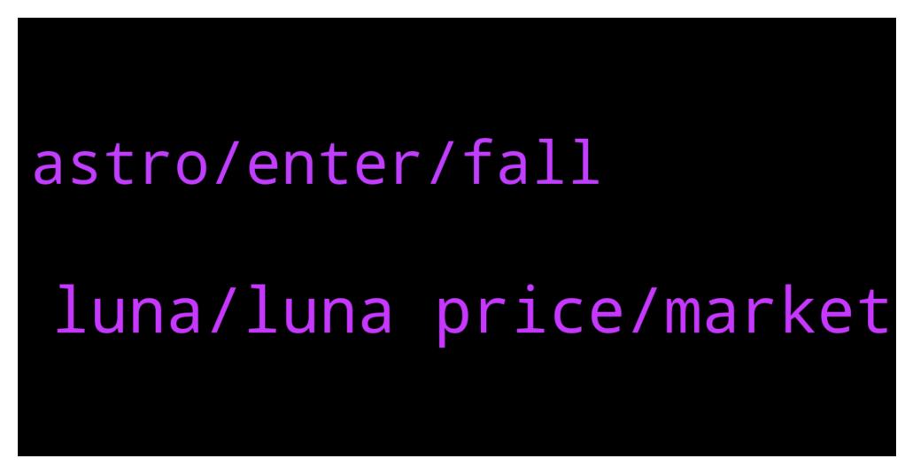

# **@terralunachat_officially**
 ## Analysis for **2022-01-05** - **2022-01-06**.

---

## 📊 **Basic Stats**

**n_messages_sent**: 26

---

---

## 🔝 **Top keywords and related messages**

1. **luna, luna price, market**

    @mattttti --- *I use anchor for leveraged exposure, Staking on Stader and keeping UST ready for buying dipps. And providing liquidity for luna/bLuna on Astroport / Terraswap. If the price of luna/bLuna diverges there is also arbitrage.  Oh and I DCA every day with a bot on Kraken :)* **--->** [TG Discussion](https://t.me/terralunachat_officially/22778)

    @danielpaivasilva --- *Guys, do you think Luna is sell-off proof? Unfortunately, I bought it on top, thinking it would break the 100 usd resistance, and it is going down, down, down...* **--->** [TG Discussion](https://t.me/terralunachat_officially/22914)

    @may_gin --- *So LUNA has held with extreme markets very well, where the peg has done very well, with the -75% drop we saw in May. Was still a bad black swan, but that drop led to several changes in how Anchor approached liquidations and so on, Since then in reasonably big dips, the peg has been held to a T. And this was when LUNA was a much smaller market cap - it is likely far better protected witht his market cap, and the anchor liquidation changes made after the May market crash.   However - the next step is creating BTC and forex reserves, and I understand that is something we might hear about this month. With further reserve stability, we should be more than safe. Not sure of specifically what and how, but we should know before the month ends.* **--->** [TG Discussion](https://t.me/terralunachat_officially/22885)

    @santoso82 --- *How much will luna price reach by end of year* **--->** [TG Discussion](https://t.me/terralunachat_officially/22920)

    @Gregorysu --- *wow, how is astroport so low compared to terraswap.  less than 1% APR on bluna/luna??  is that real?* **--->** [TG Discussion](https://t.me/terralunachat_officially/22886)

    @djackop --- *what's your expectation for LUNA ?* **--->** [TG Discussion](https://t.me/terralunachat_officially/22850)

2. **astro, enter, fall**

    @ponemalone --- *struggling to find a scanner that does this* **--->** [TG Discussion](https://t.me/terralunachat_officially/22879)

    @L520131444a --- *BTC has been 43593, which is more than a thousand short of 42,000 from what I said,😅* **--->** [TG Discussion](https://t.me/terralunachat_officially/22862)

    @Mayginn --- *For the first five days of this phase, you can commit ASTRO and/or UST to the ASTRO-UST bootstrapping pool. Participants receive ASTRO tokens. ASTRO won't be able till you use the link in the group to re authenticate your portfolio address properly.* **--->** [TG Discussion](https://t.me/terralunachat_officially/22820)

    @L520131444a --- *There are still many people who think that BTC will not fall anymore. I believe that its price will fall in the past few days.* **--->** [TG Discussion](https://t.me/terralunachat_officially/22811)

    @Fred --- *Nft . Discount where can i get ...?.. I get a email from cryptocom..it will start tomorrow* **--->** [TG Discussion](https://t.me/terralunachat_officially/22769)

    @MohsenDastan --- *I have the security phrase but I forgot my password I enter the security phrase correctly for recovery, but it does not enter the next stage Thank you very much for your help* **--->** [TG Discussion](https://t.me/terralunachat_officially/22926)

