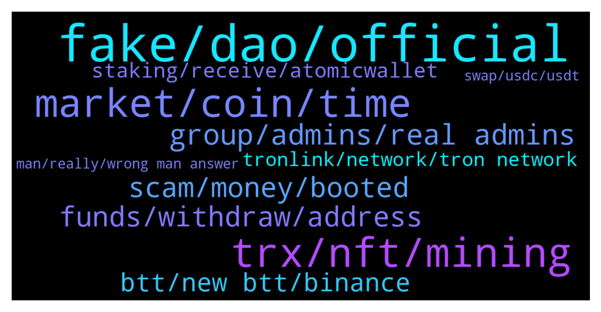

# **@tronnetworkEN**
 ## Analysis for **2022-01-05** - **2022-01-06**.

---

## 📊 **Basic Stats**

**n_messages_sent**: 298

---

---

## 🔝 **Top keywords and related messages**

1. **fake, dao, official**

    @DG --- *We're down 10b in staked TRX from ath. Should we be concerned it's less secure? Also, entire TRX supply is now in circulation. If TRON is truly decentralized, why can't we propose and collectively reduce total supply by removing TRON Foundation TRX?* **--->** [TG Discussion](https://t.me/tronnetworkEN/3811853)

    @PiterSpain --- *📢 Led by the founder, supported by developers & super representatives, #TRON established itself as one of the top public chains and eventually transformed itself into a fully decentralized and self-governed organization and gave birth to TRON DAO.🙌 https://trondao.medium.com/announcement-on-tron-foundation-restructured-as-tron-dao-3b18aec7699e   ⚒️ At present, the total number of #TRON accounts has exceeded 70 million. #TRON is showered with a myriad of decentralized projects in #stablecoins, wallets, storage, exchanges, lending, liquidity mining, cross-chain applications, Oracle, social media, games, etc.   🚀 #TRON Foundation has settled to dissolve itself on July 25, 2021, which fits better into the next development stage of TRON. TRON DAO is tipped to leverage the TRON protocol to decentralize the Internet while boosting effective governance for community members.* **--->** [TG Discussion](https://t.me/tronnetworkEN/3810738)

    @Papeaz --- *Here I can tell about a fake Tron telegram scamming about and airdrop* **--->** [TG Discussion](https://t.me/tronnetworkEN/3809883)

    @PiterSpain --- *TRON burns TRX with every transaction. Fees are getting burned  https://tronscan.org/#/data/charts/supplyAndDestroy* **--->** [TG Discussion](https://t.me/tronnetworkEN/3811586)

    @PiterSpain --- *TRON is dedicated to building the infrastructure for a truly decentralized Internet. https://tron.network   TRON Official Telegram: http://t.me/tronnetworkEN* **--->** [TG Discussion](https://t.me/tronnetworkEN/3810395)

    @PiterSpain --- *The winner of TRON SPAIN contest @TronnetworkES  https://twitter.com/dayronsimon/status/1478753298870067200* **--->** [TG Discussion](https://t.me/tronnetworkEN/3812579)

2. **trx, nft, mining**

    @xPommepote --- *The market is still crashing hard and you expect TRX to make a big move 🧐 stake it and wait a little more 🤷🏼‍♂️* **--->** [TG Discussion](https://t.me/tronnetworkEN/3811555)

    @PiterSpain --- *🚀$NFT has already traded on Korean crypto exchange, Bithumb! 🚀For Bithumb users, 21 B $NFT airdrop is coming! Period:Jan.6,2022-Jan.8,2022 1. Newly registered members trade $NFT, get $NFT bonus. 2. $NFT will distribute by contribution rate. Details:  https://cafe.bithumb.com/view/board-contents/1642551* **--->** [TG Discussion](https://t.me/tronnetworkEN/3812767)

    @otakuinla --- *The reduction in staked trx is probably the result of Binance unfreezing their trx. They do this from time to time to do some maintenance. They'll refreeze again soon. In the meantime, enjoy the high voter rewards 😊* **--->** [TG Discussion](https://t.me/tronnetworkEN/3811901)

    @emilie_Dana --- *How to participate in TRX liquidity mining.* **--->** [TG Discussion](https://t.me/tronnetworkEN/3810557)

    @xPommepote --- *You can freeze around 500 trx for a free transaction* **--->** [TG Discussion](https://t.me/tronnetworkEN/3813128)

    @GinaVSCRIC --- *What will 250 TRX locked give me?* **--->** [TG Discussion](https://t.me/tronnetworkEN/3813134)

3. **market, coin, time**

    @Rahul2368 --- *If I buy and hold this coin, will any balance be deducted?* **--->** [TG Discussion](https://t.me/tronnetworkEN/3812654)

    @RealLescoBrandon --- *Does this board kick you off for asking about price movements?   It seems that no one likes to talk about price, because you’re all in this $Trillion Mkt for the tech.  Is that right?* **--->** [TG Discussion](https://t.me/tronnetworkEN/3810893)

    @Sussyi7 --- *Shiba pump run is over and if you are buying shiba now you deserve to loose your money and all of it..* **--->** [TG Discussion](https://t.me/tronnetworkEN/3810325)

    @xPommepote --- *Do your own research we don’t know about this coin* **--->** [TG Discussion](https://t.me/tronnetworkEN/3812655)

    @vin --- *Why whole crypto market is down?* **--->** [TG Discussion](https://t.me/tronnetworkEN/3811923)

    @NawedAnjumkhan007 --- *What will be the trons price after end of this year? Is it worth holding or i should plan to sell it for other coin??* **--->** [TG Discussion](https://t.me/tronnetworkEN/3812845)

4. **group, admins, real admins**

    @udari_chamathka --- *Can I send my link to this group?* **--->** [TG Discussion](https://t.me/tronnetworkEN/3812548)

    @Glinn --- *What’s this group al about ?* **--->** [TG Discussion](https://t.me/tronnetworkEN/3810391)

    @ccmedianetwork --- *Change group or you get ban* **--->** [TG Discussion](https://t.me/tronnetworkEN/3810177)

    @Fabs_trx --- *Nop she didn’t “spam” the group ^^ I did it for her hehe* **--->** [TG Discussion](https://t.me/tronnetworkEN/3809735)

    @xPommepote --- *You were asking something not related to the group.* **--->** [TG Discussion](https://t.me/tronnetworkEN/3809382)

    @Honytox --- *I want share the link, you can see the groupe* **--->** [TG Discussion](https://t.me/tronnetworkEN/3812963)

5. **scam, money, booted**

    @agentpiki --- *If you have noticed, that particular message has been spammed for days now. Not sure if scammers trying to get attention or just promoting* **--->** [TG Discussion](https://t.me/tronnetworkEN/3812033)

    @kelvinalessandro --- *please can someone explain to me how I can earn money from this platform... no scam please.* **--->** [TG Discussion](https://t.me/tronnetworkEN/3810376)

    @agentpiki --- *Scammers are hungry. We should make them even hungrier 👍* **--->** [TG Discussion](https://t.me/tronnetworkEN/3813053)

    @RealLescoBrandon --- *Anyone want to know the fastest way to get booted from a Crypto chat board?    Ask a question they don’t want to answer.    You’ll get booted faster than a Constitutionalist on Twitter.* **--->** [TG Discussion](https://t.me/tronnetworkEN/3809380)

    @sim_bil --- *& be careful of scams every where* **--->** [TG Discussion](https://t.me/tronnetworkEN/3812224)

    @simon866 --- *Scam and your money is long gone   Don't give your money to scam websites* **--->** [TG Discussion](https://t.me/tronnetworkEN/3811308)

6. **funds, withdraw, address**

    @shotirk --- *i send my funds to by mistake to SC.... can I return it to my wallet? Or whom must I contact about it? Thanks.* **--->** [TG Discussion](https://t.me/tronnetworkEN/3810580)

    @agentpiki --- *I answered you. Don't you read sir  Your funds gone sir* **--->** [TG Discussion](https://t.me/tronnetworkEN/3810615)

    @PiterSpain --- *Already answered, funds sent to smart contracts are gone.* **--->** [TG Discussion](https://t.me/tronnetworkEN/3810658)

    @Carlos_TRX --- *Blockchain transactions cannot be returned, if you know the owner of the address you can try to contact him, although it is very difficult. Remember it like a lesson for the future mate* **--->** [TG Discussion](https://t.me/tronnetworkEN/3810627)

    @agentpiki --- *No one controls smart contract. You sent to address so you just basically threw it there 👌* **--->** [TG Discussion](https://t.me/tronnetworkEN/3810625)

    @agentpiki --- *Why would I provide wrong answer?  No hope to return your funds* **--->** [TG Discussion](https://t.me/tronnetworkEN/3810621)

7. **btt, new btt, binance**

    @g4briellon --- *Where I can exchange btt for wbtt?* **--->** [TG Discussion](https://t.me/tronnetworkEN/3809662)

    @trilokarya6 --- *is binance supporting BTT redenomination plan* **--->** [TG Discussion](https://t.me/tronnetworkEN/3809976)

    @PiterSpain --- *Old BTT or new BTT?  OLD BTT: https://just.tronscan.io/?lang=en-US#/wbtt  NEW BTT: SUNSwap.com V2 but the impact price ia going to be huge* **--->** [TG Discussion](https://t.me/tronnetworkEN/3810370)

    @Trust man --- *But not yet on binance maybe i will wait till tomorrow* **--->** [TG Discussion](https://t.me/tronnetworkEN/3811646)

    @digitimed --- *started the action with btt burning. it always takes the price action relatively within the justin ecosystem.* **--->** [TG Discussion](https://t.me/tronnetworkEN/3810088)

    @agentpiki --- *@BttBittorrent << this is channel for BTT related questions.  I strongly believe Binance will automatically swap BTTOLD to new BTT.  Stay updated by tuning in to Binance announcement* **--->** [TG Discussion](https://t.me/tronnetworkEN/3810006)

8. **staking, receive, atomicwallet**

    @valetramo --- *But i will receive also tron while staking ?* **--->** [TG Discussion](https://t.me/tronnetworkEN/3812417)

    @M17miba --- *How to stake tron and how is the APY at the moment* **--->** [TG Discussion](https://t.me/tronnetworkEN/3812463)

    @Lordsamzy --- *I have a question on Tron staking* **--->** [TG Discussion](https://t.me/tronnetworkEN/3811705)

    @agentpiki --- *Freezing + staking is the best way* **--->** [TG Discussion](https://t.me/tronnetworkEN/3810096)

    @Niikmoor --- *The process of staking in Atomicwallet is easy and straightforward.* **--->** [TG Discussion](https://t.me/tronnetworkEN/3809887)

    @cryptobubbleX --- *Bruh all I know is that I’m staking all my bag on atomicwallet, till then imma keep staking* **--->** [TG Discussion](https://t.me/tronnetworkEN/3809314)

9. **tronlink, network, tron network**

    @matapat --- *thru TronLink App.. APY now highest at 9.54* **--->** [TG Discussion](https://t.me/tronnetworkEN/3812467)

    @suPerJack0 --- *Tronlink is best wallet for tron network. 4.2 rating is not bad👀* **--->** [TG Discussion](https://t.me/tronnetworkEN/3811975)

    @PEREKUZER --- *I'm not using any either rather I'm using trust wallet just tried checking on play store but the rating for tronlink pro is very bad how do I go about it please?* **--->** [TG Discussion](https://t.me/tronnetworkEN/3811970)

    @PiterSpain --- *TRON Network is faster than light. If you got delays ask to your exchange because they are the cause. If Kucoin provide a tx hash check out in the blockchain explorer tronscan.org* **--->** [TG Discussion](https://t.me/tronnetworkEN/3810381)

    @PiterSpain --- *New version of Tronlink for those who do not have yet the last update from PlayStore   4.5.0   https://android.tronlink.org/tronlinkpro_googleplay_4.5.0_20220104102153.apk* **--->** [TG Discussion](https://t.me/tronnetworkEN/3811203)

    @Avie12 --- *Tronlink is not on play store* **--->** [TG Discussion](https://t.me/tronnetworkEN/3810958)

10. **man, really, wrong man answer**

    @shotirk --- *can you answer to my question )))* **--->** [TG Discussion](https://t.me/tronnetworkEN/3810614)

    @xPommepote --- *Did you really read ? 🧐* **--->** [TG Discussion](https://t.me/tronnetworkEN/3811594)

    @shotirk --- *i hope you wrong man )))))* **--->** [TG Discussion](https://t.me/tronnetworkEN/3810619)

    @agentpiki --- *📴 need to turn phone off 😂* **--->** [TG Discussion](https://t.me/tronnetworkEN/3810630)

    @agentpiki --- *you have 10 minutes to change your pic* **--->** [TG Discussion](https://t.me/tronnetworkEN/3810596)

    @turbo_tutone --- *piter you the man... you really are!👏👏👍👍👍👍👍🙃🙃🙃🙃🙃😉😉* **--->** [TG Discussion](https://t.me/tronnetworkEN/3810875)

