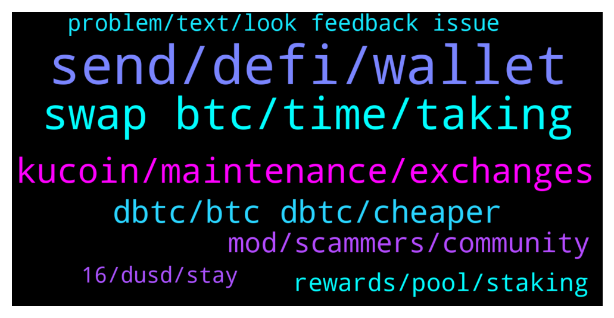

# **@CakeDeFi_EN**
 ## Analysis for **2022-01-06** - **2022-01-07**.

---

## 📊 **Basic Stats**

**n_messages_sent**: 239

---

---

## 🔝 **Top keywords and related messages**

1. **send, defi, wallet**

    @Sam --- *Okay thank you! Do I need to do this from cake? Or can I send LTC from kucoin to my light wallet and get dLTC without the cake bridge?* **--->** [TG Discussion](https://t.me/CakeDeFi_EN/161571)

    @<UNK> --- *A ceo shoudnt need so many opinions* **--->** [TG Discussion](https://t.me/CakeDeFi_EN/161436)

    @Sam --- *Okay so I want to be very sure about it because its a big amount of money: I have LTC on my Cake account and can send it with the defi chain network to my Lightwallet and get dLTC? Sorry for repeating my question, just want to be sure 😅* **--->** [TG Discussion](https://t.me/CakeDeFi_EN/161579)

    @Kassius84 --- *Welcome, Start your DeFi Journey Here: Cake  DeFi Services Simply Explained https://support.cakedefi.com/hc/en-us/articles/900003427506-Cake-Service-simply-explained* **--->** [TG Discussion](https://t.me/CakeDeFi_EN/161393)

    @Seraphim_1986 --- *Ok thank you. A lot of private persons in name of Cake wrote to me last time 🤨* **--->** [TG Discussion](https://t.me/CakeDeFi_EN/161629)

    @DmgBautista --- *No, you always have to go through Cake first* **--->** [TG Discussion](https://t.me/CakeDeFi_EN/161572)

2. **swap btc, time, taking**

    @dwgranth --- *When is BTC->DFI swapping going to be enabled?* **--->** [TG Discussion](https://t.me/CakeDeFi_EN/161231)

    @Sebastian --- *Is it possible, that it takes weeks? 🤯* **--->** [TG Discussion](https://t.me/CakeDeFi_EN/161634)

    @fabioandreatta --- *We announced this the 2nd of January for the first time* **--->** [TG Discussion](https://t.me/CakeDeFi_EN/161954)

    @Steffen --- *Ok, when will it be possible again? Do you know ?* **--->** [TG Discussion](https://t.me/CakeDeFi_EN/161552)

    @<UNK> --- *Taking own sweet time to vote and blah. Solve it already* **--->** [TG Discussion](https://t.me/CakeDeFi_EN/161430)

    @JL --- *Every 3 green candles there's 1 red candle. So make your guess for 2022* **--->** [TG Discussion](https://t.me/CakeDeFi_EN/161837)

3. **kucoin, maintenance, exchanges**

    @YunTao --- *I got a network upgrade at kucoin* **--->** [TG Discussion](https://t.me/CakeDeFi_EN/161562)

    @freedfidotcom --- *DFI Withdrawals and Deposits are working fine* **--->** [TG Discussion](https://t.me/CakeDeFi_EN/161285)

    @DmgBautista --- *I always inform about DFX.swiss to any user, as its also in the possibilities listed in the pinned messages that I always request the same users to read first of all.   My point with the previous answer was to be as broad as possible to any user in terms, not of a specific route, but to a generall off/on ramp, since is the main issue at the moment with many users. DFX.swiss uses Sepa, which is not broadly available in many countries or which may carry some heavy fees and therefore which may not serve all. But yes, obviously any user can try and on/off ramp with it, provided they have an account :)* **--->** [TG Discussion](https://t.me/CakeDeFi_EN/161513)

    @Seraphim_1986 --- *Full market is dipping. Is not only DFI* **--->** [TG Discussion](https://t.me/CakeDeFi_EN/161311)

    @ABIOLA SYLVESTER --- *Still waiting for DFi withdrawal to go through for days now any idea when they will have it resolved as KuCoin shows my deposit is still processing* **--->** [TG Discussion](https://t.me/CakeDeFi_EN/161380)

    @AndesLarson --- *Basically we are caught hostage (I don’t mind at all) but that’s what it looks like or you can swap it to DFI for a huge loss right?* **--->** [TG Discussion](https://t.me/CakeDeFi_EN/161269)

4. **dbtc, btc dbtc, cheaper**

    @Michael_Schredl --- *At the Moment no, but normaly yes. dBTC are just wrapped Bitcoin* **--->** [TG Discussion](https://t.me/CakeDeFi_EN/161616)

    @DmgBautista --- *BTC is the real asset. dBTC is a wrapped version to use in the defichain environment, if for example you want to send your BTC from Cake to the defichain wallet for example* **--->** [TG Discussion](https://t.me/CakeDeFi_EN/161608)

    @iAden_94 --- *Ok cool. I just saw all the ERC20 addresses cost $130 now 🤯 Wasn’t it like $20 or $30?* **--->** [TG Discussion](https://t.me/CakeDeFi_EN/161491)

    @jumbolin --- *I get that but I’ve been told that dBTC is supposedly half the regular price? Is that correct?* **--->** [TG Discussion](https://t.me/CakeDeFi_EN/161816)

    @jumbolin --- *is dBTC currently cheaper s as usual when I swap it with DFI?* **--->** [TG Discussion](https://t.me/CakeDeFi_EN/161806)

    @syahirmustaffa --- *Hi all, i am a new to cake-defi. Can anybody explain to me the diff between BTC & dBTC?* **--->** [TG Discussion](https://t.me/CakeDeFi_EN/161607)

5. **mod, scammers, community**

    @Michael_Schredl --- *No, there is no official Support on Telegram* **--->** [TG Discussion](https://t.me/CakeDeFi_EN/161628)

    @jumbolin --- *That’s great but I’ve come to cake through FB and had no idea bout Telegramm Channel thus couldn’t have known. I wish I’d known before for it’d saved me the fees.* **--->** [TG Discussion](https://t.me/CakeDeFi_EN/161532)

    @gilldog --- *Not everyone is checking the Telegram announcements daily. Something this major needed a banner on the platform or BTC deposits blocked.* **--->** [TG Discussion](https://t.me/CakeDeFi_EN/161958)

    @Sam --- *got 2 messages, instant blocked those shameless idiots* **--->** [TG Discussion](https://t.me/CakeDeFi_EN/161586)

    @fabioandreatta --- *We also have banners and text on the website itself* **--->** [TG Discussion](https://t.me/CakeDeFi_EN/161959)

    @DmgBautista --- *Actually, Bernd is the actual mod in the platform. Not worthy to look for scammers impersonating mods here in the group, they usually have two accounts, one silent here to see messages and then one impersonating a mod or a community member to contact directly anyone in the look for help.  Thats why we always request anyone to follow the community guidelines (see pinned messages). In them, you can see that there are 3 basic rules thay should be followed to help the community being safe. 1, no mod will ever DM you, as well as its against the rules to DM other users. 2, there is no official support in telegram. And 3, any unsolicited DM must always be considered a scam attempt, therefore just block and report (even if it looks from from a mod). Impersonating a mod account is possible unfortunatelly, therefore we have this rules.   All users must take care and should always read the rules, as well as the daily evening announcement on the automated safety message. Feeling sorry for anyone that might be a victim of a scammer (I know I have been a few years ago when joining the crypto world), but unfortunatelly theres is not much more that we can do in order to raise awareness.* **--->** [TG Discussion](https://t.me/CakeDeFi_EN/161818)

6. **rewards, pool, staking**

    @Michael_Schredl --- *Yes, that are two complete different things. With Staking you can help the Network, Liquidity Pools are needed for a DEX* **--->** [TG Discussion](https://t.me/CakeDeFi_EN/161612)

    @Sander --- *Quick question about staking. I thought staking rewards should be fairly stable in terms of dfi rewards. But it's changing quite significantly, the last 12 almost half of what's common. Would anyone be able to explain this? Is it related to the dBTC issue? (I don't see how it would)* **--->** [TG Discussion](https://t.me/CakeDeFi_EN/161542)

    @skiatwongrr --- *I see but at the end of the day the returns are still the same way of compounding right so why does liquidity pool offer higher “interest” than staking is there any additional risk I ought to take note of ?* **--->** [TG Discussion](https://t.me/CakeDeFi_EN/161614)

    @skiatwongrr --- *Does anyone know the difference between staking and liquidity pool?* **--->** [TG Discussion](https://t.me/CakeDeFi_EN/161610)

    @Marcel --- *Wann wird das Hinzufügen zum Liquidity Pool wieder aktiviert?* **--->** [TG Discussion](https://t.me/CakeDeFi_EN/161597)

    @Michael_Schredl --- *Because they were less block rewards, thats why the rewards are not consistent at the moment* **--->** [TG Discussion](https://t.me/CakeDeFi_EN/161544)

7. **problem, text, look feedback issue**

    @Manvydasm --- *Thanks. But it does not say what is the problem. Just a problwm* **--->** [TG Discussion](https://t.me/CakeDeFi_EN/161944)

    @Cryptoziano --- *Thank you for this :). I must do more research* **--->** [TG Discussion](https://t.me/CakeDeFi_EN/161230)

    @gilldog --- *Literally on it right now there is definitely no banners or anything. Allowed me to deposit my BTC in my cake wallet no problem 2 days ago, no text or anything. It only shows text when it's time to swap which is too late* **--->** [TG Discussion](https://t.me/CakeDeFi_EN/161961)

    @stcascha --- *I suggest opening another tab: https://blog.defichain.com/atomic-swap-post-mortem-further-steps/* **--->** [TG Discussion](https://t.me/CakeDeFi_EN/161232)

    @syahirmustaffa --- *Alright. Thank you for the explanation. Appreciate it* **--->** [TG Discussion](https://t.me/CakeDeFi_EN/161621)

    @Michael_Schredl --- *Thanks for the Feedback, there seems to be an issue, Tech Team is looking at it* **--->** [TG Discussion](https://t.me/CakeDeFi_EN/161467)

