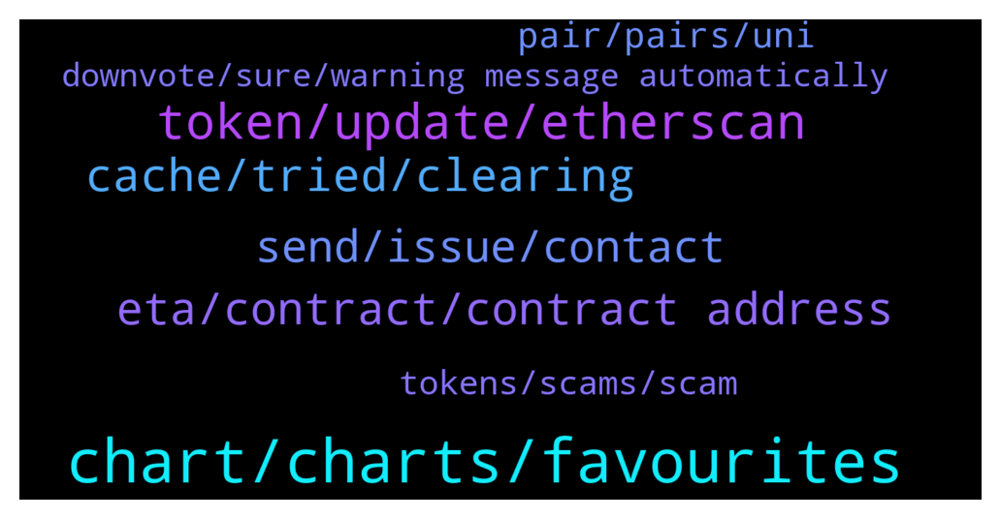

# **@DEXToolsCommunity**
 ## Analysis for **2022-01-05** - **2022-01-07**.

---

## 📊 **Basic Stats**

**n_messages_sent**: 469

---

---

## 🔝 **Top keywords and related messages**

1. **chart, charts, favourites**

    @imuresan --- *Sorry for this. I guess a bot was guilty of vaporising my feedback. Here it is again. I like the new font and the new, slightly cleaner, more stylish look. The thing that I don't find good is the treatment of the favourites. I should mention that I took the time to try and adjust to the new look and avoid being resistant to change. However I find that the favourites being displayed like they are on the right column does not work for me. That column covers the right part of the main/current chart I'm looking at (including the price). I'm on a windows computer. Also the column on the left side of the screen, where the favourites used to be, displays now information that is largely irrelevant to me at least. And one last thing. The miniature charts for each of the favourites is not very useful to me. It occupies a lot of space and it makes me scroll a lot to have a look at all my favourite pairs. I would still prefer the favourites to be on the left side of the screen where they used to be and without the miniature chart. In that way I was able to have a quick, birds eye view at my favourites without the need to scroll too much. I hope my feedback gets to the right persons. I wish everyone a Happy New Year! I have bought into Dextools because you are the first to publish the charts of new pairs from IDOs. I tried to use the Ethereum bot, without success. It's clunky as hell. I know that's another company. And I know a BSC bot is in the making. If you guys manage to pull those trading strategies off you have a great advantage and product.* **--->** [TG Discussion](https://t.me/DEXToolsCommunity/322017)

    @mf1495 --- *No charts opening for me since the UI update* **--->** [TG Discussion](https://t.me/DEXToolsCommunity/322433)

    @P C --- *I mean when I filter it down to my own transactions* **--->** [TG Discussion](https://t.me/DEXToolsCommunity/322650)

    @napascual --- *1. You can switch favorites to the left side 2. You can hide the charts on the favorites and display them in a single line each* **--->** [TG Discussion](https://t.me/DEXToolsCommunity/322018)

    @JoeyDieleman --- *All depends on screensizes but you should have a change layout button right top* **--->** [TG Discussion](https://t.me/DEXToolsCommunity/322028)

    @pranaysanghavi --- *The price was stuck at $7.5 since many days* **--->** [TG Discussion](https://t.me/DEXToolsCommunity/321762)

2. **token, update, etherscan**

    @OQuintero --- *Trying to swap some rose token to bnb but I can’t, any idea why?* **--->** [TG Discussion](https://t.me/DEXToolsCommunity/322505)

    @hmk18990 --- *To update Social Information for your token, please update etherscan.io or bscscan.com & update information on coinmarketcap.com and coingecko.com* **--->** [TG Discussion](https://t.me/DEXToolsCommunity/322058)

    @H0nKl3R --- *Can anybody assist me? The info icons below the token name / contract address will not show on Brave browser. I have tried resetting cache, rebooting, check internet.* **--->** [TG Discussion](https://t.me/DEXToolsCommunity/322726)

    @JoeyDieleman --- *Apply on etherscan/bscscan/etc, coingecko and coinmarketcap* **--->** [TG Discussion](https://t.me/DEXToolsCommunity/321992)

    @stanes --- *There is indeed an issue with displaying this token. I am reporting it to the devs team and they will fix it asap. Thank you for reporting.* **--->** [TG Discussion](https://t.me/DEXToolsCommunity/322123)

    @Shauno73 --- *Thanks for vid. I'm pretty well versed in this stuff. Since update I've found this issue. Shows wallet address that's connected currently, but does not give me access to the plan that my tokens activate. Strange one, but I'll work it out once I've been able to disconnect and reconnect. That's all it needs. A refreshed connection.* **--->** [TG Discussion](https://t.me/DEXToolsCommunity/322778)

3. **cache, tried, clearing**

    @bastardganpunk --- *Still not working? Check you have a stable internet connection and your cache cleared. It should work then. Maybe even restarting your computer.* **--->** [TG Discussion](https://t.me/DEXToolsCommunity/321610)

    @bastardganpunk --- *you might need to clear your cache and try again. but the way you tried to do it is correct* **--->** [TG Discussion](https://t.me/DEXToolsCommunity/322894)

    @borntochas3 --- *yea it worked after clearing cache and restarting my pc, i had it on for a few weeks now that might be the issue* **--->** [TG Discussion](https://t.me/DEXToolsCommunity/322286)

    @jamesharris279 --- *Is anyone else having huge problems with the site stalling and not running? I have to disconnect and reconnect my metamask every 15 minutes for the site to keep working. Same problem on chrome and brave* **--->** [TG Discussion](https://t.me/DEXToolsCommunity/322380)

    @hmk18990 --- *also it's a possibility that an antivirus, ad-blocker (can sometimes blocks irrelevant javascripts), or some other extension blocking something in the webapp.* **--->** [TG Discussion](https://t.me/DEXToolsCommunity/322386)

    @rpoole69 --- *duh, lol, it was doing it in mobile and desktop, but all good now! Thanks* **--->** [TG Discussion](https://t.me/DEXToolsCommunity/322933)

4. **eta, contract, contract address**

    @hmk18990 --- *yes it's on the way but can't give you an ETA* **--->** [TG Discussion](https://t.me/DEXToolsCommunity/322066)

    @RedPanda94 --- *Not listed yet but wanna be prepared* **--->** [TG Discussion](https://t.me/DEXToolsCommunity/321990)

    @napascual --- *Neither calling him noob nor ignoring his comment is a great solution* **--->** [TG Discussion](https://t.me/DEXToolsCommunity/322689)

    @ShibanceinuEmployee --- *are there any plans to do so?* **--->** [TG Discussion](https://t.me/DEXToolsCommunity/322065)

    @stanes --- *He is really busy, give him one or two days to get back to you.* **--->** [TG Discussion](https://t.me/DEXToolsCommunity/321874)

    @hmk18990 --- *let's ask it to @FredericDEXT if the team has a plan for that. he'll respond when he's available.* **--->** [TG Discussion](https://t.me/DEXToolsCommunity/322106)

5. **send, issue, contact**

    @stanes --- *Can you send me some links with with this issue in DM please?* **--->** [TG Discussion](https://t.me/DEXToolsCommunity/322322)

    @napascual --- *Hey could you dm me before doing that?* **--->** [TG Discussion](https://t.me/DEXToolsCommunity/322591)

    @stanes --- *Ahahaha how many of you in this chat + in DM? 😅* **--->** [TG Discussion](https://t.me/DEXToolsCommunity/322275)

    @napascual --- *You can dm those contact addresses to me* **--->** [TG Discussion](https://t.me/DEXToolsCommunity/322532)

    @napascual --- *Feel free to dm me for the original pc issue, we could go through it now* **--->** [TG Discussion](https://t.me/DEXToolsCommunity/322593)

    @rpoole69 --- *Ok great, any particular contact information I can pass on?* **--->** [TG Discussion](https://t.me/DEXToolsCommunity/322305)

6. **pair, pairs, uni**

    @GetFreeOwner --- *Hello how to create missing pair?  0xea5cd2dd91de5b080dbbc7226893c457c5eceb91   this token dont have pair.  thanks for fix   @admins* **--->** [TG Discussion](https://t.me/DEXToolsCommunity/322263)

    @stanes --- *Seems like you are looking at the Uni v3 pair when all the action is on the Uni v2 pair.* **--->** [TG Discussion](https://t.me/DEXToolsCommunity/321766)

    @AbdoMelody --- *I have problem with this pair   https://www.dextools.io/app/polygon/pair-explorer/0x643cc040bbf5eee0ded70d4f63173f2cdc4e89bf* **--->** [TG Discussion](https://t.me/DEXToolsCommunity/321973)

    @RealCryptoDomus --- *But they also have an eth pairing* **--->** [TG Discussion](https://t.me/DEXToolsCommunity/322829)

    @Thesios --- *I think this is unreasonable as they dont add any pairs , they just show what is been traded.* **--->** [TG Discussion](https://t.me/DEXToolsCommunity/322709)

    @Mustycrypto --- *This pair chart is totally incorrect* **--->** [TG Discussion](https://t.me/DEXToolsCommunity/322244)

7. **tokens, scams, scam**

    @solDevW3 --- *This excuse is unacceptable. You need to be more proactive as to ensure scams are not listed on your platform. This will go very far to help investors in their efforts not to get scammed. This will also help the market and your business fight back against bad actors. Your lame excuse is encouraging the continued listing of these scam projects. I suppose yo will only take action when you’re sued and have to pay a few millions to a class action of investors fed up with this lacks approach to security.* **--->** [TG Discussion](https://t.me/DEXToolsCommunity/322624)

    @P C --- *good point. At least the obvious scams should be removed or at least flagged!* **--->** [TG Discussion](https://t.me/DEXToolsCommunity/322633)

    @stanes --- *Np, just let few hours for our devs to take care of it.  Others tokens with the same name can't be considered as "fraudulent" because anybody is free to list a token with this name. We never remove anything, we display what is available on the blockchain.  But once your token is live on our website it will be on the first result if it's the one with the most txs.* **--->** [TG Discussion](https://t.me/DEXToolsCommunity/322129)

    @rpoole69 --- *good morning, I was finally able to get the 1000 tokens for standard access, for the wallet, is there anyway to hide the scam tokens from the list?* **--->** [TG Discussion](https://t.me/DEXToolsCommunity/322531)

    @FredericDEXT --- *We will work on features to avoid scams trending, but as we previously said, it's hard to balance that and keep it decentraliced.* **--->** [TG Discussion](https://t.me/DEXToolsCommunity/322765)

    @napascual --- *I cannot agree with you. We are proactive on identifying scams but cannot make disappear something that's already on the blockchain. We give lots of possible data so make a better tranding decision (and will provide even more helpful info) but in the end you always need to DYOR* **--->** [TG Discussion](https://t.me/DEXToolsCommunity/322695)

