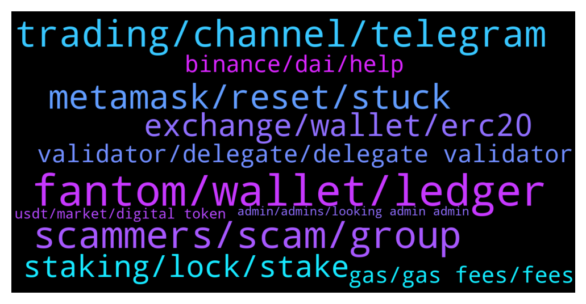

# **@Fantom_English**
 ## Analysis for **2022-01-06** - **2022-01-07**.

---

## 📊 **Basic Stats**

**n_messages_sent**: 307

---

---

## 🔝 **Top keywords and related messages**

1. **fantom, wallet, ledger**

    @Janevietani --- *open fwallet.fantom.network from trustwallet and use walletconnect* **--->** [TG Discussion](https://t.me/Fantom_English/624233)

    @Goldensurfer --- *Anyone else staked to fantom foundation or can I ask them? Really it should have details on when rewards are sent ....* **--->** [TG Discussion](https://t.me/Fantom_English/624666)

    @AirCincy --- *What other options are there for sales with WL on Fantom besides Fantomstarter* **--->** [TG Discussion](https://t.me/Fantom_English/625120)

    @kuzu_mao --- *I saw in the hellhound group that their project was included by fantom. Does it mean that this project is less risky？* **--->** [TG Discussion](https://t.me/Fantom_English/624301)

    @Emoguy112 --- *And I can do defi with it ... Like bluna* **--->** [TG Discussion](https://t.me/Fantom_English/625098)

    @kuzu_mao --- *This Twitter means it was officially recommended by fantom？* **--->** [TG Discussion](https://t.me/Fantom_English/624293)

2. **scammers, scam, group**

    @FrancoAndreassi --- *be avare of scammers contact you in private* **--->** [TG Discussion](https://t.me/Fantom_English/623945)

    @dracula53 --- *A scam is occurring using this channel name* **--->** [TG Discussion](https://t.me/Fantom_English/625241)

    @Ziga --- *scammer above called "crypto wallet support"* **--->** [TG Discussion](https://t.me/Fantom_English/624888)

    @Fjody --- *If anyone DMs you, those are all scammers.* **--->** [TG Discussion](https://t.me/Fantom_English/625414)

    @LDM246 --- *You really want to be scammed?* **--->** [TG Discussion](https://t.me/Fantom_English/624018)

    @stevelee2021 --- *he just sent me a google form with a last question asking for seeds LOL* **--->** [TG Discussion](https://t.me/Fantom_English/624893)

3. **trading, channel, telegram**

    @Johnnyfantom --- *You will have to ask in the trading channel, not here, please see channels below* **--->** [TG Discussion](https://t.me/Fantom_English/625264)

    @codear17 --- *Come to https://t.me/FantomMarines  You can ask such questionss there* **--->** [TG Discussion](https://t.me/Fantom_English/625103)

    @K --- *But this is not the price chat* **--->** [TG Discussion](https://t.me/Fantom_English/623830)

    @dracula53 --- *Which one is the trading channel* **--->** [TG Discussion](https://t.me/Fantom_English/625279)

    @Janevietani --- *better ask it on tomb telegram/discord group* **--->** [TG Discussion](https://t.me/Fantom_English/624436)

    @Johnnyfantom --- *No price chat please, go to trading/price  channel* **--->** [TG Discussion](https://t.me/Fantom_English/624504)

4. **metamask, reset, stuck**

    @Johnnyfantom --- *you can reset metamask, just have your seedphrase handy* **--->** [TG Discussion](https://t.me/Fantom_English/624956)

    @Janevietani --- *metamask? go to metamask setting -> advanced -> reset then re-do your tx* **--->** [TG Discussion](https://t.me/Fantom_English/625196)

    @G0ldMax --- *Stupid question, is there a reset button, or what do I do?* **--->** [TG Discussion](https://t.me/Fantom_English/624957)

    @G0ldMax --- *How to clear stuck transactions in metamask?* **--->** [TG Discussion](https://t.me/Fantom_English/624948)

    @Cristiano --- *With this solution every transaction Will be cancelled from the blockchain? I did this but not solved* **--->** [TG Discussion](https://t.me/Fantom_English/625202)

    @Gens --- *You don't need Metamask at all* **--->** [TG Discussion](https://t.me/Fantom_English/623909)

5. **exchange, wallet, erc20**

    @stevelee2021 --- *i tried to send some FTM from exchange to my metamask wallet, i am confused how i can do that, the exchange is only showing it as ERC20* **--->** [TG Discussion](https://t.me/Fantom_English/625405)

    @LaurensVKA --- *What can you use FTM actually for? I'm new* **--->** [TG Discussion](https://t.me/Fantom_English/623877)

    @JoseSwifty --- *just curious if i send ftm from binance to ftm wallet will i need to have my metamask connected to FTM Opera or Eth mainnet* **--->** [TG Discussion](https://t.me/Fantom_English/623904)

    @Mark --- *Hi; no it was the Sywftx exchange wallet to FTM.* **--->** [TG Discussion](https://t.me/Fantom_English/623997)

    @pajamasfreak --- *Preference, both are top amm on ftm* **--->** [TG Discussion](https://t.me/Fantom_English/624309)

    @Fenflocka --- *So then converting FTM to BNB and then BNB to BUSD?* **--->** [TG Discussion](https://t.me/Fantom_English/623848)

6. **staking, lock, stake**

    @sinjindavidjung --- *but quick question, im sure everyone is sick of it, but which validator should i pick for my staking? is just putting in the foudation 1 ok?* **--->** [TG Discussion](https://t.me/Fantom_English/625372)

    @Mcjig --- *no minimum. no lock is 4%* **--->** [TG Discussion](https://t.me/Fantom_English/624078)

    @Coin_Warior --- *Where are the best rate for staking ?* **--->** [TG Discussion](https://t.me/Fantom_English/624042)

    @Coin_Warior --- *Can i use trustwallet for staking ?* **--->** [TG Discussion](https://t.me/Fantom_English/624228)

    @VirtualRob --- *Does anyone know of a better deal than farming FTM/Tomb on reaper? Seems like there shouldn’t be IL loss because of the peg, correct?* **--->** [TG Discussion](https://t.me/Fantom_English/624429)

    @Mcjig --- *you can stake on fwallet. 4 to 14% for a 1 year lock* **--->** [TG Discussion](https://t.me/Fantom_English/624044)

7. **validator, delegate, delegate validator**

    @Goldensurfer --- *The validator Id is 2   is that the same thing? Thank you* **--->** [TG Discussion](https://t.me/Fantom_English/624668)

    @Janevietani --- *check it on explorer.fantom.network see if your validator still online or offline* **--->** [TG Discussion](https://t.me/Fantom_English/624658)

    @sk_hodl --- *Actually I delegated a validator last time. But I cannot delegate to the same validator again…* **--->** [TG Discussion](https://t.me/Fantom_English/624357)

    @Goldensurfer --- *Weird cos I received rewards from a different validator for 1 weeks delegation* **--->** [TG Discussion](https://t.me/Fantom_English/624673)

    @sk_hodl --- *Can anybody suggest best validator to delegate FTM???  👆🏽👆🏽👆🏽* **--->** [TG Discussion](https://t.me/Fantom_English/624348)

    @Goldensurfer --- *Hi where can I find out how often a validater sends me rewards , I checked through my delegation info and I haven't received rewards from fantom foundation yet and wondering why . Thanks* **--->** [TG Discussion](https://t.me/Fantom_English/624655)

8. **binance, dai, help**

    @Krazykook --- *Hi guys, I’ve send DAI to Binance through the FTM network which isn’t supported by Binance, Anyone know if the funds are lost or a way to retrieve them back please and thanks* **--->** [TG Discussion](https://t.me/Fantom_English/625337)

    @G --- *Can I ask someone for help about sending dai back to my binance account* **--->** [TG Discussion](https://t.me/Fantom_English/625245)

    @Diego --- *Hi, i had a problem that i  send  BNB on the fantom network from my metamesk to my binance account, but when I was created the deposit I did BEP20, and sent. This BNB will back to my account? Can I do this?* **--->** [TG Discussion](https://t.me/Fantom_English/624235)

    @Janevietani --- *you can not send DAI Fantom to Binance* **--->** [TG Discussion](https://t.me/Fantom_English/625248)

    @Janevietani --- *only Binance can help you. if they wont help, no one can* **--->** [TG Discussion](https://t.me/Fantom_English/624553)

    @Janevietani --- *no, you need to contact Binance for help, only them can access the address that you sent to* **--->** [TG Discussion](https://t.me/Fantom_English/624237)

9. **gas, gas fees, fees**

    @CloudXXX2021 --- *Gas fee is out of this world.  Any plans for fantom to lower gas fee* **--->** [TG Discussion](https://t.me/Fantom_English/624061)

    @SpaView --- *Gas fees are a problem for scaling* **--->** [TG Discussion](https://t.me/Fantom_English/624112)

    @rhizomatique --- *i mean it usually costs less than a dollar for me* **--->** [TG Discussion](https://t.me/Fantom_English/624064)

    @Coin_Warior --- *How much for the gas fees?* **--->** [TG Discussion](https://t.me/Fantom_English/624182)

    @Lmiri6 --- *What’s peoples price predictions for this coin in the next 10-12 months ?* **--->** [TG Discussion](https://t.me/Fantom_English/624773)

    @Mcjig --- *too many panic sellers, causing gas prices* **--->** [TG Discussion](https://t.me/Fantom_English/624075)

10. **usdt, market, digital token**

    @Feilin --- *may be! But as the most stable digital token on the market, I don’t think any digital token is safer than usdt.* **--->** [TG Discussion](https://t.me/Fantom_English/623861)

    @Feilin --- *First of all, you must understand that the issuance of usdt is strictly based on the concept of the dollar; to issue, every company that issues a usdt will have a dollar of funds stored in a bank account to ensure the stability of the usdt  Because it is secured by the U.S. dollar as the underlying technology currency, it will be called a safe haven for all cryptocurrencies* **--->** [TG Discussion](https://t.me/Fantom_English/623850)

    @Feilin --- *When the cryptocurrency market is falling, I think it’s the safest way to convert some coins into usdt.* **--->** [TG Discussion](https://t.me/Fantom_English/623847)

    @chapingzhao --- *Us interest rate is increasing, Crypto market needs 30% interest rate for counter it 😆* **--->** [TG Discussion](https://t.me/Fantom_English/623966)

    @Feilin --- *Ha ha! Usdt is currently the largest digital token in circulation on the market* **--->** [TG Discussion](https://t.me/Fantom_English/623872)

    @Feilin --- *I'm not alone in saying this, nor am I alone in switching most cryptocurrencies to USDT as a hedge when risk comes* **--->** [TG Discussion](https://t.me/Fantom_English/623873)

