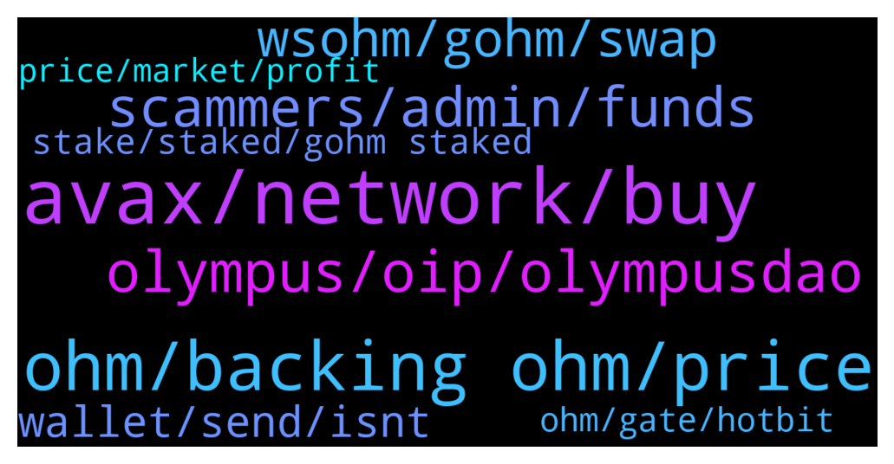

# **@OlympusTG**
 ## Analysis for **2022-01-06** - **2022-01-07**.

---

## 📊 **Basic Stats**

**n_messages_sent**: 705

---

---

## 🔝 **Top keywords and related messages**

1. **avax, network, buy**

    @Nitin --- *Can one buy gohm from the website? Or it is only available on avalanche etc?* **--->** [TG Discussion](https://t.me/OlympusTG/143756)

    @Ap0l1o --- *after you swap on avax for gOhm* **--->** [TG Discussion](https://t.me/OlympusTG/144119)

    @ccryii --- *Well in avax you have already pools for gOhm .* **--->** [TG Discussion](https://t.me/OlympusTG/143423)

    @nfwaple --- *AVAX was like approximately 0.015 AVAX per swap, first time you might need to approve + swap though, so 2 x 0.015 AVAX at most* **--->** [TG Discussion](https://t.me/OlympusTG/143906)

    @nfwaple --- *correct, you'd need AVAX to do anything on the AVAX chain* **--->** [TG Discussion](https://t.me/OlympusTG/143921)

    @Agus --- *Theres some tutorials on youtube anout that, easy actually (avax chain)* **--->** [TG Discussion](https://t.me/OlympusTG/143923)

2. **ohm, backing ohm, price**

    @Daniel --- *will the ohm v2 price increase after it?* **--->** [TG Discussion](https://t.me/OlympusTG/143674)

    @john --- *True, how do we create demand for this ohm? a lot of rebase projects rugged so Id figure etheir people are sick of rebase projects or still looking for a legitimate one, which ohm is* **--->** [TG Discussion](https://t.me/OlympusTG/142909)

    @foodielov --- *im a bit confused theres so many Ohm contracts out there which one are we suppose to buy* **--->** [TG Discussion](https://t.me/OlympusTG/143505)

    @timon_k --- *guys i’m having trouble keeping faith in Ohm. help me out! bought at the top. I’m not pulling out but it is kinda depressing* **--->** [TG Discussion](https://t.me/OlympusTG/143995)

    @KenSatoshi33 --- *Any know the reason why OHM until now not listed on any CEX? Why* **--->** [TG Discussion](https://t.me/OlympusTG/143932)

    @FLankarooo --- *wat is happening is that market goes down so backing / OHM goes down so the price of OHM goes down, that being said with OHM you are getting the rebases no matter wat* **--->** [TG Discussion](https://t.me/OlympusTG/143864)

3. **olympus, oip, olympusdao**

    @s_p_i_r_a_l --- *is there any olympus trading channel?* **--->** [TG Discussion](https://t.me/OlympusTG/144050)

    @samboan --- *So i just connect wallet on the olympus dao app and thats itv* **--->** [TG Discussion](https://t.me/OlympusTG/143029)

    @nfwaple --- *go to the OlympusDAO forum, I'm voting no though, that's not really related to the vision of the protocol* **--->** [TG Discussion](https://t.me/OlympusTG/142878)

    @ccryii --- *Your investments your decision. Avax and bsc you pay less fees but the main options of Olympus are only available in ETH* **--->** [TG Discussion](https://t.me/OlympusTG/143420)

    @cdp279 --- *Hey bro,  I'm not at my PC. just look at the whitepaper on Olympus Website. I also encourage you to join Discord and even Reddit please ser.https://discord.gg/a9YhADFk* **--->** [TG Discussion](https://t.me/OlympusTG/143489)

    @Nitin --- *Hey guys, quick one..why has Olympus decided 2200 eth blocks as 1 epoch?* **--->** [TG Discussion](https://t.me/OlympusTG/143907)

4. **scammers, admin, funds**

    @Marco --- *So support will never contact me?* **--->** [TG Discussion](https://t.me/OlympusTG/143086)

    @gmjillcrypto --- *Ok, been spammed by 10 accounts to "resolve my issue". How can I check who is actually admn here?* **--->** [TG Discussion](https://t.me/OlympusTG/142802)

    @nfwaple --- *👀 scammers be dming you now* **--->** [TG Discussion](https://t.me/OlympusTG/143351)

    @Alex --- *This should bei pinned aswell. The amount of scammers trying is insane in here 🙂👌 i think this is a good sign 😂* **--->** [TG Discussion](https://t.me/OlympusTG/143129)

    @nfwaple --- *do not respond to direct/private messages, they're scammers* **--->** [TG Discussion](https://t.me/OlympusTG/143126)

    @nfwaple --- *you can DCA any project friend* **--->** [TG Discussion](https://t.me/OlympusTG/143882)

5. **wsohm, gohm, swap**

    @Ap0l1o --- *The migration is so that you change from the old contracts to the new ones. The new ones allow you to take your Ohm multi chain and avoid high fees on eth. By migrating, you can bridge your gOhm to another network and sell it there later on for fees that are less than a dollar.* **--->** [TG Discussion](https://t.me/OlympusTG/142981)

    @nfwaple --- *correct, but get gOHM not the wsOHM, gOHM is the v2 token, wsOHM is the old version* **--->** [TG Discussion](https://t.me/OlympusTG/143897)

    @dbish4 --- *I can get more gOHM if I swap on traderjoe though. Why not do that?* **--->** [TG Discussion](https://t.me/OlympusTG/143329)

    @themannyster --- *I see thanks. I kept seeing gOHM and was wondering what the difference was. So what happens if you get wsOHM on avax will it become worthless if you dont migrate to gOHM?* **--->** [TG Discussion](https://t.me/OlympusTG/143903)

    @dbish4 --- *Should I trade wsOHM for gOHM on traderjoe or do migration from wsOHM to gOHM on Olympus website?* **--->** [TG Discussion](https://t.me/OlympusTG/143325)

    @samboan --- *Ok so i swapped to gohm. Is that al i need to do now?* **--->** [TG Discussion](https://t.me/OlympusTG/143087)

6. **wallet, send, isnt**

    @Ap0l1o --- *the remaining will be shown in the wallet* **--->** [TG Discussion](https://t.me/OlympusTG/144116)

    @willyc --- *It keeps getting disconnected by wallet connect* **--->** [TG Discussion](https://t.me/OlympusTG/142870)

    @QTmightbehere --- *Done that as well. Nothing new showing in my wallet ether* **--->** [TG Discussion](https://t.me/OlympusTG/142956)

    @nfwaple --- *do you still see them through your wallet?* **--->** [TG Discussion](https://t.me/OlympusTG/143170)

    @nfwaple --- *I think you have been hacked friend, if metamask says 0.. if you want you can send me the transaction link in my dm, I can help you to have a look. No need to send if you're uncomfortable with it though* **--->** [TG Discussion](https://t.me/OlympusTG/143175)

    @QTmightbehere --- *New to crypto but can’t any reflections or anything* **--->** [TG Discussion](https://t.me/OlympusTG/142937)

7. **stake, staked, gohm staked**

    @Nostress04 --- *gOHM, it's v2 and already staked.  Don't buy v1, since you'll have to convert it to gOHM, paying network fee for conversion* **--->** [TG Discussion](https://t.me/OlympusTG/143510)

    @samboan --- *So after i buy gohm what do i do? And which is better. To buy gohm or stake manually* **--->** [TG Discussion](https://t.me/OlympusTG/143026)

    @cdp279 --- *Yes Ser, just hold in your wallet. it is wrapped, not staked. gOhm = index x price* **--->** [TG Discussion](https://t.me/OlympusTG/143476)

    @cdp279 --- *If you buy gohm direct you will never need to stake. It’s a wrapped token that has the staking effect built in* **--->** [TG Discussion](https://t.me/OlympusTG/144045)

    @Tony --- *Whats the difference between zap and stake* **--->** [TG Discussion](https://t.me/OlympusTG/144033)

    @nfwaple --- *no, gOHM is already staked, you're just going to the website to visualise your holding, you should be able to see something under Staked Balance* **--->** [TG Discussion](https://t.me/OlympusTG/143104)

8. **ohm, gate, hotbit**

    @JRL1337 --- *Ok once you unwrap the box how do you sell the ohm cannot see in wallet but can see on ohm app. Must be doing something wrong.* **--->** [TG Discussion](https://t.me/OlympusTG/142960)

    @nfwaple --- *you should still see your staked OHM in Metamask even if you haven't migrated. I would suggest you to use Debank, then look up your own wallet address, no need to connect if you're uncomfortable with it. Then go to History, and you can see where your OHM has gone* **--->** [TG Discussion](https://t.me/OlympusTG/143180)

    @stacyd82d --- *What happened to the zap function on the ohm dashboard   I knew it was not running but now the option is gone?* **--->** [TG Discussion](https://t.me/OlympusTG/142895)

    @Zhtjook --- *I deposited ohm V2 in gate two days ago, but they only support ohm V1 at present. How can I get my token back?* **--->** [TG Discussion](https://t.me/OlympusTG/143661)

    @Zeeshan --- *Ohm trade in hotbit not working* **--->** [TG Discussion](https://t.me/OlympusTG/143220)

    @Mine --- *How do I DCA ohm please* **--->** [TG Discussion](https://t.me/OlympusTG/143883)

