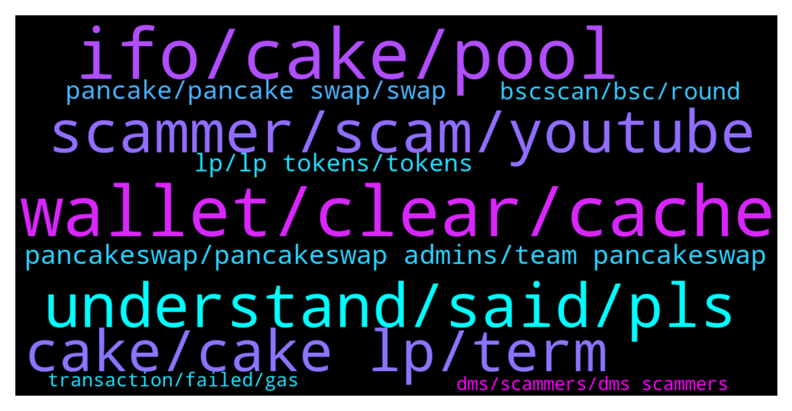

# **@PancakeSwap**
 ## Analysis for **2022-01-06** - **2022-01-07**.

---

## 📊 **Basic Stats**

**n_messages_sent**: 1295

---

---

## 🔝 **Top keywords and related messages**

1. **wallet, clear, cache**

    @jim --- *Dear all i am using my metamask on brave, should i be on chrome as ive heard of problems* **--->** [TG Discussion](https://t.me/PancakeSwap/2253878)

    @Ceddi200 --- *Well works fine at my end. Better check your internet provider or device you using* **--->** [TG Discussion](https://t.me/PancakeSwap/2252793)

    @P --- *Ya, I only use mobile MM. Web ext also easy target for hacks..* **--->** [TG Discussion](https://t.me/PancakeSwap/2252412)

    @TomorrowlandForLife --- *if that doesn't work, try changing RPC* **--->** [TG Discussion](https://t.me/PancakeSwap/2253482)

    @HAITIENLK --- *i use metamask on pc, safepal, trust on mobile, it's normal. pls check your internet and change other wallet.* **--->** [TG Discussion](https://t.me/PancakeSwap/2250780)

    @HAITIENLK --- *^_^. it's normal bro. you can try clear cache or try other wallet app* **--->** [TG Discussion](https://t.me/PancakeSwap/2250769)

2. **ifo, cake, pool**

    @HAITIENLK --- *IFO coming soon, you can unstake when ifo lived. average balance ifo is still there when you unstake* **--->** [TG Discussion](https://t.me/PancakeSwap/2251121)

    @Ceddi200 --- *You can’t stake in ifo pool at the moment,.  More news on that later.* **--->** [TG Discussion](https://t.me/PancakeSwap/2252876)

    @yash86172 --- *If the calculation period ended Can I remove my stake now but my ifo credits will remain?* **--->** [TG Discussion](https://t.me/PancakeSwap/2251112)

    @HAITIENLK --- *you can wait next ifo bro, stake for average balance ifo is ended.* **--->** [TG Discussion](https://t.me/PancakeSwap/2251145)

    @HAITIENLK --- *it's the same autocake, but you can get average balance ifo to join IFO sale bro. (and you get cake reward too)* **--->** [TG Discussion](https://t.me/PancakeSwap/2251149)

    @ROTFLALAPMASTC --- *So this IFO pool is like the autocompound one but with the only difference that once the IFO start, you get the other token minus your cake, right? So your cake will carry on compounding as announced* **--->** [TG Discussion](https://t.me/PancakeSwap/2251105)

3. **understand, said, pls**

    @خسته از روزگار --- *Sorry I did not understand what you mean, you can say more clearly؟* **--->** [TG Discussion](https://t.me/PancakeSwap/2252607)

    @jaytmusic --- *I told you all 8 times I dont understand the last part of the message* **--->** [TG Discussion](https://t.me/PancakeSwap/2251736)

    @jaytmusic --- *obviously! Ive been messaging you guys nonstop saying that what he said wasnt making sense. I followed the directions exactly* **--->** [TG Discussion](https://t.me/PancakeSwap/2251765)

    @SecuestPcs --- *Ser, please read first. Not ape it!  https://twitter.com/safemoon/status/1476198900717342724* **--->** [TG Discussion](https://t.me/PancakeSwap/2252838)

    @HAITIENLK --- *i don't understand what  you mean. pls chat clearly* **--->** [TG Discussion](https://t.me/PancakeSwap/2250972)

    @Crypticman2002 --- *I am just trying to exhibit my limited knowledge ..... 😂😂* **--->** [TG Discussion](https://t.me/PancakeSwap/2252917)

4. **scammer, scam, youtube**

    @fietter --- *Wow just ask roadmap,someone call me, i deacline. Scammer getting agresive now* **--->** [TG Discussion](https://t.me/PancakeSwap/2254142)

    @Luc --- *Please scammer keep calling me i love to talk about my grand mother* **--->** [TG Discussion](https://t.me/PancakeSwap/2252041)

    @alexsoh1 --- *Yup. Few hundred lines of codes with just one line to transfer the fund to the scammer wallet.   And they will ask you to execute Action function of their contract to trigger the transfer of funds.   All YouTube tutorials for front running/snipping are all scams. Scammers usually create multiple YouTube accounts to leave excellent comments on their YouTube posting.  No one will post real front running codes on YouTube 😁. So beware of scams.* **--->** [TG Discussion](https://t.me/PancakeSwap/2253454)

    @raniman --- *some scam video in youtube is available  all video are scam report heavily in youtube* **--->** [TG Discussion](https://t.me/PancakeSwap/2253535)

    @HOLO need is love --- *Scammers i am not answering your call. Stop pestering me!!!!* **--->** [TG Discussion](https://t.me/PancakeSwap/2251340)

    @AttilaSolomon --- *Unbelievable, already two scammers DMed me ....* **--->** [TG Discussion](https://t.me/PancakeSwap/2249220)

5. **cake, cake lp, term**

    @Gauravcryptoo --- *So should we Remove the cake from it or what?* **--->** [TG Discussion](https://t.me/PancakeSwap/2251089)

    @Vishaljain2 --- *Is there any Tools to find out Holders of Cake ?* **--->** [TG Discussion](https://t.me/PancakeSwap/2254155)

    @hoseiinnnna --- *Price catches fundemantals sooner or later, no doubt. But current fundemantals are not giving any reason/excitement to create a new demand for $CAKE   Something big NEEDS to come. That's a fact. It's not an optional, it's a must for CAKE to reach over 45$* **--->** [TG Discussion](https://t.me/PancakeSwap/2249293)

    @RangerApos --- *No end date was given. Long term goal of chefs is to make cake deflationary.* **--->** [TG Discussion](https://t.me/PancakeSwap/2252098)

    @nikhilhi5 --- *man what's wrong with the cake why its showing such a bad price action* **--->** [TG Discussion](https://t.me/PancakeSwap/2254064)

    @iterationbot --- *Ok before startiing this operation I had 40 cake.* **--->** [TG Discussion](https://t.me/PancakeSwap/2250617)

6. **pancakeswap, pancakeswap admins, team pancakeswap**

    @nftspoony --- *It's okay egg spoony is a better spoony trust me* **--->** [TG Discussion](https://t.me/PancakeSwap/2252210)

    @Analyst303 --- *wow, just got in and 5 "pancakeswap" admins PM me lol* **--->** [TG Discussion](https://t.me/PancakeSwap/2249990)

    @Free_Tether1 --- *Do not buy from pancakeswap for now* **--->** [TG Discussion](https://t.me/PancakeSwap/2250329)

    @HAITIENLK --- *you can use filter on pancakeswap* **--->** [TG Discussion](https://t.me/PancakeSwap/2250571)

    @SecuestPcs --- *It is not about Pancakeswap. You can talk with Safemoon team* **--->** [TG Discussion](https://t.me/PancakeSwap/2252849)

    @Dockters --- *you wrong group, you swap on uniswap not pancakeswap 😂* **--->** [TG Discussion](https://t.me/PancakeSwap/2251284)

7. **pancake, pancake swap, swap**

    @KAMI --- *same problem. I think pancake swap was hacked by someone.* **--->** [TG Discussion](https://t.me/PancakeSwap/2253716)

    @Koolblade --- *I see. On pancake swap, how do they make token?* **--->** [TG Discussion](https://t.me/PancakeSwap/2252588)

    @HAITIENLK --- *All transactions are confirmed on your wallet. I can't do anything with your money, please check your history yourself. the transaction at pancake has been completed and the money has been deposited in your wallet.* **--->** [TG Discussion](https://t.me/PancakeSwap/2252744)

    @CryptoClams --- *Added it to MM no problem.  Trying to add it to pancake swap, not accepting contract address* **--->** [TG Discussion](https://t.me/PancakeSwap/2252513)

    @The_Keith_Richards --- *I tried with Dapps (in safepal) as well as on Pancake website. But couldn't attach* **--->** [TG Discussion](https://t.me/PancakeSwap/2253602)

    @Mr.BAz --- *We almost going to 2 years on pancake? What can you say about the improvement you've noticed? This time last year,we were almost 1-2 USD....now we are trading at 10.3* **--->** [TG Discussion](https://t.me/PancakeSwap/2252895)

8. **lp, lp tokens, tokens**

    @Elke --- *So you are saying even if the token is worth $49 you buy the equivalent amount of the other token the lp amount comes out randomly?* **--->** [TG Discussion](https://t.me/PancakeSwap/2250676)

    @xandercakes --- *you should see the LP tokens there after withdrawing them from the farm. if you don't, click find other LP tokens and put in the two tokens in the LP to try finding it* **--->** [TG Discussion](https://t.me/PancakeSwap/2249222)

    @evp --- *Hi admin,  I did lp staking, everything is approved and correct in bscscan,  it appears in my pancake how many lp tokens I have in my wallet  My question is how do I see this in the Metamask wallet?  Thanks* **--->** [TG Discussion](https://t.me/PancakeSwap/2250597)

    @Dywie --- *I think if there is a pool about your lp token, stake it* **--->** [TG Discussion](https://t.me/PancakeSwap/2253392)

    @charliesheen78 --- *Hey guys  I have a question about LP payout  i have got my liquidity out but no money on my wallet what could be the reason?  here is the txhash would be cool if someone could help me  0x8bf31fc6d1f79eff262f2e6caf9c94188825bbf0ebce7c395d52cc67726729c7* **--->** [TG Discussion](https://t.me/PancakeSwap/2251306)

    @RB777R --- *Hi guys. I created REV/WBNB LP on PCS and addeit to the Farm on the manor far website, but it doesn't show it there. It is also gone from my Metamask wallet. Can you help me track it down please?* **--->** [TG Discussion](https://t.me/PancakeSwap/2249985)

9. **bscscan, bsc, round**

    @HAITIENLK --- *You can use yieldwatch.net to find or check on bscscan.com* **--->** [TG Discussion](https://t.me/PancakeSwap/2253281)

    @elinucleus --- *yes. But I don't see the history being shown in my BSC wallet.* **--->** [TG Discussion](https://t.me/PancakeSwap/2253087)

    @FarooqGhani14 --- *Yes dear but i didn't got tokens and i scan my bsc Also* **--->** [TG Discussion](https://t.me/PancakeSwap/2252828)

    @cryptoNKOTB --- *no error - nothing even happens...Sorry, We are unable to locate this TxnHash --> this is what I get on bscscan* **--->** [TG Discussion](https://t.me/PancakeSwap/2253684)

    @cryptoNKOTB --- *Sorry, We are unable to locate this TxnHash --> this is what I get on bscscan* **--->** [TG Discussion](https://t.me/PancakeSwap/2253469)

    @Awino --- *Bsc  says that it's successful  I have checked* **--->** [TG Discussion](https://t.me/PancakeSwap/2254287)

10. **transaction, failed, gas**

    @RichQuackTico --- *Hi, I tried to place an order and the transaction failed, but the fee was taken anyway.* **--->** [TG Discussion](https://t.me/PancakeSwap/2252485)

    @Aosh1ma --- *You can’t reverse any transaction because he is blockchain world. Your txn is in chains* **--->** [TG Discussion](https://t.me/PancakeSwap/2249718)

    @Jo --- *Anyone please help me about a transaction* **--->** [TG Discussion](https://t.me/PancakeSwap/2249746)

    @Cryptoholder386 --- *But this transaction not belongs to me . I didn't do yhis* **--->** [TG Discussion](https://t.me/PancakeSwap/2250184)

    @RichQuackTico --- *Yes but it was deducted and the transaction failed.* **--->** [TG Discussion](https://t.me/PancakeSwap/2252561)

    @HAITIENLK --- *https://bscscan.com/tx/0x5f72fe41385acc89b1e19210376947106fccf722888f677a88c30124323e8172 —> this transaction, you transfered 3300 ONE. pls check* **--->** [TG Discussion](https://t.me/PancakeSwap/2252740)

