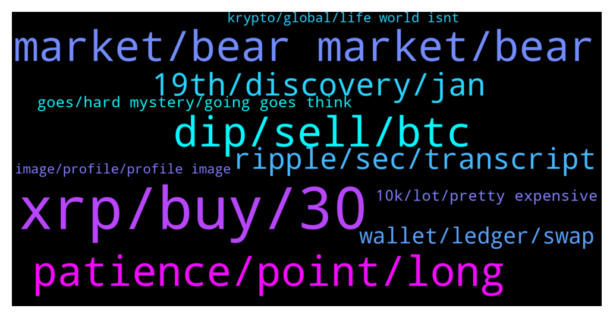

# **@Ripple**
 ## Analysis for **2022-01-06** - **2022-01-07**.

---

## 📊 **Basic Stats**

**n_messages_sent**: 308

---

---

## 🔝 **Top keywords and related messages**

1. **xrp, buy, 30**

    @XRParmyLFG --- *What will a $27tril market cap to 100billion xrp have per coin?* **--->** [TG Discussion](https://t.me/Ripple/3036683)

    @jarilitmanen1 --- *New baby and call it Xrp* **--->** [TG Discussion](https://t.me/Ripple/3035728)

    @NialPial --- *Long time ago, 2 yrs they took over 9% stakes of xrp. And i think last september, they took another deal.    https://www.newsbtc.com/news/ripple/xrp-spikes-9-as-japans-2nd-largest-bank-takes-stake-in-ripple-partner-sbi-holdings/* **--->** [TG Discussion](https://t.me/Ripple/3036237)

    @futurestoreee --- *xrp will touch $10 in 5 years ago* **--->** [TG Discussion](https://t.me/Ripple/3036748)

    @NialPial --- *So i wouldnt consider it risky to buy xrp, but a wise choice. The only 2 remaining questions are: How much, and when, it’ll go up.* **--->** [TG Discussion](https://t.me/Ripple/3036217)

    @NialPial --- *And that’s exactly whats NOT the deal with xrp, hence why i buy it.* **--->** [TG Discussion](https://t.me/Ripple/3036234)

2. **market, bear market, bear**

    @marianmp --- *Problem is rich people become even richer and so the market becomes even more manipulated* **--->** [TG Discussion](https://t.me/Ripple/3036230)

    @richcryto --- *Hi Guys . Are there any Crypto experts who think we may be entering a bear market judging the way Bitcoin is behaving.* **--->** [TG Discussion](https://t.me/Ripple/3036433)

    @LincolnXtamc4 --- *There is more money in crypto now than this time last year, that has to make certain projects more valuable than they were a year ago unless market cap drops back to 1 Trillion again* **--->** [TG Discussion](https://t.me/Ripple/3036276)

    @BennyBennyBlanco --- *If lack of business keeps going down and many don’t have enough money to invest with, everything will continue to drop. Money is what pumps investments up such example like XRP. No money no pump* **--->** [TG Discussion](https://t.me/Ripple/3036005)

    @Sky_Lurkz --- *Yawn  Factor in actual reality   The markets no longer just a bloody predictable pattern* **--->** [TG Discussion](https://t.me/Ripple/3036443)

    @Andrew --- *R we in a bear market* **--->** [TG Discussion](https://t.me/Ripple/3035930)

3. **patience, point, long**

    @marianmp --- *Do you have any inner organs left ????* **--->** [TG Discussion](https://t.me/Ripple/3036198)

    @marianmp --- *No worries ....as long you are still alive you can make it 🤣🤣* **--->** [TG Discussion](https://t.me/Ripple/3036105)

    @marianmp --- *Yea,crazy times calls for crazy measures ....😁😜* **--->** [TG Discussion](https://t.me/Ripple/3035725)

    @marianmp --- *Hope you won't get a stroke sooner or later....* **--->** [TG Discussion](https://t.me/Ripple/3036174)

    @marianmp --- *Otherwise you go and sleep like a dog 🐕🐕🐕* **--->** [TG Discussion](https://t.me/Ripple/3036112)

    @marianmp --- *So pray for an angel 🙏 then 🙏🤣* **--->** [TG Discussion](https://t.me/Ripple/3036180)

4. **dip, sell, btc**

    @Hours_140 --- *Imo, this is the last dip. If its not and btc going below the 40k, i'll sell all my crypto! 🥺* **--->** [TG Discussion](https://t.me/Ripple/3035862)

    @Letum9 --- *Check XRP BTC chart, it's been in a dip for quite some time now 😂* **--->** [TG Discussion](https://t.me/Ripple/3035891)

    @JustNNM --- *Do you work for Atomic? cause this is all you post about* **--->** [TG Discussion](https://t.me/Ripple/3036325)

    @erik_sz91 --- *Do you guys think it can go to 0.50? It would be awesome to fill my bags* **--->** [TG Discussion](https://t.me/Ripple/3036031)

    @ReiTeh --- *Yep. This is the dip of the dip* **--->** [TG Discussion](https://t.me/Ripple/3035892)

    @DrGarryHVLAandVitamins --- *Chill out market red because of Kasachstan 🇰🇿* **--->** [TG Discussion](https://t.me/Ripple/3035865)

5. **19th, discovery, jan**

    @rsilwal2 --- *Is they gonna settle on 19th jan* **--->** [TG Discussion](https://t.me/Ripple/3036669)

    @Drobac32 --- *Who knows date for trial? Is it 22nd January?* **--->** [TG Discussion](https://t.me/Ripple/3036297)

    @Jorge --- *Can you update me of what's the purpose of the trial this January 14th? Also I heard theyre gonna reschedule the trial to Jan 19th or even March What do you know abt that ?* **--->** [TG Discussion](https://t.me/Ripple/3036772)

    @DhCryptoGroup --- *Lets hope lawsuit realy ends on jan 14th and we fly soon after the decison* **--->** [TG Discussion](https://t.me/Ripple/3036750)

    @PWRAIDI --- *There is no trial on the 14th, its the end of expert discovery and it has actually been moved to the 19th 😂😂😂* **--->** [TG Discussion](https://t.me/Ripple/3036776)

    @XRParmyLFG --- *By the sound of it, it does look like Jan 19th.* **--->** [TG Discussion](https://t.me/Ripple/3036671)

6. **ripple, sec, transcript**

    @EML1993 --- *Just follow/watch the lawyers in Twitter and YouTube discussing about the sec vs ripple case, like Jeremy Hogan, John E. Deaton, Filan law. And decide for yourself if xrp will win or not. As for me, I’m going all in.* **--->** [TG Discussion](https://t.me/Ripple/3036644)

    @Cointh88 --- *XRP lawsuit: ‘Make or break’ ruling for Ripple ahead – Conference transcript released  The release of the transcript might signal that the Judge’s ruling over Ripple’s motion to compel the SEC to hand over internal deliberations is right around the corner. This motion is a make of break for Ripple’s fair notice defense.  https://financefeeds.com/xrp-lawsuit-make-break-ruling-ripple-ahead-conference-transcript-released/* **--->** [TG Discussion](https://t.me/Ripple/3035822)

    @Cointh88 --- *Nevermind the Ripple lawsuit: Digivault becomes first accredited custodian to support XRP - FinanceFeeds https://financefeeds.com/nevermind-ripple-lawsuit-digivault-becomes-first-accredited-custodian-support-xrp/* **--->** [TG Discussion](https://t.me/Ripple/3036767)

    @EML1993 --- *“…..reviewing the transcript I am more reminded that the Ripple attorney really did not make one single mistake.  The transcript is like reading a law review journal. It really was ... perfect.” -Atty. Jeremy Hogan* **--->** [TG Discussion](https://t.me/Ripple/3036385)

    @EML1993 --- *High Probability that judge ruling on the motion will be favorable to xrp, IMO. Bullish for me. Filan law has provided the link to the transcript. Search on twitter. Reading the transcript now, so far I like what I’m reading.* **--->** [TG Discussion](https://t.me/Ripple/3035893)

    @EML1993 --- *Saw a tweet that: Judge interrupted SEC counsel Jorge 3-4 times.  Ripple lawyer Solomon wasn't interrupted once by the judge.* **--->** [TG Discussion](https://t.me/Ripple/3035883)

7. **wallet, ledger, swap**

    @Carolinaboy76 --- *Can I send bnb to xumm wallet? Then swap it for xrp? I'm not firmiliar with xrp network* **--->** [TG Discussion](https://t.me/Ripple/3035968)

    @LawDLa --- *If you have Atomic Wallet, it is very easy and fast, just use Atomic Wallet inbuilt exchange* **--->** [TG Discussion](https://t.me/Ripple/3036321)

    @Msmsms12345 --- *Can I move my xrp to metamask from exchanges..??* **--->** [TG Discussion](https://t.me/Ripple/3036725)

    @barryradio --- *I imagine it would require importing your private key into another wallet, not sure that’s a good idea from a ledger* **--->** [TG Discussion](https://t.me/Ripple/3036754)

    @Lallulu --- *You can also buy/swap trough a dex if you have a wallet. You can buy BNB and transfer to your bsc wallet and swap XRP there* **--->** [TG Discussion](https://t.me/Ripple/3036478)

    @Tinkabellagal --- *No Need to swap for xrp and then send xrp to XUMM* **--->** [TG Discussion](https://t.me/Ripple/3035974)

8. **goes, hard mystery, going goes think**

    @Trey young --- *So it s hard to go down right?* **--->** [TG Discussion](https://t.me/Ripple/3036280)

    @Rektallstar --- *The one that goes down and not up* **--->** [TG Discussion](https://t.me/Ripple/3036448)

    @crazy_nft --- *What goes down must go up* **--->** [TG Discussion](https://t.me/Ripple/3036023)

    @localfeeder --- *The mystery is determining where the bottom is* **--->** [TG Discussion](https://t.me/Ripple/3036168)

    @Kbron123 --- *Why is it going down again?* **--->** [TG Discussion](https://t.me/Ripple/3036055)

    @j0rg4 --- *If Bitcoin goes down which one should go up?* **--->** [TG Discussion](https://t.me/Ripple/3035813)

9. **10k, lot, pretty expensive**

    @erik_sz91 --- *10k usd is 2 million argentinian pesos here, which is quite a lot :P* **--->** [TG Discussion](https://t.me/Ripple/3036042)

    @mahmah87 --- *Lmao 10k is not a lot of money bro* **--->** [TG Discussion](https://t.me/Ripple/3036038)

    @mahmah87 --- *I’d love to visit Argentina nice place* **--->** [TG Discussion](https://t.me/Ripple/3036051)

    @erik_sz91 --- *I'd just eat rice and drink rain's water if I had the same money but lived there  xD* **--->** [TG Discussion](https://t.me/Ripple/3036049)

    @mahmah87 --- *Yeh it’s pretty expensive I’m from Sydney so it’s pretty expensive just to get groceries lmao* **--->** [TG Discussion](https://t.me/Ripple/3036047)

    @mahmah87 --- *I meant for me here in Australia 10k would only last 2 months* **--->** [TG Discussion](https://t.me/Ripple/3036044)

10. **image, profile, profile image**

    @LawDLa --- *I suggest good and easy way for the newbie* **--->** [TG Discussion](https://t.me/Ripple/3036330)

    @Tinkabellagal --- *Mozart Set a profile image to chat in this group* **--->** [TG Discussion](https://t.me/Ripple/3036417)

    @JustNNM --- *Thats what the pinned messages are for.* **--->** [TG Discussion](https://t.me/Ripple/3036347)

    @JustNNM --- *Please go to settings then edit and scroll down to @Username and add one there* **--->** [TG Discussion](https://t.me/Ripple/3036126)

    @Tinkabellagal --- *First add a profile image and @username* **--->** [TG Discussion](https://t.me/Ripple/3035933)

    @specialpatrolgroup --- *Get a public profile image pls* **--->** [TG Discussion](https://t.me/Ripple/3036065)

