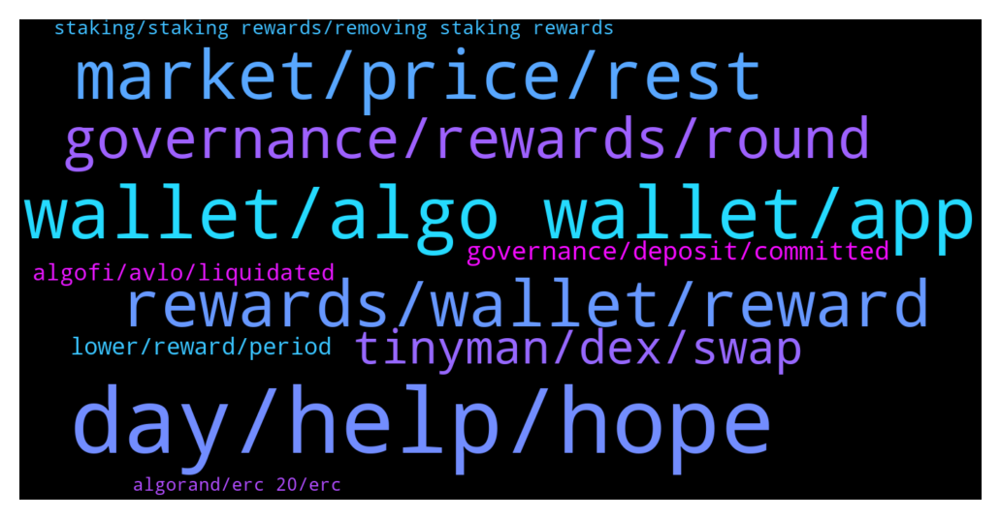

# **@algorand**
 ## Analysis for **2022-01-06** - **2022-01-07**.

---

## 📊 **Basic Stats**

**n_messages_sent**: 284

---

---

## 🔝 **Top keywords and related messages**

1. **day, help, hope**

    @babayaga589 --- *Can you send me the link bro* **--->** [TG Discussion](https://t.me/algorand/330596)

    @NightAlgorand --- *Hi @TheCryptoFuture2021 , you can PM me the details 🙂* **--->** [TG Discussion](https://t.me/algorand/330468)

    @Mental --- *thank you for your answer, have a good day:)* **--->** [TG Discussion](https://t.me/algorand/330188)

    @Cryptonigt --- *It's going alright? Was hoping to te the dump better...didn't happen quite like I wanted* **--->** [TG Discussion](https://t.me/algorand/330133)

    @Lord_Shin_Chan_2_O --- *Can you please check pm sir...🙂* **--->** [TG Discussion](https://t.me/algorand/330499)

    @Lord_Shin_Chan_2_O --- *Wait sir... I should send screenshot in pm...* **--->** [TG Discussion](https://t.me/algorand/330481)

2. **wallet, algo wallet, app**

    @Tiny_Philosopher_784 --- *If you use the wallet app, you'll get a notification saying the tx of 0 algos were sent.* **--->** [TG Discussion](https://t.me/algorand/330430)

    @NightAlgorand --- *Hi Chris , you can refer to this information regarding hard wallet  https://www.algorand.com/resources/algorand-announcements/the-algorand-wallet-just-got-more-secure-with-ledger  https://algorandwallet.com/support/security/pairing-your-ledger-nano-x  Hope it will help 🙂* **--->** [TG Discussion](https://t.me/algorand/330149)

    @MackDenver --- *You need 1 ALGO for the transaction fee, correct.* **--->** [TG Discussion](https://t.me/algorand/330570)

    @MackDenver --- *You might need to create a custom script for it. You should ask about it in our discord  https://discord.gg/84AActu3at* **--->** [TG Discussion](https://t.me/algorand/330538)

    @kramercrypto --- *If you send yourself a 0 algo tx they will be in your wallet, though* **--->** [TG Discussion](https://t.me/algorand/330545)

    @Freedom --- *Hi, I just put x amount of Algo into governance. Is it correct I still see my initial Algo amount in my wallet? I do see a new outgoing transaction of 0,00* **--->** [TG Discussion](https://t.me/algorand/330358)

3. **market, price, rest**

    @Monica241 --- *Can market get dumb for the rest of the month ? 😑* **--->** [TG Discussion](https://t.me/algorand/330382)

    @NightAlgorand --- *I was assuming you talked about the market last night 😂* **--->** [TG Discussion](https://t.me/algorand/330143)

    @kramercrypto --- *Looked at the rest of the market today?* **--->** [TG Discussion](https://t.me/algorand/330610)

    @Cora --- *Bitcoin is plummeting. Should I Sell？* **--->** [TG Discussion](https://t.me/algorand/330273)

    @NightAlgorand --- *Hi @MuratArkan , we all know it was coming, this market was extended long enough, it's time for everyone to rest and start building real stuff like algorand stop chasing hype 😉* **--->** [TG Discussion](https://t.me/algorand/330180)

    @NightAlgorand --- *Hi @Monica241 how are you today?  We don't speculate market movement here, you can go  https://t.me/algorand_price 🙂* **--->** [TG Discussion](https://t.me/algorand/330383)

4. **rewards, wallet, reward**

    @sravan906 --- *0.3 algo reward 😂😂 lol what is this . Is this a reward* **--->** [TG Discussion](https://t.me/algorand/330393)

    @kramercrypto --- *You could move your rewards to a separate wallet* **--->** [TG Discussion](https://t.me/algorand/330543)

    @Grabari --- *Seems like a kind of task for software developers, to implement special type of tx for withdrawing (0A to your wallet to collect rewards and then send XA to other wallet). If done in <4s (later 2.5s) there should be no additional microA in rewards. Or maybe there are already an option for it (sending only the wallet Algorands)? 🤔 Maybe admins could answer it.* **--->** [TG Discussion](https://t.me/algorand/330552)

    @qweraar --- *hi may i ask will i get more rewards by holding more algo in my wallet？* **--->** [TG Discussion](https://t.me/algorand/330165)

    @eloquentplatypus --- *When I make a withdraw from my Algo wallet it includes rewards e.g. I send 300 ALGO and there are 100 rewards it will send 100 ALGO rewards + 200 ALGO from wallet. This is absurd. A tax nightmare. It's putting me off ALGO.* **--->** [TG Discussion](https://t.me/algorand/330541)

    @Malvo --- *Greetings has anyone received their rewards as yet* **--->** [TG Discussion](https://t.me/algorand/330299)

5. **governance, rewards, round**

    @Chompy --- *9.27% is the governance awards right? Does this fluctuate or will increase in time? I'm not ready to go governance just yet, I was thinking Q3 for governance* **--->** [TG Discussion](https://t.me/algorand/330620)

    @Malvo --- *Admin Any update on the governance rewards* **--->** [TG Discussion](https://t.me/algorand/330323)

    @sravan906 --- *Hloo governance rewards for period 1 ?* **--->** [TG Discussion](https://t.me/algorand/330167)

    @MrCarbone --- *Do we know what proposal we gonna have for second round ?* **--->** [TG Discussion](https://t.me/algorand/330394)

    @Malvo --- *Hello any update on the governance rewards* **--->** [TG Discussion](https://t.me/algorand/330321)

    @Asiwajushittu --- *Please how/where can I view my reward for governance #1* **--->** [TG Discussion](https://t.me/algorand/330211)

6. **tinyman, dex, swap**

    @mbolaji1 --- *All Algo project depends on tinyman 😌 and tinyman pool get problem and no trade again. Algorand need to do something* **--->** [TG Discussion](https://t.me/algorand/330312)

    @Ariwijaya90 --- *can anyone tell me other than tinyman..for swap/dex algo?* **--->** [TG Discussion](https://t.me/algorand/330408)

    @Paul --- *There is no way to trade most ASAs at the moment. Everyone should hold until dex is back and ignore price until then* **--->** [TG Discussion](https://t.me/algorand/330286)

    @NightAlgorand --- *Hi there 🙂 At the moment AlgoDex is in testnet. Tinyman is available at the moment 🙂* **--->** [TG Discussion](https://t.me/algorand/330488)

    @sivavasanthi --- *Is the any dex I can swap other than tinyman* **--->** [TG Discussion](https://t.me/algorand/330475)

    @madafak_avril14th --- *Hello! anyone swapped on wagmi swap? Is it reliable?* **--->** [TG Discussion](https://t.me/algorand/330310)

7. **governance, deposit, committed**

    @MackDenver --- *The governance apy depends on the total committed ALGO* **--->** [TG Discussion](https://t.me/algorand/330265)

    @GanthaMakala --- *how to recover its algo which one has to deposit in governance please?* **--->** [TG Discussion](https://t.me/algorand/330563)

    @MackDenver --- *The governance reward depends on the total committed ALGO in a phase.* **--->** [TG Discussion](https://t.me/algorand/330622)

    @eloquentplatypus --- *Most govts tax it that way.* **--->** [TG Discussion](https://t.me/algorand/330589)

    @MackDenver --- *Governance 2 APY will depend on the total committed ALGO* **--->** [TG Discussion](https://t.me/algorand/330583)

    @eloquentplatypus --- *You don't understand basic taxation then. One is income the other has CGT...* **--->** [TG Discussion](https://t.me/algorand/330581)

8. **lower, reward, period**

    @NightAlgorand --- *Hi Mental , how are you today? 🙂  Yes, it will be lower. If there are 30 billion Algo committed in Governing Accounts for that quarter, their rewards will be 70.5m/30b% = 0.24% for every Algo committed for the quarter, corresponding to annualized 0.94%, to be added to the return from participation rewards, totaling 1.94%* **--->** [TG Discussion](https://t.me/algorand/330187)

    @Mental --- *If commited algos for applying the governor are over 30b, can apr for reward be lower below 10%?* **--->** [TG Discussion](https://t.me/algorand/330185)

    @Axel --- *Thats pretty low, ccom offers 3%* **--->** [TG Discussion](https://t.me/algorand/330625)

    @go --- *9.27% = apr 2.3% is real reward of this period* **--->** [TG Discussion](https://t.me/algorand/330623)

    @xyzxyzxyzxyzxyzxyzxyzxy --- *9.9%/4= 2.475% reward. You divide the APR by 4 because it is a quarterly reward* **--->** [TG Discussion](https://t.me/algorand/330338)

    @Dan --- *Ahhh that's what i thought but wasn't 100%, thanks a lot mate* **--->** [TG Discussion](https://t.me/algorand/330107)

9. **algofi, avlo, liquidated**

    @MuratArkan --- *Why didn't algo intervene in the November 18 manipulation? this date has done great damage to this project. If you want to be a big coin, you will interfere with these manipulations, you will not allow them? Who sold the upgrade at that time? algo should explain it* **--->** [TG Discussion](https://t.me/algorand/330181)

    @Martin --- *I hope I don’t get liquidated in Algofi until then* **--->** [TG Discussion](https://t.me/algorand/330290)

    @Cryptonigt --- *I don't do leverage so I didn't get liquidated or anything* **--->** [TG Discussion](https://t.me/algorand/330146)

    @Paul --- *I was trying to figure out how you could get screwed using algofi responsibility* **--->** [TG Discussion](https://t.me/algorand/330291)

    @MuratArkan --- *Algo is no different from stock. this project is dead.* **--->** [TG Discussion](https://t.me/algorand/330174)

    @Chris --- *i also forgot it doesnt have bluetooth, regardless algo has some awesome security. thanks!* **--->** [TG Discussion](https://t.me/algorand/330159)

10. **staking, staking rewards, removing staking rewards**

    @KAPIBAYSIDE --- *Are there people  in here in the arcc staking pool on yeildly? The numbers don't add up to me at the moment I have  283 arcc but yieldly  says I only have $22.21* **--->** [TG Discussion](https://t.me/algorand/330283)

    @MackDenver --- *The staking will be replaced with Governance reward* **--->** [TG Discussion](https://t.me/algorand/330263)

    @vbncrypto --- *I mean the staking rewards that will decrease and halt by february* **--->** [TG Discussion](https://t.me/algorand/330262)

    @vbncrypto --- *I mean, with the slashing of the staking rewards* **--->** [TG Discussion](https://t.me/algorand/330255)

    @jonysarker --- *Quick question for confirmation- If we have done governance staking in period 1, is the next round Period 2 is automatically count in or need to commit algo manually for period 2?* **--->** [TG Discussion](https://t.me/algorand/330306)

    @vbncrypto --- *removing staking rewards and going all in into governance, with reduced APR, wasnt what I was expecting* **--->** [TG Discussion](https://t.me/algorand/330647)

