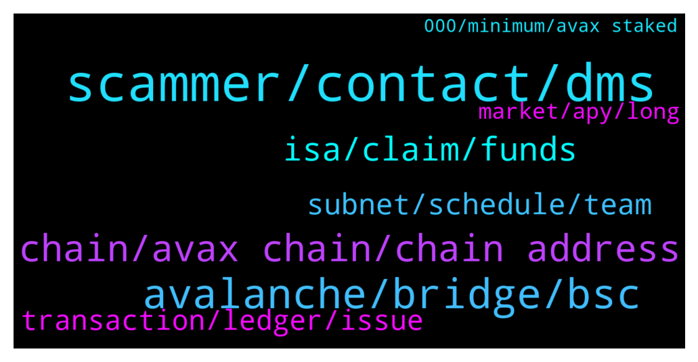

# **@avalancheavax**
 ## Analysis for **2022-01-06** - **2022-01-07**.

---

## 📊 **Basic Stats**

**n_messages_sent**: 194

---

---

## 🔝 **Top keywords and related messages**

1. **scammer, contact, dms**

    @Lanrejones --- *Is it forbidden to talk about here* **--->** [TG Discussion](https://t.me/avalancheavax/320385)

    @JimWelder --- *You'll get some dms shortly they'll offer to help you I'm sure* **--->** [TG Discussion](https://t.me/avalancheavax/320675)

    @CryptoDefiPhoenix --- *Unbelievable the number of people To DM Me* **--->** [TG Discussion](https://t.me/avalancheavax/320262)

    @Nicolas_A --- *Haha he contacted me also. He isn’t in the group so can’t do much* **--->** [TG Discussion](https://t.me/avalancheavax/320404)

    @ghostcarapace3 --- *A scammer named avalanche Mod just contacted me. You might want to delete them from the group.* **--->** [TG Discussion](https://t.me/avalancheavax/320403)

    @TimeToChange! --- *Hello Nicolas, can I contact you ?* **--->** [TG Discussion](https://t.me/avalancheavax/320407)

2. **avalanche, bridge, bsc**

    @Nicolas_A --- *Automatic (you receive only if you bridged more than $75* **--->** [TG Discussion](https://t.me/avalancheavax/320381)

    @João --- *Is this the official telegram? There are a few Avalanche channels which stand as official. It's confusing...* **--->** [TG Discussion](https://t.me/avalancheavax/320449)

    @Nicolas_A --- *You can bridge some assets from another chain to BSC using synapse and it will give a bit of BNb* **--->** [TG Discussion](https://t.me/avalancheavax/320654)

    @samuel8842 --- *Hi team,  Could someone please tell me if it is possible to set an alarm for wallet activity on the Avalanche blockchain? Maybe through Avascan?  Thank you,* **--->** [TG Discussion](https://t.me/avalancheavax/320564)

    @Nicolas_A --- *On BSC ? Need to buy it from an exchange* **--->** [TG Discussion](https://t.me/avalancheavax/320651)

    @nullheaven --- *Do i need to claim the airdrop for using the avax bridge or is it automatic?* **--->** [TG Discussion](https://t.me/avalancheavax/320379)

3. **chain, avax chain, chain address**

    @sk_hodl --- *Hi… I exported avax from c-chain address to x-chain address. But after exported from c-chain, I rejected the transaction before importing to x-chain.   Now avax is not available in any chain…can anybody help????   👆🏽👆🏽👆🏽👆🏽* **--->** [TG Discussion](https://t.me/avalancheavax/320325)

    @oathtobarbatos --- *Avalps? I have never heard anything about them* **--->** [TG Discussion](https://t.me/avalancheavax/320291)

    @BinanceApe --- *Anyone else heard of avalps? Can’t get a chat link* **--->** [TG Discussion](https://t.me/avalancheavax/320290)

    @byjameson --- *Avax is finite and its burning from fee total cap, so it will be burning until finishing all avax? Is it sustainable?* **--->** [TG Discussion](https://t.me/avalancheavax/320198)

    @charitrabansal --- *i need usdt on avax chain on metamask* **--->** [TG Discussion](https://t.me/avalancheavax/320355)

    @deepfakeoracle --- *When will chainlink vrf be available on avax?* **--->** [TG Discussion](https://t.me/avalancheavax/320623)

4. **isa, claim, funds**

    @MiaoMiao11 --- *The debit card has been added, coinbase but I can't find where to add the funds.* **--->** [TG Discussion](https://t.me/avalancheavax/320674)

    @Jack --- *I can't see the butten of buying the ISA. what's wrong?* **--->** [TG Discussion](https://t.me/avalancheavax/320516)

    @Thomas --- *I'm looking for advice, help or any support I can contact as my Avax was stolen from my wallet Christmas day and just discovered this last night when I logged in. Any help people can give me and point me in the direction of finding out how this has happened and what I can do will be much appreciated. Thank you.* **--->** [TG Discussion](https://t.me/avalancheavax/320411)

    @Saga_the_legend --- *Hi Admin I can’t find option for claim isa.* **--->** [TG Discussion](https://t.me/avalancheavax/320604)

    @Traderluz21 --- *Hi !!! I have registered an ISA ,,,Is it mandatory to make the purchase to receive my avax ? is appearing here " staking " as to claim if there is zero ISA . They told me that this beginning was not necessary to buy. ,what to do* **--->** [TG Discussion](https://t.me/avalancheavax/320672)

    @btc_linzi --- *I staked the xava coin  but not get the isa quota ？ Why？* **--->** [TG Discussion](https://t.me/avalancheavax/320671)

5. **subnet, schedule, team**

    @Nicolas_A --- *There is no subnet schedule but should probably be more or less ready in this period. A lot of functionalities are already ready* **--->** [TG Discussion](https://t.me/avalancheavax/320682)

    @M --- *Admin, Will subnet project be announced on march?(crypto inno 2022) If not, where can i get some info about subnet schedule?* **--->** [TG Discussion](https://t.me/avalancheavax/320681)

    @iwong1 --- *May I ask about schedule of subnet?🤦‍♂🤦‍♂🤦‍♂* **--->** [TG Discussion](https://t.me/avalancheavax/320527)

    @M --- *Can i expect subnet within 2022?* **--->** [TG Discussion](https://t.me/avalancheavax/320684)

    @Pablom19 --- *do we have any stimates about the first subnet going online?* **--->** [TG Discussion](https://t.me/avalancheavax/320440)

    @christinegodail --- *where can I find the details of the network for metamask?* **--->** [TG Discussion](https://t.me/avalancheavax/320201)

6. **transaction, ledger, issue**

    @NETBOX.GLOBAL Official Admin --- *Talk to the admin they must have seen your complain see your PM* **--->** [TG Discussion](https://t.me/avalancheavax/320329)

    @Linus --- *I have this issue "Fail with error 'JoeRouter: INSUFFICIENT_OUTPUT_AMOUNT'", Can you assist?* **--->** [TG Discussion](https://t.me/avalancheavax/320621)

    @Linus --- *I did transaction ten days ago. Do you know how I could add more gas today?* **--->** [TG Discussion](https://t.me/avalancheavax/320625)

    @DCalister --- *Please, i need some help urgently. I was doing a transaction from c chain to x chain into Avax Wallet and instead a aprove the transaction i denied It in the Ledger. So all my Avax desapered. In the transaction history didnt apperead any transaction. ??????* **--->** [TG Discussion](https://t.me/avalancheavax/320658)

    @NETBOX.GLOBAL Official Admin --- *There might be an error you need to debugged* **--->** [TG Discussion](https://t.me/avalancheavax/320326)

    @don_wonton --- *Ah that might be the issue. I never use mobile* **--->** [TG Discussion](https://t.me/avalancheavax/320283)

7. **market, apy, long**

    @Rocco --- *Thank you ☺️ Another user already told me that. I have bought yesterday. I hope the apy stays high long time, but i have the feeling it goes down more and more as more people join* **--->** [TG Discussion](https://t.me/avalancheavax/320553)

    @Nicolas_A --- *@ghostcarapace3 you are in the trading channel please use it and avoid talking about markets here. Thank you* **--->** [TG Discussion](https://t.me/avalancheavax/320380)

    @JimWelder --- *Just looking at the top coins on coin market cap btw. What's everyone's thoughts?* **--->** [TG Discussion](https://t.me/avalancheavax/320477)

    @Monica241 --- *Can market get dumb for the rest of the month ? 😑* **--->** [TG Discussion](https://t.me/avalancheavax/320508)

    @Jimmy --- *As has the entire market.. Beet gets hammered so does everything else.* **--->** [TG Discussion](https://t.me/avalancheavax/320356)

    @CryptoDefiPhoenix --- *Plenty of money to be made in Crypto, BlockChain, Web3… to impact the world. There is not need to resort to actions that generate karmic debt* **--->** [TG Discussion](https://t.me/avalancheavax/320272)

8. **000, minimum, avax staked**

    @ghostcarapace3 --- *And on a bigger question of MEV, I am of the understanding that the larger a pool of avax is staked behind a single validator, that validator validates more transactions.... is this right? If so, does avax have a maximum size amount for validators to prevent centralization? I am less worried about 51% than I am about frontrunning transactions.* **--->** [TG Discussion](https://t.me/avalancheavax/320400)

    @ramadhan_tiba --- *Not farm, but stake singlr side , just avax* **--->** [TG Discussion](https://t.me/avalancheavax/320360)

    @ghostcarapace3 --- *Question... is there a technical or game theory purpose to not allowing a lower minimum number of avax to be staked? At some point, avax will be split among a larger number of people hodling it, and the average avax wallet may only be 5-10 avax in size. Let us for the sake of argument assume avax reaches a price of $3000 in 5 years. However, the average investor continues to hold less than $15,000 in investments (10,000 with generous inflation) In addition, the total distribution of avax amongst investors flattens out. Under such a condition, less of the total supply of avax can be staked, leading to more avax sloshing around on the market, leading to lower prices. However, I am more worried about the centralization of the market in such a scenario. let's say a whale comes along with 200,000 avax, and starts to use it to stake maliciously, or to try to extract value from the trades of other users (front running via block production) Am I missing something here? Isn't it more healthy to have the minimum amount stakeable by market participants to be as low as technically possible, and the cost of running a node to also be as low as technically possible to include as much of the network as possible in the protocol? Having an arbitrary minimum limit might exist for a good technical reason i am not aware of, but if it is does not exist, then long term when avax increases in price beyond what most people can afford, does this create a situation where the consensus is gerrymandered in favour of the whales?* **--->** [TG Discussion](https://t.me/avalancheavax/320399)

    @ramadhan_tiba --- *does anyone here know where to staking single side AVAX?* **--->** [TG Discussion](https://t.me/avalancheavax/320350)

    @Cofidiss --- *For staking we need 25a avax?* **--->** [TG Discussion](https://t.me/avalancheavax/320598)

