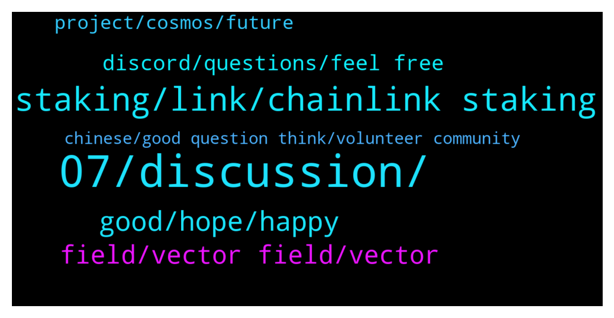

# **@chainlinkofficial**
 ## Analysis for **2022-01-06** - **2022-01-07**.

---

## 📊 **Basic Stats**

**n_messages_sent**: 128

---

---

## 🔝 **Top keywords and related messages**

1. **07, discussion, **

    @Kim --- *How can I invest chainlink please* **--->** [TG Discussion](https://t.me/chainlinkofficial/360919)

    @ich_bin_ej --- *Hello! I'd like to ask if asking for current ways to earn passive income with chainlink falles under trading/market/price discussion? If yes, I understand if my current message will be deleted. Thanks!* **--->** [TG Discussion](https://t.me/chainlinkofficial/361010)

    @proteusguy --- *Considering using Chainlink to implement bridges between various EVM chains and SmartBCH. Where can I see what are "normal" fee ranges for pricing Oracles? Also, if I am operating an Oracle, how much of the fees come to me vs going Chainlink or some other entity?* **--->** [TG Discussion](https://t.me/chainlinkofficial/360492)

    @IronMan_CH --- *When i try to run a local chainlink node, i got following error: 2022-01-07 09:55:20.292 UTC [75] ERROR:  relation "migrations" does not exist at character 16 2022-01-07 09:55:20.292 UTC [75] STATEMENT:  SELECT id FROM migrations 2022-01-07 09:55:20.296 UTC [75] ERROR:  relation "goose_migrations" does not exist at character 36 2022-01-07 09:55:20.296 UTC [75] STATEMENT:  SELECT version_id, is_applied from goose_migrations ORDER BY id DESC 2022-01-07 09:57:07.392 UTC [81] ERROR:  relation "migrations" does not exist at character 16 2022-01-07 09:57:07.392 UTC [81] STATEMENT:  SELECT id FROM migrations  Anything missing from the doc ? appreciate for any help.* **--->** [TG Discussion](https://t.me/chainlinkofficial/360966)

    @IronMan_CH --- *I can't register & login on chainlink's website. I didn't receive a validation email, anyone can help ?* **--->** [TG Discussion](https://t.me/chainlinkofficial/360891)

    @Sylvarantt --- *Hi @vovantan123, LinkPool is a separate entity from Chainlink Labs. They are a Chainlink node operator and Chainlink developer team building platforms and services such as https://market.link and https://naas.link   Their aim is to lower the technical barriers to participate in the Chainlink ecosystem in different ways. I strongly suggest reaching them out in their own telegram @linkpoolio* **--->** [TG Discussion](https://t.me/chainlinkofficial/361102)

2. **staking, link, chainlink staking**

    @Crypto_Banana --- *Is it true that staking link will be available in the future? (Scammers, dont bother dm me)* **--->** [TG Discussion](https://t.me/chainlinkofficial/360403)

    @Kokenyesi --- *Hi guys, any dates about staking announced? More than a year is gone & I still hear ‘soon’, but atleast now Sergey called it it will be in 2022 Do we have atleast which quarters now? 2022 Q3? Q4? Maybe late Q2? If staking would come in next months we would been able to see more data on githube in the staking documents, so I guess it will come probably around june or july if no delays? I am fine with that, atleast we securly know it comes in 2022* **--->** [TG Discussion](https://t.me/chainlinkofficial/360736)

    @marcromeron --- *Some form of staking will come out this year per Sergey: https://www.youtube.com/watch?v=YShbzR7mlog* **--->** [TG Discussion](https://t.me/chainlinkofficial/360939)

    @harrumphharrumph --- *Yes. Some form of staking will come out this year per Sergey: https://www.youtube.com/watch?v=YShbzR7mlog* **--->** [TG Discussion](https://t.me/chainlinkofficial/360874)

    @FloBoss --- *Guys who knows when staking will be available ? I mean we could stake on coinbase for example?* **--->** [TG Discussion](https://t.me/chainlinkofficial/360990)

    @vovantan123 --- *Is this the official site of Chainlink?: staking. linkpool. io* **--->** [TG Discussion](https://t.me/chainlinkofficial/361094)

3. **good, hope, happy**

    @JJ_D_RZ --- *Good morning, afternoon or evening everyone I hope you have a wonderful one 🤩* **--->** [TG Discussion](https://t.me/chainlinkofficial/361066)

    @JoshSimenhoff --- *Hey, what's up Rudy! Happy Friday 👋* **--->** [TG Discussion](https://t.me/chainlinkofficial/361073)

    @Kenduvik --- *I am happy to be here* **--->** [TG Discussion](https://t.me/chainlinkofficial/360421)

    @Joypokkamol --- *Hi everyone! 👋 We will have an AMA today, don’t miss out! https://twitter.com/sosojoystory/status/1479014562422734849?s=20* **--->** [TG Discussion](https://t.me/chainlinkofficial/360562)

    @Joypokkamol --- *Hi everyone, please be ready in 15 minutes!* **--->** [TG Discussion](https://t.me/chainlinkofficial/360640)

    @Nnadjak --- *Hi everyone. I'm New here hope I'm welcome.* **--->** [TG Discussion](https://t.me/chainlinkofficial/360455)

4. **field, vector field, vector**

    @joey_roth --- *So Vector Field is my way of exploring this materiality that blockchain affords. It’s the foundation of the dynamic (changing after mint based on real-time data feeds) on-chain art that I’m working on now* **--->** [TG Discussion](https://t.me/chainlinkofficial/360666)

    @Joypokkamol --- *In just a few moments, we will have a Community Q&A with Vector Field who recently announced that it integrates Chainlink VRF to Deliver Secure Randomness for On-Chain Materiality in NFTs. https://twitter.com/chainlink/status/1478410899727785993?s=20* **--->** [TG Discussion](https://t.me/chainlinkofficial/360643)

    @Linkederic --- *Reposting for you Joey:  "Hi, thanks for having me! I'm Joey Roth. I've spent the last decade + designing and launching hardware products, interspersed with startups and letterpress prints.   Some of my designs: Sorapot teapot, Ceramic Speakers, a wearable survival compass, a stovetop espresso pot for Blue Bottle, and most recently another coffee device that uses acoustic cavitation instead of heat to extract cold espresso, called Osma: https://drinkosma.com  No technology since 3d printing has captured my obsession like the blockchain. It feels like a physical material with all the benefits of digital composability and distribution. Making work on-chain, particularly dynamic NFTs that visually represent data from oracle feeds, has been my focus for the last 6 months.   My first project was on Solana using a readymade Metaplex contract: https://generativeminimalism.com  The current project (officially launched today) is a more intense deep-dive into Solidity and on-chain generation and storage of SVGs: https://vectorfield.art  The project I'm working on now builds on what I've learned and the relationships I've made with Vector Field, and will be a dynamic series that changes post-mint based on actions taken by other members of the collector community- more on this soon."* **--->** [TG Discussion](https://t.me/chainlinkofficial/360651)

    @Joypokkamol --- *It is fascinating to see Vector Field Integrates Chainlink VRF.* **--->** [TG Discussion](https://t.me/chainlinkofficial/360668)

    @joey_roth --- *It does three main things - requests a random number from VRF, uses that number to generate svg code with boundaries for dimensions, opacity, and colors that I set, and then encodes the svg to bytes32 as the token uri* **--->** [TG Discussion](https://t.me/chainlinkofficial/360660)

    @joey_roth --- *So Vector Field is based on Patrick Collin’s on-chain svg repo* **--->** [TG Discussion](https://t.me/chainlinkofficial/360659)

5. **discord, questions, feel free**

    @proteusguy --- *Done. Thanks. (Interesting that you offer email, Telegram, and Discord as communication channels. Pretty cool.)* **--->** [TG Discussion](https://t.me/chainlinkofficial/360494)

    @marcromeron --- *Hi there, I highly recommend our Discord for deep tech questions https://chain.link/discord* **--->** [TG Discussion](https://t.me/chainlinkofficial/361001)

    @marcromeron --- *Hi there, I highly recommend to ask your question on our Discord: https://discord.gg/DfDuSDTW* **--->** [TG Discussion](https://t.me/chainlinkofficial/360968)

    @Joypokkamol --- *Website: https://vectorfield.art OpenSea: https://opensea.io/collection/vectorfield  Twitter: https://twitter.com/joeyroth Discord: https://discord.gg/cUhze929GX  Smart Contract: https://etherscan.io/address/0x816b108c0ed83528aB465c172a4B50B5E152CF22#writeContract* **--->** [TG Discussion](https://t.me/chainlinkofficial/360684)

    @joey_roth --- *If anyone has more questions feel free to pm me or hit me up on discord/ twitter* **--->** [TG Discussion](https://t.me/chainlinkofficial/360692)

    @joey_roth --- *Discord is the best place to join the community and ask questions/ get early info about new drops* **--->** [TG Discussion](https://t.me/chainlinkofficial/360683)

6. **project, cosmos, future**

    @Meggie --- *Hey!! Just had to setup a test for the students here n thereafter organize my crypto farm portfolio* **--->** [TG Discussion](https://t.me/chainlinkofficial/360972)

    @Giuseppe --- *Really? You sound like Satoshy Nakamoto with this answer thank you!* **--->** [TG Discussion](https://t.me/chainlinkofficial/361125)

    @JJ_D_RZ --- *Not much just happy to be healthy , aware and around witnessing the emergence of a project that will impact the WORLD and the people living in it for decades to come* **--->** [TG Discussion](https://t.me/chainlinkofficial/361076)

    @JoshSimenhoff --- *Creating a truth machine, providing transparency and security on chain has me pumped for sure! The future looks bright for all of us.* **--->** [TG Discussion](https://t.me/chainlinkofficial/361074)

    @AriKiry --- *Such an inspiration. Love to hear how people from different backgrounds jump into this industry to create totally new use cases. Wish you the best of luck!* **--->** [TG Discussion](https://t.me/chainlinkofficial/360696)

    @Joypokkamol --- *The new year has just begun! What’s next on your project’s roadmap that we may expect in the near future?* **--->** [TG Discussion](https://t.me/chainlinkofficial/360673)

7. **chinese, good question think, volunteer community**

    @JoshSimenhoff --- *Thank you for the offer sir but we are not currently hiring moderators. If you want to volunteer for our community you can always apply to be a Chainlink Advocate https://blog.chain.link/expanding-the-chainlink-community-advocate-program/* **--->** [TG Discussion](https://t.me/chainlinkofficial/360324)

    @Max --- *I have an AMA proposal whom I contact* **--->** [TG Discussion](https://t.me/chainlinkofficial/360320)

    @amanagarwalaa --- *Do uh need Mod for ur community ☺️☺️* **--->** [TG Discussion](https://t.me/chainlinkofficial/360312)

    @Lzj168028 --- *Hello administrator, is there a Chinese community?* **--->** [TG Discussion](https://t.me/chainlinkofficial/360858)

    @Sylvarantt --- *China has a telegram group, it’s called @chainlinkfans (unofficial) and please also feel free to check out our Chinese communities (official) here:  https://blog.chain.link/chainlink-chinese-communities/* **--->** [TG Discussion](https://t.me/chainlinkofficial/360860)

    @ceej0511 --- *Good question  I think it’s a great opportunity for our community* **--->** [TG Discussion](https://t.me/chainlinkofficial/360639)

