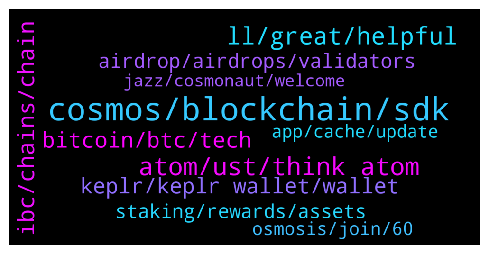

# **@cosmosproject**
 ## Analysis for **2022-01-06** - **2022-01-07**.

---

## 📊 **Basic Stats**

**n_messages_sent**: 582

---

---

## 🔝 **Top keywords and related messages**

1. **cosmos, blockchain, sdk**

    @ZoltanAtom --- *Yes,Archway is smart contract platform that rewards developers.   Join them to learn more if you are interested in;  https://discord.gg/archwayhq* **--->** [TG Discussion](https://t.me/cosmosproject/468694)

    @KellySlaterKook --- *Guys do we have any project that acts like cross chain layer 2 solution and connects ETH cosmos and other chains?* **--->** [TG Discussion](https://t.me/cosmosproject/469915)

    @DAD_DEFI --- *Why BSC not included in the Cosmos ecosystem? Its built on Cosmos SDK right?* **--->** [TG Discussion](https://t.me/cosmosproject/469404)

    @Roberto1177 --- *Correct.  Bep20 is binance smart chain, cosmos has its own network.* **--->** [TG Discussion](https://t.me/cosmosproject/468685)

    @AtomJazz --- *Trezor is not supported anywhere in cosmos afaik* **--->** [TG Discussion](https://t.me/cosmosproject/468428)

    @AtomJazz --- *Cosmos doesn't do partnerships just like BTC doesn't do partnerships* **--->** [TG Discussion](https://t.me/cosmosproject/468846)

2. **atom, ust, think atom**

    @StudentForAllMyLife --- *Comparing ATOM to ETH what is the level of ATOM decentralization?  Higher, lower and why?* **--->** [TG Discussion](https://t.me/cosmosproject/469266)

    @Tony_Smart --- *guys - sorry to be v slow but what's up with ATOM and why's it ramping? Bought some a while back and have sort of forgotten about it but now interested to know what's best to do with it. Staking etc ... any help / advice would be great if poss* **--->** [TG Discussion](https://t.me/cosmosproject/469675)

    @AtomJazz --- *ATOM is available on all major exchanges, including Coinbase, Kraken, Binance and Cryptocom* **--->** [TG Discussion](https://t.me/cosmosproject/469086)

    @Nicolejustin --- *Hey, what did you think about atom* **--->** [TG Discussion](https://t.me/cosmosproject/469965)

    @Graphicals --- *the exchange isnt banned, is more of ATOM network not being "in my area"* **--->** [TG Discussion](https://t.me/cosmosproject/469944)

    @ZoltanAtom --- *Hey,I think you can’t get Atom without any exchange. Unless if you have any assets at your exchange and swap to Atom.* **--->** [TG Discussion](https://t.me/cosmosproject/469938)

3. **ll, great, helpful**

    @tandemalphafitzy --- *Cool, I'll keep my eyes peeled for further information. I'll likely write an article on it once I feel I understand exactly where we are at with that* **--->** [TG Discussion](https://t.me/cosmosproject/468405)

    @AtomJazz --- *You'll get better answers on https://t.me/osmosis_chat directly* **--->** [TG Discussion](https://t.me/cosmosproject/469662)

    @austinrenny7 --- *Point me to the road map please. I missed that class.* **--->** [TG Discussion](https://t.me/cosmosproject/468512)

    @AtomJazz --- *You'll find more exact information for that on https://t.me/JunoNetwork* **--->** [TG Discussion](https://t.me/cosmosproject/468806)

    @TicoJohnny --- *Hopefully you got these answers in the FAQ, let me know if you have further questions* **--->** [TG Discussion](https://t.me/cosmosproject/469418)

    @Cswizzy --- *I've seen some great articles linked in here. Very level headed. Cheers* **--->** [TG Discussion](https://t.me/cosmosproject/469392)

4. **ibc, chains, chain**

    @Sephirote --- *Thanks, that's interesting.  So if I understand correctly, being IBC enabled allows for better interoperability between an IBC enabled chain (let's say Terra) and another IBC enabled chain (let's say Osmosis). In this case, devs could easily create a Dapp to move Luna tokens to Osmosis without needing a bridge?* **--->** [TG Discussion](https://t.me/cosmosproject/469446)

    @Totalspud --- *Through  ibc or does it need a bridge ?* **--->** [TG Discussion](https://t.me/cosmosproject/468353)

    @m1ndl3ss --- *i see many project not on IBC? why?* **--->** [TG Discussion](https://t.me/cosmosproject/470108)

    @Sephirote --- *Thanks for that Johny.  Reading your first link, I think the proper term is IBC enabled chains correct? IBC enabled chains refers to zones correct? Is that the same thing in the Cosmos ecosystem?* **--->** [TG Discussion](https://t.me/cosmosproject/469443)

    @ZoltanAtom --- *You might start with Cosmos official website;  https://cosmos.network/ecosystem/tokens  IBC-enabled chains are at mapofzones.com* **--->** [TG Discussion](https://t.me/cosmosproject/470104)

    @bkc1111 --- *Is there a link where I can find all the blockchain channel IDs for IBC transfer in the cosmos ecosystem? I have this link: https://medium.com/chainapsis/getting-started-with-ibc-transfers-276e9ce91e17  But I can't seem to find the channel IDs in here.* **--->** [TG Discussion](https://t.me/cosmosproject/469170)

5. **bitcoin, btc, tech**

    @Ajubile --- *What happen to the Crypto market. Bloody day.* **--->** [TG Discussion](https://t.me/cosmosproject/468665)

    @moikle --- *I have a question for anybody who knows, why do you guys pool with bitcoin? Why expose yourself to arbitrage? Ppl say its cuz bitcoin has the most dominance, but technically usdt does because its basically the american dollar.* **--->** [TG Discussion](https://t.me/cosmosproject/469285)

    @austinrenny7 --- *Bitcoin should behave ... Damn.. it's plunging the whole market.* **--->** [TG Discussion](https://t.me/cosmosproject/468322)

    @moikle --- *So what, bitcoin is a mad old lady. Usdt is fine* **--->** [TG Discussion](https://t.me/cosmosproject/468328)

    @TicoJohnny --- *We don't have pools with bitcoin or USDT, whatcha talkin about* **--->** [TG Discussion](https://t.me/cosmosproject/469286)

    @not a name --- *Bitcoin tanked.  That's what happened lol* **--->** [TG Discussion](https://t.me/cosmosproject/468689)

6. **keplr, keplr wallet, wallet**

    @comingla --- *How can I send Ust from keplr to terra station?* **--->** [TG Discussion](https://t.me/cosmosproject/469221)

    @Irontigerr --- *I want to add tokens to keplr but i dont have the add token button on the menu* **--->** [TG Discussion](https://t.me/cosmosproject/469865)

    @Vasko --- *Anyone know how to fix kepl mobile* **--->** [TG Discussion](https://t.me/cosmosproject/468940)

    @AtomJazz --- *Trezor is not connectable to Keplr* **--->** [TG Discussion](https://t.me/cosmosproject/468434)

    @AtomJazz --- *Click on tokens tab then dvpn and IBC send to Sentinel chain* **--->** [TG Discussion](https://t.me/cosmosproject/469787)

    @Stan --- *Can i transfer my atom from Binance to Keplr* **--->** [TG Discussion](https://t.me/cosmosproject/469593)

7. **airdrop, airdrops, validators**

    @AtomJazz --- *One thing is tho that some airdrops are excluding 0% commission validators. Desmos, Evmos, Shade comes to mind* **--->** [TG Discussion](https://t.me/cosmosproject/468761)

    @ZoltanAtom --- *Each projects have their own rules of airdrops. I can not be certain! But many validators of delegators were excluded from airdrops. Exchange ones,validators which offers 0, also “Game and Debo validators. I can’t say top 10 or top 20 will be excluded for next one.   Also keep in mind that it’s better to separate your bags with different validators to keep decentralization safe. Top20 has %67 voting power.* **--->** [TG Discussion](https://t.me/cosmosproject/468909)

    @ZoltanAtom --- *Hello,just stake them at Keplr or cosmotation. That’s all. Also join airdrop community channel.   https://t.me/CosmosAirdrops* **--->** [TG Discussion](https://t.me/cosmosproject/469579)

    @trotskiiiiiy --- *Hello! How to get an airdrop by staking atom and scrt?* **--->** [TG Discussion](https://t.me/cosmosproject/469577)

    @TicoJohnny --- *Uhm, also some people have been putting airdrop limits on some things.* **--->** [TG Discussion](https://t.me/cosmosproject/468619)

    @matthew4you --- *Cause I heard no airdrop for their tokens* **--->** [TG Discussion](https://t.me/cosmosproject/470000)

8. **staking, rewards, assets**

    @AtomJazz --- *We will have more details on this when we get closer to the launch of Interchain staking. Hard to tell or speculate on this atm* **--->** [TG Discussion](https://t.me/cosmosproject/468375)

    @badcapitan02 --- *staking in cosmosation do not need to comession?* **--->** [TG Discussion](https://t.me/cosmosproject/468980)

    @ed_10000 --- *Do we know what proportion of rewards we get from interchain staking? For example if I stake 100 dollars of atom and the validator also secures akash, do I get rewards for 100 dollars worth of akash too, or for some other amount of akash?* **--->** [TG Discussion](https://t.me/cosmosproject/468373)

    @MPLD35 --- *If so maybe I should choose SG-1* **--->** [TG Discussion](https://t.me/cosmosproject/468763)

    @AGoodProject --- *Using ATOM for loan collateral......  What is the staking % ? Is there anything I can read about staking?* **--->** [TG Discussion](https://t.me/cosmosproject/469769)

    @Pastashooter105 --- *Yes. I started staking SCRT. My ATOM is still on Coinbase b/c they are ERC-20. However I am irritated that Ledger Nano X produces different account addresses on Keplr vs Terra Station. I guess it’s the different derivation paths.* **--->** [TG Discussion](https://t.me/cosmosproject/468879)

9. **osmosis, join, 60**

    @Ian --- *I can’t believe how seemless osmosis is* **--->** [TG Discussion](https://t.me/cosmosproject/469167)

    @nicholasds --- *Guys, where can i stake on Osmosis?* **--->** [TG Discussion](https://t.me/cosmosproject/469979)

    @AtomJazz --- *A lot of it is pooled on Osmosis* **--->** [TG Discussion](https://t.me/cosmosproject/469046)

    @AtomJazz --- *Sure I think so. Once you have Cosmostation open go to Osmosis and click on defi lab* **--->** [TG Discussion](https://t.me/cosmosproject/469658)

    @TicoJohnny --- *Osmosis has a good tutorial here: https://t.me/osmosis_chat/405529* **--->** [TG Discussion](https://t.me/cosmosproject/469222)

    @zoran --- *Hello is there an atom ust pool in osmosis?* **--->** [TG Discussion](https://t.me/cosmosproject/468466)

10. **app, cache, update**

    @TicoJohnny --- *first try a cache reset with ctrl + shift + r* **--->** [TG Discussion](https://t.me/cosmosproject/469339)

    @Vasko --- *been a couple of days and it still doesnt open* **--->** [TG Discussion](https://t.me/cosmosproject/468941)

    @Cordtus --- *If it's already updated then try maybe clearing the app cache or reinstalling entirely* **--->** [TG Discussion](https://t.me/cosmosproject/468949)

    @BenjaminShannon --- *It's up to date. Will try the reinstall route.* **--->** [TG Discussion](https://t.me/cosmosproject/469217)

    @Cordtus --- *That's a long time... Did you reinstall it? Or check for updates that may have not auto downloaded* **--->** [TG Discussion](https://t.me/cosmosproject/469214)

    @ZoltanAtom --- *Mine works without a problem. I don’t think there is any fix solution. Just check if there is an update.* **--->** [TG Discussion](https://t.me/cosmosproject/468942)

