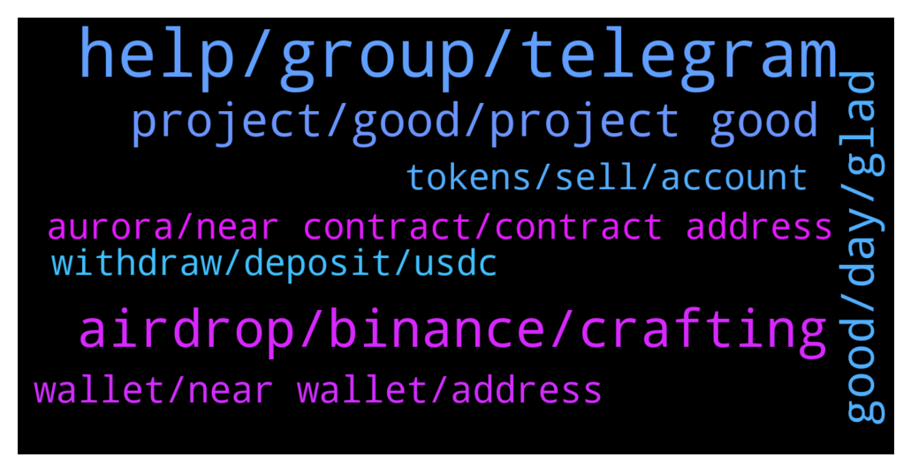

# **@cryptonear**
 ## Analysis for **2022-01-06** - **2022-01-07**.

---

## 📊 **Basic Stats**

**n_messages_sent**: 348

---

---

## 🔝 **Top keywords and related messages**

1. **help, group, telegram**

    @murica21 --- *I answered same as my friend he got it, why i didn't get it? Whats wrong...!!! You guys are making fool..!!* **--->** [TG Discussion](https://t.me/cryptonear/275589)

    @FritzWagner --- *Me neither, no worries, they haven't made the distribution* **--->** [TG Discussion](https://t.me/cryptonear/272164)

    @kv9990 --- *Maybe you answered any question wrong :( all participants with correct answers got it ✌️* **--->** [TG Discussion](https://t.me/cryptonear/275547)

    @Stelcy_Chelsey --- *We have reported this several times, there should be a SCAM tag on that group by now!* **--->** [TG Discussion](https://t.me/cryptonear/279229)

    @badidif --- *ye i connected and swapped but i dont see it* **--->** [TG Discussion](https://t.me/cryptonear/277831)

    @FritzWagner --- *its done I believe, I received the 1,XX today* **--->** [TG Discussion](https://t.me/cryptonear/277943)

2. **airdrop, binance, crafting**

    @larry_lang --- *hehe at least the crafting finance airdrop has some benefit* **--->** [TG Discussion](https://t.me/cryptonear/274886)

    @bailey_12 --- *Hey team,   If you looking for airdrop, do join the podcast for a chance to win an airdrop bois  https://twitter.com/BaileyVu12/status/1479376715252043777* **--->** [TG Discussion](https://t.me/cryptonear/278615)

    @Takemidown --- *Is the CMC learn and earn over? I did not get any airdrop.* **--->** [TG Discussion](https://t.me/cryptonear/272142)

    @Thanhtung1919 --- *Thanks for this awesome opportunity!  I am glad to participate in the airdrop.* **--->** [TG Discussion](https://t.me/cryptonear/272768)

    @FritzWagner --- *Yep, no worries, is about the airdrop.* **--->** [TG Discussion](https://t.me/cryptonear/272505)

    @FritzWagner --- *Binance CMC airdrop finally is done* **--->** [TG Discussion](https://t.me/cryptonear/277418)

3. **project, good, project good**

    @AkatsukiRedSun --- *Near project as a whole 😁* **--->** [TG Discussion](https://t.me/cryptonear/278303)

    @xgspon --- *Best project ever and congratulations !* **--->** [TG Discussion](https://t.me/cryptonear/276478)

    @phoelann007 --- *I am really happy that i have participated to this project.* **--->** [TG Discussion](https://t.me/cryptonear/274472)

    @Qianzy182 --- *I understand about this. Do your best for this project and good luck to all* **--->** [TG Discussion](https://t.me/cryptonear/275909)

    @hecgpon --- *This project is very good, the whitepaper is also very clear!* **--->** [TG Discussion](https://t.me/cryptonear/275846)

    @conga3chan --- *I've participated in this good project. Hopefully in the future the project will be better and better.* **--->** [TG Discussion](https://t.me/cryptonear/275840)

4. **good, day, glad**

    @bailey_12 --- *Oh hey man,  My duty is on our Reddit sub recently so I am mostly there* **--->** [TG Discussion](https://t.me/cryptonear/278118)

    @bailey_12 --- *hi @Stelcy_Chelsey, long time no see.  Hope you doing all good..* **--->** [TG Discussion](https://t.me/cryptonear/279233)

    @kv9990 --- *I too used to think like this few years back =))))* **--->** [TG Discussion](https://t.me/cryptonear/275863)

    @daplek --- *How are you to day @larry_lang ?* **--->** [TG Discussion](https://t.me/cryptonear/274842)

    @FritzWagner --- *Hello, please only English here 🤘* **--->** [TG Discussion](https://t.me/cryptonear/277731)

    @Kim90s --- *Hello everyone. Happy to be here.* **--->** [TG Discussion](https://t.me/cryptonear/279180)

5. **wallet, near wallet, address**

    @badidif --- *Can some1 help me with near wallet* **--->** [TG Discussion](https://t.me/cryptonear/277813)

    @rainloving --- *Hello, is it possible to apply a multi-sig wallet on NEAR?* **--->** [TG Discussion](https://t.me/cryptonear/275283)

    @a1sunny --- *Hello  I am new here. And have near in my near wallet. I hold NEAR for long term  Can you please guide me how can i get extra benifits by near. Like Airdrops etc.  Thanks 😊* **--->** [TG Discussion](https://t.me/cryptonear/278690)

    @larry_lang --- *no, i believe only near wallet is available* **--->** [TG Discussion](https://t.me/cryptonear/275289)

    @John --- *Guys does anyone know how to transfer from NEAR WALLET ---> exchange. The wallet insists on a 64 character address but the exchanges provide deposit address with less characters. BEP20 (BSC) address - which is not 64 characters so there does not seem to be any way to transfer from NEAR Wallet to an exchange - I'm sure there's an obvious answer here but I can't see it - thanks in advance* **--->** [TG Discussion](https://t.me/cryptonear/279162)

    @larry_lang --- *if u need help in creating near account, u can seek it here https://near.org/blog/getting-started-with-the-near-wallet/* **--->** [TG Discussion](https://t.me/cryptonear/278168)

6. **tokens, sell, account**

    @larry_lang --- *u have to left 2 NEAR in the account that u wanna sell* **--->** [TG Discussion](https://t.me/cryptonear/278041)

    @ArbzKendz --- *Why can’t I sell ? I got the tokens on the balance. Tried everything* **--->** [TG Discussion](https://t.me/cryptonear/278035)

    @ArbzKendz --- *I have 2. Will I get the 2 coins back after the sale ?* **--->** [TG Discussion](https://t.me/cryptonear/278044)

    @kv9990 --- *In the account u wanna sale* **--->** [TG Discussion](https://t.me/cryptonear/278046)

    @ArbzKendz --- *It’s 32 usd lol. I hope I get them back. Anyone can confirm ?* **--->** [TG Discussion](https://t.me/cryptonear/278066)

    @ArbzKendz --- *and will I get the tokens back ?* **--->** [TG Discussion](https://t.me/cryptonear/278056)

7. **withdraw, deposit, usdc**

    @John --- *@rahulgoel007 @NEARverse_xd Guys - in ref.finance - can you 1) deposit Near (receive wNear) 2) Swap wNear for USDC ---> it looks like you can from the UI - but then how would you withdraw that USDC ?* **--->** [TG Discussion](https://t.me/cryptonear/279192)

    @NEARverse_xd --- *Withdraw from where? If you wanna withdraw to your bank then you need to transfer it to CEX and then you can sell your stablecoin. There is no other option* **--->** [TG Discussion](https://t.me/cryptonear/279197)

    @SamuelOwen8 --- *What am trying to say is that how can I withdraw to my trust wallet account* **--->** [TG Discussion](https://t.me/cryptonear/279048)

    @kv9990 --- *Withdraw from deposit page, there's a button* **--->** [TG Discussion](https://t.me/cryptonear/277832)

    @John --- *let's say you want to swap wNEAR to USDC - is there an option to transfer that USDC to an exchange from ref.finance?* **--->** [TG Discussion](https://t.me/cryptonear/279199)

    @rahulgoel007 --- *You can get the transaction from https://explorer.mainnet.near.org/ but haven't tried to download that in CSV  @larry_lang @Kripto_Raptor* **--->** [TG Discussion](https://t.me/cryptonear/278903)

