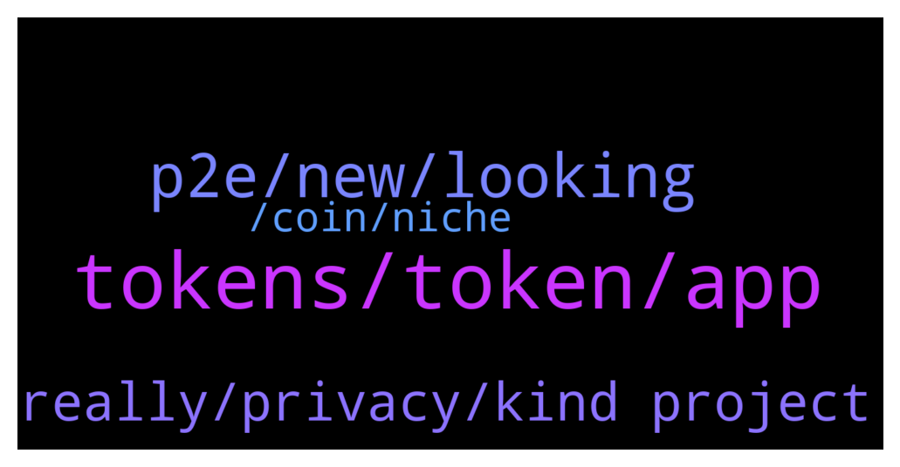

# **@defisearchpublic**
 ## Analysis for **2022-01-05** - **2022-01-07**.

---

## 📊 **Basic Stats**

**n_messages_sent**: 83

---

---

## 🔝 **Top keywords and related messages**

1. **tokens, token, app**

    @mikaztirf --- *project offers staking and a token rewards of every bet* **--->** [TG Discussion](https://t.me/defisearchpublic/240912)

    @mikaztirf --- *those tokens you earn can be stake to participate the governance in the future* **--->** [TG Discussion](https://t.me/defisearchpublic/240922)

    @GioFlorin --- *what do you mean token rewards?* **--->** [TG Discussion](https://t.me/defisearchpublic/240913)

    @GioFlorin --- *may I know whats their token first?* **--->** [TG Discussion](https://t.me/defisearchpublic/240929)

    @dionieP --- *ohh great! and how much tokens are we getting on every bet?* **--->** [TG Discussion](https://t.me/defisearchpublic/240930)

    @danizsw --- *it is where you can create your tokens and have the latest news of tokens to be listed* **--->** [TG Discussion](https://t.me/defisearchpublic/240958)

2. **p2e, new, looking**

    @purestofpure --- *new blockchain releasing its q1 in the next 3 months* **--->** [TG Discussion](https://t.me/defisearchpublic/240967)

    @mykillandgelo --- *new game turn base p2e, ROI isn't that big but looks good since its freshly released* **--->** [TG Discussion](https://t.me/defisearchpublic/240963)

    @danizsw --- *can you tell me the difference about 2.0 and 3.0?* **--->** [TG Discussion](https://t.me/defisearchpublic/240981)

    @mykillandgelo --- *what are you spotting right now?* **--->** [TG Discussion](https://t.me/defisearchpublic/240960)

    @jwongjts --- *yup what p2e you're playing right now?* **--->** [TG Discussion](https://t.me/defisearchpublic/240902)

    @GioFlorin --- *what kind of p2e youre looking my friend?* **--->** [TG Discussion](https://t.me/defisearchpublic/240898)

3. **really, privacy, kind project**

    @danizsw --- *what kind of project is this?* **--->** [TG Discussion](https://t.me/defisearchpublic/240968)

    @danizsw --- *how does the project works I know its a blockchain lol* **--->** [TG Discussion](https://t.me/defisearchpublic/240973)

    @mykillandgelo --- *this looks like a data transferring* **--->** [TG Discussion](https://t.me/defisearchpublic/240976)

    @wenmis01 --- *Really that huge. This seems a potential project for this year* **--->** [TG Discussion](https://t.me/defisearchpublic/240888)

    @jeshug01 --- *Yes. Many projects going to launch this quarter.* **--->** [TG Discussion](https://t.me/defisearchpublic/240877)

    @GioFlorin --- *ya know just to check about who trust them before I jump on their project* **--->** [TG Discussion](https://t.me/defisearchpublic/240920)

4. **, coin, niche**

    @mykillandgelo --- *new coin to invest guys suggest it now* **--->** [TG Discussion](https://t.me/defisearchpublic/240953)

    @danizsw --- *how much do I need to invest for that game?* **--->** [TG Discussion](https://t.me/defisearchpublic/240964)

    @jeshug01 --- *It's VENI. Huge total supply of 1,000,000,000* **--->** [TG Discussion](https://t.me/defisearchpublic/240887)

    @Mylesctty --- *One very good thing I have come to learn about crypto-currency is not to quickly wave a project off because of the niche the project belongs to or how poor other projects in the niche are doing, Stabila coin is by far one of the most promising projects out there now and you are entitled to do your research about that fact. Dyor on stabilastb* **--->** [TG Discussion](https://t.me/defisearchpublic/240950)

    @mikaztirf --- *yep that's right, if you're familiar of future trading* **--->** [TG Discussion](https://t.me/defisearchpublic/240916)

    @mikaztirf --- *it is made to bet the prices of crypto assets like avax* **--->** [TG Discussion](https://t.me/defisearchpublic/240911)

