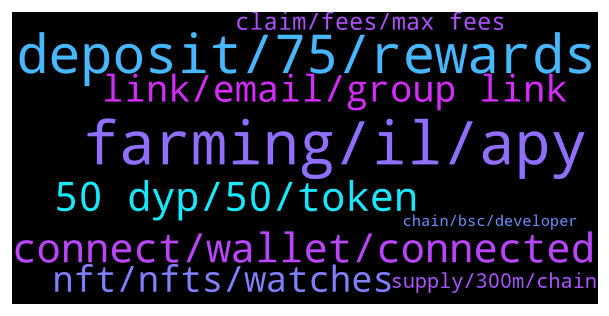

# **@dypfinance**
 ## Analysis for **2022-01-06** - **2022-01-07**.

---

## 📊 **Basic Stats**

**n_messages_sent**: 171

---

---

## 🔝 **Top keywords and related messages**

1. **farming, il, apy**

    @Nazhadi57 --- *Is there any IL for the farms?* **--->** [TG Discussion](https://t.me/dypfinance/237290)

    @shinigamikami --- *I’m in all farms too and down especially on BSC buyback(heavily down on that one) but I believe all these are in the short term* **--->** [TG Discussion](https://t.me/dypfinance/237459)

    @Craig --- *Thanks for the article. Back to my original post - what's the short description on how IL fluctuates? I have a hard time understanding why it would hit a 100% at any time and what would cause it to improve back.* **--->** [TG Discussion](https://t.me/dypfinance/237491)

    @Craig --- *We're comparing apples to oranges. I'm farming and you're staking, so different IL's taking place.* **--->** [TG Discussion](https://t.me/dypfinance/237482)

    @hemanrock --- *Usually all types Farming do have IL. here is a clear explanation about IL https://academy.binance.com/en/articles/impermanent-loss-explained it can be improved when the both assets increased* **--->** [TG Discussion](https://t.me/dypfinance/237497)

    @Craig --- *I see the option - what's the difference between this and farming, basically?* **--->** [TG Discussion](https://t.me/dypfinance/237480)

2. **deposit, 75, rewards**

    @danasocial --- *i think i don't understand, 60 days ago i deposited 9 avax and 1100 DYP for an equivalent of 91LP, now the contract is expired and i withdraw and in my wallet are returned...32dyp? What's happened? i don't understand* **--->** [TG Discussion](https://t.me/dypfinance/237235)

    @shinigamikami --- *Give it time mate, you’re not that down due to the rewards and IL is only temporary. My $6k deposit on bsc buyback peaked $19k now it’s barley $1500 but I’m not really bothered cause I plan to leave it there for at least 5 months* **--->** [TG Discussion](https://t.me/dypfinance/237472)

    @shinigamikami --- *No, I was talking about a different product “BUYBACK” there your deposit is used to buy 75% iDYP and 25% DYP and they’re staked* **--->** [TG Discussion](https://t.me/dypfinance/237486)

    @Nazhadi57 --- *Hi, can I ask if I deposit my token (eg AVAX) in farms and withdraw later, will I still get back the same token or some will be converted to DYP?* **--->** [TG Discussion](https://t.me/dypfinance/237282)

    @Nazhadi57 --- *So 25% of my deposit is converted to DYP? I can’t get back 100% AVAX?* **--->** [TG Discussion](https://t.me/dypfinance/237285)

    @Craig --- *You said the value is now $1500 and your deposit was $6K. That's a 75% drop.* **--->** [TG Discussion](https://t.me/dypfinance/237492)

3. **connect, wallet, connected**

    @Laurentoni --- *I got an issue  Any help team here Or admin Please* **--->** [TG Discussion](https://t.me/dypfinance/237314)

    @hemanrock --- *Please make sure you are well connected to right Wall and right network.* **--->** [TG Discussion](https://t.me/dypfinance/237450)

    @Aliceasdf --- *Why can't I always connect when I link my wallet?* **--->** [TG Discussion](https://t.me/dypfinance/237618)

    @Aliceasdf --- *But what should I do if I can't connect to the wallet* **--->** [TG Discussion](https://t.me/dypfinance/237622)

    @fightinamish --- *Got it reinvested, thank you.  It does a weird thing (especially on iPhone) where you click idyp allocation and it goes to the page for 1-2 seconds and then snaps back to connect wallet.  I can access everything on site through my phone except for idyp.  Then on mac I can get it to work but after multiple attempts.  Nothing major, just an fyi* **--->** [TG Discussion](https://t.me/dypfinance/237452)

    @fightinamish --- *Idyp allocation page isn’t working on my desktop (won’t load, unable to see balance or reinvest).  Any work being done internally?* **--->** [TG Discussion](https://t.me/dypfinance/237449)

4. **50 dyp, 50, token**

    @DhoniMSD516 --- *To get whitelisted you need 50 DYP :)* **--->** [TG Discussion](https://t.me/dypfinance/237380)

    @A --- *Besides holding 50 Dyp  What else gets us whitened* **--->** [TG Discussion](https://t.me/dypfinance/237581)

    @melodywaisted --- *How will they know that we hold at least 50 dyp I bought on KuCoin* **--->** [TG Discussion](https://t.me/dypfinance/237603)

    @Snakedancer --- *Thanks, so no dyp is required for it? Just wanted to be sure. All my dyp are staked and locked for few months* **--->** [TG Discussion](https://t.me/dypfinance/237379)

    @trader_broi --- *idyp is reward token it can go more down also... Habibi come to DYP 😅* **--->** [TG Discussion](https://t.me/dypfinance/237571)

    @hasan --- *Hi is dyp or idyp better* **--->** [TG Discussion](https://t.me/dypfinance/237181)

5. **link, email, group link**

    @Noun --- *Please provide me the group link* **--->** [TG Discussion](https://t.me/dypfinance/237677)

    @bosbesarbanget --- *is there any Indonesia community mate?* **--->** [TG Discussion](https://t.me/dypfinance/237586)

    @DhoniMSD516 --- *Hey please watch this video https://www.youtube.com/watch?v=07B5QsFqm-Q* **--->** [TG Discussion](https://t.me/dypfinance/237714)

    @Sandy0209 --- *Did you recorded the session Tyler* **--->** [TG Discussion](https://t.me/dypfinance/237563)

    @DhoniMSD516 --- *Hey nope this is only English community channel* **--->** [TG Discussion](https://t.me/dypfinance/237587)

    @hemanrock --- *Hey , please check your My stats VIEW ALL and DM me a screenshot please.* **--->** [TG Discussion](https://t.me/dypfinance/237239)

6. **nft, nfts, watches**

    @hemanrock --- *PAW has collection of 10,000 cat NFT s* **--->** [TG Discussion](https://t.me/dypfinance/237233)

    @Snakedancer --- *Question about cats nft. With what currency/token you be able to buy/mint? It says it will cost $250 but doesn’t specify…eth? Bnb? ADAX? Depends on chain? Or dyp?* **--->** [TG Discussion](https://t.me/dypfinance/237376)

    @profit984 --- *Do idyp will have any usecase regarding nft?* **--->** [TG Discussion](https://t.me/dypfinance/237351)

    @Nji_jalen --- *I saw on roadmap 2021 Q2-Q4 many progress not checklist.. I hope Q1 2022 will done all* **--->** [TG Discussion](https://t.me/dypfinance/237383)

    @iamJubi --- *#NFTGiveaway time🐱  🔥10 lucky people will get a Cats and Watches Society #NFT which starts minting on January 17, 2022👇 https://dyp.finance/nft  Enter to win: ✅Retweet ✅Tag 3 friends that loves #NFTs ✅Follow @dypfinance ✅Join https://t.me/dypfinance  #NFTCommunity #NFTdrop  👉https://twitter.com/dypfinance/status/1475805248887439360* **--->** [TG Discussion](https://t.me/dypfinance/237631)

    @Lawrence --- *When the NFTS  come out you have to buy one of them and joint the discord chat* **--->** [TG Discussion](https://t.me/dypfinance/237598)

7. **claim, fees, max fees**

    @DhoniMSD516 --- *This is from Metamask estimation and as said this is Max fees that will be charged and that is based on ETH network* **--->** [TG Discussion](https://t.me/dypfinance/237425)

    @Craig --- *This is the estimated fee to claim 386 DYP. If I click on 'claim' WETH, the estimated fee is $35. It makes no sense.* **--->** [TG Discussion](https://t.me/dypfinance/237428)

    @DhoniMSD516 --- *Try completing the transaction the actual cost will be less of what is shown the Metamask estimates max fees* **--->** [TG Discussion](https://t.me/dypfinance/237420)

    @Craig --- *It shows the same GWEI amount for both claims, but the dollar amount is 10x higher. It makes no sense.* **--->** [TG Discussion](https://t.me/dypfinance/237419)

    @Craig --- *Why is it to claim DYP rewards the amount of fees are 10x what it is to claim your underlying asset? So, if to claim WETH costs $50, to claim DYP costs $500.* **--->** [TG Discussion](https://t.me/dypfinance/237416)

    @DhoniMSD516 --- *The metamask shows Max fees the actual charge will be less, I see that ETH nework is congested the GWEI is ranging upto 200 so this might be reason* **--->** [TG Discussion](https://t.me/dypfinance/237418)

8. **supply, 300m, chain**

    @profit984 --- *but i saw in each chain theres 300m total supply* **--->** [TG Discussion](https://t.me/dypfinance/237539)

    @profit984 --- *x4 chain will be 1.2b total supply?* **--->** [TG Discussion](https://t.me/dypfinance/237537)

    @Nji_jalen --- *How many circulation and max supply?* **--->** [TG Discussion](https://t.me/dypfinance/237349)

    @iamJubi --- *Cmc reflects datas, including total supply in ALL chains. https://coinmarketcap.com/currencies/idefiyieldprotocol/* **--->** [TG Discussion](https://t.me/dypfinance/237548)

    @DhoniMSD516 --- *DYP Circulation supply is 18,704,944 Max Supply is ~25M https://coinmarketcap.com/currencies/defi-yield-protocol/* **--->** [TG Discussion](https://t.me/dypfinance/237350)

    @iamJubi --- *As I said reflected by data sites as 300m in every chain but the supply is not 300m supply for each chain.* **--->** [TG Discussion](https://t.me/dypfinance/237547)

9. **chain, bsc, developer**

    @mohammadnickeghbal --- *I new in group , how can earn income from defi  daily ? Can guide  me , thanks* **--->** [TG Discussion](https://t.me/dypfinance/237701)

    @DhoniMSD516 --- *You can buy with. ETH on ETH chain BNB on BSC chain AVAX on AVAX chain* **--->** [TG Discussion](https://t.me/dypfinance/237378)

    @SF0071 --- *Hello, there.  I am a fullstack developer and have a lot of experience in web development and blockchain projects(Defi/NFT/Metaverse/Solana). Is there anyone who can engage me in a developer position?* **--->** [TG Discussion](https://t.me/dypfinance/237444)

    @hemanrock --- *for BSC, https://dyp.finance/farmv2/bsc you need is to deposit one of the supported assets (WBNB, BTCB, ETH, BUSD, or CAKE) and earn WBNB/ETH/DYP as rewards.  you can check more from here https://www.youtube.com/watch?v=2pOUmRTMN1o&t=304s* **--->** [TG Discussion](https://t.me/dypfinance/237191)

    @hemanrock --- *Stake is available on three chain ETH/BSC/AVAX only DYP can be staked https://dyp.finance/stakev2 please check this video tutorial https://www.youtube.com/watch?v=sYkoxGbpBi4* **--->** [TG Discussion](https://t.me/dypfinance/237189)

