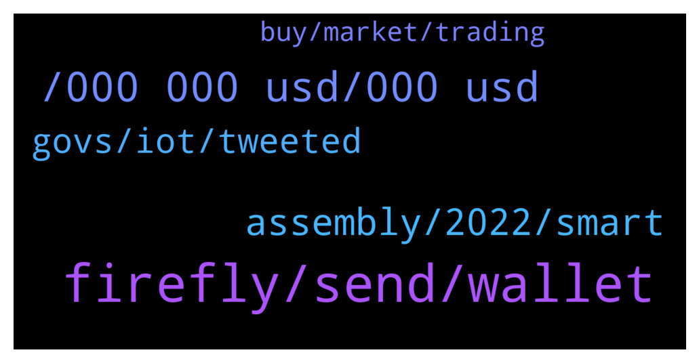

# **@iotatangle**
 ## Analysis for **2022-01-06** - **2022-01-07**.

---

## 📊 **Basic Stats**

**n_messages_sent**: 93

---

---

## 🔝 **Top keywords and related messages**

1. **firefly, send, wallet**

    @Rrbok88 --- *can see it by transaction in my wallet* **--->** [TG Discussion](https://t.me/iotatangle/306064)

    @Rrbok88 --- *send tokens to my adress can see it in transactions but not count in my wallet* **--->** [TG Discussion](https://t.me/iotatangle/306061)

    @Darius --- *Thanks I did it already but doesn't find it* **--->** [TG Discussion](https://t.me/iotatangle/306048)

    @L --- *Can somebody tell me what I can do more than changing the available nodes in firefly wallet to synchronize to the Assembly & Schimmer staking again?* **--->** [TG Discussion](https://t.me/iotatangle/305925)

    @Incog --- *It should be fine. You could try "balance finder" under advanced settings in Firefly.* **--->** [TG Discussion](https://t.me/iotatangle/306047)

    @oetrgr --- *Hi. Still problem in binance withdrawals?* **--->** [TG Discussion](https://t.me/iotatangle/305991)

2. **, 000 000 usd, 000 usd**

    @ef4ort --- *But looks like Miota is laying down her life for the two children  Shimmer and Assembly .  No greater Love  has a mother have . .  Lets see how that pans out* **--->** [TG Discussion](https://t.me/iotatangle/305974)

    @RevNine --- *Hyyyyype i have 50mio shimmer woooo* **--->** [TG Discussion](https://t.me/iotatangle/305923)

    @Ollie --- *can I stake more IOTAs at this point (albeit for lesser rates than originally)?* **--->** [TG Discussion](https://t.me/iotatangle/306149)

    @iam_anihnuella --- *What price are we expecting for the shimmer and asm token* **--->** [TG Discussion](https://t.me/iotatangle/306021)

    @HolgerKoether --- *There are 2.7 Pi in total* **--->** [TG Discussion](https://t.me/iotatangle/305999)

    @lalit1414 --- *They need DEX and many IOTA meme coins with extra large community.. not gonna work out with 50k discord people where 90% already don’t check anything..   They need crazy promotion (paid promotion) Nothing comes for free..  pay for listing or get ignored* **--->** [TG Discussion](https://t.me/iotatangle/305971)

3. **assembly, 2022, smart**

    @Toby --- *Any updates on when smart contracts will begin deploying on Assembly?* **--->** [TG Discussion](https://t.me/iotatangle/305947)

    @Toby --- *Thanks man. I am not concerned about a run. If there are good dapps on the protocol, it will attract value. We just need updates on those* **--->** [TG Discussion](https://t.me/iotatangle/305969)

    @Alex --- *Hello guys. Do you know approximately when IOTA 2.0 and smart contracts? During 2022 or 2023? Thank you* **--->** [TG Discussion](https://t.me/iotatangle/306016)

    @lalit1414 --- *It will take 4 years all together to finish everything bro..* **--->** [TG Discussion](https://t.me/iotatangle/305962)

    @PiernasLocas --- *Yes 2 years more announced in the assembly network* **--->** [TG Discussion](https://t.me/iotatangle/306157)

    @Papa_Moose --- *Devnet is set to be released Q1 2022* **--->** [TG Discussion](https://t.me/iotatangle/306017)

4. **govs, iot, tweeted**

    @Sepblu_Kyqp9lBblu --- *Guys, can you tell me if this is an admin? - IOTA Tech Support Agent* **--->** [TG Discussion](https://t.me/iotatangle/306134)

    @Basti --- *Govs 🎈Govs.io (@govs_io) Tweeted: The Iota America’s group will be having our team lead discuss the Govs protocol and project efforts. 🇺🇸  Learn about the team and vision behind the effort. Join us.   Host | @gregmart  Where | @iota discord  Time | @ 6pm PST / 9pm EST https://t.co/uTk7CX12jN https://twitter.com/govs_io/status/1478806704137678856?s=20* **--->** [TG Discussion](https://t.me/iotatangle/306012)

    @Basti --- *Govs 🎈Govs.io (@govs_io) Tweeted: 📸 of @airlyorg sensor deployed for a forward thinking organizations on Govs protocol.   We are spinning up #Iota nodes and testing pulling data for deployed sensors.   Don’t worry, when we are ready all early adopters and Discord member will be the first to know. https://t.co/AqG0oZjIDr https://twitter.com/govs_io/status/1478871648120025088?s=20* **--->** [TG Discussion](https://t.me/iotatangle/306010)

    @Basti --- *Machine Learning (@machinelearnflx) Tweeted: Metal Pay welcomes IOTA to our Marketplace https://t.co/PsWtVJIyol  #Iot https://twitter.com/machinelearnflx/status/1479067087641452545?s=20* **--->** [TG Discussion](https://t.me/iotatangle/306009)

    @everyday_burns_a_hole_in_my_soul --- *Like how i understend it now . That iota is just security and optimisation stuff  mainly for iot projects.* **--->** [TG Discussion](https://t.me/iotatangle/306167)

    @StefanoDellaValle --- *Thanks Holger. Yes, I've been too synthetic. I was referring to the shimmer network at the end of the deployment, or in other world, before to launch IOTA 2.0* **--->** [TG Discussion](https://t.me/iotatangle/306005)

5. **buy, market, trading**

    @Anna --- *It's time to change your trading strategy and learn something that will deliver steady long-term returns in the face of unknown market changes. When the market dives, you can easily be exposed to hedging risks.* **--->** [TG Discussion](https://t.me/iotatangle/306137)

    @ElmettS96 --- *Same opinion, in this group there are too many people that want to make profit and to be rich as soon as possible without thinking, instead of thinking to a real utility of a token in long time (and accumulate it in this situation) they are influenced by the price and by the rumors of the cryptospace and buy whatever shitcoin people told them to buy (and usually their fund sunks)... TIME PEOPLE TIME* **--->** [TG Discussion](https://t.me/iotatangle/306100)

    @potatooe --- *Please go to @iotatrader for this type of discussion. This channel is not for trading or price related talk* **--->** [TG Discussion](https://t.me/iotatangle/306139)

    @baskinbeagle --- *It can go down more but the underlying technology and projects remain the same. If you believe and wanna support the team then just buy the dip based on indicators.* **--->** [TG Discussion](https://t.me/iotatangle/306103)

    @lmaooooooffffff --- *If investing in Crypto is too Volatile for you, maybe you should go to stocks.* **--->** [TG Discussion](https://t.me/iotatangle/306006)

    @chenlin99 --- *The market is not good lately, will we tide over the difficulties?* **--->** [TG Discussion](https://t.me/iotatangle/306102)

