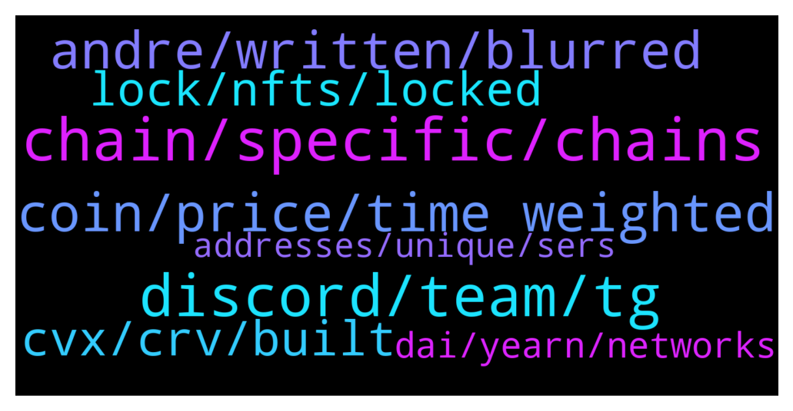

# **@lobsters_chat**
 ## Analysis for **2022-01-06** - **2022-01-07**.

---

## 📊 **Basic Stats**

**n_messages_sent**: 344

---

---

## 🔝 **Top keywords and related messages**

1. **chain, specific, chains**

    @juju1234534 --- *Any Cosmos/Polkadot (Substrate) people here? Do these give you more flexibility for building an app specific chain? Or are all Cosmos/para chains also using the same execution clients? (With the customization not going beyond basic parameters such as block size/time etc?)* **--->** [TG Discussion](https://t.me/lobsters_chat/313359)

    @enderwiggins1 --- *Okay, noob question: Can't you just make an eternal adapter in chainlink and peg to that? I guess the question is how much can you trust that one api endpoint chainlink is calling.* **--->** [TG Discussion](https://t.me/lobsters_chat/313402)

    @rahemanAli --- *yeah but anyswap/multichain has about 6B$ in TVL, which means it can support large volume cross-chain swaps which is v cool and hard to compete with.* **--->** [TG Discussion](https://t.me/lobsters_chat/313423)

    @strategyofconflict --- *depends kinda on what you want; spinning up a subnet is very easy if you want to re-use their evm/avm environments, if you want to use a different vm the article you'd want for starters is https://docs.avax.network/build/tutorials/platform/subnets/create-a-virtual-machine-vm / it's basically an interface that you need to implement* **--->** [TG Discussion](https://t.me/lobsters_chat/313354)

    @juju1234534 --- *Does Avalanche have something similar to Cosmos/Substrate for their subnets? I.e. an easy and fast way to build compatible chains (application specific chains etc.)  Please more elaborate answers than „yes“ 😉  PS: I guess they don’t since Avalanche itself is just a gETH copy essentially and only their consensus design is custom. Or maybe I’m overestimating the power of something like substrate and in reality each substrate chain is effectively the same execution client as well (and customizability is only for basic parameters such as block size and block time etc.?)* **--->** [TG Discussion](https://t.me/lobsters_chat/313350)

    @paul_aaa --- *Where could one find some sort of primer detailing the pros and cons between Synapse, Celer (cbridge), Anyswap/Multiswap, XPollinate/Connext, etc... by any chance* **--->** [TG Discussion](https://t.me/lobsters_chat/313485)

2. **discord, team, tg**

    @enzosbo --- *Only seems to work for this group for me* **--->** [TG Discussion](https://t.me/lobsters_chat/313301)

    @Sunny --- *their TG is bad, they use zendesk* **--->** [TG Discussion](https://t.me/lobsters_chat/313501)

    @arncarr --- *My funds are stuck there. I kyced and still haven't been able to get help.* **--->** [TG Discussion](https://t.me/lobsters_chat/313036)

    @arncarr --- *Anyone have contacts from Kucoin here?* **--->** [TG Discussion](https://t.me/lobsters_chat/313033)

    @paul_aaa --- *tks, 1kx coming to the rescue ^^* **--->** [TG Discussion](https://t.me/lobsters_chat/313491)

    @RobAnon --- *Just run try/catch on it 🤷‍♂️* **--->** [TG Discussion](https://t.me/lobsters_chat/313367)

3. **coin, price, time weighted**

    @iuriivv --- *Hi, guys. I am thinking about relatively stable coin which represents time weighted changes in Bitcoin price. Or whatever assets. I think projects like synthetics can do this. So having time interval is long enough we can have a coin which is stable same as FIAT currencies relative to goods prices. The problem to solve here is to have a stable coin without USD and other fiat currencies addiction.    Do you see any problems designing it? #tws* **--->** [TG Discussion](https://t.me/lobsters_chat/313392)

    @iuriivv --- *The question is not about which asset to choose but how to make the peg time weighted.* **--->** [TG Discussion](https://t.me/lobsters_chat/313399)

    @iuriivv --- *The problem of oracles is clear and I don't have questions about it. For me the question is how we can ensure that users will trade it according to the value.  With USD there is now problem, because you just create a pair on curve and you clearly see the demand and you can control the value. If the price  is a timeweighted value of an assets it is might be more difficult to control the market.   What do you think about this point?* **--->** [TG Discussion](https://t.me/lobsters_chat/313406)

    @ivangbi --- *-> time weighted changes in Bitcoin price Wdym, or asking for oracle manipulations?* **--->** [TG Discussion](https://t.me/lobsters_chat/313394)

    @ivangbi --- *I had a dream about calculating APYs and figuring out what to LP in order to get the highest @andrecronje coin return. My smol brain even made up a new curve-like UI which was somewhat light green with big font numbers, which I stared at  looking for the best strategy. I need a doctor ://* **--->** [TG Discussion](https://t.me/lobsters_chat/313377)

    @anisopteran --- *just implement it exactly how maker implements dai, liquity implements lusd, etc. except use gold value instead of dollar value. of course, then you have to find people willing to short gold* **--->** [TG Discussion](https://t.me/lobsters_chat/313417)

4. **andre, written, blurred**

    @ivangbi --- *Andre is a very confusing person. He hates everyone and himself. You never know.* **--->** [TG Discussion](https://t.me/lobsters_chat/313173)

    @ivangbi --- *Andre way is fairest, if u r ok w whales and smart people taking over (u should be)* **--->** [TG Discussion](https://t.me/lobsters_chat/313120)

    @panicsold --- *"i'm just as great as him"* **--->** [TG Discussion](https://t.me/lobsters_chat/313339)

    @obaidoteth --- *Andre is the definition of chaos* **--->** [TG Discussion](https://t.me/lobsters_chat/313179)

    @panicsold --- *"i swear i can manipulate like sam"* **--->** [TG Discussion](https://t.me/lobsters_chat/313338)

    @John TG --- *Cant discriminate ppl when you hate everybody equally💪😂* **--->** [TG Discussion](https://t.me/lobsters_chat/313176)

5. **cvx, crv, built**

    @Xoheb --- *Rome wasn't built in a day... So shall the futur of france be?* **--->** [TG Discussion](https://t.me/lobsters_chat/313017)

    @kakusaan --- *Mm the idea of cvx I remember you dint like the idea* **--->** [TG Discussion](https://t.me/lobsters_chat/313161)

    @kakusaan --- *Doesn’t cvx already solve for that* **--->** [TG Discussion](https://t.me/lobsters_chat/313129)

    @kakusaan --- *Whats stopping another crv to emerge and do the same* **--->** [TG Discussion](https://t.me/lobsters_chat/313153)

    @perpetual_losses --- *Yeah but having a blue print of how Rome was built would definitely make the job easier.* **--->** [TG Discussion](https://t.me/lobsters_chat/313020)

    @vaibhavchellani --- *I learnt this while building FundMovr(https://app.fund.movr.network/)* **--->** [TG Discussion](https://t.me/lobsters_chat/313442)

6. **lock, nfts, locked**

    @SpikeSpiege1 --- *If the token is transferable then it should be tradeable though. So should be market for both. Article says locked positions work as nfts* **--->** [TG Discussion](https://t.me/lobsters_chat/313242)

    @tandeloff --- *>By tokenizing the lock position this allows a single address to own more than one lock, locks balances are cumulative and each lock contributes to the overall ve balance  Will allow for nonlinear unlock schedule, could be used for more nuanced unlocking curves packed into NFT* **--->** [TG Discussion](https://t.me/lobsters_chat/313329)

    @hosermage --- *token locks as tradeable nfts, neat* **--->** [TG Discussion](https://t.me/lobsters_chat/313212)

    @ssmccul --- *This is something I wish all ve-locks had* **--->** [TG Discussion](https://t.me/lobsters_chat/313274)

    @jiji0x --- *that’s beside the point of the article, which outlines a modified version of ve-locking* **--->** [TG Discussion](https://t.me/lobsters_chat/313196)

    @RobAnon --- *Dude, I think you'd like what my team and I have built The locks are on NFTs, and completely programmable  https://docs.revest.finance/fnft-token-locking/address-locks* **--->** [TG Discussion](https://t.me/lobsters_chat/313355)

7. **dai, yearn, networks**

    @CryptShelby --- *DAI definitely not popular outside of ETH I reckon. On the other hand MIM starts to be a one of the best alternatives out there, very good liquidity in some of the most used networks* **--->** [TG Discussion](https://t.me/lobsters_chat/313483)

    @phil_muhbags --- *Dai isn't that popular on other networks. Usually every network has a "preferred" stable coin.   Bsc: busd  Alot of the other networks: usdc (eth) tether (eth)* **--->** [TG Discussion](https://t.me/lobsters_chat/313480)

    @yukairex --- *it’s a bit strange that many bridges do not support DAI..* **--->** [TG Discussion](https://t.me/lobsters_chat/313476)

    @yukairex --- *like celer/nerve etc..dai seems not supported, for example transfer from arbitrum* **--->** [TG Discussion](https://t.me/lobsters_chat/313477)

    @kakusaan --- *Hence Yearn and stakedao are almost crying* **--->** [TG Discussion](https://t.me/lobsters_chat/313141)

    @Joel_john --- *sure, please do - you should also check the amount of innovation powerpool has done this last year on auto-rebalancing assets,* **--->** [TG Discussion](https://t.me/lobsters_chat/313109)

