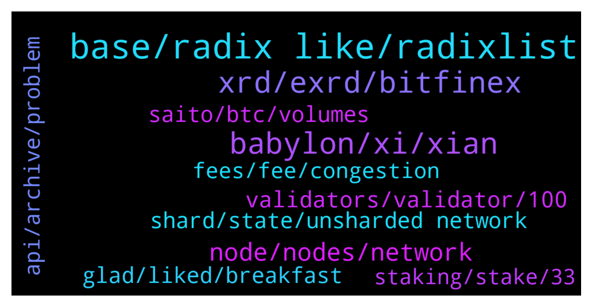

# **@radix_dlt**
 ## Analysis for **2022-01-06** - **2022-01-07**.

---

## 📊 **Basic Stats**

**n_messages_sent**: 920

---

---

## 🔝 **Top keywords and related messages**

1. **base, radix like, radixlist**

    @fpieper --- *https://ces.tech/Innovation-Awards/Honorees/2022/Honorees/R/RadiX-AXE6600.aspx RadiX got an innovations award on CES 🔥🤟* **--->** [TG Discussion](https://t.me/radix_dlt/334998)

    @Kansuler --- *Agreed! It's a feature on the roadmap. Unfortunately my time is lacking currently. But we're looking for more Devs that want to help moving radixlist to the next level!* **--->** [TG Discussion](https://t.me/radix_dlt/334772)

    @Adam_XRD --- *Another busy day in progress at CES. So much interest in leaning about Radix!* **--->** [TG Discussion](https://t.me/radix_dlt/335123)

    @Avaunt --- *Wen Radix Tesla colour changing paint job?! https://twitter.com/SadlyItsBradley/status/1478853751091843072* **--->** [TG Discussion](https://t.me/radix_dlt/335082)

    @Alex --- *https://instagram.com/radixdlt_updates?r=nametag  Hey everyone!  Feel free to follow my Radix Instagram page for regular updates! My goal is to spread awareness about the Radix ecosystem and grow the community in an educated manner. If you have any interesting news to post, I would be happy if you contact me, to post something about it! (Related to Radix or a new project of the ecosystem) Wishing you all a great day and let’s go🙌* **--->** [TG Discussion](https://t.me/radix_dlt/335443)

    @Cpt_Charles --- *I think this article in Radix knowledge base covers it well  https://learn.radixdlt.com/article/what-is-sharding* **--->** [TG Discussion](https://t.me/radix_dlt/334557)

2. **xrd, exrd, bitfinex**

    @AfterWave2 --- *Right now you cannot buy XRD in the US (without VPN). Yes you can get EXRD and use instabridge, but its one-way and there is no way back so the US market is stuck with Eth wrapped and fees, can't stake, or is faced with a rug-pull like situation where they can't sell their XRD. I suspect that once this is resloved, US influencers may start to open up.* **--->** [TG Discussion](https://t.me/radix_dlt/334665)

    @Altjoe --- *why they don't list XRD ?? like kucoin has EXRD not XRD* **--->** [TG Discussion](https://t.me/radix_dlt/334842)

    @romel9002 --- *Admin please how can i send xrd from my radix wallet to bitfinex* **--->** [TG Discussion](https://t.me/radix_dlt/335018)

    @rxdufu --- *sorry for the noob question but I just installed Radix desktop wallet and am trying to transfer my EXRD from Kucoin to the wallet - but apparently the wallet adress is not ERC20. looking through FAQ now but would appreciate any advice!* **--->** [TG Discussion](https://t.me/radix_dlt/334881)

    @Radstakes --- *You can buy XRD directly at Bitfinex, or buy eXRD at any of the exchanges listed here /buy and then swap for XRD using Instabridge.io or Bitfinex's currency conversion tool* **--->** [TG Discussion](https://t.me/radix_dlt/335413)

    @Radstakes --- *No, you can't stake eXRD unfortunately. Only XRD* **--->** [TG Discussion](https://t.me/radix_dlt/335417)

3. **babylon, xi, xian**

    @Vorgesetzter --- *https://cryptonews.net/en/news/nft/2980333/  Correct me if I'm wrong, but: Polygon has about 100 TPS. So it got clogged, because that's simply not enough. Am I the only one seeing that danger for Radix with Babylon? Seems everybody in the team is working an making Scrypto a success. If that happens before Xi'an, Babylon will get clogged the same way Polygon was now. So pushing Dapps on Babylon is actually a wrong thing to do. For not getting "bad press" we would have to wait until Xi'an with that. If too many too big projects start on Babylon the whole thing could implode. Am I missing something?* **--->** [TG Discussion](https://t.me/radix_dlt/334929)

    @ahsimon --- *TLDR: I see a possible path to an early release of a "limited" release of version 1 of Xi'an before EoY 2023, but only if it is needed.  This is not a commitment by the team (which I lack the power to make) but just how I personally would manage things.  It is my guess (which could be wrong) that one of the milestones along the way to Xi'an will be a test network version that "only" supports two shard groups.  Such a milestone is work that is needed for Xi'an anyway.   If we are wildly successful after Babylon delivery, and find Babylon approaching congestion, then I believe the team can quickly pivot to productizing this as version 1 of Xi'an.  That could provide us with (a) up to 6000 validators and (b) increased (double?) TPS  throughput and (c) a "functioning" PoC that Xi'an is not paperware.* **--->** [TG Discussion](https://t.me/radix_dlt/335043)

    @Blockchain_Sail --- *Xian is supposed to launch on 2023 right? And was also wondering if now that Scrypto is live there are teams that want to build on Radix and launch as soon as Xian goes live? since scrypto still might be subjected to changes so it could withhold developers from alrady building products* **--->** [TG Discussion](https://t.me/radix_dlt/334436)

    @fpieper --- *Well, in this case it would be pure FUD, because Radix then has delivered smart contracts on mainnet - having a safe, fun and easy to use environment for developers also being 100 times faster than Cardano, 3x faster than Ethereum, 2x of Avalanche and roughly similar to other chains like Elrond, Fantom, Polkadot etc.  Also having a congested network is anything but a dead network. Yes, I agree that having Xian directly would be better (obviously) but that isn't a realistic option (even with any money and resources in the world). Babylon WILL be ready earlier.* **--->** [TG Discussion](https://t.me/radix_dlt/334947)

    @mx471 --- *Yes, Xi'an is coming in 2023, but smart contracts are coming with Babylon (later this year) and there are already some projects that want to launch then (a list of community projects is at https://radixlist.com)* **--->** [TG Discussion](https://t.me/radix_dlt/334439)

    @Vorgesetzter --- *On Polygon it seems to be ONE Dapp causing the congestion. I guess we will get one of those apps on Babylon, too.* **--->** [TG Discussion](https://t.me/radix_dlt/334942)

4. **node, nodes, network**

    @Shang En --- *I mean when I buy something in the meanwhile I become a node?* **--->** [TG Discussion](https://t.me/radix_dlt/335876)

    @Shang En --- *When I transfer will I become a node?* **--->** [TG Discussion](https://t.me/radix_dlt/335873)

    @Blockchain_Sail --- *Yes it is possible, if the mayority votes for and more then 50% of the nodes accept it it is changed and trail mining can become real. Will be needed eventually imo* **--->** [TG Discussion](https://t.me/radix_dlt/334890)

    @Shang En --- *A stupid question here, what is a node?* **--->** [TG Discussion](https://t.me/radix_dlt/335872)

    @crypt_punk --- *😶really? as i know in first stage just radix nodes can be active  i don't know how it accept new nodes* **--->** [TG Discussion](https://t.me/radix_dlt/335235)

    @Shang En --- *So basically a node is when I keep opening the radix software, I am a node? (Sorry English is not my native language.)* **--->** [TG Discussion](https://t.me/radix_dlt/335879)

5. **validators, validator, 100**

    @ahsimon --- *I for one will not delegate to a validator who runs more than one validator node if the total stake he has at risk is more than 1% of total (over all validator sets) of total stake.* **--->** [TG Discussion](https://t.me/radix_dlt/335173)

    @Shane_Larson --- *On that note, it wss reccomended that I follow the 5x5 rule.  I feel like there's lots of other validators I'd like to support, but i would no longer have my total stake divided by 5 validators.  Whats the harm in spreading across 7, or 10? (helping the overall network is my main priority)* **--->** [TG Discussion](https://t.me/radix_dlt/334539)

    @fpieper --- *Also I don't think you will be selecting each validator independently. Maybe you can define groups or another more intelligent approach.  Besides that, probably current node runners will run multiple nodes then. E.g. in Elrond it is common that one node runner is running tens or even up to 100 nodes. Therefore if we need the nodes because of adoption the emissions will have enough value to pay for the nodes.* **--->** [TG Discussion](https://t.me/radix_dlt/335172)

    @ahsimon --- *We shall find out if the value of an XRD increases at a rate that still provides adequate compensation for a validator.  Bear in mind that increases in the value of an XRD benefits all XRD holders, without the expenses of running a node.  So, I think it wise to plan for something that is directly proportional to the amount of work a validator does.* **--->** [TG Discussion](https://t.me/radix_dlt/335177)

    @chris_pica --- *It varies depending on the fee and uptime of the validator node. There's a table on https://www.radixscan.io/ValidatorTable.shtml which lists the APY for the last 30 days if you want to see the values. All around 12-13%.* **--->** [TG Discussion](https://t.me/radix_dlt/334722)

    @fpieper --- *The amount of validators and stake will be independent dimensions in Xian* **--->** [TG Discussion](https://t.me/radix_dlt/335174)

6. **saito, btc, volumes**

    @DefiYields --- *You made it too clear at first that you play for that team then tried to row back belatedly.  Given how shockingly Radix community members have been treated by Saito community in the past, you should have treaded more lightly.* **--->** [TG Discussion](https://t.me/radix_dlt/335573)

    @DefiYields --- *They literally liken technical developers to Soviet Union technocrats because Saito devs believe they have all the answers lol  It sounds like you are already deep down that rabbit hole so maybe you can’t be too subjective about it.  One thing… Saito won’t be secure *until* it has transaction volumes on the same level of ETH. But it cannot reach such volumes without security. I also find the notion that ISPs will invest in space age tech to run Saito’s blockchain just because they fixed a self-identified market failure a… bit farfetched.  Like I say, it has some interesting features and I don’t completely write them off. It would also be interesting to hear views of Radix tech team if they ever care to address it.* **--->** [TG Discussion](https://t.me/radix_dlt/335517)

    @S --- *Look can we stop talking about Saito 😂.* **--->** [TG Discussion](https://t.me/radix_dlt/335637)

    @Gustave --- *There is no point inventing the steam engine. Just solve the collective action problem and econ magic will fund nuclear rockets to attach to every horse.  That’s Saito.* **--->** [TG Discussion](https://t.me/radix_dlt/335635)

    @DefiYields --- *Read the damn paper. And take your Saito shilling elsewhere until then.* **--->** [TG Discussion](https://t.me/radix_dlt/335569)

    @S --- *Right, but you won't make money. Btw, let's drop the discussion about Saito specifically, I doubt they're gmi anyways.* **--->** [TG Discussion](https://t.me/radix_dlt/335526)

7. **glad, liked, breakfast**

    @fpieper --- *I hope you still enjoyed your breakfast 😊👌. Liked your interview with Bits Be Tripping btw 💪* **--->** [TG Discussion](https://t.me/radix_dlt/335016)

    @TyPo1 --- *Great read and very clear to understand* **--->** [TG Discussion](https://t.me/radix_dlt/335400)

    @RDBunn --- *Thank you so very kindly. Much appreciated.* **--->** [TG Discussion](https://t.me/radix_dlt/335114)

    @RDBunn --- *Thank you Ben! Very helpful as well.* **--->** [TG Discussion](https://t.me/radix_dlt/335120)

    @MattToTheMoon --- *Thanks peachy. I was hoping you would respond. I am working through the act60 stuff now.* **--->** [TG Discussion](https://t.me/radix_dlt/335749)

    @Adam_XRD --- *You got me. Eating breakfast and was like, wait what, we did?* **--->** [TG Discussion](https://t.me/radix_dlt/335010)

8. **shard, state, unsharded network**

    @DefiYields --- *Right, ok.  I find this infographic to be very helpful.  https://www.radixdlt.com/post/cerberus-infographic-series-chapter-i  Of course, you are right that in sharding the global state is not stored anywhere. But that is why you have a consensus mechanism. As far as I’m aware, Saito doesn’t have a true consensus mechanism at all so it cannot shard.* **--->** [TG Discussion](https://t.me/radix_dlt/335582)

    @S --- *What if I approve a double spend on my shard, to 2 other shards, with a malevolent consensus? They cannot verify my malevolent shard and will approve the double spend.* **--->** [TG Discussion](https://t.me/radix_dlt/335608)

    @fpieper --- *I don't think your argumentation holds up in this regard.  The core aspect is that you need 33% of global stake to attack one single shard. Meaning with more than 33% you potentially attacked the whole network. You simply can't produce invalid states in a shard without to break the same security guarantees like in an unsharded network with the same security boundaries.  Therefore arguing that "you can produce invalid shards" is not possible, because you would have successfully attacked an unsharded network then.  Attacking one shard is equally hard as attacking an unsharded network with the same 33% guarantee.* **--->** [TG Discussion](https://t.me/radix_dlt/335655)

    @Inspector_Crypto --- *And it would vary has to how many shards each shard group would cover.* **--->** [TG Discussion](https://t.me/radix_dlt/335479)

    @S --- *Look, I really hate it when people tell you to figure out what you're missing yourself. Obviously, I read the paper and didn't figure it out. If I'm asking a dumb question, fine, but then just correct me. With sharding, it is *generally* accepted that you have to accept consensus in other shards as speaking the truth. You cannot verify everything that goes on in another shard because that breaks the point of sharding* **--->** [TG Discussion](https://t.me/radix_dlt/335578)

    @Radstakes --- *I suggest reviewing chapter 6 of the infographics.  If your attempted double spend touches other shards, all nodes in the relevant shard groups would have the QCs from all other relevant shards.  Still no need for the global state to be known. https://www.radixdlt.com/post/cerberus-infographic-series-chapter-vi* **--->** [TG Discussion](https://t.me/radix_dlt/335631)

9. **fees, fee, congestion**

    @chris_pica --- *@Shane_Larson there's a handy TG bot from Emmoglu Stakery which allows you to get notified of any fee changes. See https://www.radixscan.io/EmmogluStakeryBot.shtml* **--->** [TG Discussion](https://t.me/radix_dlt/334727)

    @chris_pica --- *Yep, 500 epoch delay until any fee changes applies and max of 10% change. Fee change also shows in the explorer immediately. https://radixtalk.com/t/can-validators-increase-their-fees/164* **--->** [TG Discussion](https://t.me/radix_dlt/334726)

    @fpieper --- *Yes, you can't really fix the fees, you only can increase capacity of your network.* **--->** [TG Discussion](https://t.me/radix_dlt/335278)

    @fpieper --- *The amount of fees isn't a selling point in the end, it is just a symptom of network congestion 😂* **--->** [TG Discussion](https://t.me/radix_dlt/335269)

    @S --- *Yes. But fixing fees would never help* **--->** [TG Discussion](https://t.me/radix_dlt/335271)

    @lukit_t --- *is it any reason that your fee is 3%?* **--->** [TG Discussion](https://t.me/radix_dlt/335776)

10. **api, archive, problem**

    @crypt_punk --- *go language is great for huge req/res for network* **--->** [TG Discussion](https://t.me/radix_dlt/335296)

    @BlAzAk --- *Official node is the default node for each users.  Balances page is 1 request to get balances and 1 request for each RRI found to show the name. Every 10 seconds We released RadixCollection with 30+ different tokens. And other projects did the same.  So imagine all users (we have 830 players) with an average of 30 different tokens in their wallet doing 30 api calls every 10 seconds.  Example : 830 x 30 x 6 = 149 400 calls / minutes to the official node. It has the same effect of a DDoS attack  So it's not a problem with network, no worries. Just the wallet need to be optimized. You can use different nodes via your settings* **--->** [TG Discussion](https://t.me/radix_dlt/335246)

    @fpieper --- *Go doesn't help for the archive API, what is needed is having proper indexes on their database. (Which is done in the new version)* **--->** [TG Discussion](https://t.me/radix_dlt/335306)

    @fpieper --- *Problem isn't the language or the node implementation, but the query/indexing layer of the archive node.  But this is being fixed with the new core API and new implementation with better indexes of the gateway API (former archive node API)* **--->** [TG Discussion](https://t.me/radix_dlt/335300)

    @Mleekko --- *yesterday I confirmed that this is how it works, but turns out this is true only for the older versions of the wallet (I had v1.1.x). the new wallet (v1.2.6) cashes tokens RRIs, and loads the balances in one go. So the number of requests is much lower, but still, Archive nodes are not optimized, so the more tokens you have, the longer it takes for them to return the response* **--->** [TG Discussion](https://t.me/radix_dlt/335264)

    @BlAzAk --- *I think it's not a problem with the language, but just something we can easily fix with cache.* **--->** [TG Discussion](https://t.me/radix_dlt/335299)

