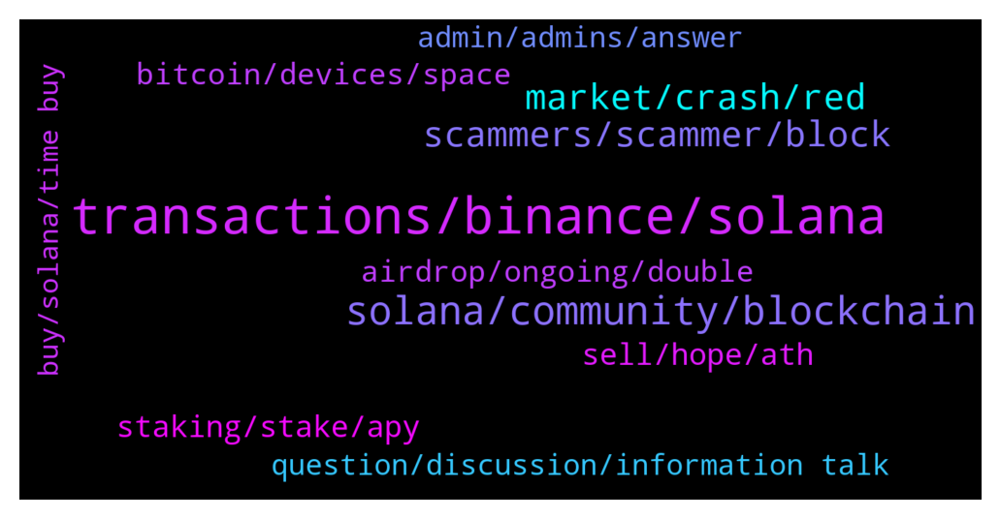

# **@solana**
 ## Analysis for **2022-01-06** - **2022-01-07**.

---

## 📊 **Basic Stats**

**n_messages_sent**: 845

---

---

## 🔝 **Top keywords and related messages**

1. **transactions, binance, solana**

    @yharma --- *is there any issue about solona chain? i cant swap my sol with usdc on raydium web site* **--->** [TG Discussion](https://t.me/solana/892489)

    @daothe --- *5Ts3ohonDCZRhWpdLZA9bM7jhdm2crDzue8JL2ZbpQjGWDUPx67bD7sHufW8a7z4pTcQS6ibg5m7RnLUNqeAoUHw  Not Found on explorer, but have on Binance.* **--->** [TG Discussion](https://t.me/solana/890937)

    @Pete --- *Why my withdrawel on Usdc to Solana not work since 12hr now also the allbridge doesn’t work to send in Solana* **--->** [TG Discussion](https://t.me/solana/891729)

    @billy1031 --- *i send usdc to my friend its still pending almost 30 min now* **--->** [TG Discussion](https://t.me/solana/892434)

    @cartier234 --- *They have not deducted the fund. Still there. And the transaction is pending* **--->** [TG Discussion](https://t.me/solana/894380)

    @kuntal1987 --- *My Solana Transactions and Swappings are failing.  I purchased 2 .sol domains a few days back worth 2 KB and 5 KB.  Could it be because of these 2 domains ?   WHY ARE ALL MY SOLANA TRANSACTIONS AND SWAPPINGS FAILING TODAY ?   Please help me out, and thus oblige.  🙏🏻-Amen-🙏🏻* **--->** [TG Discussion](https://t.me/solana/894393)

2. **solana, community, blockchain**

    @Adarsv --- *Hey, can anyone tell me how I can deploy my nft project on solana blockchain* **--->** [TG Discussion](https://t.me/solana/891425)

    @Umar --- *Plz can anyone tell me how to earn solana* **--->** [TG Discussion](https://t.me/solana/893934)

    @mahib45 --- *Hello 👋  Always do your own research! Solana is a blockchain that anyone can build on!  The latest update can be found here  https://twitter.com/Solana_Mates* **--->** [TG Discussion](https://t.me/solana/892432)

    @gabiskrt --- *is solana web3.0 really linked to ecosystem solana? if yes why are they asking for our bep20 adress* **--->** [TG Discussion](https://t.me/solana/892403)

    @mahib45 --- *Hello 👋  This is the official solana community and you may visit Solana.com to check this out!* **--->** [TG Discussion](https://t.me/solana/892996)

    @mahib45 --- *Thanks for joining here! ❤ Let's keep supporting #Solana* **--->** [TG Discussion](https://t.me/solana/892918)

3. **market, crash, red**

    @V --- *Can anyone pls letme know what are the main reason market down...hold or sell pls suggest* **--->** [TG Discussion](https://t.me/solana/891617)

    @Crypto_jolijn --- *My question is why are people so obsessed with the market moving up right now? Shouldn't it be better to want it to stay lower for longer to buy more for cheaper. The market will recover and resume the upward movement eventually so wouldn't you want to have accumulated more before that happens 🤷‍♂* **--->** [TG Discussion](https://t.me/solana/893212)

    @G3I5T --- *its crazy though because those 2 things mentioned above most retail investors dont know about* **--->** [TG Discussion](https://t.me/solana/891066)

    @Monica241 --- *Can market get dumb for the rest of the month ? 😑* **--->** [TG Discussion](https://t.me/solana/893258)

    @rosannerosse --- *Red market … what’s going on guys? Everything is red* **--->** [TG Discussion](https://t.me/solana/892039)

    @Jaspreet --- *Why market crashed terribly? Any valid reason so far* **--->** [TG Discussion](https://t.me/solana/891423)

4. **scammers, scammer, block**

    @Baldyo7 --- *Somebody from the group messaged me pretending to be admin and said they can help with investing 😂 I asked them which country they were scamming me from and they just blocked me. Could of at least answered my question first lol* **--->** [TG Discussion](https://t.me/solana/893956)

    @C --- *Mods, can you ban @trustwallet_assistant? Another scammer that couldn’t handle it when i asked where i could purchase hookers for my wallet* **--->** [TG Discussion](https://t.me/solana/893345)

    @Admin --- *A guy on here just too my $100 sol and blocked me 😭😭😭😭* **--->** [TG Discussion](https://t.me/solana/891981)

    @C --- *Never reply to scammers, admins never dm you first either* **--->** [TG Discussion](https://t.me/solana/892144)

    @Alexandru --- *Like trying to sell some received tokens. Someone contacted me after I joined the channels. But I bl9cked him* **--->** [TG Discussion](https://t.me/solana/892143)

    @Folaross --- *None of our admins will DM you first. Please beware of scammers and impersonators account that PM you first.* **--->** [TG Discussion](https://t.me/solana/894159)

5. **staking, stake, apy**

    @Monterrey_Rice --- *Please read this article to know everything about Solana staking system https://solana.com/staking  Check this out for APY  1. https://solanabeach.io/validators  2. https://www.stakingrewards.com/earn/solana/providers?sort=balance_DESC  3. https://stakeview.app/* **--->** [TG Discussion](https://t.me/solana/891220)

    @callq --- *If I just want to hold and stake, should I go with SOL or mSOL for staking?* **--->** [TG Discussion](https://t.me/solana/892171)

    @mahib45 --- *Please read this article to know everything about Solana staking system https://solana.com/staking  Check this out for APY  1. https://solanabeach.io/validators  2. https://www.stakingrewards.com/earn/solana/providers?sort=balance_DESC  3. https://stakeview.app/* **--->** [TG Discussion](https://t.me/solana/892908)

    @cryptolover1987 --- *Staking is the best option right now.* **--->** [TG Discussion](https://t.me/solana/893838)

    @mahib45 --- *Stake/Unstake takes several epoch to warm up or to cool down (aprox. 2-3 days). You can read more about it here:  🔗https://docs.solana.com/staking/stake-accounts  You can use the   🔗 https://solanabeach.io/ explorer for monitoring the Epoch* **--->** [TG Discussion](https://t.me/solana/894592)

    @Macko --- *Hey guys, any tips how to stake sol with high apy?* **--->** [TG Discussion](https://t.me/solana/890876)

6. **sell, hope, ath**

    @Michael --- *I bought at nearly ath so stupid lost literally thousands of dollars by now probably going to get out soon* **--->** [TG Discussion](https://t.me/solana/893493)

    @K_somai --- *Looks like it became very common 😥 don't want to fud but i'm scared about my sol investment* **--->** [TG Discussion](https://t.me/solana/894403)

    @Tibg768 --- *Hope all of you are buying DAFI* **--->** [TG Discussion](https://t.me/solana/894010)

    @iHuzam --- *Hold.Its getting ready for a great move.Study yourself.* **--->** [TG Discussion](https://t.me/solana/891623)

    @Antonio2050 --- *Hold 4 years more and we discuss price again* **--->** [TG Discussion](https://t.me/solana/890911)

    @mamy1727 --- *I buy as the prices drop.😂* **--->** [TG Discussion](https://t.me/solana/891681)

7. **bitcoin, devices, space**

    @actionmarcel --- *Imagine selling crypto because a country shut down the internet* **--->** [TG Discussion](https://t.me/solana/890992)

    @Antonio2050 --- *Go looooooong in 4 years more the same thieves that told you sell cryptos are bad etc etc Will say ..this is the future* **--->** [TG Discussion](https://t.me/solana/891093)

    @C --- *That a third party could rob your crypto wallet in dummy language* **--->** [TG Discussion](https://t.me/solana/892490)

    @zet07 --- *if you guys ment the sell-off, dont worry, such things are normals in the stock and crypto world, crypto is just not from feds verified company that trys to run a new bank system and dominate the future* **--->** [TG Discussion](https://t.me/solana/890775)

    @Kelly --- *it's a rough day for most of the crypto holders* **--->** [TG Discussion](https://t.me/solana/890991)

    @G3I5T --- *yeah more lockdowns worldwide, im in australia so we're use to it. but when ppl are locked down they end up googling how to make money from home. crypto is always in the top 3. we all know its no.1 but those looking now wont find that out til theyve been in for at least a year* **--->** [TG Discussion](https://t.me/solana/891084)

8. **airdrop, ongoing, double**

    @mahib45 --- *Hello 👋  There is no Airdrop ongoing here!* **--->** [TG Discussion](https://t.me/solana/891016)

    @C --- *My friend, with all due respect, i think they emptied it for you already LMFAO, there is no airdrop.* **--->** [TG Discussion](https://t.me/solana/892138)

    @EllieScottt --- *Are you guys doing an airdrop named solanaweb3.0?* **--->** [TG Discussion](https://t.me/solana/892441)

    @kiloniner --- *i've held and staked cosmos for a couple years and never seen any airdrops* **--->** [TG Discussion](https://t.me/solana/891426)

    @Mr_Lannister --- *I heard that it is a good airdrop... called Metaplace. Has anyone heard of it?🤔 I have put the link in the bio.😌* **--->** [TG Discussion](https://t.me/solana/892161)

    @KryptoKuhn --- *Be careful scamer make Solana Groups for AirDrop* **--->** [TG Discussion](https://t.me/solana/891979)

9. **question, discussion, information talk**

    @Noname --- *I see, this is better than receive an easy answer, thank you so much. 😁* **--->** [TG Discussion](https://t.me/solana/892911)

    @Dieter1983 --- *See DM please, don't want to disturb all people with my question :) thanks* **--->** [TG Discussion](https://t.me/solana/892306)

    @C --- *You could either DM or talk here, i’m up for it.* **--->** [TG Discussion](https://t.me/solana/893847)

    @Monterrey_Rice --- *Sure, feel free to shoot me a dm* **--->** [TG Discussion](https://t.me/solana/891401)

    @Dieter1983 --- *Rahul, please check DM if you have the time. Thank you dear* **--->** [TG Discussion](https://t.me/solana/892302)

    @Dieter1983 --- *Mahib, I have send you a DM with my question, can you check please? Many thanks* **--->** [TG Discussion](https://t.me/solana/892456)

10. **admin, admins, answer**

    @Dieter1983 --- *an admin available for my question please ?* **--->** [TG Discussion](https://t.me/solana/892234)

    @Charles_lily --- *Can you see now, I just received text messages from someone claiming to be an admin* **--->** [TG Discussion](https://t.me/solana/893593)

    @aligeorge --- *Admin when will it ready I can’t do any thing on my wallet* **--->** [TG Discussion](https://t.me/solana/892724)

    @zet07 --- *is there any Admin-Dev? Please its simple i guess, i searched the docs trough but i find no solution to my problem* **--->** [TG Discussion](https://t.me/solana/890759)

    @kakawan --- *Do we have any admins here to answer question?* **--->** [TG Discussion](https://t.me/solana/894154)

    @Krishna --- *how to change anchor program program authority* **--->** [TG Discussion](https://t.me/solana/894209)

