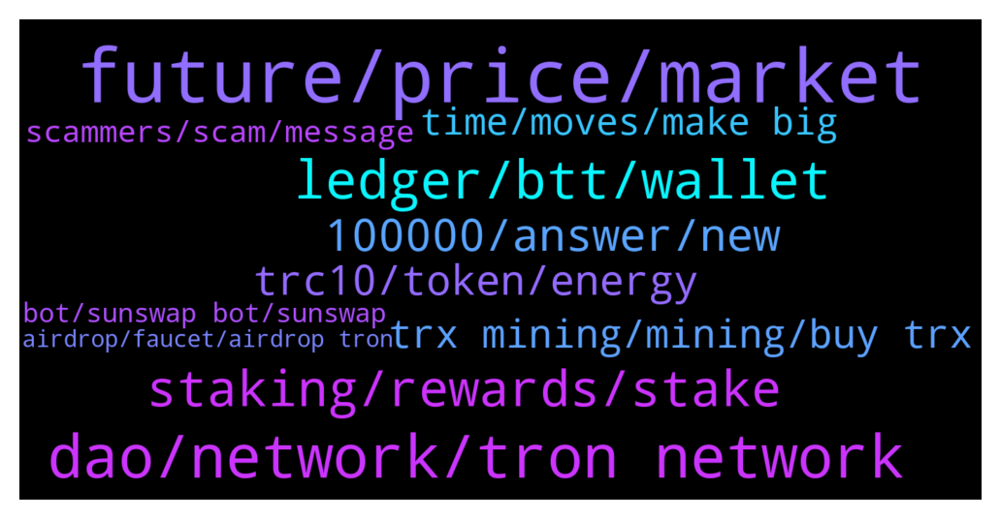

# **@tronnetworkEN**
 ## Analysis for **2022-01-06** - **2022-01-07**.

---

## 📊 **Basic Stats**

**n_messages_sent**: 271

---

---

## 🔝 **Top keywords and related messages**

1. **future, price, market**

    @Arashseven777 --- *Tron pump or dump in 1 months* **--->** [TG Discussion](https://t.me/tronnetworkEN/3813559)

    @Carlos_TRX --- *no, nobody can predict a price, trust in the fundamentals and decide by yourself* **--->** [TG Discussion](https://t.me/tronnetworkEN/3814911)

    @xPommepote --- *Do your own research we don’t know about this coin* **--->** [TG Discussion](https://t.me/tronnetworkEN/3812655)

    @Matthew --- *Any hope of tron value increasing sooner?* **--->** [TG Discussion](https://t.me/tronnetworkEN/3815324)

    @theStrangeGeneration --- *What's the price prediction of tron by the end of the month?* **--->** [TG Discussion](https://t.me/tronnetworkEN/3813372)

    @M💫 --- *Why  crypto is falling from 1 month ?* **--->** [TG Discussion](https://t.me/tronnetworkEN/3815195)

2. **dao, network, tron network**

    @M17miba --- *Thanks, whats about the new dao project* **--->** [TG Discussion](https://t.me/tronnetworkEN/3812468)

    @suPerJack0 --- *Tronlink is best wallet for tron network. 4.2 rating is not bad👀* **--->** [TG Discussion](https://t.me/tronnetworkEN/3811975)

    @matapat --- *thru TronLink App.. APY now highest at 9.54* **--->** [TG Discussion](https://t.me/tronnetworkEN/3812467)

    @RogerJones --- *So tron foundation devs creating a tron dao?  But isn't voting for an SR and SRs voting on proposals essentially like a DAO?* **--->** [TG Discussion](https://t.me/tronnetworkEN/3811487)

    @Greg --- *Is tron and all tokens related to tron network legal in USA?* **--->** [TG Discussion](https://t.me/tronnetworkEN/3814896)

    @agentpiki --- *Energy and bandwidth is the gas of tron* **--->** [TG Discussion](https://t.me/tronnetworkEN/3812414)

3. **ledger, btt, wallet**

    @Rozzi --- *I mean the quantity  of my NFT is not showing  in my trust wallet admin plz help me* **--->** [TG Discussion](https://t.me/tronnetworkEN/3813926)

    @Carlos_TRX --- *In the ledger option u can find the option to give permissions* **--->** [TG Discussion](https://t.me/tronnetworkEN/3812541)

    @Prem0011 --- *The BTT coin was mine on the tron ​​link, I clicked on the deposit option, I do not know where my BTT coin disappeared, please tell me help* **--->** [TG Discussion](https://t.me/tronnetworkEN/3812024)

    @cassettechroot --- *ho i need to edit settings on ledger firmware omg* **--->** [TG Discussion](https://t.me/tronnetworkEN/3812596)

    @Hayz --- *Guys.. Need to ask something, How do I withdraw money from Tron wallet to my bank account?* **--->** [TG Discussion](https://t.me/tronnetworkEN/3814096)

    @cassettechroot --- *how to allow contracts using ledger please ? i dont find settings* **--->** [TG Discussion](https://t.me/tronnetworkEN/3812527)

4. **staking, rewards, stake**

    @The_Influencerr --- *Can I stake to earn Klever?* **--->** [TG Discussion](https://t.me/tronnetworkEN/3814810)

    @valetramo --- *But i will receive also tron while staking ?* **--->** [TG Discussion](https://t.me/tronnetworkEN/3812417)

    @azizdevil --- *It is the same staking in trust wallet and trinlink wallet?* **--->** [TG Discussion](https://t.me/tronnetworkEN/3813513)

    @xPommepote --- *It depends on the APY and how much you stake 🤷🏼‍♂️ But we recommend you to stake using TronLink for better APY.* **--->** [TG Discussion](https://t.me/tronnetworkEN/3813499)

    @M17miba --- *How to stake tron and how is the APY at the moment* **--->** [TG Discussion](https://t.me/tronnetworkEN/3812463)

    @valetramo --- *I’ve voted for some randomly but i don’t know which rewards they give* **--->** [TG Discussion](https://t.me/tronnetworkEN/3812425)

5. **100000, answer, new**

    @M --- *“ how can i know i am in top 100000 users? “* **--->** [TG Discussion](https://t.me/tronnetworkEN/3815334)

    @MilNoslen --- *You have 5 min to explain yourself* **--->** [TG Discussion](https://t.me/tronnetworkEN/3811993)

    @whindel_delanter --- *Were are you from stranger ?* **--->** [TG Discussion](https://t.me/tronnetworkEN/3814958)

    @M --- *Actually I don’t know how to answer that* **--->** [TG Discussion](https://t.me/tronnetworkEN/3815335)

    @Zareen Khan --- *Check my profile you will get details* **--->** [TG Discussion](https://t.me/tronnetworkEN/3812004)

    @DG --- *Don't abuse your powers admin I've been here since genesis* **--->** [TG Discussion](https://t.me/tronnetworkEN/3811876)

6. **trc10, token, energy**

    @RogerJones --- *where can I trade TRC10 tokens now like CGIZA?* **--->** [TG Discussion](https://t.me/tronnetworkEN/3811452)

    @Nathan2507 --- *How to buy tron with usdt trc20* **--->** [TG Discussion](https://t.me/tronnetworkEN/3813524)

    @RogerJones --- *thanks  @cryptoguyinza I think you gotta do a swap, for your trc10 token for a new trc20 token  anyone who has your trc10, have them send it to you and you send them the trc20 version  and also  list your trc20 token on SunSwap* **--->** [TG Discussion](https://t.me/tronnetworkEN/3811978)

    @simon866 --- *Yes most for smart contract inclusion have updated to trc20 versions   Hopefully the project you mentioned will decide to do the same 👍* **--->** [TG Discussion](https://t.me/tronnetworkEN/3811475)

    @RogerJones --- *Since poloniex is gone, you can't trade any of the old TRC10 tokens* **--->** [TG Discussion](https://t.me/tronnetworkEN/3811470)

    @simon866 --- *You would have to ask the token project team where they have listed their trc10 token  Maybe they have listed with an exchange* **--->** [TG Discussion](https://t.me/tronnetworkEN/3811474)

7. **trx mining, mining, buy trx**

    @Carlos_TRX --- *U cant, shasta is only for developers, TRX shasta has no value* **--->** [TG Discussion](https://t.me/tronnetworkEN/3814619)

    @shaydee --- *Where can i buy trx? Thanks* **--->** [TG Discussion](https://t.me/tronnetworkEN/3812138)

    @Slik Sonic --- *Hi guys, how can I buy trx* **--->** [TG Discussion](https://t.me/tronnetworkEN/3811247)

    @PiterSpain --- *TRX is listed in several /usa exchanges* **--->** [TG Discussion](https://t.me/tronnetworkEN/3815073)

    @vitria devy --- *is there any TRX mining for beginners* **--->** [TG Discussion](https://t.me/tronnetworkEN/3813126)

    @Njninjn --- *The best sites to get Trix?* **--->** [TG Discussion](https://t.me/tronnetworkEN/3813919)

8. **time, moves, make big**

    @xPommepote --- *The market is still crashing hard and you expect TRX to make a big move 🧐 stake it and wait a little more 🤷🏼‍♂️* **--->** [TG Discussion](https://t.me/tronnetworkEN/3811555)

    @otakuinla --- *The reduction in staked trx is probably the result of Binance unfreezing their trx. They do this from time to time to do some maintenance. They'll refreeze again soon. In the meantime, enjoy the high voter rewards 😊* **--->** [TG Discussion](https://t.me/tronnetworkEN/3811901)

    @Carlos_TRX --- *TRX is being burned every day with the fees that were paid in transfers* **--->** [TG Discussion](https://t.me/tronnetworkEN/3813514)

    @Mulia108 --- *Its time to increase your TRX* **--->** [TG Discussion](https://t.me/tronnetworkEN/3811888)

    @Paul 🎭 --- *How did circulating supply increase 😳😳. It happened in APENFT, Now it's happening in TRX also* **--->** [TG Discussion](https://t.me/tronnetworkEN/3811869)

    @msn7676 --- *Market had made good recovery but now days again in dip but trx don't moves from since mine holding* **--->** [TG Discussion](https://t.me/tronnetworkEN/3811558)

9. **scammers, scam, message**

    @agentpiki --- *Scammers are hungry. We should make them even hungrier 👍* **--->** [TG Discussion](https://t.me/tronnetworkEN/3813053)

    @agentpiki --- *If you have noticed, that particular message has been spammed for days now. Not sure if scammers trying to get attention or just promoting* **--->** [TG Discussion](https://t.me/tronnetworkEN/3812033)

    @ccmedianetwork --- *Scammers, private info - only you, not share to other. This 100% scam* **--->** [TG Discussion](https://t.me/tronnetworkEN/3814617)

    @agentpiki --- *Yoo scammer talking to each other alright hammer time* **--->** [TG Discussion](https://t.me/tronnetworkEN/3813027)

    @sim_bil --- *& be careful of scams every where* **--->** [TG Discussion](https://t.me/tronnetworkEN/3812224)

    @simon866 --- *Scam and your money is long gone   Don't give your money to scam websites* **--->** [TG Discussion](https://t.me/tronnetworkEN/3811308)

10. **bot, sunswap bot, sunswap**

    @MilNoslen --- *@PiterSpain @Carlos_TRX verify please before removal* **--->** [TG Discussion](https://t.me/tronnetworkEN/3812005)

    @goblinex --- *is there any bot to trade auto matically on sunswap* **--->** [TG Discussion](https://t.me/tronnetworkEN/3814358)

    @Carlos_TRX --- *There is no bot mate, all bots are scam* **--->** [TG Discussion](https://t.me/tronnetworkEN/3813652)

    @emotionalthinker --- *There should be some type of bot that detects the fake people and delete their I'd 😅😅* **--->** [TG Discussion](https://t.me/tronnetworkEN/3813388)

    @emotionalthinker --- *Why there is no bot that removes the fakes* **--->** [TG Discussion](https://t.me/tronnetworkEN/3813387)

    @The --- *Your captcha redirected me to google* **--->** [TG Discussion](https://t.me/tronnetworkEN/3815021)

