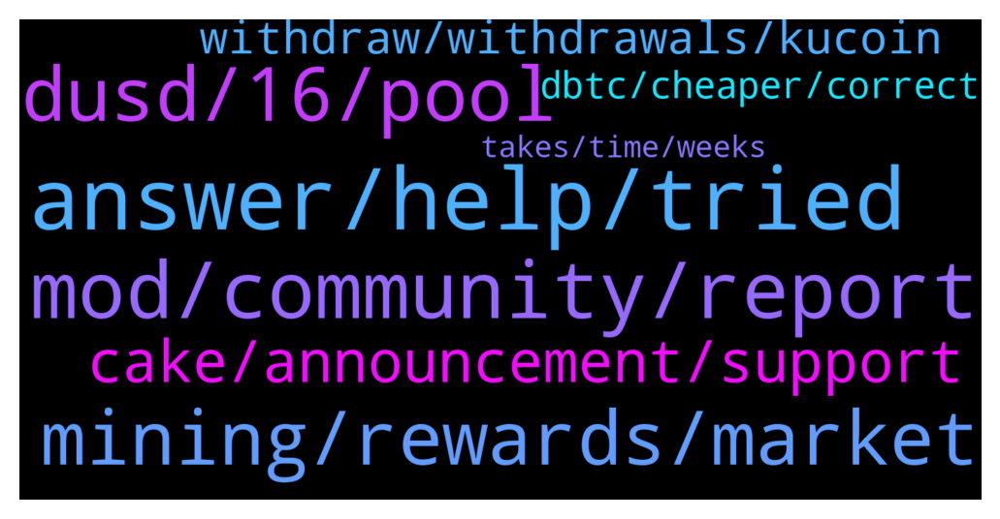

# **@CakeDeFi_EN**
 ## Analysis for **2022-01-07** - **2022-01-08**.

---

## 📊 **Basic Stats**

**n_messages_sent**: 186

---

---

## 🔝 **Top keywords and related messages**

1. **answer, help, tried**

    @daughterofVitalik --- *As I told you: there is just one question and two answer possibilities. I tried both of them. And none of them works* **--->** [TG Discussion](https://t.me/CakeDeFi_EN/162043)

    @Michael_Schredl --- *This is disabled because of some DeFiChain issues* **--->** [TG Discussion](https://t.me/CakeDeFi_EN/161665)

    @Manvydasm --- *Thanks. But it does not say what is the problem. Just a problwm* **--->** [TG Discussion](https://t.me/CakeDeFi_EN/161944)

    @Gerhard --- *When will you solve these problems?* **--->** [TG Discussion](https://t.me/CakeDeFi_EN/161666)

    @daughterofVitalik --- *I tried both answers. None works* **--->** [TG Discussion](https://t.me/CakeDeFi_EN/162038)

    @syahirmustaffa --- *Hi, have u got the answer to this? I have the same question too.* **--->** [TG Discussion](https://t.me/CakeDeFi_EN/162287)

2. **mod, community, report**

    @super33max --- *Scammer are getting smarter and smarter.  This is just an idea: Why moderators don’t put their username in their photo? (Like a water mark)  So, when scammer write you, you can click on their profile and see the mismatch between the username and the username written in the photo.* **--->** [TG Discussion](https://t.me/CakeDeFi_EN/162323)

    @DmgBautista --- *Scammers usually try to impersonate mods, in order to gain users trust. Please refer to the community guidelines on pinned messages. In them, you'll see that no mod will ever DM you, as well as its against the rules to DM other users. Also, there is no official support in telegram.   Any unsolicited DM must be therefore and always, considered a scam attempt. We dont have these rules for nothing, they are here to ensure the community members safety 🙂 Just block and report any unsolicited DM or call, always!   Unfortunatelly, is easy to a scammer to copy the profile pic and name to try and impersonate a mod. If you click on the name, you'll see that the telegram username that appears below will never be equal, as telegram blocks this, so a scamer may try to use the name of a mod, but never be able to use the same telegram username. Just a tip.   Anyway, the only safe thing is to stick to the community rules, therefore, always imediatelly block and report any unsolicited DM or call, whoever it may look! Stay safe! 👍* **--->** [TG Discussion](https://t.me/CakeDeFi_EN/162243)

    @Michael_Schredl --- *I didnt write you a DM* **--->** [TG Discussion](https://t.me/CakeDeFi_EN/162234)

    @edmund_lim2981 --- *Did you just send a DM to me? I just got one from you right now.* **--->** [TG Discussion](https://t.me/CakeDeFi_EN/162236)

    @edmund_lim2981 --- *Should've taken a screenshot but the chat is now gone. Be wary, everyone. Some dude is impersonating @Michael_Schredl and sending DMs.* **--->** [TG Discussion](https://t.me/CakeDeFi_EN/162239)

    @edmund_lim2981 --- *@Michael_Schredl I realised that I blocked you earlier cause I wasn't sure if you were legit 😅* **--->** [TG Discussion](https://t.me/CakeDeFi_EN/162231)

3. **dusd, 16, pool**

    @Rosinmand --- *ok i maybe think i understood the calculation worng i entered it into a impermenant loss calculator and if stocks price stays the same and DUSD goes from 1,16 to 1 use it would result in a 0,27% loss* **--->** [TG Discussion](https://t.me/CakeDeFi_EN/161762)

    @Michael_Schredl --- *A lot? Did you already calculate how much you would lose?* **--->** [TG Discussion](https://t.me/CakeDeFi_EN/161760)

    @Rosinmand --- *yes if i understand it correctly why would i stay in a pool i know will shift 16% on a certain day making me lose quite alot of money ?* **--->** [TG Discussion](https://t.me/CakeDeFi_EN/161759)

    @Michael_Schredl --- *If the pool get arbitraged, you will have more dUSD and less DVNQ* **--->** [TG Discussion](https://t.me/CakeDeFi_EN/161758)

    @Rosinmand --- *as i understand it i will be losing 16% of my position so i dont see why anyone would stay in the position when this happens ?* **--->** [TG Discussion](https://t.me/CakeDeFi_EN/161756)

    @JonD26 --- *You haven't lost anything if you don't sell* **--->** [TG Discussion](https://t.me/CakeDeFi_EN/161890)

4. **mining, rewards, market**

    @AStron6 --- *Be greedy when everyone else is fearful. Whole market is red. Look 2- 3 years down the road* **--->** [TG Discussion](https://t.me/CakeDeFi_EN/162342)

    @deeteejay --- *Lots of FUD. Don't panic sell. Whales are accumulating like mad* **--->** [TG Discussion](https://t.me/CakeDeFi_EN/161883)

    @markthenerd --- *I'm new to cakedefi platform I need a small help can u please tell  me what would be the rewards if I invest 500doge in liquidity mining or freeze for 1month* **--->** [TG Discussion](https://t.me/CakeDeFi_EN/162161)

    @Artur --- *Does this mean that liquidity mining deposits and withdrawals are disabled or the mining it self paused as well?* **--->** [TG Discussion](https://t.me/CakeDeFi_EN/161778)

    @dahendl --- *Here is my proposal for the BTC issue. What is yours? https://github.com/DeFiCh/dfips/issues/101#issuecomment-1007494975* **--->** [TG Discussion](https://t.me/CakeDeFi_EN/161919)

    @helleoo --- *the community here needs to be stronger  if we want to sustain a bear market* **--->** [TG Discussion](https://t.me/CakeDeFi_EN/162333)

5. **cake, announcement, support**

    @Michael_Schredl --- *!Support You need to write the Cake Support* **--->** [TG Discussion](https://t.me/CakeDeFi_EN/161786)

    @Seraphim_1986 --- *Ok thank you. A lot of private persons in name of Cake wrote to me last time 🤨* **--->** [TG Discussion](https://t.me/CakeDeFi_EN/161629)

    @Bingo2022 --- *Hi Team what is the situation with Bafin? Seems Germany will ban Cake* **--->** [TG Discussion](https://t.me/CakeDeFi_EN/161901)

    @John --- *Watch out for this guy giving support He is a stammer.  Stole money from a few people on here , pretending g to be tech support for cakedefi* **--->** [TG Discussion](https://t.me/CakeDeFi_EN/161803)

    @Seraphim_1986 --- *A Cake DeFi B o t sent me a personal message. Is this legit?* **--->** [TG Discussion](https://t.me/CakeDeFi_EN/161627)

    @alessandrolocicero --- *Pls kick the user "CakeDefi Admin", scammer* **--->** [TG Discussion](https://t.me/CakeDeFi_EN/162216)

6. **withdraw, withdrawals, kucoin**

    @iAden_94 --- *Was it same day withdrawals? I’m withdrawing to a whitelisted address but still have not receive any notifications* **--->** [TG Discussion](https://t.me/CakeDeFi_EN/162155)

    @gilldog --- *Wish they had mentioned this earlier. Wasted transactions for nothing that noone of course will refund. What a joke* **--->** [TG Discussion](https://t.me/CakeDeFi_EN/161953)

    @cihat28 --- *When can I cash out and withdraw this defi airdrop? It's been 5 months but I still can't withdraw* **--->** [TG Discussion](https://t.me/CakeDeFi_EN/162244)

    @cybearir --- *Kucoin needs to do that ? Do you know which exchange has allready done that ?* **--->** [TG Discussion](https://t.me/CakeDeFi_EN/162074)

    @iAden_94 --- *Withdrawals of LTC all good ?* **--->** [TG Discussion](https://t.me/CakeDeFi_EN/162151)

    @mm_phoenix --- *yes kucoin need that. bitrue ist open.* **--->** [TG Discussion](https://t.me/CakeDeFi_EN/162077)

7. **dbtc, cheaper, correct**

    @Michael_Schredl --- *No it is not, it is only a bit under the BTC price* **--->** [TG Discussion](https://t.me/CakeDeFi_EN/161821)

    @jumbolin --- *is dBTC currently cheaper s as usual when I swap it with DFI?* **--->** [TG Discussion](https://t.me/CakeDeFi_EN/161806)

    @Cryptoziano --- *I'm not personally happy with the swap fees, just my opinion.* **--->** [TG Discussion](https://t.me/CakeDeFi_EN/162060)

    @jumbolin --- *I get that but I’ve been told that dBTC is supposedly half the regular price? Is that correct?* **--->** [TG Discussion](https://t.me/CakeDeFi_EN/161816)

    @DmgBautista --- *BTC-DFI LM is dBTC based as it uses the defichain dex to run so is locked for the moment. For pure BTC, you have to go for lending at the moment* **--->** [TG Discussion](https://t.me/CakeDeFi_EN/161777)

    @fabioandreatta --- *Yes, everything is working. Only dBTC is affected* **--->** [TG Discussion](https://t.me/CakeDeFi_EN/162033)

