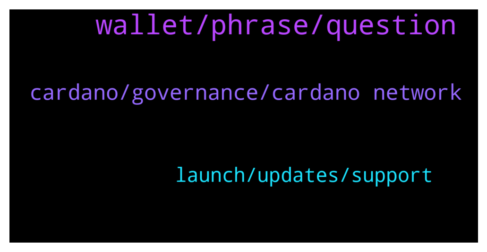

# **@Cardano**
 ## Analysis for **2022-01-07** - **2022-01-08**.

---

## 📊 **Basic Stats**

**n_messages_sent**: 85

---

---

## 🔝 **Top keywords and related messages**

1. **wallet, phrase, question**

    @glitch04 --- *Anyone that dm's you is not an admin or staff, and there are no ADA giveaways* **--->** [TG Discussion](https://t.me/Cardano/766406)

    @glitch04 --- *I would recommend hardware devices for light wallet added security, if you have the means* **--->** [TG Discussion](https://t.me/Cardano/766925)

    @glitch04 --- *Where ever you tried to "Exchange" one for the other* **--->** [TG Discussion](https://t.me/Cardano/766414)

    @kiwicryptoT --- *Shame half the holders still can’t access their tokens or get a deposit address from Kucoin…groups a bloodbath* **--->** [TG Discussion](https://t.me/Cardano/766551)

    @kiwicryptoT --- *It is very easy…the hard part was getting the listing in the 1st place.  It shouldn’t be hard to deposit CNTs   And even without the CEX issues, REVU app crapped itself today and deleted a lot of users wallets and won’t let them restore as severs overloaded* **--->** [TG Discussion](https://t.me/Cardano/766561)

    @CryptoHorsey --- *Heya! Did the team get back to you on this one?  Peter* **--->** [TG Discussion](https://t.me/Cardano/766422)

2. **cardano, governance, cardano network**

    @Kharlyp --- *I exchange my cardano to lisk and it’s been pending for months now* **--->** [TG Discussion](https://t.me/Cardano/766407)

    @Glement --- *Google just leads to cardano page explaining stacking 🤣* **--->** [TG Discussion](https://t.me/Cardano/766674)

    @Juanlot --- *hello here you can see the cardano projects https://www.cardanocube.io/* **--->** [TG Discussion](https://t.me/Cardano/766972)

    @silbererde1 --- *SNET ecosystem on cardano soon?   https://www.reddit.com/r/cardano/comments/ryd4wa/snetecosystem_on_cardano_soon/?utm_medium=android_app&utm_source=share* **--->** [TG Discussion](https://t.me/Cardano/766699)

    @Dat_Me --- *Cardano Forest  funded100%, what's next?* **--->** [TG Discussion](https://t.me/Cardano/766945)

    @Ultimate_Gigachad --- *Hello all, I hope you are all well! I am writing to you to have more details on how Cardano's governance system work especially the voting part! I am doing a Taxonomy of Blockchain Governance and I am researching all the governance mechanism in all most reputable projects!* **--->** [TG Discussion](https://t.me/Cardano/766827)

3. **launch, updates, support**

    @RexNebu --- *That I now... but what's going on with it... when can we expect it on mainnet?* **--->** [TG Discussion](https://t.me/Cardano/766690)

    @ThinkLater --- *Is there an issue with the Daedalus network?* **--->** [TG Discussion](https://t.me/Cardano/766441)

    @KyR14c0s --- *The guys are rushing catching up other projects and i really believe they will screw up.... i believe SS is only marketting* **--->** [TG Discussion](https://t.me/Cardano/766764)

    @glitch04 --- *No the network runs fine use the #support channel below* **--->** [TG Discussion](https://t.me/Cardano/766442)

    @kiwicryptoT --- *So yeah, I’m super excited to see a cnt finally on a T1 Cex. Just hoping all the drama today doesn’t distract from that* **--->** [TG Discussion](https://t.me/Cardano/766562)

    @SkyeFive --- *Has there been any good or solid updates on timescales to enable SundaeSwap to launch? It feels like the September summit was just a smoke screen to keep people hungry and invested? 🤷🏻‍♂️ I’m not saying the project understandably needs more time etc… etc…. One chance to get it right and be patient… etc…. Just what is actually happening on the updates and what updates are required… like I say if everything was projected as so fantastic in September then updates to get Daps & DEX’s launched should be more concrete in what is happening* **--->** [TG Discussion](https://t.me/Cardano/766595)

