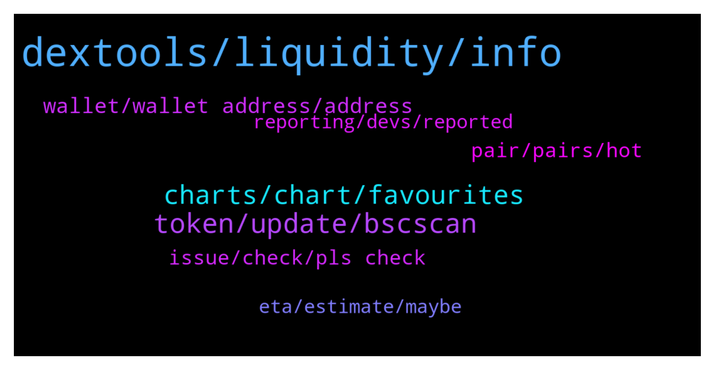

# **@DEXToolsCommunity**
 ## Analysis for **2022-01-06** - **2022-01-08**.

---

## 📊 **Basic Stats**

**n_messages_sent**: 418

---

---

## 🔝 **Top keywords and related messages**

1. **dextools, liquidity, info**

    @hmk18990 --- *if liq. is added in pancake then you'll see it soon in dextools. did you try to search for your contract in the search bar? (no need to add anything in dextools)* **--->** [TG Discussion](https://t.me/DEXToolsCommunity/322108)

    @smartlinkteam --- *Hi guys, we’re looking to list Tezos as a blockchain on Dextools. How can we proceed?* **--->** [TG Discussion](https://t.me/DEXToolsCommunity/322101)

    @stanes --- *Fixed. You can now find your pair on Dextools. Sorry for the delay.* **--->** [TG Discussion](https://t.me/DEXToolsCommunity/322292)

    @Birds --- *Hello, could you explain how can I withdraw my cryptos in my DEXTools Wallet? I bought DEXT on Uniswap, and I see my balance on Metamask as well. Thanks.* **--->** [TG Discussion](https://t.me/DEXToolsCommunity/321957)

    @stanes --- *Dextools is providing data and tools to exploit this data.  We don't list anything but index all the pairs directly from the blockchain. We don't decide what is on the blockchain, always DYOR.* **--->** [TG Discussion](https://t.me/DEXToolsCommunity/322603)

    @Terryjunior --- *Hi  Our token got listed on Pancakeswap since the 18th of December and is not appearing on dextools.  People talk about API CALL. PLEASE can you help?  Flashtoken  💥OFFICIAL CONTRACT:   0x311e015e2e255dd14eddc4a2107e39649dc81c5d* **--->** [TG Discussion](https://t.me/DEXToolsCommunity/322694)

2. **token, update, bscscan**

    @OQuintero --- *Trying to swap some rose token to bnb but I can’t, any idea why?* **--->** [TG Discussion](https://t.me/DEXToolsCommunity/322505)

    @hmk18990 --- *To update Social Information for your token, please update etherscan.io or bscscan.com & update information on coinmarketcap.com and coingecko.com* **--->** [TG Discussion](https://t.me/DEXToolsCommunity/322058)

    @JoeyDieleman --- *Apply on etherscan/bscscan/etc, coingecko and coinmarketcap* **--->** [TG Discussion](https://t.me/DEXToolsCommunity/321992)

    @MRAndersoni --- *how do I change info on a listing. The discord link expired and I would like to update it.* **--->** [TG Discussion](https://t.me/DEXToolsCommunity/322055)

    @stanes --- *There is indeed an issue with displaying this token. I am reporting it to the devs team and they will fix it asap. Thank you for reporting.* **--->** [TG Discussion](https://t.me/DEXToolsCommunity/322123)

    @Shauno73 --- *Thanks for vid. I'm pretty well versed in this stuff. Since update I've found this issue. Shows wallet address that's connected currently, but does not give me access to the plan that my tokens activate. Strange one, but I'll work it out once I've been able to disconnect and reconnect. That's all it needs. A refreshed connection.* **--->** [TG Discussion](https://t.me/DEXToolsCommunity/322778)

3. **charts, chart, favourites**

    @imuresan --- *Sorry for this. I guess a bot was guilty of vaporising my feedback. Here it is again. I like the new font and the new, slightly cleaner, more stylish look. The thing that I don't find good is the treatment of the favourites. I should mention that I took the time to try and adjust to the new look and avoid being resistant to change. However I find that the favourites being displayed like they are on the right column does not work for me. That column covers the right part of the main/current chart I'm looking at (including the price). I'm on a windows computer. Also the column on the left side of the screen, where the favourites used to be, displays now information that is largely irrelevant to me at least. And one last thing. The miniature charts for each of the favourites is not very useful to me. It occupies a lot of space and it makes me scroll a lot to have a look at all my favourite pairs. I would still prefer the favourites to be on the left side of the screen where they used to be and without the miniature chart. In that way I was able to have a quick, birds eye view at my favourites without the need to scroll too much. I hope my feedback gets to the right persons. I wish everyone a Happy New Year! I have bought into Dextools because you are the first to publish the charts of new pairs from IDOs. I tried to use the Ethereum bot, without success. It's clunky as hell. I know that's another company. And I know a BSC bot is in the making. If you guys manage to pull those trading strategies off you have a great advantage and product.* **--->** [TG Discussion](https://t.me/DEXToolsCommunity/322017)

    @P C --- *would be handy if I could see all my transactions though, without having to leave the chart* **--->** [TG Discussion](https://t.me/DEXToolsCommunity/322660)

    @mf1495 --- *No charts opening for me since the UI update* **--->** [TG Discussion](https://t.me/DEXToolsCommunity/322433)

    @Flashbang665 --- *hi, any admin online? (f&ckying scammers dont botther me with your dms...)  The save chart functionality doesn't work for me. When I want to load a saved chart, it doesn't list any charts* **--->** [TG Discussion](https://t.me/DEXToolsCommunity/322449)

    @JoeyDieleman --- *All depends on screensizes but you should have a change layout button right top* **--->** [TG Discussion](https://t.me/DEXToolsCommunity/322028)

    @P C --- *found it, thanks. However, it only shows the transactions I made after the Standard Plan update.* **--->** [TG Discussion](https://t.me/DEXToolsCommunity/322646)

4. **wallet, wallet address, address**

    @OQuintero --- *But they asking for my wallet address, it’s that correct?* **--->** [TG Discussion](https://t.me/DEXToolsCommunity/322507)

    @Birds --- *Wallet Info when linked to Metamask* **--->** [TG Discussion](https://t.me/DEXToolsCommunity/321960)

    @stanes --- *Yes you can. But for that you only need to connect your actual wallet (Metamask or other) to the app.* **--->** [TG Discussion](https://t.me/DEXToolsCommunity/322204)

    @Shauno73 --- *How do we disconnect wallet and reconnect on desktop platform?   Mine is not working.* **--->** [TG Discussion](https://t.me/DEXToolsCommunity/322770)

    @Ayim --- *Okk av connected with my trust wallet  Am having problem with the transfer* **--->** [TG Discussion](https://t.me/DEXToolsCommunity/322189)

    @bastardganpunk --- *Michael is right. Nobody can steal coins having your PUBLIC key, which is your wallet address and starts with 0x…. On the ethereum chain. Never show your seed phrase to anyone. This is the 12 or 24 words you appointed. You need to keep them in a save place, this is the access to your wallet.* **--->** [TG Discussion](https://t.me/DEXToolsCommunity/322520)

5. **issue, check, pls check**

    @stanes --- *Ahahaha how many of you in this chat + in DM? 😅* **--->** [TG Discussion](https://t.me/DEXToolsCommunity/322275)

    @stanes --- *Can you send me some links with with this issue in DM please?* **--->** [TG Discussion](https://t.me/DEXToolsCommunity/322322)

    @napascual --- *Feel free to dm me for the original pc issue, we could go through it now* **--->** [TG Discussion](https://t.me/DEXToolsCommunity/322593)

    @napascual --- *Hey could you dm me before doing that?* **--->** [TG Discussion](https://t.me/DEXToolsCommunity/322591)

    @大可不必 --- *I want to be sure of the authenticity of this picture* **--->** [TG Discussion](https://t.me/DEXToolsCommunity/322341)

    @Thesios --- *which I am trying to get an official CPM per zone , But I have not see anything official yet* **--->** [TG Discussion](https://t.me/DEXToolsCommunity/322711)

6. **pair, pairs, hot**

    @王多鱼 --- *It keeps coming up Pair not found* **--->** [TG Discussion](https://t.me/DEXToolsCommunity/323065)

    @GetFreeOwner --- *Hello how to create missing pair?  0xea5cd2dd91de5b080dbbc7226893c457c5eceb91   this token dont have pair.  thanks for fix   @admins* **--->** [TG Discussion](https://t.me/DEXToolsCommunity/322263)

    @InFer_Dev --- *That’s not our coin but thanks for the response! Gotcha and I saw that you offer hot pairs I can read those! Hope to do Business soon!* **--->** [TG Discussion](https://t.me/DEXToolsCommunity/322704)

    @Fiddelish --- *hello to whom do i speak for questions about making a new pair and putting up links to tg/twitter etc on it?* **--->** [TG Discussion](https://t.me/DEXToolsCommunity/322217)

    @AbdoMelody --- *I have problem with this pair   https://www.dextools.io/app/polygon/pair-explorer/0x643cc040bbf5eee0ded70d4f63173f2cdc4e89bf* **--->** [TG Discussion](https://t.me/DEXToolsCommunity/321973)

    @FredericDEXT --- *Fantom is a chain with low visits, so with a low amount of people checking a pair can trend.* **--->** [TG Discussion](https://t.me/DEXToolsCommunity/322764)

7. **eta, estimate, maybe**

    @hmk18990 --- *yes it's on the way but can't give you an ETA* **--->** [TG Discussion](https://t.me/DEXToolsCommunity/322066)

    @ShibanceinuEmployee --- *are there any plans to do so?* **--->** [TG Discussion](https://t.me/DEXToolsCommunity/322065)

    @RedPanda94 --- *Not listed yet but wanna be prepared* **--->** [TG Discussion](https://t.me/DEXToolsCommunity/321990)

    @bastardganpunk --- *At the moment there is no eta for it* **--->** [TG Discussion](https://t.me/DEXToolsCommunity/322809)

    @hmk18990 --- *planned but can't give you an ETA* **--->** [TG Discussion](https://t.me/DEXToolsCommunity/322398)

    @bastardganpunk --- *I’m asking, not sure myself atm.. I think not yet available, but not 100% sure* **--->** [TG Discussion](https://t.me/DEXToolsCommunity/322379)

