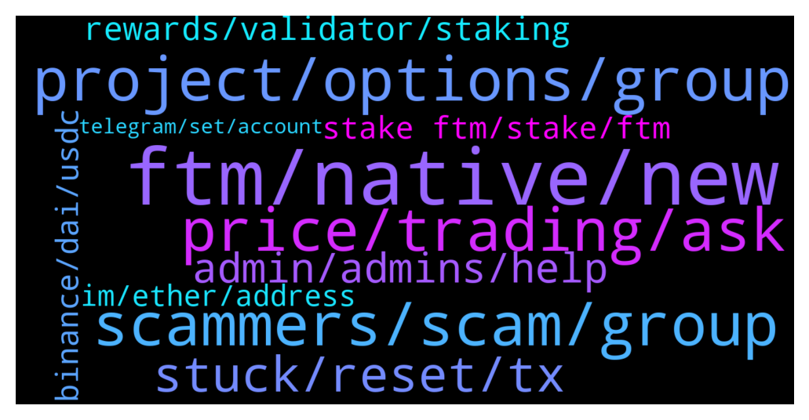

# **@Fantom_English**
 ## Analysis for **2022-01-07** - **2022-01-08**.

---

## 📊 **Basic Stats**

**n_messages_sent**: 243

---

---

## 🔝 **Top keywords and related messages**

1. **ftm, native, new**

    @stevelee2021 --- *i tried to send some FTM from exchange to my metamask wallet, i am confused how i can do that, the exchange is only showing it as ERC20* **--->** [TG Discussion](https://t.me/Fantom_English/625405)

    @inacryptoworld --- *Hy guys somebody can help me please? I want to sent ftm to fantom wallet and in the wallet I see FTMet and not only FTM is it good anyway? Thanks for help* **--->** [TG Discussion](https://t.me/Fantom_English/626012)

    @shibumigo --- *that is what i tried first but as I do not have FTM I cannot pay gas fee* **--->** [TG Discussion](https://t.me/Fantom_English/626191)

    @Mcjig --- *Thats a scam. Ftm doesnt do airdrops* **--->** [TG Discussion](https://t.me/Fantom_English/625518)

    @KingDaw --- *what's the easiest way to bridge eth from mainnet to FTM* **--->** [TG Discussion](https://t.me/Fantom_English/626049)

    @adc_20 --- *hello. which the most profitable way to use my FTM ? I think about TOMB-FTM-LP...I saw another one named SCARAB, but I don't know how safe it is* **--->** [TG Discussion](https://t.me/Fantom_English/625262)

2. **scammers, scam, group**

    @Ziga --- *if you get a private message its a scam, you probably already have a few messaging you* **--->** [TG Discussion](https://t.me/Fantom_English/624877)

    @Fjody --- *If anyone DMs you, those are all scammers.* **--->** [TG Discussion](https://t.me/Fantom_English/625414)

    @dracula53 --- *A scam is occurring using this channel name* **--->** [TG Discussion](https://t.me/Fantom_English/625241)

    @stevelee2021 --- *he just sent me a google form with a last question asking for seeds LOL* **--->** [TG Discussion](https://t.me/Fantom_English/624893)

    @Ziga --- *scammer above called "crypto wallet support"* **--->** [TG Discussion](https://t.me/Fantom_English/624888)

    @stevelee2021 --- *this group is full of scammers* **--->** [TG Discussion](https://t.me/Fantom_English/625417)

3. **project, options, group**

    @AirCincy --- *What other options are there for sales with WL on Fantom besides Fantomstarter* **--->** [TG Discussion](https://t.me/Fantom_English/625120)

    @anubis3301 --- *This project will explode in 2022* **--->** [TG Discussion](https://t.me/Fantom_English/625645)

    @LittleSanchez --- *Hello, anyone could tell me why Andre starting a new project?* **--->** [TG Discussion](https://t.me/Fantom_English/625445)

    @Damo1610 --- *Hi where is the best place to stake Fantom..* **--->** [TG Discussion](https://t.me/Fantom_English/625089)

    @mastroalex25 --- *as a bridge from cronos to fantom I only know evodefi who eats a 0.5% (too much) does anyone know better? do not contact me in private, I will not answer.* **--->** [TG Discussion](https://t.me/Fantom_English/625450)

    @rafaelp_eth --- *Hi guys, I’m setting up a DAO and researching on tooling for. treasury management, voting etc. I see that there are many options on ethereum, some options for Polygon but I didn’t see too much options on Fantom. How is this? Do you guys know some protocols on Fantom already? (scammers, please get out of my DM)* **--->** [TG Discussion](https://t.me/Fantom_English/625057)

4. **price, trading, ask**

    @Johnnyfantom --- *You will have to ask in the trading channel, not here, please see channels below* **--->** [TG Discussion](https://t.me/Fantom_English/625264)

    @codear17 --- *Come to https://t.me/FantomMarines  You can ask such questionss there* **--->** [TG Discussion](https://t.me/Fantom_English/625103)

    @Janevietani --- *https://t.me/fantomine you can ask it here* **--->** [TG Discussion](https://t.me/Fantom_English/626040)

    @dracula53 --- *Which one is the trading channel* **--->** [TG Discussion](https://t.me/Fantom_English/625279)

    @eznika --- *no price talk in this channel guys* **--->** [TG Discussion](https://t.me/Fantom_English/626176)

    @Johnnyfantom --- *No price chat here please, thank you* **--->** [TG Discussion](https://t.me/Fantom_English/624786)

5. **stuck, reset, tx**

    @Janevietani --- *if you have pending tx. you can reset metamask to clear pending tx* **--->** [TG Discussion](https://t.me/Fantom_English/626060)

    @Janevietani --- *metamask? go to metamask setting -> advanced -> reset then re-do your tx* **--->** [TG Discussion](https://t.me/Fantom_English/625196)

    @Cristiano --- *With this solution every transaction Will be cancelled from the blockchain? I did this but not solved* **--->** [TG Discussion](https://t.me/Fantom_English/625202)

    @G0ldMax --- *Stupid question, is there a reset button, or what do I do?* **--->** [TG Discussion](https://t.me/Fantom_English/624957)

    @G0ldMax --- *How to clear stuck transactions in metamask?* **--->** [TG Discussion](https://t.me/Fantom_English/624948)

    @Cristiano --- *Hi everyone, my wallet Is Stuck with 9 transaction pending... I Need to solve! Please some advice?* **--->** [TG Discussion](https://t.me/Fantom_English/625192)

6. **admin, admins, help**

    @G --- *Is there an admin that can dm me please* **--->** [TG Discussion](https://t.me/Fantom_English/625592)

    @Janevietani --- *You are here now. No detail out yet* **--->** [TG Discussion](https://t.me/Fantom_English/625446)

    @Fjody --- *Maybe some Admin knows. I have no clue.* **--->** [TG Discussion](https://t.me/Fantom_English/625418)

    @IcZEe --- *Hey guys  Am looking for the admin here* **--->** [TG Discussion](https://t.me/Fantom_English/624872)

    @AOJOA --- *please where's the admin. I need help* **--->** [TG Discussion](https://t.me/Fantom_English/625739)

    @Aka_Jacki --- *Any admins that can help devs here?* **--->** [TG Discussion](https://t.me/Fantom_English/625380)

7. **rewards, validator, staking**

    @sinjindavidjung --- *but quick question, im sure everyone is sick of it, but which validator should i pick for my staking? is just putting in the foudation 1 ok?* **--->** [TG Discussion](https://t.me/Fantom_English/625372)

    @bC311 --- *When will we able to automatically get rewards on staking rewards?* **--->** [TG Discussion](https://t.me/Fantom_English/625462)

    @GanthaMakala --- *But with ledger or Razor no rewards if you stak....* **--->** [TG Discussion](https://t.me/Fantom_English/625524)

    @Lawrence --- *On staking, what has validating wallet* **--->** [TG Discussion](https://t.me/Fantom_English/625829)

    @bC311 --- *I dont stake so I can sell my rewards. I stake for compounding interest.* **--->** [TG Discussion](https://t.me/Fantom_English/625465)

    @WILLEMH --- *I see so many staking options, cant see the forrest cause of the trees* **--->** [TG Discussion](https://t.me/Fantom_English/624807)

8. **stake ftm, stake, ftm**

    @Bill (to the moon) --- *Hey guys Wich is the best wallet to stake ftm ? What's the apy ?* **--->** [TG Discussion](https://t.me/Fantom_English/626013)

    @bC311 --- *i get like 11.5% - year lock.* **--->** [TG Discussion](https://t.me/Fantom_English/625566)

    @Ketle --- *Spiritswap ? Spookyswap ? Hyperjump ? Waka finance ? Beefy Finance ?* **--->** [TG Discussion](https://t.me/Fantom_English/624982)

    @Emoguy112 --- *That is staking. I am looking for liquid staking, which doesn't lock my ftm* **--->** [TG Discussion](https://t.me/Fantom_English/625097)

    @Bravecrypto --- *@admin where can I stake my FTM* **--->** [TG Discussion](https://t.me/Fantom_English/625292)

    @JoshXBT --- *Where can i stake FTM on mobile* **--->** [TG Discussion](https://t.me/Fantom_English/625952)

9. **binance, dai, usdc**

    @Krazykook --- *Hi guys, I’ve send DAI to Binance through the FTM network which isn’t supported by Binance, Anyone know if the funds are lost or a way to retrieve them back please and thanks* **--->** [TG Discussion](https://t.me/Fantom_English/625337)

    @Janevietani --- *you can not send DAI Fantom to Binance* **--->** [TG Discussion](https://t.me/Fantom_English/625248)

    @G --- *Can I ask someone for help about sending dai back to my binance account* **--->** [TG Discussion](https://t.me/Fantom_English/625245)

    @Fjody --- *That means it doesn't support mainnet withdrawals. Use other exchange - e.g. Binance or a Bridge.* **--->** [TG Discussion](https://t.me/Fantom_English/625407)

    @BuletstormZ --- *Buy USDC on binance and bridge to fantom tgru spooky swap, and then buy fantom* **--->** [TG Discussion](https://t.me/Fantom_English/626189)

    @Janevietani --- *not sure about DAI but as i know Binance are working for USDC on Fantom* **--->** [TG Discussion](https://t.me/Fantom_English/625344)

10. **im, ether, address**

    @sinjindavidjung --- *im getting dmed by an admin asking about what wallet im using* **--->** [TG Discussion](https://t.me/Fantom_English/625376)

    @Alex --- *You sent to ether token address? Or your ether wallet address?* **--->** [TG Discussion](https://t.me/Fantom_English/625863)

    @Alex --- *Has the original transaction failed yet?* **--->** [TG Discussion](https://t.me/Fantom_English/625853)

    @GanthaMakala --- *Can WE stak from wallet application please ? In the same delegator ? Thanks* **--->** [TG Discussion](https://t.me/Fantom_English/625651)

    @AOJOA --- *I have screenshot of the wallet* **--->** [TG Discussion](https://t.me/Fantom_English/625737)

    @AOJOA --- *I lost my opera wallet mnemonic key. please who xan help* **--->** [TG Discussion](https://t.me/Fantom_English/625736)

