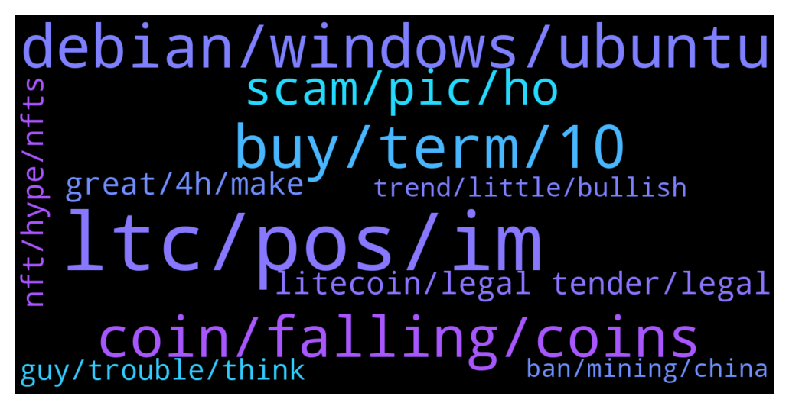

# **@Litecoin**
 ## Analysis for **2022-01-07** - **2022-01-08**.

---

## 📊 **Basic Stats**

**n_messages_sent**: 243

---

---

## 🔝 **Top keywords and related messages**

1. **ltc, pos, im**

    @ck42069 --- *Yeah maybe delete the last zero on that bill because ltc is headed for 100$ instead of 1000$ lol.* **--->** [TG Discussion](https://t.me/Litecoin/2041822)

    @syonfive --- *ltc to 1$ , be prepared for short run* **--->** [TG Discussion](https://t.me/Litecoin/2042174)

    @jw418 --- *LTC is supposed to do well when bearish cycles break. Let's see I guess ..* **--->** [TG Discussion](https://t.me/Litecoin/2041824)

    @Dr --- *yeah sell your kidney and ltc if its $1* **--->** [TG Discussion](https://t.me/Litecoin/2042191)

    @RorschachTesst --- *Can't believe I converted my eth for this pos* **--->** [TG Discussion](https://t.me/Litecoin/2042061)

    @Bigcfidolla --- *diamond formation/ tea cup forming/ trendline channel is uptrend to top blue trendline.  fibo signal set for take profits w/ minimum sl but i stay safer and use the target verticle blue line eta of target is Sunday* **--->** [TG Discussion](https://t.me/Litecoin/2042516)

2. **debian, windows, ubuntu**

    @JohnTheApostle --- *If you know what you're doing yes a good Linux distro is probably the safest thing* **--->** [TG Discussion](https://t.me/Litecoin/2042290)

    @Yigru --- *ok thx. then I'll install debian instead of ubuntu. but using vpn is also recommended?* **--->** [TG Discussion](https://t.me/Litecoin/2042298)

    @JohnTheApostle --- *Ubuntu is easier but is a bloated mess 😌* **--->** [TG Discussion](https://t.me/Litecoin/2042311)

    @TonyNakamoto --- *A lot of distr0s look and function similar 2 Wimdows* **--->** [TG Discussion](https://t.me/Litecoin/2042324)

    @Yigru --- *i have ububtu 20.04.3 on my other laptop. should be safe right?* **--->** [TG Discussion](https://t.me/Litecoin/2042293)

    @Yigru --- *isn't gentoo really hard to install?* **--->** [TG Discussion](https://t.me/Litecoin/2042300)

3. **buy, term, 10**

    @Bigcfidolla --- *i find the best time to buy or sell is 12 to 14 gmt* **--->** [TG Discussion](https://t.me/Litecoin/2042464)

    @Bigcfidolla --- *first started trading it was 10k wow i wish i knew to buy it then* **--->** [TG Discussion](https://t.me/Litecoin/2042449)

    @cloudlite15 --- *Sounds like it would be easier to sell* **--->** [TG Discussion](https://t.me/Litecoin/2041986)

    @Bigcfidolla --- *im sure.  i was always interested but didnt have no one to tell me to buy.  or how to buy.  now we have btc atm's lol* **--->** [TG Discussion](https://t.me/Litecoin/2042456)

    @Carlos_PRO_Holder --- *Bear market confirmed, btc is going to $15k* **--->** [TG Discussion](https://t.me/Litecoin/2041752)

    @Therealkeysopendoors --- *Depends on what you buy but I'm a long term investor* **--->** [TG Discussion](https://t.me/Litecoin/2041988)

4. **coin, falling, coins**

    @Therealkeysopendoors --- *I guess we all should have sold around that coinbase offering* **--->** [TG Discussion](https://t.me/Litecoin/2041960)

    @Kleber002 --- *that's why I also ranked the BTC top of all coin* **--->** [TG Discussion](https://t.me/Litecoin/2042451)

    @Jim --- *Someone stops btc falling...  707.9 billion market cap and still falling 😢* **--->** [TG Discussion](https://t.me/Litecoin/2041887)

    @JohnTheApostle --- *Also the safest way to store your coins is a hardware wallet* **--->** [TG Discussion](https://t.me/Litecoin/2042301)

    @cloudlite15 --- *Where have you been the past year? Haven't heard from you for a while. Thought you moved onto other coins* **--->** [TG Discussion](https://t.me/Litecoin/2041962)

    @Bigcfidolla --- *i even have a coinbase debit card .  the future is here* **--->** [TG Discussion](https://t.me/Litecoin/2042457)

5. **scam, pic, ho**

    @syonfive --- *sorry i am hodler like others , despite my name , my pic and all you think be important* **--->** [TG Discussion](https://t.me/Litecoin/2042247)

    @ken_xmas --- *Hé want to scam me ?* **--->** [TG Discussion](https://t.me/Litecoin/2041778)

    @ken_xmas --- *@DJFrohFace  No coiner ,no pic ,no username ,Fudder and laughing at hodlers* **--->** [TG Discussion](https://t.me/Litecoin/2042245)

    @morningzone --- *sorry sir, i gotta remove this url - it looks a bit shadyish.* **--->** [TG Discussion](https://t.me/Litecoin/2042549)

    @ck42069 --- *Got sum new profile pics ho ho* **--->** [TG Discussion](https://t.me/Litecoin/2042357)

    @syonfive --- *having an account image is not a real good rule for avoiding scam spam and so on .  but i apply it* **--->** [TG Discussion](https://t.me/Litecoin/2042289)

6. **litecoin, legal tender, legal**

    @tonster84 --- *litecoin will break below 100 soon* **--->** [TG Discussion](https://t.me/Litecoin/2042055)

    @rakshithkulal412 --- *Is Litecoin will down below 100$ or not?* **--->** [TG Discussion](https://t.me/Litecoin/2042162)

    @ken_xmas --- *Why Litecoin team not working on a metaberse city ?* **--->** [TG Discussion](https://t.me/Litecoin/2042584)

    @KevinWilson8 --- *If mweb released last year, Litecoin won't perform so badly* **--->** [TG Discussion](https://t.me/Litecoin/2042002)

    @RorschachTesst --- *Change the name of this group to : will litecoin ever pump* **--->** [TG Discussion](https://t.me/Litecoin/2042410)

    @Mayaserrrbe --- *Looking to buy litecoin between 1 and 50 ltc* **--->** [TG Discussion](https://t.me/Litecoin/2042024)

7. **great, 4h, make**

    @JohnTheApostle --- *So you can blow it up by copy and pasting stuff in the terminal that you don't understand* **--->** [TG Discussion](https://t.me/Litecoin/2042319)

    @hotsince81 --- *That’s why youtubers for the most part are full of shit* **--->** [TG Discussion](https://t.me/Litecoin/2042679)

    @JohnTheApostle --- *Yes usually trying to make things easier too much ends up doing the opposite* **--->** [TG Discussion](https://t.me/Litecoin/2042314)

    @JohnTheApostle --- *It's not for beginners at all lol* **--->** [TG Discussion](https://t.me/Litecoin/2042303)

    @TonyNakamoto --- *Cuz nobody sure wat it is* **--->** [TG Discussion](https://t.me/Litecoin/2041770)

    @RabbitL0v3r --- *Me after spending 4h explaining my fren how to setup the vm Someone random "ohh do `rm -rf /" 😭😭😭* **--->** [TG Discussion](https://t.me/Litecoin/2042498)

8. **nft, hype, nfts**

    @Therealkeysopendoors --- *I have been in nft land* **--->** [TG Discussion](https://t.me/Litecoin/2041963)

    @Therealkeysopendoors --- *I do sports and branded nfts* **--->** [TG Discussion](https://t.me/Litecoin/2041975)

    @cloudlite15 --- *For sure, I never got into the nft hype* **--->** [TG Discussion](https://t.me/Litecoin/2041951)

    @Therealkeysopendoors --- *Yeah defi and nft have taken over* **--->** [TG Discussion](https://t.me/Litecoin/2041946)

    @cloudlite15 --- *It's been all defi and nft* **--->** [TG Discussion](https://t.me/Litecoin/2041944)

    @cloudlite15 --- *Will you be making nft on omni?* **--->** [TG Discussion](https://t.me/Litecoin/2041965)

9. **guy, trouble, think**

    @Yigru --- *is it safe to use crypto software on macOs? because i read it sends user data to apple in the background. is it true? if so, Linux is the safest to use for crypto?* **--->** [TG Discussion](https://t.me/Litecoin/2042288)

    @BennyBennyBlanco --- *More badd news on the way, this will affect everything cause of no agreement. If there’s no extra income coming into the economy crypto and stocks will continue to have a even bigger drop https://www.cnbc.com/2022/01/08/manchins-1point8-trillion-spending-offer-is-reportedly-no-longer-on-the-table.html* **--->** [TG Discussion](https://t.me/Litecoin/2042695)

    @Amelia --- *I've been a crypto holder for over a decade, and I know how most of the work works. I also helped a lot of people out of trouble. And it turns out. Cryptocurrencies are a shortcut to wealth and freedom.* **--->** [TG Discussion](https://t.me/Litecoin/2042123)

    @Bigcfidolla --- *Can't believe out of 11k members nobody uses mt4 to trade crypto* **--->** [TG Discussion](https://t.me/Litecoin/2042572)

    @cloudlite15 --- *I think crypto is in trouble* **--->** [TG Discussion](https://t.me/Litecoin/2042011)

    @BennyBennyBlanco --- *Crypto space is still making a dump* **--->** [TG Discussion](https://t.me/Litecoin/2041869)

10. **trend, little, bullish**

    @Therealkeysopendoors --- *I want to see it do well* **--->** [TG Discussion](https://t.me/Litecoin/2042006)

    @Bigcfidolla --- *History loves to repeat itself aka backtest* **--->** [TG Discussion](https://t.me/Litecoin/2042699)

    @BennyBennyBlanco --- *Wouldn’t be surprised if everything falls lower, the trend is looking like shit* **--->** [TG Discussion](https://t.me/Litecoin/2042665)

    @BennyBennyBlanco --- *The trend is not doing well* **--->** [TG Discussion](https://t.me/Litecoin/2042154)

    @ck42069 --- *No bro it never does well I have been bullish for the last decade bit we are still seing the same numbers for the past 4 years* **--->** [TG Discussion](https://t.me/Litecoin/2041826)

    @Bigcfidolla --- *one whole day of good bullishness wiped out in 2 hrs* **--->** [TG Discussion](https://t.me/Litecoin/2042686)

