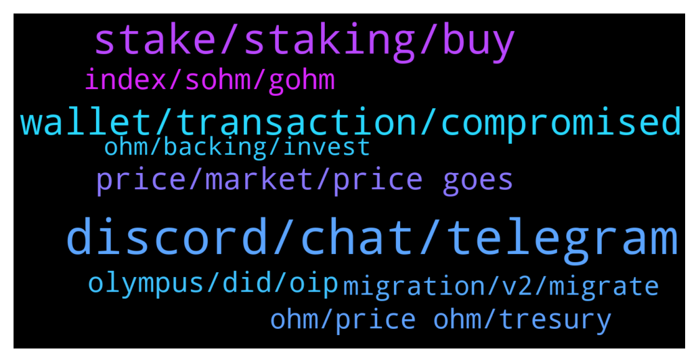

# **@OlympusTG**
 ## Analysis for **2022-01-07** - **2022-01-08**.

---

## 📊 **Basic Stats**

**n_messages_sent**: 772

---

---

## 🔝 **Top keywords and related messages**

1. **discord, chat, telegram**

    @Agus --- *Still ok but not that good as it wants to show in the website, just it* **--->** [TG Discussion](https://t.me/OlympusTG/143957)

    @DaveCraige --- *https://twitter.com/davecraige/status/1479096639403044868?s=21  ETH Denver chat group set up for Ohmies that are going!   Let me know if you want access!* **--->** [TG Discussion](https://t.me/OlympusTG/144866)

    @nfwaple --- *refer to this - Second pic: https://twitter.com/dopex_intern/status/1473439395999068162/photo/1* **--->** [TG Discussion](https://t.me/OlympusTG/143944)

    @nfwaple --- *all good, careful with clicking links in telegram too. and since you mentioned 'new', careful don't respond to dm, only scammers private message you on telegram* **--->** [TG Discussion](https://t.me/OlympusTG/144766)

    @AIi_Persian --- *I Have a business proposal about creating an Arabic telegram community for $OlympusTG* **--->** [TG Discussion](https://t.me/OlympusTG/143484)

    @Niels --- *Didnt now you have to have a source for a question* **--->** [TG Discussion](https://t.me/OlympusTG/143598)

2. **stake, staking, buy**

    @Nostress04 --- *gOHM, it's v2 and already staked.  Don't buy v1, since you'll have to convert it to gOHM, paying network fee for conversion* **--->** [TG Discussion](https://t.me/OlympusTG/143510)

    @chitangxxx --- *havent bought ohm for a while - so whats the process now? do i buy ohm and stake it or just buy gohm?* **--->** [TG Discussion](https://t.me/OlympusTG/144091)

    @foodielov --- *so is this 0x04906695D6D12CF5459975d7C3C03356E4Ccd460 the one i buy on sushiswap* **--->** [TG Discussion](https://t.me/OlympusTG/143526)

    @BitWealthInc --- *What is diffrence between toggling button sOHM - gOHM? Does it changes anything for staker ?* **--->** [TG Discussion](https://t.me/OlympusTG/144743)

    @Ap0l1o --- *you can hold it as Ohm, without it being staked* **--->** [TG Discussion](https://t.me/OlympusTG/144090)

    @Tony --- *Hi everyone for those who know, when staking do i stake old or new ohm* **--->** [TG Discussion](https://t.me/OlympusTG/144025)

3. **wallet, transaction, compromised**

    @nfwaple --- *honestly it doesn't really look like hacked wallet, usually the scammers take everything, the time gap is quite big in your wallet* **--->** [TG Discussion](https://t.me/OlympusTG/144465)

    @nfwaple --- *no bruh from your transaction it's very obvious someone transferred your assets out over a range of days* **--->** [TG Discussion](https://t.me/OlympusTG/144478)

    @bike4peace --- *Nothing can be stolen as long as you don’t give away your seeds* **--->** [TG Discussion](https://t.me/OlympusTG/143620)

    @Brihas --- *Thanks for the warning. Thats exactly what happened. I got two dm asking me if I need further help.* **--->** [TG Discussion](https://t.me/OlympusTG/144778)

    @kg_boond_drip_squad --- *wallet address i mean - metamask* **--->** [TG Discussion](https://t.me/OlympusTG/144604)

    @stacyd82d --- *It seems so many people are talking w about hard wallets these days?* **--->** [TG Discussion](https://t.me/OlympusTG/143625)

4. **price, market, price goes**

    @David IL --- *6 months from now even if the price goes down to 1000$ we will still be in a huge profit. My question is : if we start taking profit the price will drop and making it impossible for the rest of us to take profit. Because of huge selling and less buyers. 🥲* **--->** [TG Discussion](https://t.me/OlympusTG/143637)

    @fantom2684 --- *what is happening, why is the rate falling? and is it going to rise?)* **--->** [TG Discussion](https://t.me/OlympusTG/144257)

    @cdp279 --- *Bro. Do you have to check the price like every minute* **--->** [TG Discussion](https://t.me/OlympusTG/144759)

    @thinkbig777 --- *so even now its overpriced lol, and good time to sell  it worth less then 300$ for real  66-70$ or something* **--->** [TG Discussion](https://t.me/OlympusTG/144642)

    @thinkbig777 --- *yes, and there is no reason for price to go up* **--->** [TG Discussion](https://t.me/OlympusTG/144632)

    @nfwaple --- *buy more multiple times instead of buying a lot at once* **--->** [TG Discussion](https://t.me/OlympusTG/143884)

5. **index, sohm, gohm**

    @DonDaddaa --- *Why does sohm go up but gohm stays the same ?* **--->** [TG Discussion](https://t.me/OlympusTG/143943)

    @Hdler --- *I’m confused 🤔…,, because all my gOHM are staked on Rari and my value is basically the number of gOHM I have multiplied by the value if gOHM….. but on the other hand I see how my sOHM increases all the time..,* **--->** [TG Discussion](https://t.me/OlympusTG/143473)

    @Hdler --- *But it doesn’t…, it is fixed gOHM* **--->** [TG Discussion](https://t.me/OlympusTG/143481)

    @nfwaple --- *Let's say 1gOHM ($14,000) x 40 (Current Index) = 40 sOHM ($350 each), a few days later, when sOHM holders have 41 sOHM because of the APY, the current index will be 41. Assuming price of sOHM is still $350, price of 1gOHM will be approximately $14,350* **--->** [TG Discussion](https://t.me/OlympusTG/143977)

    @DonDaddaa --- *Yes but I don’t understand why gohm balance not increase only decrease* **--->** [TG Discussion](https://t.me/OlympusTG/143980)

    @Ap0l1o --- *If you have 0,5 gOhm, with index of 59,6 your sOhm value is 29,8* **--->** [TG Discussion](https://t.me/OlympusTG/143472)

6. **olympus, did, oip**

    @s_p_i_r_a_l --- *is there any olympus trading channel?* **--->** [TG Discussion](https://t.me/OlympusTG/144050)

    @GSG_AP --- *How about Butterfly? Is this related to Olympus?* **--->** [TG Discussion](https://t.me/OlympusTG/143847)

    @Ap0l1o --- *The current index is displayed on the Olympus site* **--->** [TG Discussion](https://t.me/OlympusTG/143469)

    @cdp279 --- *Hey bro,  I'm not at my PC. just look at the whitepaper on Olympus Website. I also encourage you to join Discord and even Reddit please ser.https://discord.gg/a9YhADFk* **--->** [TG Discussion](https://t.me/OlympusTG/143489)

    @theMagicUnicorn --- *exactly, on olympus pro as well* **--->** [TG Discussion](https://t.me/OlympusTG/144647)

    @theMagicUnicorn --- *yes, the more people learn about olympus and olympus pro, the partnerships involved, the value proposition, all of the exciting things going on you can find in the forums, medium, etc, people start realizing this is the tortoise beating the hare, because there is so much substance there 🎆* **--->** [TG Discussion](https://t.me/OlympusTG/143641)

7. **ohm, price ohm, tresury**

    @thinkbig777 --- *1000% a year in OHM is good. but, will our tresury growth by 1000% ? will buyers at defi's buy ohm at that level ? to keep price per ohm static* **--->** [TG Discussion](https://t.me/OlympusTG/144683)

    @Daniel --- *will the ohm v2 price increase after it?* **--->** [TG Discussion](https://t.me/OlympusTG/143674)

    @thinkbig777 --- *I am talking about 2 things - speed of growth of tresury  - buy and hold ohm* **--->** [TG Discussion](https://t.me/OlympusTG/144672)

    @Andr3w_1 --- *Could someone please explain what happens if we theoretically drop below backing per OHM price* **--->** [TG Discussion](https://t.me/OlympusTG/144075)

    @foodielov --- *im a bit confused theres so many Ohm contracts out there which one are we suppose to buy* **--->** [TG Discussion](https://t.me/OlympusTG/143505)

    @Danimal84 --- *Wouldn't that be more or less the same thing?  Only reason one would unstake OHM, is to sell.  No other usage yet, that I am aware of.* **--->** [TG Discussion](https://t.me/OlympusTG/144088)

8. **migration, v2, migrate**

    @Ap0l1o --- *not really, you won't see the current amount until you migrate* **--->** [TG Discussion](https://t.me/OlympusTG/144052)

    @Eli --- *Poor guy , I checked my tokens are still there am I supposed to do anything for the migration?* **--->** [TG Discussion](https://t.me/OlympusTG/144472)

    @PATLIK --- *Oh okay i get now... why theres still people didnt migrated?* **--->** [TG Discussion](https://t.me/OlympusTG/143697)

    @Lilyleegate --- *would you please kindly check the DM? i have some questions on the migration to v2* **--->** [TG Discussion](https://t.me/OlympusTG/143650)

    @nfwaple --- *there are instructions for migration in the pinned message* **--->** [TG Discussion](https://t.me/OlympusTG/143651)

    @Ap0l1o --- *They clone the sites, do the migration for you and then they take all your funds* **--->** [TG Discussion](https://t.me/OlympusTG/144433)

