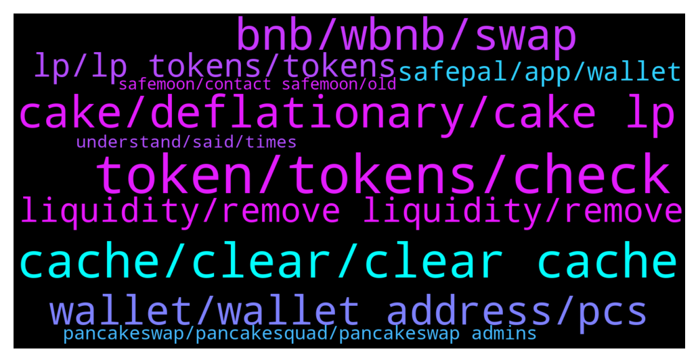

# **@PancakeSwap**
 ## Analysis for **2022-01-07** - **2022-01-08**.

---

## 📊 **Basic Stats**

**n_messages_sent**: 1174

---

---

## 🔝 **Top keywords and related messages**

1. **token, tokens, check**

    @RangerApos --- *Sound like you approved scam token if you approve scam token then tokens can be withdrawn from wallet by someone who have control over the contract that remains connected to wallet. You can use this tool to check what’s connected to wallet. https://app.unrekt.net/* **--->** [TG Discussion](https://t.me/PancakeSwap/2252581)

    @MBainzy --- *no i created a new contract that will be launching 1st feb and airdropping all holders the same amount of tokens they already have* **--->** [TG Discussion](https://t.me/PancakeSwap/2254672)

    @TomorrowlandForLife --- *I'm not saying anything. I've just shared a command with help to solve your issue. Ask on token's community. They should inform/help you how to operate their own token* **--->** [TG Discussion](https://t.me/PancakeSwap/2256390)

    @TomorrowlandForLife --- *Your tokens are IN your wallet as you can see. Check if you're added the correct contract. This is the correct one  0x0e09fabb73bd3ade0a17ecc321fd13a19e81ce82* **--->** [TG Discussion](https://t.me/PancakeSwap/2254649)

    @Santhosh --- *When added token address into metamask its showing 0* **--->** [TG Discussion](https://t.me/PancakeSwap/2254652)

    @TomorrowlandForLife --- *your tokens are IN your wallet if the ammount is not what you bought then probably is a Rebase token Ask on their community please* **--->** [TG Discussion](https://t.me/PancakeSwap/2254642)

2. **cache, clear, clear cache**

    @TomorrowlandForLife --- *if that doesn't work, try changing RPC* **--->** [TG Discussion](https://t.me/PancakeSwap/2253482)

    @cryptoNKOTB --- *sure, will try that. but it was working earlier in the day. not sure what happened.* **--->** [TG Discussion](https://t.me/PancakeSwap/2253690)

    @jim --- *Dear all i am using my metamask on brave, should i be on chrome as ive heard of problems* **--->** [TG Discussion](https://t.me/PancakeSwap/2253878)

    @Ceddi200 --- *Well works fine at my end. Better check your internet provider or device you using* **--->** [TG Discussion](https://t.me/PancakeSwap/2252793)

    @DefiFutchy --- *Anyone else ever have issues with metamask extension on chrome randomly removing itself over and over again? Second day in a row it’s removed on its own randomly.* **--->** [TG Discussion](https://t.me/PancakeSwap/2252373)

    @TomorrowlandForLife --- *yes please, change to Chrome and use Metamask extension* **--->** [TG Discussion](https://t.me/PancakeSwap/2253885)

3. **cake, deflationary, cake lp**

    @Vishaljain2 --- *Is there any Tools to find out Holders of Cake ?* **--->** [TG Discussion](https://t.me/PancakeSwap/2254155)

    @nikhilhi5 --- *man what's wrong with the cake why its showing such a bad price action* **--->** [TG Discussion](https://t.me/PancakeSwap/2254064)

    @forc3r --- *Yes you will still earn cake* **--->** [TG Discussion](https://t.me/PancakeSwap/2255703)

    @RangerApos --- *No end date was given. Long term goal of chefs is to make cake deflationary.* **--->** [TG Discussion](https://t.me/PancakeSwap/2252098)

    @jaytmusic --- *its asking me to add cake-lp to meta* **--->** [TG Discussion](https://t.me/PancakeSwap/2253062)

    @Mr.BAz --- *Yea..I am still fully well staked, trying to accumulate more,..but the apr and Apy on both manual and auto are not too encouraging TBH, but nonetheless,we keep accumulating...hope,the chef,or the Dev finds a quick solution to making cake deflationary....thanks and have a great day 📌* **--->** [TG Discussion](https://t.me/PancakeSwap/2252934)

4. **bnb, wbnb, swap**

    @iambabak --- *Hi, i swaped 100$ bnb to safemoon v1 in pancakeswap , transaction was successfull but the safemoon didnt come to my trust wallet and oon transaction hash says that bnb has changed to wbnb then wbnb changed to safemoon but the amount of safemoon is 0 as it has written on transaction hash , can you help me please?* **--->** [TG Discussion](https://t.me/PancakeSwap/2253704)

    @Ceddi200 --- *2 hours ago. You swap 1000 busd and got 2.2298 bnb* **--->** [TG Discussion](https://t.me/PancakeSwap/2253086)

    @Bllaat --- *I have both BNB and WBNB in the wallet. Both showing unchanged balances. So i do actually have WBNB visable and all set up correctly* **--->** [TG Discussion](https://t.me/PancakeSwap/2255861)

    @Bllaat --- *Thats the balance that didnt change. Normal bnb neither* **--->** [TG Discussion](https://t.me/PancakeSwap/2255859)

    @SpeedForceGN --- *Good Evening.  I am having issues with swapping one token (BNB) to another token (dogedi. dogedash).  No matter how much that I have in BNB, every transaction fails and states that I do not have enough funds.  I have tried on my phone and laptop.  Also, when I try to connect my wallets, LEDGER and METAMASK stated thatthey are connected to your website, however my wallet never loads.  I really need to get this done, so please help.* **--->** [TG Discussion](https://t.me/PancakeSwap/2252555)

    @elinucleus --- *Later on, I won't remember where I got the BNB if it is not shown in my wallet and there is a gap in my BNB and BUSD transactions.* **--->** [TG Discussion](https://t.me/PancakeSwap/2253103)

5. **wallet, wallet address, pcs**

    @az6996 --- *The issue is the wallet showing zero. That’s why it is so puzzling to me.* **--->** [TG Discussion](https://t.me/PancakeSwap/2254644)

    @jim --- *i have tried everything, accept filling out this synchronisation.  im concerned about giving my private key* **--->** [TG Discussion](https://t.me/PancakeSwap/2253765)

    @R --- *Hi, some problem with trust wallet?  When I try to connect the wallet a message "provider error. No provider was found"* **--->** [TG Discussion](https://t.me/PancakeSwap/2255504)

    @TomorrowlandForLife --- *can you try from a different device/wallet?* **--->** [TG Discussion](https://t.me/PancakeSwap/2253687)

    @Vishaljain2 --- *How can someone do ? Without your access of Wallet ?* **--->** [TG Discussion](https://t.me/PancakeSwap/2256106)

    @Ceddi200 --- *Bro if you copy the right address, u won’t have that issues.* **--->** [TG Discussion](https://t.me/PancakeSwap/2254074)

6. **liquidity, remove liquidity, remove**

    @HDH17 --- *No but you can add liquidity in stead of pool* **--->** [TG Discussion](https://t.me/PancakeSwap/2253403)

    @nftworld012 --- *You don’t have liquidity in this pool yet. Add Liquidity* **--->** [TG Discussion](https://t.me/PancakeSwap/2254881)

    @Koolblade --- *Oh sigh. How do they provide liquidity?* **--->** [TG Discussion](https://t.me/PancakeSwap/2252540)

    @Babs --- *Hello guys , how does the liquidity pool work ?    If I place my token price at 0.01bnb per 1,000,000 token, can someone who has more than 1,000,000 of my token swap it for bnb ?* **--->** [TG Discussion](https://t.me/PancakeSwap/2254413)

    @LetsfuckingGoGoGo --- *Can u tell us why we cannot remove liquidity ?* **--->** [TG Discussion](https://t.me/PancakeSwap/2254604)

    @peteboyo --- *Hey so I cleared my cache but rn I'm trying to remove liquidity and I can't get past the confirm part* **--->** [TG Discussion](https://t.me/PancakeSwap/2255216)

7. **lp, lp tokens, tokens**

    @xandercakes --- *They don't, see the screenshot I sent. It's from the docs page and explains how fees are collected for LP providers* **--->** [TG Discussion](https://t.me/PancakeSwap/2255453)

    @Dywie --- *I think if there is a pool about your lp token, stake it* **--->** [TG Discussion](https://t.me/PancakeSwap/2253392)

    @DesiBoyUK --- *I do not see my LP token being increased, those are same* **--->** [TG Discussion](https://t.me/PancakeSwap/2255442)

    @DesiBoyUK --- *i put 723.50 lp token in a pool and after 2 days i took off the liquidty and tried to get LP again, I got only 715 LP. how can it be possible?* **--->** [TG Discussion](https://t.me/PancakeSwap/2255456)

    @DesiBoyUK --- *I have a question if someone can help? how do you get LP Rewards?* **--->** [TG Discussion](https://t.me/PancakeSwap/2255423)

    @famrxboy --- *do my Lp tokens earn profit just by holding them there?* **--->** [TG Discussion](https://t.me/PancakeSwap/2253400)

8. **safepal, app, wallet**

    @Andreas9679 --- *I wanted an app to integrate in OVR, the metaverse platform to buy there something* **--->** [TG Discussion](https://t.me/PancakeSwap/2256140)

    @RangerApos --- *I would suggest trying different wallet safepal for mobile MetaMask for pc* **--->** [TG Discussion](https://t.me/PancakeSwap/2255221)

    @Andreas9679 --- *I thought, Google Play Store is safe.* **--->** [TG Discussion](https://t.me/PancakeSwap/2256122)

    @Joel --- *How do I send crypt from trustwallet to coinbase* **--->** [TG Discussion](https://t.me/PancakeSwap/2253908)

    @HAITIENLK --- *👉Try trustwallet or safepal is work on 100%👈  ✅ Metamask - PC ✅ Safepal - iphone, android ✅ Trustwallet - android  Don't use metamask with phone ❌ Don't use Binance wallet with pc ❌ ---------------------------------------------------  You can import your wallet to any other wallets that works with Pancakeswap if you want. You can continue to use same wallet with your seed. That seed is not special for safepal or trust wallet or metamask. You can use it in any wallet app  You will write the seed words to new app with choosing "I have already a wallet" or " Import Wallet"  Trust ➜  Safepal Guide👇🏻👇🏻👇🏻 https://youtu.be/FSGmEW9fFA0* **--->** [TG Discussion](https://t.me/PancakeSwap/2253561)

    @Ceddi200 --- *👉Try trustwallet or safepal is work on 100%👈  ✅ Metamask - PC ✅ Safepal - iphone, android ✅ Trustwallet - android  Don't use metamask with phone ❌ Don't use Binance wallet with pc ❌ ---------------------------------------------------  You can import your wallet to any other wallets that works with Pancakeswap if you want. You can continue to use same wallet with your seed. That seed is not special for safepal or trust wallet or metamask. You can use it in any wallet app  You will write the seed words to new app with choosing "I have already a wallet" or " Import Wallet"  Trust ➜  Safepal Guide👇🏻👇🏻👇🏻 https://youtu.be/FSGmEW9fFA0* **--->** [TG Discussion](https://t.me/PancakeSwap/2254486)

9. **pancakeswap, pancakesquad, pancakeswap admins**

    @CakeCompounder --- *Welcome! This should help you get started:   Learn about pancakeswap for beginner:  https://youtu.be/4nSLa3vJbOY  Ignore ANYONE who sends you a direct message no matter what it says their name is.   All DM are from SCAMMERS because we are a popular Crypto   ✅* **--->** [TG Discussion](https://t.me/PancakeSwap/2255624)

    @CakeCompounder --- *The chefs are well aware of that PancakeSwap is not deflationary and the is their goal. But not today and not tomorrow. Be patient and polite. 🙏🏽* **--->** [TG Discussion](https://t.me/PancakeSwap/2254213)

    @CakeCompounder --- *I’m sure you read the November Pancakeswap recap, but just to refresh your memory - Please give this a read sir* **--->** [TG Discussion](https://t.me/PancakeSwap/2254297)

    @ppopierre --- *Pancakesquad are going to moon and everybody regretting not buying one at this prices* **--->** [TG Discussion](https://t.me/PancakeSwap/2254245)

    @ClockTower_Dr_Dex --- *Anyway I can speak to a dev from pancakeswap?* **--->** [TG Discussion](https://t.me/PancakeSwap/2254882)

    @Karthe --- *your lost your moning on what? pancakeswap or other project?* **--->** [TG Discussion](https://t.me/PancakeSwap/2252983)

10. **understand, said, times**

    @خسته از روزگار --- *Sorry I did not understand what you mean, you can say more clearly؟* **--->** [TG Discussion](https://t.me/PancakeSwap/2252607)

    @jaytmusic --- *obviously! Ive been messaging you guys nonstop saying that what he said wasnt making sense. I followed the directions exactly* **--->** [TG Discussion](https://t.me/PancakeSwap/2251765)

    @jaytmusic --- *I told you all 8 times I dont understand the last part of the message* **--->** [TG Discussion](https://t.me/PancakeSwap/2251736)

    @santiph0 --- *i don’t understand what do u mean by that* **--->** [TG Discussion](https://t.me/PancakeSwap/2254991)

    @Rush_lover --- *lol, thats not my question. But ok* **--->** [TG Discussion](https://t.me/PancakeSwap/2255430)

    @Gauravcryptoo --- *Why deleted? So I don't repeat the mistake to get banned😅* **--->** [TG Discussion](https://t.me/PancakeSwap/2254020)

