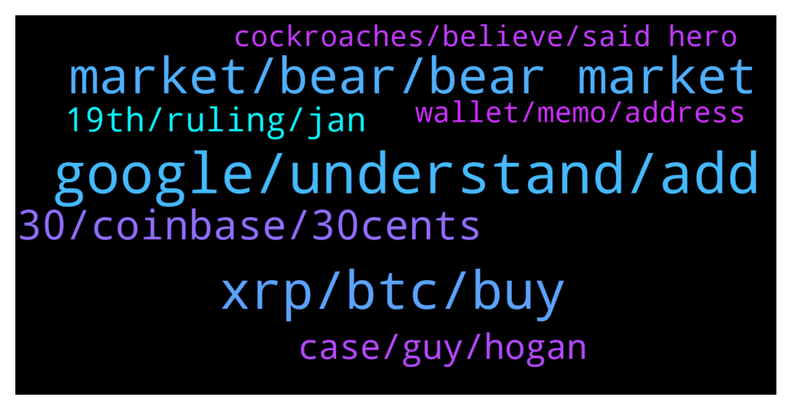

# **@Ripple**
 ## Analysis for **2022-01-07** - **2022-01-08**.

---

## 📊 **Basic Stats**

**n_messages_sent**: 177

---

---

## 🔝 **Top keywords and related messages**

1. **google, understand, add**

    @Greatest54 --- *If you have knowledge about why don't you just share* **--->** [TG Discussion](https://t.me/Ripple/3037176)

    @barryradio --- *Basically both sides get their co*ks out and sees who is bigger* **--->** [TG Discussion](https://t.me/Ripple/3036816)

    @JustNNM --- *I got the joke but let me put it this way, as part of my research i ask a reasonable question so i expect a reasonable answer.* **--->** [TG Discussion](https://t.me/Ripple/3036722)

    @JesusJames --- *watch a YouTube video on it* **--->** [TG Discussion](https://t.me/Ripple/3037172)

    @Hours_140 --- *I wonder if it can go lower?!! 🤔🤔🤔* **--->** [TG Discussion](https://t.me/Ripple/3037061)

    @JustNNM --- *Please go to settings then edit and scroll down to @Username and add one there* **--->** [TG Discussion](https://t.me/Ripple/3037097)

2. **xrp, btc, buy**

    @sophia_marti --- *XRP is forming a familiar pattern which is a bearish market sign* **--->** [TG Discussion](https://t.me/Ripple/3036438)

    @Ringo70 --- *Within 5 years you’re looking at lease a $100+ XRP.* **--->** [TG Discussion](https://t.me/Ripple/3036858)

    @futurestoreee --- *xrp will touch $10 in 5 years ago* **--->** [TG Discussion](https://t.me/Ripple/3036748)

    @Tinkabellagal --- *A Google search  Also xrpl projects can establish on sidechains   https://ripple.com/xrp/* **--->** [TG Discussion](https://t.me/Ripple/3036562)

    @Drsaddamshaikh --- *Can Any Tell Me Is Xrp dump more or not ?* **--->** [TG Discussion](https://t.me/Ripple/3036588)

    @LincolnXtamc4 --- *strange my BTC chart should be removed as XRP is directly related to BTC movements, wouldn't post it otherwise* **--->** [TG Discussion](https://t.me/Ripple/3037080)

3. **market, bear, bear market**

    @jarilitmanen1 --- *We are not in a bear market* **--->** [TG Discussion](https://t.me/Ripple/3036829)

    @Lennox1989 --- *How long did the last bear market last?* **--->** [TG Discussion](https://t.me/Ripple/3036826)

    @marianmp --- *If we go under 40k then we can think of bear market* **--->** [TG Discussion](https://t.me/Ripple/3036835)

    @Lennox1989 --- *How are we not? Its red everywhere and has been for a month* **--->** [TG Discussion](https://t.me/Ripple/3036833)

    @jarilitmanen1 --- *Long term this is good for crypto* **--->** [TG Discussion](https://t.me/Ripple/3036849)

    @Sky_Lurkz --- *Yawn  Factor in actual reality   The markets no longer just a bloody predictable pattern* **--->** [TG Discussion](https://t.me/Ripple/3036443)

4. **30, coinbase, 30cents**

    @XRParmyLFG --- *What will a $27tril market cap to 100billion xrp have per coin?* **--->** [TG Discussion](https://t.me/Ripple/3036683)

    @wesang --- *What’s going on?  Mine is showing $.30 for the current price, but my total is correct and showing at $.77.   Should I be worried?  Wish I could buy more at .30 too!* **--->** [TG Discussion](https://t.me/Ripple/3036492)

    @Ringo70 --- *No ask someone else who thinks it’s going over a $1,000* **--->** [TG Discussion](https://t.me/Ripple/3036903)

    @XRParmyLFG --- *It's weird. But it was priced at 30cents for a good while* **--->** [TG Discussion](https://t.me/Ripple/3036680)

    @ApoIIyon --- *2000000 usd according to the ball* **--->** [TG Discussion](https://t.me/Ripple/3036911)

    @Ringo70 --- *You may be right but didn’t want to build peoples hopes up, but definitely a 3 digit sum* **--->** [TG Discussion](https://t.me/Ripple/3036874)

5. **case, guy, hogan**

    @EML1993 --- *Just follow/watch the lawyers in Twitter and YouTube discussing about the sec vs ripple case, like Jeremy Hogan, John E. Deaton, Filan law. And decide for yourself if xrp will win or not. As for me, I’m going all in.* **--->** [TG Discussion](https://t.me/Ripple/3036644)

    @LincolnXtamc4 --- *This guy Jeremy Hogan is intimately involved in the case, so get on his twitter feed for accurate up to date info on the case https://twitter.com/attorneyjeremy1* **--->** [TG Discussion](https://t.me/Ripple/3037037)

    @thenativepatriot --- *Just read the letter that the SEC wrote about the fair notice… Fife is a penny stock that’s right a stock a completely different asset class they are trying to compare apples to oranges.* **--->** [TG Discussion](https://t.me/Ripple/3037006)

    @dZaTom --- *Anything to back the claim up?* **--->** [TG Discussion](https://t.me/Ripple/3036880)

    @Cointh88 --- *Nevermind the Ripple lawsuit: Digivault becomes first accredited custodian to support XRP - FinanceFeeds https://financefeeds.com/nevermind-ripple-lawsuit-digivault-becomes-first-accredited-custodian-support-xrp/* **--->** [TG Discussion](https://t.me/Ripple/3036767)

    @osismog --- *Sec is bigger than ripple in this context.* **--->** [TG Discussion](https://t.me/Ripple/3036821)

6. **19th, ruling, jan**

    @rsilwal2 --- *Is they gonna settle on 19th jan* **--->** [TG Discussion](https://t.me/Ripple/3036669)

    @Jorge --- *Can you update me of what's the purpose of the trial this January 14th? Also I heard theyre gonna reschedule the trial to Jan 19th or even March What do you know abt that ?* **--->** [TG Discussion](https://t.me/Ripple/3036772)

    @DhCryptoGroup --- *Lets hope lawsuit realy ends on jan 14th and we fly soon after the decison* **--->** [TG Discussion](https://t.me/Ripple/3036750)

    @PWRAIDI --- *There is no trial on the 14th, its the end of expert discovery and it has actually been moved to the 19th 😂😂😂* **--->** [TG Discussion](https://t.me/Ripple/3036776)

    @EML1993 --- *Ruling on Fair Notice - February.* **--->** [TG Discussion](https://t.me/Ripple/3036582)

    @EML1993 --- *Any expectation for fair notice ruling timeframe ? Hogan answers February-ish.* **--->** [TG Discussion](https://t.me/Ripple/3036578)

7. **wallet, memo, address**

    @Greatest54 --- *Okay, thanks but sorry to say the wallet is a personal wallet, I wanted to send stellar coin to block chain but after inputting the address I was asked to include XLM memo that's why I'm confused* **--->** [TG Discussion](https://t.me/Ripple/3037188)

    @JesusJames --- *you only need a memo when using an exchange not your own personal wallet* **--->** [TG Discussion](https://t.me/Ripple/3037182)

    @JesusJames --- *its for your wallet address on the exchange so you get the tokens you send there* **--->** [TG Discussion](https://t.me/Ripple/3037170)

    @Greatest54 --- *When ask to include a memo what I'm I suppose to put* **--->** [TG Discussion](https://t.me/Ripple/3037169)

    @barryradio --- *I imagine it would require importing your private key into another wallet, not sure that’s a good idea from a ledger* **--->** [TG Discussion](https://t.me/Ripple/3036754)

    @JesusJames --- *if its a personal wallet you don't need a memo* **--->** [TG Discussion](https://t.me/Ripple/3037189)

8. **cockroaches, believe, said hero**

    @marianmp --- *As I said we can go HERO OR ZERO ...FLY HUGH OR GO DOWN WITH THE COCKROACHES 🤣* **--->** [TG Discussion](https://t.me/Ripple/3037083)

    @localfeeder --- *THIS IS THE YEAR WE WIN* **--->** [TG Discussion](https://t.me/Ripple/3037056)

    @theprince789 --- *if all goes good maybe we can expect some nice candles...* **--->** [TG Discussion](https://t.me/Ripple/3036968)

    @marianmp --- *We can go sky high or down with the cockroaches 🤣* **--->** [TG Discussion](https://t.me/Ripple/3036846)

    @Lallulu --- *Let’s go to stratosphere before Moon 😂😂😂😂* **--->** [TG Discussion](https://t.me/Ripple/3036515)

    @Ringo70 --- *Believe me. It’s going to the moon and the next moon whats not even been built yet  !!* **--->** [TG Discussion](https://t.me/Ripple/3036869)

