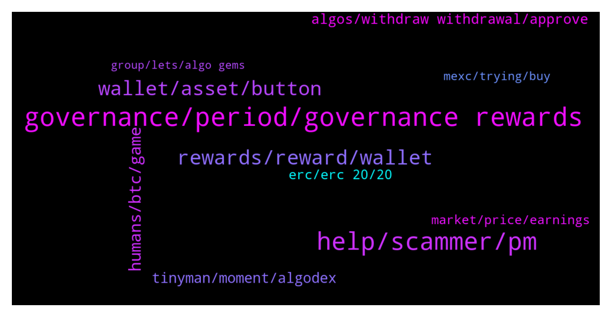

# **@algorand**
 ## Analysis for **2022-01-07** - **2022-01-08**.

---

## 📊 **Basic Stats**

**n_messages_sent**: 258

---

---

## 🔝 **Top keywords and related messages**

1. **governance, period, governance rewards**

    @Chompy --- *9.27% is the governance awards right? Does this fluctuate or will increase in time? I'm not ready to go governance just yet, I was thinking Q3 for governance* **--->** [TG Discussion](https://t.me/algorand/330620)

    @Malvo --- *Admin Any update on the governance rewards* **--->** [TG Discussion](https://t.me/algorand/330323)

    @Sayithowitis --- *Hello. Greetings.  I attempted participating in the governance but don't know how it works.  I was asked to connect wallet which I did. What next after connecting wallet ?* **--->** [TG Discussion](https://t.me/algorand/330417)

    @Shane --- *Does such a large portion of algo being locked in governance leave algorand more susceptible to whale market manipulation?* **--->** [TG Discussion](https://t.me/algorand/330419)

    @GanthaMakala --- *how to recover its algo which one has to deposit in governance please?* **--->** [TG Discussion](https://t.me/algorand/330563)

    @jonysarker --- *Quick question for confirmation- If we have done governance staking in period 1, is the next round Period 2 is automatically count in or need to commit algo manually for period 2?* **--->** [TG Discussion](https://t.me/algorand/330306)

2. **help, scammer, pm**

    @babayaga589 --- *Can you send me the link bro* **--->** [TG Discussion](https://t.me/algorand/330596)

    @Malvo --- *Is there a customer support or admin that can help me* **--->** [TG Discussion](https://t.me/algorand/330357)

    @Lord_Shin_Chan_2_O --- *Admins shouldn't respond my messages... But scammers should...😒🤦‍♂ worst sir...😒* **--->** [TG Discussion](https://t.me/algorand/330853)

    @Lord_Shin_Chan_2_O --- *Can you please check pm sir...🙂* **--->** [TG Discussion](https://t.me/algorand/330499)

    @NightAlgorand --- *Yes please if you can 🙂* **--->** [TG Discussion](https://t.me/algorand/330484)

    @Lord_Shin_Chan_2_O --- *Wait sir... I should send screenshot in pm...* **--->** [TG Discussion](https://t.me/algorand/330481)

3. **rewards, reward, wallet**

    @sravan906 --- *0.3 algo reward 😂😂 lol what is this . Is this a reward* **--->** [TG Discussion](https://t.me/algorand/330393)

    @Watduc --- *Algo rewards down to 2.3% only for period 2* **--->** [TG Discussion](https://t.me/algorand/330542)

    @Grabari --- *Seems like a kind of task for software developers, to implement special type of tx for withdrawing (0A to your wallet to collect rewards and then send XA to other wallet). If done in <4s (later 2.5s) there should be no additional microA in rewards. Or maybe there are already an option for it (sending only the wallet Algorands)? 🤔 Maybe admins could answer it.* **--->** [TG Discussion](https://t.me/algorand/330552)

    @eloquentplatypus --- *When I make a withdraw from my Algo wallet it includes rewards e.g. I send 300 ALGO and there are 100 rewards it will send 100 ALGO rewards + 200 ALGO from wallet. This is absurd. A tax nightmare. It's putting me off ALGO.* **--->** [TG Discussion](https://t.me/algorand/330541)

    @kramercrypto --- *You could move your rewards to a separate wallet* **--->** [TG Discussion](https://t.me/algorand/330543)

    @eloquentplatypus --- *Doesn't solve the problem. I'd have to do that everytime before sending any algo out no matter how small the rewards.* **--->** [TG Discussion](https://t.me/algorand/330546)

4. **wallet, asset, button**

    @MackDenver --- *You need 1 ALGO for the transaction fee, correct.* **--->** [TG Discussion](https://t.me/algorand/330570)

    @druidrune --- *I try to transfer Algo to my sollet wallet but not working* **--->** [TG Discussion](https://t.me/algorand/330936)

    @Tiny_Philosopher_784 --- *If you use the wallet app, you'll get a notification saying the tx of 0 algos were sent.* **--->** [TG Discussion](https://t.me/algorand/330430)

    @MackDenver --- *You might need to create a custom script for it. You should ask about it in our discord  https://discord.gg/84AActu3at* **--->** [TG Discussion](https://t.me/algorand/330538)

    @kramercrypto --- *If you send yourself a 0 algo tx they will be in your wallet, though* **--->** [TG Discussion](https://t.me/algorand/330545)

    @lordkepin --- *is there any way to do that?* **--->** [TG Discussion](https://t.me/algorand/330537)

5. **humans, btc, game**

    @Julian --- *Isn’t there a large chance the US will just ban crypto, especially a crypto like Algorand since it poses a threat to the US Dollar. Even though Algorand is infinitely brilliant and world changing, can’t it just be banned?* **--->** [TG Discussion](https://t.me/algorand/330775)

    @MackDenver --- *The Drone Racing League and Playground Labs have announced they will develop the first play-to-earn crypto sports game on the Algorand blockchain.   This P2E game will unlock next generation fan experiences and bring DRL's high-speed drone races to the metaverse: https://www.coindesk.com/business/2022/01/05/drone-racing-league-zooms-into-metaverse-bringing-play-to-earn-to-algorand/* **--->** [TG Discussion](https://t.me/algorand/330503)

    @NightAlgorand --- *They can ban it in the US. That’s about it* **--->** [TG Discussion](https://t.me/algorand/330776)

    @Sophia --- *I think I love how this 2022 would turn out to be as time flies, best option to take is to stack as much as we can n farm enough to earn while we hold since the value of a crypto is retained when you do.* **--->** [TG Discussion](https://t.me/algorand/330970)

    @khunpon --- *I don't think US wanna lose dominance in this crypto-space.* **--->** [TG Discussion](https://t.me/algorand/330801)

    @khunpon --- *I don't think US will ban crypto. before US can sanction any country. USD is very powerful.* **--->** [TG Discussion](https://t.me/algorand/330799)

6. **tinyman, moment, algodex**

    @NightAlgorand --- *At the moment AlgoDex is in testnet. Only Tinyman is available at the moment 🙂* **--->** [TG Discussion](https://t.me/algorand/330734)

    @mbolaji1 --- *All Algo project depends on tinyman 😌 and tinyman pool get problem and no trade again. Algorand need to do something* **--->** [TG Discussion](https://t.me/algorand/330312)

    @IwuAustinChris1 --- *Please is there any other Decentralized Exchange except tinyman on Algorand ecosystem?* **--->** [TG Discussion](https://t.me/algorand/330733)

    @Ariwijaya90 --- *can anyone tell me other than tinyman..for swap/dex algo?* **--->** [TG Discussion](https://t.me/algorand/330408)

    @IwuAustinChris1 --- *🤦🏽‍♂️ and as tinyman is unavailable Nothing else can be done. I think you guys should speed up the algodex. Whereas there can be an alternative if any DEX isn't functioning* **--->** [TG Discussion](https://t.me/algorand/330735)

    @sivavasanthi --- *Is the any dex I can swap other than tinyman* **--->** [TG Discussion](https://t.me/algorand/330475)

7. **algos, withdraw withdrawal, approve**

    @Lord_Shin_Chan_2_O --- *I can't withdrawal my algo Tokens... Why sir...?* **--->** [TG Discussion](https://t.me/algorand/330842)

    @NightAlgorand --- *Hi there, could you give me more detail what was the problem or something happened when you tired to withdraw?* **--->** [TG Discussion](https://t.me/algorand/330478)

    @Lord_Shin_Chan_2_O --- *I can't withdrawal my algos... Why sir...?* **--->** [TG Discussion](https://t.me/algorand/330460)

    @Sayithowitis --- *So I should click on commit $Algos?* **--->** [TG Discussion](https://t.me/algorand/330432)

    @Emi --- *It's stressing me a lot. That was everything I had because I went all in* **--->** [TG Discussion](https://t.me/algorand/330897)

    @Tiny_Philosopher_784 --- *Then it'll send you to your wallet for you to approve. You approve, then go back to the site.* **--->** [TG Discussion](https://t.me/algorand/330423)

8. **erc, erc 20, 20**

    @MackDenver --- *Perhaps you are in the wrong group. This is the Algorand community* **--->** [TG Discussion](https://t.me/algorand/330930)

    @khunpon --- *I see only Akita on algorand* **--->** [TG Discussion](https://t.me/algorand/330958)

    @samwalkers --- *Bringing to Algorand soon, we’ll see* **--->** [TG Discussion](https://t.me/algorand/330940)

    @Tiny_Philosopher_784 --- *Atom is an ERC-20.   Algo is not an ERC-20. Nothing on algorand is an ERC-20.* **--->** [TG Discussion](https://t.me/algorand/330413)

    @xyzxyzxyzxyzxyzxyzxyzxy --- *Unsure, this website in the image is called algorandstats. If you google it, it'll come up* **--->** [TG Discussion](https://t.me/algorand/330345)

    @babayaga589 --- *Can’t find it on the website of Algorand* **--->** [TG Discussion](https://t.me/algorand/330599)

9. **market, price, earnings**

    @Monica241 --- *Can market get dumb for the rest of the month ? 😑* **--->** [TG Discussion](https://t.me/algorand/330382)

    @kramercrypto --- *Looked at the rest of the market today?* **--->** [TG Discussion](https://t.me/algorand/330610)

    @NightAlgorand --- *Hi @Monica241 how are you today?  We don't speculate market movement here, you can go  https://t.me/algorand_price 🙂* **--->** [TG Discussion](https://t.me/algorand/330383)

    @joethesniper --- *Time to buy every dip and algo😊* **--->** [TG Discussion](https://t.me/algorand/330926)

    @cryptolilly2000 --- *So happy to be in this market so early🥳* **--->** [TG Discussion](https://t.me/algorand/330736)

    @Tiny_Philosopher_784 --- *My earnings follow the market, up and down. Just like everyone else. How are your earnings recently?* **--->** [TG Discussion](https://t.me/algorand/330435)

10. **mexc, trying, buy**

    @DouglasGamaa --- *That I can exchange USDC for AlGO* **--->** [TG Discussion](https://t.me/algorand/330981)

    @Brian --- *You can convert Algo to usdt on mexc. Then convert it to yieldly* **--->** [TG Discussion](https://t.me/algorand/330743)

    @EMBRRx --- *Basically, I'm trying to find out how I can buy USDT on Algo so I can trade it for YLDY xD* **--->** [TG Discussion](https://t.me/algorand/330741)

    @EMBRRx --- *I've spent all day trying to get set up to buy some yieldly, but it's been a bit of a headache as I'm not super familiar with using exchanges* **--->** [TG Discussion](https://t.me/algorand/330739)

    @daanseloni --- *I'm putting my trader view, where I read chart and I don't mean new currency information* **--->** [TG Discussion](https://t.me/algorand/330720)

    @EMBRRx --- *I was trying to aquire it via MEXC, but right now, I have to use fiat to buy it, but the minimum purchase using a bank on mexc is higher than I can afford* **--->** [TG Discussion](https://t.me/algorand/330740)

