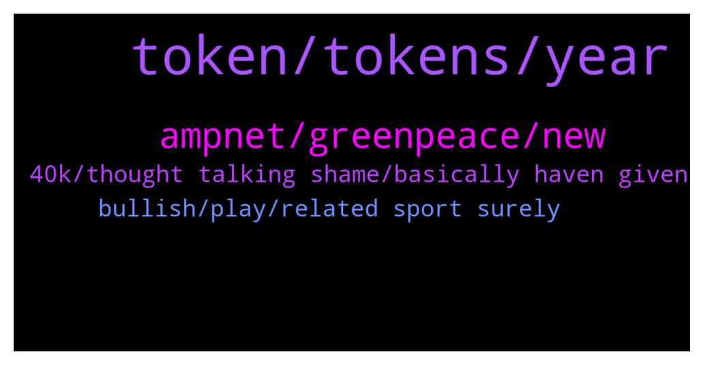

# **@ampnetapxchat**
 ## Analysis for **2022-01-03** - **2022-01-08**.

---

## 📊 **Basic Stats**

**n_messages_sent**: 106

---

---

## 🔝 **Top keywords and related messages**

1. **token, tokens, year**

    @<UNK> --- *This is due to the fact that AAPX unlocks linearly and sites like CMC or CoinGecko have "unlock date" which we cannot use, cuz appx is unlocking every moment instead of a set date  But anyone can check circ. supply/max supply here -  https://claim.ampnet.io/app/dist/index.html* **--->** [TG Discussion](https://t.me/ampnetapxchat/36149)

    @E_Don --- *We need more pairs on Matic. Eth gas fee is crazy  Matic/AAPX. Eth/AAPX* **--->** [TG Discussion](https://t.me/ampnetapxchat/36085)

    @<UNK> --- *Sorry that was automatic, use this link to claim tokens 😅 https://claim.ampnet.io/app/dist/index.html* **--->** [TG Discussion](https://t.me/ampnetapxchat/36172)

    @<UNK> --- *Hey @MarcusVieiraCosta, yes there will be, just fill up this form and you'll be compensated   https://docs.google.com/forms/d/e/1FAIpQLSf4GCX62RAfb0oZvGNPzNynTdHFlvoIw9KZqA0o1VOkEwG_Kw/viewform* **--->** [TG Discussion](https://t.me/ampnetapxchat/36133)

    @<UNK> --- *You just need to provide transaction hash and you'll be compensated   https://docs.google.com/forms/d/e/1FAIpQLSf4GCX62RAfb0oZvGNPzNynTdHFlvoIw9KZqA0o1VOkEwG_Kw/viewform* **--->** [TG Discussion](https://t.me/ampnetapxchat/36040)

    @<UNK> --- *Here is the aapx network address  https://polygonscan.com/token/0x3fc8bd9b0d8054cbdc174c4ed4b41a95d3c6a427* **--->** [TG Discussion](https://t.me/ampnetapxchat/36087)

2. **ampnet, greenpeace, new**

    @Bob_Fosse --- *That was basically a very long winded statement that reads, “ampnet did nothing wrong, it’s everyone else’s fault”. Just awful (and not surprising).* **--->** [TG Discussion](https://t.me/ampnetapxchat/36017)

    @mislavjavor --- *Hey @IncogSen - the breakdown of Greenpeace partnership and the Aeternity attacks were all announced as they happened. The onboarding of new clients and the decision to develop AMPnet v2 was also communicated when it happened. There was no hiding of information from our side - when we had nothing to say, we stayed silent. When we had new partners or developments - we announced them, as was expected from us.   The optimism in our announcements was how we felt at the time, it was a genuine excitement that we felt - but we couldn’t know how things would end before they ended.  I understand the frustrations, but information was not witheld.* **--->** [TG Discussion](https://t.me/ampnetapxchat/36007)

    @IncogSen --- *Maybe they already knew about the greenpeace deal falling through behind the scenes* **--->** [TG Discussion](https://t.me/ampnetapxchat/36013)

    @mislavjavor --- *I agree, and the team finds ourselves more than accountable for things in and beyond our control. In the history of our company, there has never been an attitde of - “it must be somebody elses fault”. We should have acted sooner on red flags by Greenpeace, we should have moved on to Ethereum sooner, etc… Trust me when I say that we do not pat ourselves on the back saying “good job, it’s the fault of the clients”. On the other hand - it’s easy to look on things from hindsight - with all the extra information that hindsight provides.   The post was meant as an update to the community, that we are working hard, exploring new business models and new clients and that AAPX will be the token that’s backing these new developments.* **--->** [TG Discussion](https://t.me/ampnetapxchat/36027)

    @IncogSen --- *How come you didn't give us this information with the partners as soon as it happened* **--->** [TG Discussion](https://t.me/ampnetapxchat/36001)

    @IncogSen --- *We were given false narratives throughout* **--->** [TG Discussion](https://t.me/ampnetapxchat/36002)

3. **40k, thought talking shame, basically haven given**

    @bazzie123 --- *Ok so you failed basically everywhere* **--->** [TG Discussion](https://t.me/ampnetapxchat/36233)

    @IncogSen --- *Ohhh sorry thought u were talking about me* **--->** [TG Discussion](https://t.me/ampnetapxchat/36022)

    @IncogSen --- *But such a shame how it ended* **--->** [TG Discussion](https://t.me/ampnetapxchat/36006)

    @IncogSen --- *Some people lost 40k from this project* **--->** [TG Discussion](https://t.me/ampnetapxchat/36003)

    @MelonHusk --- *Good god this project got fucking destroyed* **--->** [TG Discussion](https://t.me/ampnetapxchat/35955)

    @IncogSen --- *They haven't even given an update on the pontoon thing* **--->** [TG Discussion](https://t.me/ampnetapxchat/36224)

4. **bullish, play, related sport surely**

    @matejmz --- *It could be also e-sport 😅* **--->** [TG Discussion](https://t.me/ampnetapxchat/36098)

    @matejmz --- *It' better be Real Madrid plugged by Luka Modric 😆* **--->** [TG Discussion](https://t.me/ampnetapxchat/36220)

    @matejmz --- *Bullish if this is football related* **--->** [TG Discussion](https://t.me/ampnetapxchat/36218)

    @MelonHusk --- *Surely the team has run out of funds by now* **--->** [TG Discussion](https://t.me/ampnetapxchat/35975)

    @jakovtradingmentor --- *then going out to watch a play with gf* **--->** [TG Discussion](https://t.me/ampnetapxchat/35947)

    @matejmz --- *Where is scemo or what was his name? He was the most bullish OG* **--->** [TG Discussion](https://t.me/ampnetapxchat/36230)

