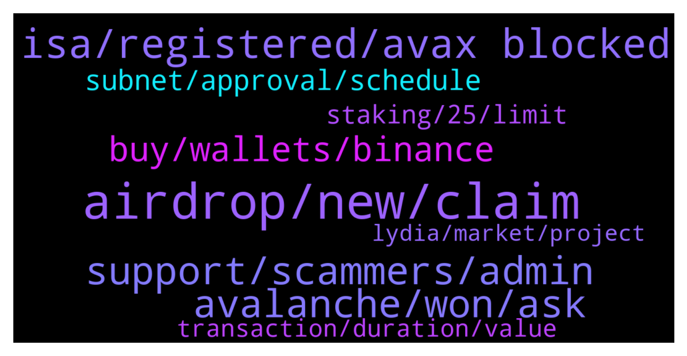

# **@avalancheavax**
 ## Analysis for **2022-01-07** - **2022-01-08**.

---

## 📊 **Basic Stats**

**n_messages_sent**: 197

---

---

## 🔝 **Top keywords and related messages**

1. **airdrop, new, claim**

    @BjornSeal --- *Any new promising project on Avax ?* **--->** [TG Discussion](https://t.me/avalancheavax/320873)

    @oathtobarbatos --- *I don't know if it helps but, you can see every tx on the Avascan website avascan.info* **--->** [TG Discussion](https://t.me/avalancheavax/320573)

    @pacificnorriswest --- *What new projects to avax we diggin?* **--->** [TG Discussion](https://t.me/avalancheavax/320704)

    @deepfakeoracle --- *When will chainlink vrf be available on avax?* **--->** [TG Discussion](https://t.me/avalancheavax/320623)

    @DHCP0893 --- *Hi, can anyone tell me how to chance AVAX for BNB? I have my AVAX in metamask and need BNB for comissions?* **--->** [TG Discussion](https://t.me/avalancheavax/320649)

    @DCalister --- *Ok,but all my Avax where in the C Chain. IS that correct?* **--->** [TG Discussion](https://t.me/avalancheavax/320664)

2. **isa, registered, avax blocked**

    @Traderluz21 --- *😤😤😤  yea !!! I registered day 07 now I made claime and they gave it to me as an ISA. But the AVAX that is blocked does not return me  0x236f46bBe17B40f0C1C7f5225C835EB8F944F84f* **--->** [TG Discussion](https://t.me/avalancheavax/320951)

    @oathtobarbatos --- *ISA is on Avalaunch, right? Try talking about your case there http://t.me/avalaunch_app* **--->** [TG Discussion](https://t.me/avalancheavax/320819)

    @Traderluz21 --- *I registered ISA. Today I made a complaint, they gave me only the ISA, but the AVAX, which was blocked, did not violate my wallet. Now there are thieves posing as adm ,,, and want like 12 words. That was wrong, it was to give me back an AVAX, so I started selling* **--->** [TG Discussion](https://t.me/avalancheavax/320817)

    @Traderluz21 --- *ISA is on Avalaunch, right? Try talking about your case there http://t.me/avalaunch_app* **--->** [TG Discussion](https://t.me/avalancheavax/320822)

    @Traderluz21 --- *please ,,,i registered ,,isa but when I made a claim ,,, they only detain me ISA , but they don't give me back to AVAX ,,, now they're asking me for 12 words* **--->** [TG Discussion](https://t.me/avalancheavax/320814)

    @Traderluz21 --- *Who participated in the ISA. Did you get your avax back without needing to click on someone's link? they are sending me a lot of links so I can have my avax blocked back. I don't understand since, my ISA was already my wallet. Do I have to remove the staick xava?* **--->** [TG Discussion](https://t.me/avalancheavax/320694)

3. **support, scammers, admin**

    @daleetguy --- *Admins be careful. This group is full of scammers. As soon as you interact here you receive several DM pretending they're representing official support. I can provide screenshots if you want.  These guys should be banned.* **--->** [TG Discussion](https://t.me/avalancheavax/320734)

    @Dante --- *Any admin here ??? My swap is pending for a while* **--->** [TG Discussion](https://t.me/avalancheavax/320904)

    @JimWelder --- *You'll get some dms shortly they'll offer to help you I'm sure* **--->** [TG Discussion](https://t.me/avalancheavax/320675)

    @oathtobarbatos --- *Ignore this kind of messages, most of them are scams* **--->** [TG Discussion](https://t.me/avalancheavax/320783)

    @li --- *scammer also can DM me ,i  need to improve my english* **--->** [TG Discussion](https://t.me/avalancheavax/320568)

    @Nicolas_A --- *Hahaha plenty of scammers always ready* **--->** [TG Discussion](https://t.me/avalancheavax/320676)

4. **avalanche, won, ask**

    @samuel8842 --- *Hi team,  Could someone please tell me if it is possible to set an alarm for wallet activity on the Avalanche blockchain? Maybe through Avascan?  Thank you,* **--->** [TG Discussion](https://t.me/avalancheavax/320564)

    @Harold --- *Does anyone know the avalanche contract number* **--->** [TG Discussion](https://t.me/avalancheavax/320806)

    @João --- *Is this the official telegram? There are a few Avalanche channels which stand as official. It's confusing...* **--->** [TG Discussion](https://t.me/avalancheavax/320449)

    @oathtobarbatos --- *I think you can see every token information in the Avalanche bridge* **--->** [TG Discussion](https://t.me/avalancheavax/320831)

    @li --- *hi , how can I transfer trc20 usdt to avalanche?* **--->** [TG Discussion](https://t.me/avalancheavax/320565)

    @bestcoderna --- *Join us for our Avalanche Weekly Wrapup on Twitter Spaces! Starting now https://twitter.com/i/spaces/1vOGwyDyOgrxB/* **--->** [TG Discussion](https://t.me/avalancheavax/320757)

5. **buy, wallets, binance**

    @Izaiya --- *And how do I buy it; I see it on coinmarket but don’t know where to begin… scammer msg me* **--->** [TG Discussion](https://t.me/avalancheavax/320773)

    @MiaoMiao11 --- *The debit card has been added, coinbase but I can't find where to add the funds.* **--->** [TG Discussion](https://t.me/avalancheavax/320674)

    @Nicolas_A --- *You can bridge some assets from another chain to BSC using synapse and it will give a bit of BNb* **--->** [TG Discussion](https://t.me/avalancheavax/320654)

    @Nicolas_A --- *On BSC ? Need to buy it from an exchange* **--->** [TG Discussion](https://t.me/avalancheavax/320651)

    @Squidward --- *Can anyone help me set up a wallet?* **--->** [TG Discussion](https://t.me/avalancheavax/320739)

    @JimWelder --- *Just looking at the top coins on coin market cap btw. What's everyone's thoughts?* **--->** [TG Discussion](https://t.me/avalancheavax/320477)

6. **subnet, approval, schedule**

    @Nicolas_A --- *There is no subnet schedule but should probably be more or less ready in this period. A lot of functionalities are already ready* **--->** [TG Discussion](https://t.me/avalancheavax/320682)

    @DanDK9 --- *Meaning anyone can launch a subnet without approval? Would there be any form of yes/no action required from someone else prior to launching the subnet?* **--->** [TG Discussion](https://t.me/avalancheavax/320867)

    @M --- *Admin, Will subnet project be announced on march?(crypto inno 2022) If not, where can i get some info about subnet schedule?* **--->** [TG Discussion](https://t.me/avalancheavax/320681)

    @Nicolas_A --- *Anyone can launch, no approval required* **--->** [TG Discussion](https://t.me/avalancheavax/320875)

    @iwong1 --- *May I ask about schedule of subnet?🤦‍♂🤦‍♂🤦‍♂* **--->** [TG Discussion](https://t.me/avalancheavax/320527)

    @DanDK9 --- *How will subnets be approved? Who will choose whether a subnet gets launched or removed? Will there be community governance or votes on subnets? Or can anyone launch a subnet without approval and who would have the authority to remove them?* **--->** [TG Discussion](https://t.me/avalancheavax/320865)

7. **staking, 25, limit**

    @BjornSeal --- *Ok. So anything less than 25 Avax is not gonna be staked?* **--->** [TG Discussion](https://t.me/avalancheavax/320889)

    @alrko616 --- *Is there other way of earning apr other than staking* **--->** [TG Discussion](https://t.me/avalancheavax/320893)

    @Platemha --- *In the avax wallet yes there is a 25 avax limit. You can always stake in single asset pools in yieldyak, benqi 10%, aave 11%, etc. No limit there.* **--->** [TG Discussion](https://t.me/avalancheavax/320892)

    @TheSEOdude --- *Nope, below that can be staked on yield yak.* **--->** [TG Discussion](https://t.me/avalancheavax/320891)

    @oathtobarbatos --- *What do you exactly mean? Can you elaborate on your question? Do not share your seed phrase with anyone* **--->** [TG Discussion](https://t.me/avalancheavax/320815)

    @Cofidiss --- *For staking we need 25a avax?* **--->** [TG Discussion](https://t.me/avalancheavax/320598)

8. **transaction, duration, value**

    @DeFiCenturion --- *Price movement. You probably need to raise the slippage based on trading activity in the market that you are trading* **--->** [TG Discussion](https://t.me/avalancheavax/320622)

    @Linus --- *I did transaction ten days ago. Do you know how I could add more gas today?* **--->** [TG Discussion](https://t.me/avalancheavax/320625)

    @DeFiCenturion --- *Resend any transaction with the same nonce as the pending one.* **--->** [TG Discussion](https://t.me/avalancheavax/320626)

    @SwissAlpen --- *Hello, I have a question about time delay on tranfering asset* **--->** [TG Discussion](https://t.me/avalancheavax/320603)

    @SwissAlpen --- *My block chain value was 4.5 hours off the chart value.. Can anyone explain why.* **--->** [TG Discussion](https://t.me/avalancheavax/320605)

    @Nicolas_A --- *You just do the transaction again* **--->** [TG Discussion](https://t.me/avalancheavax/320634)

9. **lydia, market, project**

    @Lucy6568 --- *Hi the market looks volatile today* **--->** [TG Discussion](https://t.me/avalancheavax/320933)

    @Rocco --- *Thank you ☺️ Another user already told me that. I have bought yesterday. I hope the apy stays high long time, but i have the feeling it goes down more and more as more people join* **--->** [TG Discussion](https://t.me/avalancheavax/320553)

    @EnduroV1 --- *continuing the trend...., just in a lower range* **--->** [TG Discussion](https://t.me/avalancheavax/320934)

    @Rocco --- *yes but im happy with the performance right now. while evrything went down my portfolio is 50% up. was a lucky entry 😅* **--->** [TG Discussion](https://t.me/avalancheavax/320617)

    @Monica241 --- *Can market get dumb for the rest of the month ? 😑* **--->** [TG Discussion](https://t.me/avalancheavax/320508)

    @AA --- *Will the beta price increase after this launch? Expected ?* **--->** [TG Discussion](https://t.me/avalancheavax/320881)

