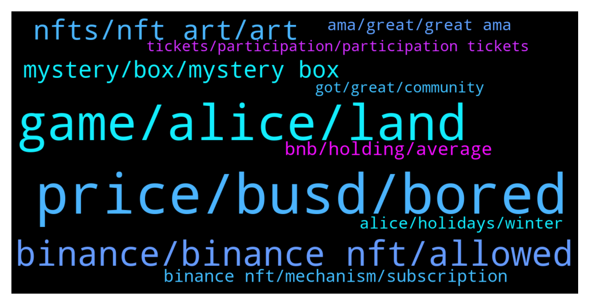

# **@binancenfts**
 ## Analysis for **2022-01-07** - **2022-01-08**.

---

## 📊 **Basic Stats**

**n_messages_sent**: 427

---

---

## 🔝 **Top keywords and related messages**

1. **price, busd, bored**

    @EM --- *Cheapest price of 12 BUSD.  Search for "Bored Gorilla 07" to place your bid. 🤝* **--->** [TG Discussion](https://t.me/binancenfts/427337)

    @ICE2005 --- *there are other bored ape who sell for 30 eth* **--->** [TG Discussion](https://t.me/binancenfts/427264)

    @serzh11 --- *ready to buy for a maximum of 150$* **--->** [TG Discussion](https://t.me/binancenfts/426220)

    @rcliko --- *Wuu very nice and cheap 👋* **--->** [TG Discussion](https://t.me/binancenfts/426571)

    @ICE2005 --- *mate, u dumb or something, I’ve just sad that I bought it for 200$* **--->** [TG Discussion](https://t.me/binancenfts/427262)

    @serzh11 --- *You idiot who bought it for 200* **--->** [TG Discussion](https://t.me/binancenfts/427263)

2. **game, alice, land**

    @Kenikky --- *I bet you get a lot of requests to participate in the grant program! Let’s get back to the game development. Anastasia is there any recent updates, events that you would like to share?* **--->** [TG Discussion](https://t.me/binancenfts/426667)

    @anastasiaplane --- *Hi. Mysterious Seed is a companion game accessible from any browser. Alice’s Mysterious Seed includes three fun and intuitive mini-games where you’ll need to water the plant, play sweet tunes to it and fertilize it in order for it to grow and prosper. You will be able to plant your seed and tend to it. If you look after it, it will yield a fruit. This fruit will be valuable in My Neighbor Alice when the game is released.   Important to say that the seeds available to purchase only during limited Alice’s shop opening that we do only 3-4 times a year. Other than that you can obtain seed from Mystery Box, such as the one we will be selling during the next Winter Holiday with Alice NFT sale on Binance https://bit.ly/31xzGqK* **--->** [TG Discussion](https://t.me/binancenfts/426830)

    @anastasiaplane --- *Hi Amir! I see you follow Alice’s channels too 🤗 To answer your question, I would say we had our challenges too during the most horrible time of it. But we managed to stay strong, focus on DAO, and develop the game according to our roadmap.   I think people are more comfortable working from home in their comfortable environment, and how much better can it be to build a game in your pajamas?! 🙂  Thank you for being a part of our community!* **--->** [TG Discussion](https://t.me/binancenfts/426833)

    @flyingsoner --- *I have been following for quite time probably since its beginning. I wonder if you guys plan to have any game for children or some people with physical disadvantage situations to improve their skills?* **--->** [TG Discussion](https://t.me/binancenfts/426785)

    @anastasiaplane --- *We launched Metaverse Grant Program in November 2021. Founded in collaboration with Chromia and Mines of Dalarnia (blockchain-based, p2e game https://twitter.com/MinesOfDalarnia) the $80m program will provide support to the most promising ideas in an effort to expand the metaverse surrounding My Neighbor Alice and the Chromia ecosystem at large.   We have written the whole article highlighting all the benefits of the program: https://myneighboralice.medium.com/introducing-the-80m-metaverse-grant-program-107a00053dc1* **--->** [TG Discussion](https://t.me/binancenfts/426664)

    @Ivar_Boneless3 --- *Do we need to buy land in the Alice game and for what reasons we need to acquire it?* **--->** [TG Discussion](https://t.me/binancenfts/426800)

3. **binance, binance nft, allowed**

    @ChibiMaya_bnb --- *is this on binance NFT? if not, not allowed. share screenshot or something with binance NFT details, not only image or video please.* **--->** [TG Discussion](https://t.me/binancenfts/426950)

    @revcrt27 --- *I understand, but i sent it to my Binance account address so i think there is still a chance to get it back, please help me :(((* **--->** [TG Discussion](https://t.me/binancenfts/427016)

    @HaruGNL --- *Yes its on binance nft and other bsc marketplace* **--->** [TG Discussion](https://t.me/binancenfts/426956)

    @Pierrotgt --- *Hi friends I'm selling this #CYNCITY NFT please.  I was saving it to play but my family has COVID 19 (I'm not lying) please I need to cure them.  my wife and my 2 babies.  with this they would help me a lot in his recovery.  thank you, God bless you.* **--->** [TG Discussion](https://t.me/binancenfts/427205)

    @Zz2497 --- *we'd like to list our nft on binance, how can do we now.? since we ve passed the proposal already. but havent gotten any feedback sir.* **--->** [TG Discussion](https://t.me/binancenfts/426013)

    @revcrt27 --- *I mistakenly transferred NFT from Opensea to my Binance wallet address, can you help me get it back ? New Year's festival coming up in my country and I'm stuck with 6000$ worth of NFTs there, please help* **--->** [TG Discussion](https://t.me/binancenfts/427010)

4. **nfts, nft art, art**

    @aradoaid --- *Hello friends, I have a thousand dollars and I want to buy nft. Does anyone have nft?* **--->** [TG Discussion](https://t.me/binancenfts/426238)

    @serzh11 --- *But if you think about it, I can pick it up for 150$ for a collection, as this nft looks really beautiful.* **--->** [TG Discussion](https://t.me/binancenfts/426601)

    @styledsm89 --- *How do I share my nfts?* **--->** [TG Discussion](https://t.me/binancenfts/426422)

    @thenotoriousdon --- *Who can sell me nft for cheap im new into this hope someone can help me Jai hind* **--->** [TG Discussion](https://t.me/binancenfts/425878)

    @kingazhar7 --- *Go check yourself the price of these nfts ….* **--->** [TG Discussion](https://t.me/binancenfts/425834)

    @Erop47 --- *Who does the NFT in which program?  Tell me please* **--->** [TG Discussion](https://t.me/binancenfts/427207)

5. **mystery, box, mystery box**

    @Kenikky --- *Let’s talk about the MyNeighborAlice Mystery boxes first. Can you please introduce your project?* **--->** [TG Discussion](https://t.me/binancenfts/426639)

    @anastasiaplane --- *The sale will have a format of a Mystery Box using the new subscription features that Effie mentioned at the bggining. We’re extremely excited and honoured to be the very first project to be a part of this exciting feature.* **--->** [TG Discussion](https://t.me/binancenfts/426656)

    @Kenikky --- *Now I really want to get an Alice mystery box of my own! 😍* **--->** [TG Discussion](https://t.me/binancenfts/426679)

    @vladbumn --- *is it worth buying mystery box from neko* **--->** [TG Discussion](https://t.me/binancenfts/425892)

    @Immortal_yooshi --- *Yoshibainu blind boxes tommorow.. Check it out* **--->** [TG Discussion](https://t.me/binancenfts/425875)

    @metatalkhost --- *Hey everyone I got this legendary card from the mystery box for hero arena* **--->** [TG Discussion](https://t.me/binancenfts/427304)

6. **bnb, holding, average**

    @c_hinmay --- *If I have 0.5 bnb in earn section and nothing in spot ... then? What amount will be locked?🤔* **--->** [TG Discussion](https://t.me/binancenfts/426865)

    @Yuanxiaote --- *For each day's data calculation for average BNB holding is collected on 24:00 UTC+0 everyday. No matter which wallet you put BNB in, we can all calculate. 😜😜* **--->** [TG Discussion](https://t.me/binancenfts/426738)

    @Yuanxiaote --- *The holding amount is calculated based on the average of your BNB amount among all wallets . yes, we have a lot of wallets, lemme walk you through* **--->** [TG Discussion](https://t.me/binancenfts/426736)

    @Ivan11338 --- *I have 1 BNB on my account since yesterday, but it shows my average is 0.1))))) Do i need to have 100 BNB on my account to participate in sale?)* **--->** [TG Discussion](https://t.me/binancenfts/426947)

    @chibiguardians --- *If on bnb vault is ok, in staking it is not counted.* **--->** [TG Discussion](https://t.me/binancenfts/426972)

    @Kenikky --- *Effie, How do you calculate the average holding of BNB?* **--->** [TG Discussion](https://t.me/binancenfts/426734)

7. **binance nft, mechanism, subscription**

    @Rehiredrebor --- *What is the speciality Binance NFT using the Subscription Mechanism?* **--->** [TG Discussion](https://t.me/binancenfts/426818)

    @Mintpapi --- *What are the benefits as a binance NFT subscriber? Or do I have to ask at 7pm?* **--->** [TG Discussion](https://t.me/binancenfts/426608)

    @semeerkv --- *First of all I thanks BinanceNFT to equal opportunity to participate in the Binance NFT primary sales . My question  When will I know about the NFT allocation result? Every Participant will get Allocations?   @Yuanxiaote* **--->** [TG Discussion](https://t.me/binancenfts/426768)

    @alansheva97 --- *Does the Binance' subcription mechanism feature will happen again at the next project or only happen to this MNA's event only ?* **--->** [TG Discussion](https://t.me/binancenfts/426781)

    @ryanzlee --- *Can check activity of sales in binance NFT market ?* **--->** [TG Discussion](https://t.me/binancenfts/427133)

    @Yuanxiaote --- *you might already browse landing page and read rules already, using the new Subscription Mechanism ensures a fair and equal way for you to commit tokens towards a Binance NFT sale. Using a subscription cap for each user, and the final NFT allocation will be distributed in a fair and random manner.* **--->** [TG Discussion](https://t.me/binancenfts/426686)

8. **alice, holidays, winter**

    @anastasiaplane --- *We invite you all to our Winter Holiday with Alice NFT Sale on Binance on January 10th at 12 PM UTC! https://bit.ly/31xzGqK   See you there 👋* **--->** [TG Discussion](https://t.me/binancenfts/426840)

    @anastasiaplane --- *We have prepared 12 seasonal handcrafted designs that are unique and exclusive to the Binance NFT platform. 🥳 And additionally, 3 Mysterious Seeds that you can use in our companion game (https://seed.myneighboralice.com) and later in the My Neighbor Alice main game. You can explore the upcoming collection here: https://bit.ly/31xzGqK* **--->** [TG Discussion](https://t.me/binancenfts/426657)

    @anastasiaplane --- *Winter is the time for comfort, for good food and warmth, for the touch of a friendly hand, and a talk beside the fire: it is time for home. So we invite you to meet winter holidays with Alice and your Neighbors in Snowflake Island by participating in our next NFT Sale on Binance NFT Marketplace on the 10th of January 2022.* **--->** [TG Discussion](https://t.me/binancenfts/426655)

    @anastasiaplane --- *Oh, right. Well, it kinda speaks for itself 🙂   The name of our next sale is ‘Holidays in Snowflake Island’ Alice’s Winter Holidays NFT Sale with Binance. For the theme, we picked the most wonderful time of the year. ✨ Celebrate this Winter Holidays in Snowflake Island with Alice! Some may be thinking, “Didn’t Xmas already happen?” well, it’s still the festive season in Eastern Europe & Russia for some, so the festive season of the holiday is still alive! ❄️* **--->** [TG Discussion](https://t.me/binancenfts/426654)

    @Kenikky --- *We have a very exciting AMA ahead of us, and we are going to be joined by @Yuanxiaote of Binance NFT and @anastasiaplane of MyNeighborAlice.  We will have three segments.  First Segment:  We will be discussing MyNeighborAlice’s “Holidays in Snowflake Island” collection launching on the Binance NFT marketplace.  Second Segment  The brand new Subscription Mechanism will be a game-changer, and we are delighted to share with you all the ins and outs of its features.  Third Segment  We will take 10 questions from the community, five will be answered by Binance NFT,  and another five will be answered by MyNeighborAlice  First thing’s first. Let’s introduce our lovely Binancians to our lovely guests.* **--->** [TG Discussion](https://t.me/binancenfts/426632)

    @kalmiye --- *I read that It is time for “Winter Holidays in Snowflake Island” with Alice and her neighbors. Can I invite my friend to our home😀?* **--->** [TG Discussion](https://t.me/binancenfts/426808)

9. **ama, great, great ama**

    @captainbnb --- *Congratulations Mytheria AMA winners  Please Dm me within 24 hours for submit your info.   @Sonersonerx @cocoteaaa @irfanecruz* **--->** [TG Discussion](https://t.me/binancenfts/427022)

    @alansheva97 --- *Thank you for the great AMA* **--->** [TG Discussion](https://t.me/binancenfts/426857)

    @ikaFelicia02 --- *Great AMA with the great ideas* **--->** [TG Discussion](https://t.me/binancenfts/426853)

    @Kenikky --- *There will be a moment at the end of the AMA to write your question to the team 🙂* **--->** [TG Discussion](https://t.me/binancenfts/426610)

    @Sonersonerx --- *When will the AMA results be announced? @Kenikky* **--->** [TG Discussion](https://t.me/binancenfts/425790)

    @wisnubacht --- *Where can i watch this Ama sir?* **--->** [TG Discussion](https://t.me/binancenfts/426106)

10. **tickets, participation, participation tickets**

    @Yuanxiaote --- *Participation Tickets is not a real ticket, this is the hard cap per user. Once a  user qualifies to move to the subscription phase, users can choose to commit all tickets or some of them. The more you commit, the higher probability of getting an NFT.* **--->** [TG Discussion](https://t.me/binancenfts/426719)

    @Yuanxiaote --- *Finally, we get the last stage-- where you can find if you get the NFT or not. Users with selected Participation Tickets will get to purchase the NFT(s) in the NFT primary sale, and their funds will be deducted accordingly. If your Participation Ticket is not selected, we’ll automatically refund the corresponding tokens to your spot wallet.* **--->** [TG Discussion](https://t.me/binancenfts/426701)

    @Yuanxiaote --- *then we come to the 3th stage---Calculation. This is the stage for our Tech team, our system will select winning tickets from all subscribed participation tickets in a fair and random manner.* **--->** [TG Discussion](https://t.me/binancenfts/426700)

    @Yuanxiaote --- *you might wonder what Participation Tickets are. Participation Tickets indicate the maximum number of NFTs each user can potentially purchase from a sale. You can choose to subscribe to the NFT primary sale by committing part or all of their participation ticket(s). To keep our NFT sales fair, we want to emphasise that subscribing to more Participation Tickets does not guarantee a successful purchase. The more tickets you commit, the higher your chances of successfully purchasing the NFT.* **--->** [TG Discussion](https://t.me/binancenfts/426698)

    @Yuanxiaote --- *2nd stage is subscription stage: If your balance meets the minimum requirement, you’ll move on to the Subscription phase. Each user will receive Participation Tickets according to the ‘purchase limit per user’ set by the NFT project/creator. Please refer to the product page to see if you meed the requirement~* **--->** [TG Discussion](https://t.me/binancenfts/426697)

    @V00Do --- *To Effie This is awesome, however on the NFT actual sale, can the NFTs be sold out before a participant try buy or it will be held until random calculation and then be distributed to winners? Seems like lottery, any more clarification on the selection mechanics?* **--->** [TG Discussion](https://t.me/binancenfts/426811)

