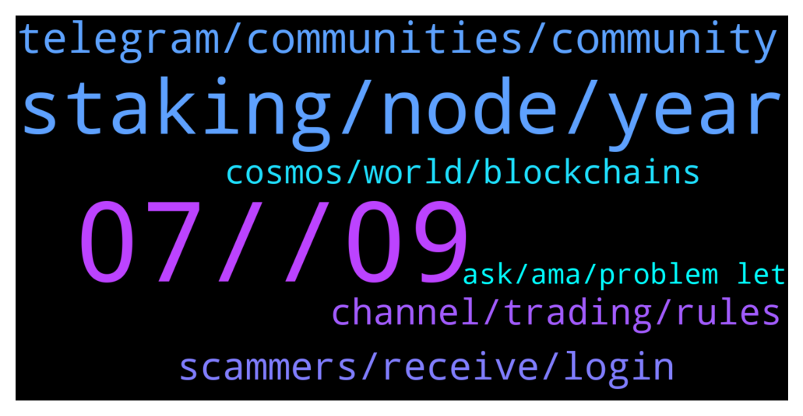

# **@chainlinkofficial**
 ## Analysis for **2022-01-07** - **2022-01-08**.

---

## 📊 **Basic Stats**

**n_messages_sent**: 111

---

---

## 🔝 **Top keywords and related messages**

1. **07, , 09**

    @ich_bin_ej --- *Hello! I'd like to ask if asking for current ways to earn passive income with chainlink falles under trading/market/price discussion? If yes, I understand if my current message will be deleted. Thanks!* **--->** [TG Discussion](https://t.me/chainlinkofficial/361010)

    @IronMan_CH --- *When i try to run a local chainlink node, i got following error: 2022-01-07 09:55:20.292 UTC [75] ERROR:  relation "migrations" does not exist at character 16 2022-01-07 09:55:20.292 UTC [75] STATEMENT:  SELECT id FROM migrations 2022-01-07 09:55:20.296 UTC [75] ERROR:  relation "goose_migrations" does not exist at character 36 2022-01-07 09:55:20.296 UTC [75] STATEMENT:  SELECT version_id, is_applied from goose_migrations ORDER BY id DESC 2022-01-07 09:57:07.392 UTC [81] ERROR:  relation "migrations" does not exist at character 16 2022-01-07 09:57:07.392 UTC [81] STATEMENT:  SELECT id FROM migrations  Anything missing from the doc ? appreciate for any help.* **--->** [TG Discussion](https://t.me/chainlinkofficial/360966)

    @Kim --- *How can I invest chainlink please* **--->** [TG Discussion](https://t.me/chainlinkofficial/360919)

    @Omoade --- *Is there any ongoing event @Sylvarantt @Sylvarant07 for Chainlink?* **--->** [TG Discussion](https://t.me/chainlinkofficial/361184)

    @swatkins67 --- *Where can you stake chain link?* **--->** [TG Discussion](https://t.me/chainlinkofficial/361172)

    @Sylvarantt --- *Hi Giuseppe, Chainlink is not a blockchain, and therefore it can't be mined. I suggest taking a look at this article for starters  https://blog.chain.link/what-is-chainlink/* **--->** [TG Discussion](https://t.me/chainlinkofficial/361104)

2. **staking, node, year**

    @FloBoss --- *Guys who knows when staking will be available ? I mean we could stake on coinbase for example?* **--->** [TG Discussion](https://t.me/chainlinkofficial/360990)

    @Crypto P --- *Hi there, admin?👋 Just a question what will the staking percentage be when chainlink brings out its official staking rewards?* **--->** [TG Discussion](https://t.me/chainlinkofficial/361463)

    @vovantan123 --- *Is this the official site of Chainlink?: staking. linkpool. io* **--->** [TG Discussion](https://t.me/chainlinkofficial/361094)

    @Sylvarantt --- *Please keep in mind that Chainlink staking is not live yet, so anything you find out there claiming to be some sort of Chainlink staking already live is either lending or liquidity provision to some degree* **--->** [TG Discussion](https://t.me/chainlinkofficial/361090)

    @Myke3000 --- *Hi can anyone let me know when the rewards are on running a node?* **--->** [TG Discussion](https://t.me/chainlinkofficial/361055)

    @Harish --- *Is it right time to buy Link?* **--->** [TG Discussion](https://t.me/chainlinkofficial/361112)

3. **telegram, communities, community**

    @harrumphharrumph --- *Sorry, we do our best. If they are members of this group we can ban them otherwise the only thing we can do is encourage people to use the Report button in Telegram and/or send information to @notoscam ... We try to spread awareness with articles like this that Eric wrote.* **--->** [TG Discussion](https://t.me/chainlinkofficial/361511)

    @Lzj168028 --- *Hello administrator, is there a Chinese community?* **--->** [TG Discussion](https://t.me/chainlinkofficial/360858)

    @Crypto P --- *Yeah now a guy called eric just text me on telegram. Since i joined this group 2hrs ago 5 people have messaged me from chainlink apparently* **--->** [TG Discussion](https://t.me/chainlinkofficial/361510)

    @Sylvarantt --- *China has a telegram group, it’s called @chainlinkfans (unofficial) and please also feel free to check out our Chinese communities (official) here:  https://blog.chain.link/chainlink-chinese-communities/* **--->** [TG Discussion](https://t.me/chainlinkofficial/360860)

    @PolivodaTatiana --- *We have very active advocates in South Africa and Uganda, but their local communities follow the main English language channel, as well as local unofficial Facebook and Twitter communities* **--->** [TG Discussion](https://t.me/chainlinkofficial/361456)

    @창현 --- *i still cant access to community* **--->** [TG Discussion](https://t.me/chainlinkofficial/361433)

4. **scammers, receive, login**

    @harrumphharrumph --- *You should read this message: https://t.me/chainlinkofficial/360797 and be aware that scammers will try to contact you.* **--->** [TG Discussion](https://t.me/chainlinkofficial/360818)

    @IronMan_CH --- *I can't register & login on chainlink's website. I didn't receive a validation email, anyone can help ?* **--->** [TG Discussion](https://t.me/chainlinkofficial/360891)

    @Sylvarantt --- *Feel free to share what do you need help with here. Don't trust anyone DM'ing you since they might be scammers and admin impersonators* **--->** [TG Discussion](https://t.me/chainlinkofficial/361529)

    @Dougie_Freshness --- *Scam!! You click the top Medium logo and it doesn’t return you to the homepage. Also none of the txn hash, block, send/receive addresses match up to the blockchain. Fake!!!* **--->** [TG Discussion](https://t.me/chainlinkofficial/361491)

    @Kim --- *A lot of scammers are here* **--->** [TG Discussion](https://t.me/chainlinkofficial/360844)

    @harrumphharrumph --- *Because that person was a scammer.* **--->** [TG Discussion](https://t.me/chainlinkofficial/360815)

5. **channel, trading, rules**

    @Bee_crypt0 --- *Where is the link to the chatting channel* **--->** [TG Discussion](https://t.me/chainlinkofficial/361555)

    @Natan --- *hello! is there a price discussion channel?* **--->** [TG Discussion](https://t.me/chainlinkofficial/361269)

    @marcromeron --- *Read pinned message for rules. Thank you.* **--->** [TG Discussion](https://t.me/chainlinkofficial/361207)

    @nam_nguyenson --- *This is not a trading channel. Please find an unofficial community for that.* **--->** [TG Discussion](https://t.me/chainlinkofficial/361360)

    @potrocks --- *hello fellow link marines can i get the link to the trading chat please* **--->** [TG Discussion](https://t.me/chainlinkofficial/361137)

    @JoshSimenhoff --- *Please sir, this channel is not focused on market or trading disucssion. Please read the rules. Thank you.* **--->** [TG Discussion](https://t.me/chainlinkofficial/361113)

6. **cosmos, world, blockchains**

    @JJ_D_RZ --- *Is it just me or Chainlink has also changed your perspective of this world into a more hopeful and optimistic view ?* **--->** [TG Discussion](https://t.me/chainlinkofficial/361072)

    @JJ_D_RZ --- *Not much just happy to be healthy , aware and around witnessing the emergence of a project that will impact the WORLD and the people living in it for decades to come* **--->** [TG Discussion](https://t.me/chainlinkofficial/361076)

    @JoshSimenhoff --- *Creating a truth machine, providing transparency and security on chain has me pumped for sure! The future looks bright for all of us.* **--->** [TG Discussion](https://t.me/chainlinkofficial/361074)

    @Tarik --- *any other use case of blockchains other than smart contracts* **--->** [TG Discussion](https://t.me/chainlinkofficial/360977)

    @zZeoneo --- *The obvious reason the ATOM COSMOS project isn't going down is that it's unifying all the blockchains. Also COSMOS who created binance, terra luna, secret, CRO and others* **--->** [TG Discussion](https://t.me/chainlinkofficial/360907)

    @Sami --- *Is there a roadmap for 2022?* **--->** [TG Discussion](https://t.me/chainlinkofficial/360954)

7. **ask, ama, problem let**

    @gamel4942 --- *Whom should I contact for AMA proposal* **--->** [TG Discussion](https://t.me/chainlinkofficial/361315)

    @Kamran --- *Hi... can I ask dev when vrf v2 on BSC please.?* **--->** [TG Discussion](https://t.me/chainlinkofficial/361573)

    @acelbluv --- *I think I posted this wrong in a different group 😂* **--->** [TG Discussion](https://t.me/chainlinkofficial/361320)

    @nam_nguyenson --- *Ah OK. Let me see who can help with that.* **--->** [TG Discussion](https://t.me/chainlinkofficial/360902)

    @IronMan_CH --- *Is it the right place to ask about technical problem ?* **--->** [TG Discussion](https://t.me/chainlinkofficial/360967)

